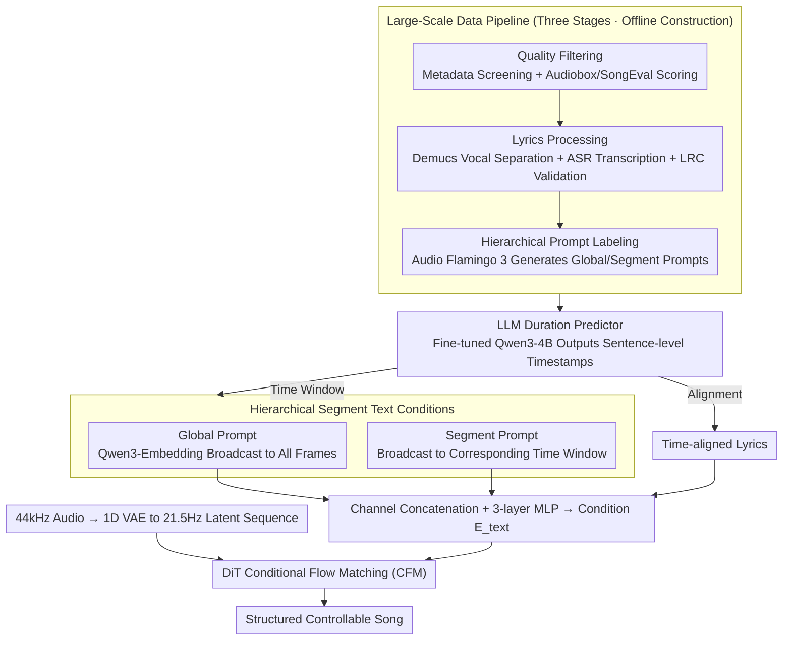

# SegTune: Structured and Fine-Grained Control for Song Generation

**Conference**: ACL 2026 Best Paper Oral  
**arXiv**: [2606.02638](https://arxiv.org/abs/2606.02638)  
**Code**: TBD  
**Area**: Audio & Speech  
**Keywords**: Song Generation, Segment Control, Diffusion Transformer, Duration Prediction, Hierarchical Conditioning

## TL;DR
SegTune is a song generation framework based on the Diffusion Transformer that achieves fine-grained temporal control over song structure and musical attributes through hierarchical text conditions (global + segment-level prompts) and an LLM-based duration predictor.

## Background & Motivation
**Background**: Neural song generation has achieved high-quality audio synthesis from lyrics and global text prompts. Existing systems, including AR models (like YuE/LeVo) and NAR models (like DiffRhythm/ACE-Step), primarily rely on global control signals.

**Limitations of Prior Work**: (1) Global prompts cannot capture the temporal dynamics of a song (where instrumentation, mood, and energy evolve across sections), leading to homogenized outputs; (2) Simulating vocals and accompaniment simultaneously under global conditions imposes a significant coordination burden on the model; (3) The lack of fine-grained control limits the expressive flexibility for creators.

**Key Challenge**: NAR models compress composition and rendering into a single diffusion process, failing to simultaneously optimize musical structure, temporal coherence, and vocal-instrumental balance. Furthermore, existing methods rely on low-quality lyric duration annotations (manual or zero-shot LLM generation).

**Goal**: Introduce segment-level fine-grained control capabilities into NAR song generation while eliminating the dependence on manual lyric duration annotations.

**Key Insight**: Partition text prompts into two levels—global and segment—where segment prompts are temporally broadcast to corresponding time windows, utilizing a fine-tuned LLM to automatically predict sentence-level timestamps.

**Core Idea**: Hierarchical segment condition injection + LLM-based duration predictor = structured fine-grained controllable song generation.

## Method

### Overall Architecture
SegTune addresses the problem of "incorporating segment-level temporal control in non-autoregressive song generation." It uses a Diffusion Transformer (DiT) backbone based on Conditional Flow Matching (CFM). First, a 1D VAE compresses 44kHz raw audio into a 21.5Hz latent sequence. Then, conditioning is constructed from three complementary sources: global text prompts, segment text prompts, and time-aligned lyrics. A fine-tuned LLM duration predictor generates sentence-level timestamps, which are used both to broadcast segment prompts to correct time windows and to align lyrics. Consequently, the output songs maintain a global style while exhibiting section-specific evolution in instrumentation, mood, and energy.

### Key Designs

**1. Hierarchical Segment Text Conditions: Decoupling Global Style Consistency from Local Musical Variations**

Instrumentation, mood, and rhythm naturally evolve with song segments. A single global prompt cannot express these temporal dynamics, often leading to monotonous outputs. SegTune splits text conditions into two levels: Global prompts are encoded by Qwen3-Embedding-0.6B and broadcast to all frames to govern overall style. Segment prompts are encoded as vectors $\mathbf{e}_s^i \in \mathbb{R}^{1 \times d_s}$ and broadcast only to frames within their corresponding time windows to handle local variations. Both conditions are concatenated along the channel dimension and passed through a 3-layer MLP to map to the final condition $E_{\text{text}} \in \mathbb{R}^{T \times 1024}$. The time windows for segment prompts are provided by the duration predictor, ensuring automated determination of which prompt governs which frames.

**2. LLM-based Duration Predictor: Converting Error-Prone Timestamp Annotation into Controllable Generation**

Previous NAR methods relied on error-prone manual timestamps or fragile zero-shot LLM prompting for word-level timing, leading to unstable quality. SegTune instead fine-tunes Qwen3-4B-Base. Given lyrics and hierarchical prompts as input, it autoregressively outputs sentence-level timestamps in LRC format. The training uses LoRA (rank=32) over $>100k$ LRC data entries for 8 epochs. The resulting timestamps serve both segment prompt broadcasting and lyric alignment, eliminating the need for manual duration labeling.

**3. Large-Scale Data Pipeline (Three Stages): Powering Segment Control with Clean Aligned Data**

Effective segment control requires a vast amount of high-quality samples containing audio, aligned lyrics, and hierarchical prompts. The pipeline consists of three steps: quality filtering using metadata and Audiobox/SongEval aesthetic scores; lyrics processing using Demucs v4 for vocal separation, FireRedASR/Whisper for transcription, and LRC validation for alignment; and hierarchical prompt labeling using Audio Flamingo 3 to generate global and segment-level text prompts. This pipeline establishes the data foundation for training with segment conditions.

### Loss & Training
The training objective is the conditional flow matching loss $\mathcal{L} = \mathbb{E}_{t,q,p} \| v_\theta(t,C,x_t) - u(x_t|x_0,x_1) \|^2$. Training proceeds in three stages: pre-training (~370k songs, ~27k hours, 20 epochs), fine-tuning (~50k songs, ~4k hours, 8 epochs), and preference alignment (2 iterations of DPO, ~20k pairs each). To support CFG, global and segment conditions are each dropped with a 20% probability. Inference utilizes an Euler ODE solver with negative condition CFG (cfg=3, cfg_n=1).

## Key Experimental Results

### Main Results

| Model | PER↓ | AudioBox-CE↑ | SongEval-OM↑ | G-Mulan↑ | Gender Acc↑ | Age Acc↑ |
|------|------|-------------|-------------|---------|------------|---------|
| YuE | 48.5% | 7.16 | 3.22 | 0.29 | 80.7% | 44% |
| LeVo | 29.8% | 7.43 | 3.35 | 0.32 | 90.6% | 50% |
| DiffRhythm++ | 27.4% | 7.55 | 3.76 | 0.47 | 37.5% | 54% |
| ACE-Step | 35.6% | 7.38 | 3.74 | 0.35 | 78.1% | 56% |
| **SegTune-SFT** | **14.5%** | 7.38 | 3.19 | 0.47 | **96.7%** | 57% |
| **SegTune-DPO** | 18.5% | **7.63** | **3.97** | 0.46 | 81.0% | 51% |

### Ablation Study (Prompt Encoder Design)

| Global Encoder | Segment Encoder | G-Mulan↑ | S-Mulan↑ | Gender Acc↑ | SongEval-OM↑ |
|-----------|-----------|---------|---------|------------|-------------|
| MuQ | – | 0.39 | 0.30 | 47.6% | 2.86 |
| Qwen3-Emb | – | 0.40 | 0.33 | 92.2% | 3.12 |
| Qwen3-Emb(G) + MuQ(S) | Concat | 0.44 | 0.37 | 84.4% | 3.34 |
| **Qwen3-Emb + Qwen3-Emb** | **Concat** | **0.47** | **0.38** | **96.7%** | **3.19** |

### Key Findings
- SegTune-SFT achieves a PER of only 14.5%, significantly lower than all baselines (the best baseline, DiffRhythm++, is 27.4%), indicating superior lyric fidelity and vocal intelligibility.
- Segment prompt injection significantly improves instruction-following: adding segment encoders increased S-Mulan from 0.33 to 0.38 and Gender Accuracy from 92.2% to 96.7%.
- DPO fine-tuning enhances musicality (MOS 4.57±0.52), though bias in preference data (predominantly young female voices) led to a decrease in gender/age control accuracy.
- Subjective MOS evaluation: SegTune-DPO achieved the highest score in musicality (4.57±0.52) and the second-highest in quality (3.87±0.56) with the lowest standard deviation.

## Highlights & Insights
- It is the first to introduce explicit segment-level text conditions in NAR song generation, enabling fine-grained temporal control of musical attributes.
- The LLM duration predictor is an elegant engineering solution: fine-tuning Qwen3-4B as an LRC format generator completely removes the need for manual timestamps.
- The three-stage training (Pre-train → SFT → DPO) combined with a clean data pipeline forms a comprehensive engineering cycle.
- Qwen3-Embedding serves as a better prompt encoder than the music-specific MuQ-MuLan for instruction following, suggesting that semantic understanding is crucial for controllable generation.

## Limitations & Future Work
- Instruction-following capabilities (gender/age) decreased after DPO; the issue of preference data bias needs addressing, potentially via online policy optimization.
- The training data is primarily Chinese pop songs (>90%), so cross-lingual and cross-style generalization requires further verification.
- Currently, only sentence-level duration prediction is supported; finer word-level or phoneme-level control has not been explored.
- Internal datasets and parts of the models are not public, limiting reproducibility.

## Related Work & Insights
- NAR methods like DiffRhythm, ACE-Step, or JAM accelerate generation but lack fine-grained control; SegTune's segment condition paradigm could be generalized to other NAR frameworks.
- Music ControlNet introduced time-varying control signals but was limited to instrumental music; SegTune extends this to full songs (vocals + accompaniment).
- The concept of an LLM duration predictor could inspire other multimodal generation tasks requiring temporal alignment.

## Rating
- Novelity: ⭐⭐⭐⭐ Segment-level conditions and LLM duration predictors are innovative designs.
- Experimental Thoroughness: ⭐⭐⭐⭐ Comprehensive objective metrics (PER/AudioBox/SongEval/MuLan/Attribute Acc) plus ablation and subjective MOS.
- Writing Quality: ⭐⭐⭐⭐ Clear structure with a complete logical chain from motivation to method and experiments.
- Value: ⭐⭐⭐⭐ Solves the core problem of lack of fine-grained control in NAR song generation with a solid engineering loop.

<!-- RELATED:START -->

## Related Papers

- [\[CVPR 2026\] FoleyDirector: Fine-Grained Temporal Steering for Video-to-Audio Generation via Structured Scripts](../../CVPR2026/audio_speech/foleydirector_fine-grained_temporal_steering_for_video-to-audio_generation_via_s.md)
- [\[AAAI 2026\] MF-Speech: Achieving Fine-Grained and Compositional Control in Speech Generation via Factor Disentanglement](../../AAAI2026/audio_speech/mf-speech_achieving_fine-grained_and_compositional_control_in_speech_generation_.md)
- [\[ACL 2026\] Towards Fine-Grained and Multi-Granular Contrastive Language-Speech Pre-training](towards_fine-grained_and_multi-granular_contrastive_language-speech_pre-training.md)
- [\[ICML 2026\] MECAT: A Multi-Experts Constructed Benchmark for Fine-Grained Audio Understanding Tasks](../../ICML2026/audio_speech/mecat_a_multi-experts_constructed_benchmark_for_fine-grained_audio_understanding.md)
- [\[NeurIPS 2025\] Segment-Factorized Full-Song Generation on Symbolic Piano Music](../../NeurIPS2025/audio_speech/segment-factorized_full-song_generation_on_symbolic_piano_music.md)

<!-- RELATED:END -->
