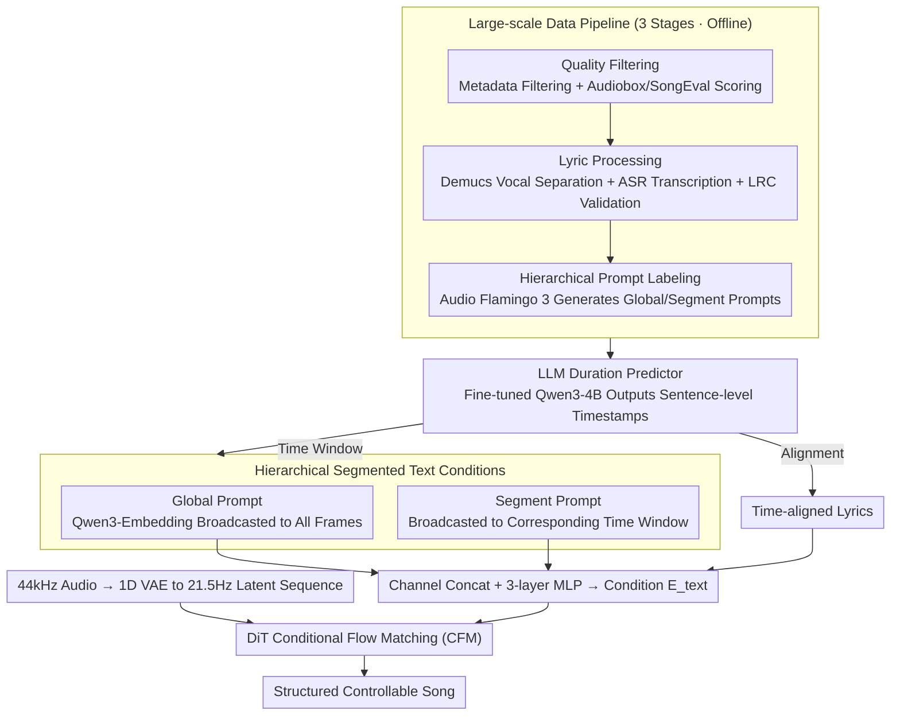

<!-- Generated automatically by src/gen_stubs.py -->
# SegTune: Structured and Fine-Grained Control for Song Generation

**Conference**: ACL 2026 Best Paper Oral  
**arXiv**: [2606.02638](https://arxiv.org/abs/2606.02638)  
**Code**: TBD  
**Area**: Audio and Speech  
**Keywords**: Song Generation, Segmented Control, Diffusion Transformer, Duration Prediction, Hierarchical Conditioning

## TL;DR
The authors propose SegTune, a song generation framework based on Diffusion Transformer. It achieves fine-grained temporal control over song structure and musical attributes through hierarchical text conditions (global + segment-level prompts) and an LLM-based duration predictor.

## Background & Motivation
**Background**: Neural song generation has successfully synthesized high-quality audio from lyrics and global text prompts. However, existing systems (AR models like YuE/LeVo and NAR models like DiffRhythm/ACE-Step) primarily rely on global control signals.

**Limitations of Prior Work**: (1) Global prompts fail to capture the temporal dynamics of a song (e.g., evolution of instrumentation, emotion, and energy across sections), leading to homogenized outputs; (2) Simultanously generating vocals and accompaniment under global conditions imposes a significant coordination burden on the model; (3) The lack of fine-grained control limits the expressive flexibility for creators.

**Key Challenge**: NAR models compress composition and rendering into a single diffusion process, making it difficult to simultaneously optimize musical structure, temporal coherence, and vocal-instrument balance. Furthermore, existing methods rely on low-quality lyric duration annotations (manual or zero-shot LLM generation).

**Goal**: To introduce segment-level fine-grained control capabilities into NAR song generation while eliminating the dependence on manual lyric duration annotations.

**Key Insight**: Text prompts are divided into global and segment levels. Segmental prompts are temporally broadcast to their corresponding time windows, and a fine-tuned LLM automatically predicts sentence-level timestamps.

**Core Idea**: Hierarchical segmented condition injection + LLM-based duration predictor = Structured and fine-grained controllable song generation.

## Method

### Overall Architecture
SegTune addresses the problem of "how to incorporate segment-level temporal control in non-autoregressive song generation." It utilizes the Diffusion Transformer (DiT) as the backbone, modeled via Conditional Flow Matching (CFM). First, a 1D VAE compresses 44kHz raw audio into a 21.5Hz latent sequence. Then, the diffusion process is conditioned on three complementary sources: global text prompts, segment text prompts, and time-aligned lyrics. A fine-tuned LLM duration predictor generates sentence-level timestamps, which are used both to broadcast segment prompts to correct time windows and to align lyrics. This allows the output song to follow the evolution of instrumentation, emotion, and energy across sections while maintaining global style consistency.

### Key Designs

**1. Hierarchical Segmented Text Conditions: Decoupling Global Consistency from Local Variation**

Song instrumentation, emotion, and rhythm naturally evolve across segments. A single global prompt cannot express such temporal dynamics, often leading to homogenized outputs. SegTune splits text conditions into two levels: the global prompt is encoded by Qwen3-Embedding-0.6B and broadcast to all frames to manage the overall style; the segment prompt is encoded into a vector $\mathbf{e}_s^i \in \mathbb{R}^{1 \times d_s}$ and broadcast only to the frames within its corresponding time window to manage local variations. These two condition paths are concatenated along the channel dimension and passed through a 3-layer MLP to map to the final condition $E_{\text{text}} \in \mathbb{R}^{T \times 1024}$ injected into the DiT. The time windows for segment prompts are provided by the duration predictor, ensuring the "which prompt controls which frames" mapping is determined automatically.

**2. LLM-based Duration Predictor: Turning Error-prone Labeling into Controllable Generation**

Previous NAR methods either relied on error-prone manual timestamps or fragile zero-shot LLM prompts for word-level timing, resulting in inconsistent quality. SegTune instead fine-tunes Qwen3-4B-Base: taking lyrics and hierarchical prompts as input, it autoregressively outputs sentence-level timestamps in LRC format. The training uses LoRA (rank=32) over 100k+ LRC data pairs for 8 epochs. The resulting sentence-level timestamps serve both segment prompt broadcasting and lyric alignment, completely removing the dependency on manual duration labels.

**3. Large-scale Data Pipeline: Robust Alignment for Segmented Control**

Learning segment-level control requires a large dataset where "audio, aligned lyrics, and hierarchical prompts" are all present. The pipeline consists of three steps: quality filtering using metadata and Audiobox/SongEval aesthetic scores; lyric processing using Demucs v4 for vocal separation, FireRedASR/Whisper for transcription, and LRC validation for alignment; and finally, hierarchical prompt labeling using Audio Flamingo 3 to generate global and segment-level text descriptions. This provides the data foundation required for training segmented conditions.

### Loss & Training
The training objective is the Conditional Flow Matching loss: 
$$\mathcal{L} = \mathbb{E}_{t,q,p} \| v_\theta(t,C,x_t) - u(x_t|x_0,x_1) \|^2$$
Training occurs in three stages: Pre-training (~370k songs, ~27k hours, 20 epochs), Fine-tuning (~50k songs, ~4k hours, 8 epochs), and Preference Alignment (2 iterations of DPO, ~20k pairs per round). To support Classifier-Free Guidance (CFG), global and segment conditions are each dropped out with a 20% probability. Inference uses an Euler ODE solver with negative condition CFG ($cfg=3, cfg\_n=1$).

## Key Experimental Results

### Main Results

| Model | PER↓ | AudioBox-CE↑ | SongEval-OM↑ | G-Mulan↑ | Gender Acc↑ | Age Acc↑ |
|------|------|-------------|-------------|---------|------------|---------|
| YuE | 48.5% | 7.16 | 3.22 | 0.29 | 80.7% | 44% |
| LeVo | 29.8% | 7.43 | 3.35 | 0.32 | 90.6% | 50% |
| DiffRhythm++ | 27.4% | 7.55 | 3.76 | 0.47 | 37.5% | 54% |
| ACE-Step | 35.6% | 7.38 | 3.74 | 0.35 | 78.1% | 56% |
| **SegTune-SFT** | **14.5%** | 7.38 | 3.19 | 0.47 | **96.7%** | 57% |
| **SegTune-DPO** | 18.5% | **7.63** | **3.97** | 0.46 | 81.0% | 51% |

### Ablation Study (Prompt Encoder Design)

| Global Encoder | Segment Encoder | G-Mulan↑ | S-Mulan↑ | Gender Acc↑ | SongEval-OM↑ |
|-----------|-----------|---------|---------|------------|-------------|
| MuQ | – | 0.39 | 0.30 | 47.6% | 2.86 |
| Qwen3-Emb | – | 0.40 | 0.33 | 92.2% | 3.12 |
| Qwen3-Emb(G) + MuQ(S) | Concat | 0.44 | 0.37 | 84.4% | 3.34 |
| **Qwen3-Emb + Qwen3-Emb** | **Concat** | **0.47** | **0.38** | **96.7%** | **3.19** |

### Key Findings
- **Ours (SegTune-SFT)** achieves a PER of only 14.5%, significantly lower than all baselines (Prev. SOTA DiffRhythm++ is 27.4%), indicating superior lyric fidelity and vocal intelligibility.
- Segmented prompt injection significantly improves instruction-following: adding the segment encoder increases S-Mulan from 0.33 to 0.38 and Gender Accuracy from 92.2% to 96.7%.
- DPO fine-tuning enhances musicality (MOS 4.57±0.52), though preference data bias (predominantly young female voices) leads to a slight decrease in gender/age control accuracy.
- Subjective MOS evaluation: SegTune-DPO achieves the highest musicality score of 4.57±0.52 (lowest variance) and a quality score of 3.87±0.56 (second highest).

## Highlights & Insights
- First to introduce explicit segment-level text conditions in NAR song generation, enabling fine-grained temporal control of musical attributes.
- The LLM duration predictor is an elegant engineering masterstroke: fine-tuning Qwen3-4B as an LRC generator completely eliminates the need for manual timestamps.
- Three-stage training (Pre-train → Fine-tune → DPO) combined with the data pipeline creates a complete engineering loop.
- Qwen3-Embedding, as a prompt encoder, outperforms music-specific MuQ-MuLan in instruction following, suggesting that semantic understanding is crucial for controllable generation.

## Limitations & Future Work
- Instruction following (gender/age) decreased after DPO; addressing preference data bias is necessary (e.g., online policy optimization with attribute bias penalties).
- Training data is predominantly Chinese pop (>90%); cross-lingual and cross-genre generalization remains to be verified.
- Currently supports only sentence-level duration prediction; finer word-level or phoneme-level control has not been explored.
- Internal datasets and parts of the model are not public, limiting reproducibility.

## Related Work & Insights
- While NAR methods like DiffRhythm, ACE-Step, and JAM accelerate generation, they lack fine-grained control; SegTune's segmented condition paradigm can be generalized to other NAR frameworks.
- Music ControlNet introduced time-varying control but focused on instrumental music; SegTune extends this to full songs (vocals + accompaniment).
- The LLM duration predictor approach can inspire other multimodal generation tasks requiring temporal alignment.

## Rating
- Novelty: ⭐⭐⭐⭐ Segment-level text conditions and LLM duration prediction are innovative designs.
- Experimental Thoroughness: ⭐⭐⭐⭐ Comprehensive objective metrics (PER, AudioBox, SongEval, MuLan, attribute accuracy) plus ablation and subjective MOS.
- Writing Quality: ⭐⭐⭐⭐ Clear structure with a complete logical chain from motivation to method and experiments.
- Value: ⭐⭐⭐⭐ Solves the core problem of lack of fine-grained control in NAR song generation with a solid engineering loop.

<!-- RELATED:START -->

## Related Papers

- [\[CVPR 2026\] FoleyDirector: Fine-Grained Temporal Steering for Video-to-Audio Generation via Structured Scripts](../../CVPR2026/audio_speech/foleydirector_fine-grained_temporal_steering_for_video-to-audio_generation_via_s.md)
- [\[AAAI 2026\] MF-Speech: Achieving Fine-Grained and Compositional Control in Speech Generation via Factor Disentanglement](../../AAAI2026/audio_speech/mf-speech_achieving_fine-grained_and_compositional_control_in_speech_generation_.md)
- [\[ACL 2026\] FIGMA: Towards Fine-Grained Music Retrieval](figma_towards_fine-grained_music_retrieval.md)
- [\[ACL 2026\] Towards Fine-Grained and Multi-Granular Contrastive Language-Speech Pre-training](towards_fine-grained_and_multi-granular_contrastive_language-speech_pre-training.md)
- [\[ICML 2026\] MECAT: A Multi-Experts Constructed Benchmark for Fine-Grained Audio Understanding Tasks](../../ICML2026/audio_speech/mecat_a_multi-experts_constructed_benchmark_for_fine-grained_audio_understanding.md)

<!-- RELATED:END -->
