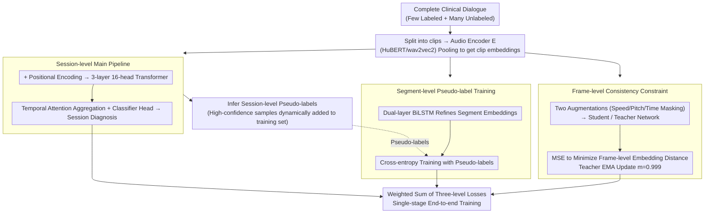

# Semi-Supervised Diseased Detection from Speech Dialogues with Multi-Level Data Modeling

**Conference**: ACL 2026 Findings  
**arXiv**: [2601.04744](https://arxiv.org/abs/2601.04744)  
**Code**: [GitHub](https://github.com/fispresent/semi_pathological)  
**Area**: Audio & Speech  
**Keywords**: semi-supervised learning, pathological speech detection, multi-granularity modeling, pseudo-labeling, clinical dialogue  

## TL;DR

This paper proposes a purely audio-based semi-supervised learning framework that jointly models pathological speech features in clinical dialogues at the session, segment, and frame levels. By utilizing an EMA teacher-student network to dynamically generate high-quality pseudo-labels, the framework achieves 90% of fully supervised performance in depression and Alzheimer's disease detection using only 11 labeled samples.

## Background & Motivation

**Background**: Utilizing acoustic features from speech as biomarkers for disease detection is an increasingly important research direction. Existing methods primarily rely on fully supervised learning, employing pre-trained audio encoders such as wav2vec2 and HuBERT for transfer learning. Multimodal approaches (combining audio, text, and vision) have also been explored but face challenges such as modality conflicts and ASR error propagation.

**Limitations of Prior Work**: (1) Labeling medical speech data requires clinical experts, resulting in extremely high acquisition costs and severe data scarcity; (2) Clinical labeling suffers from significant subjective inter-rater variability, making the labels themselves noisy; (3) The core challenge is "distal weak supervision"—a multi-minute dialogue has only one session-level label (e.g., "depressed/healthy"), yet pathological features are not uniformly distributed; (4) Existing methods process long recordings by segmenting them independently, implicitly assuming uniform symptom expression across all segments, which is often invalid; (5) Semi-supervised methods from general audio domains cannot be directly transferred to medical scenarios because pathological patterns are sparsely distributed in speech.

**Key Challenge**: Supervision signals are provided at the session level (macro), but meaningful acoustic features need to be extracted at the frame or segment level (micro). The model must learn to locate segments with the highest diagnostic value from long dialogues without fine-grained annotations.

**Goal**: To design a semi-supervised framework specifically for medical speech that can simultaneously address the core challenges of weak supervision, data scarcity, and label noise.

**Key Insight**: Leveraging the hierarchical structure of clinical dialogues—frame-level acoustic features $\rightarrow$ segment-level (single utterance) semantics $\rightarrow$ session-level diagnostic labels—to explicitly model these hierarchical relationships rather than compressing all information into a single granularity.

**Core Idea**: Through joint modeling across three granular levels (session-level classification + segment-level pseudo-label refinement + frame-level consistency constraints), the framework dynamically generates and updates pseudo-labels during single-stage end-to-end training to efficiently utilize unlabeled data.

## Method

### Overall Architecture

The framework adopts a teacher-student architecture comprising three levels of modeling: (1) A session-level main pipeline that encodes the complete dialogue and aggregates features via a Transformer to output the final diagnosis; (2) A segment-level pipeline that utilizes an RNN to model individual utterance-level embeddings, trained using pseudo-labels generated by the main pipeline; (3) A frame-level pipeline that applies consistency constraints via a Siamese network. Teacher network parameters are updated via EMA and do not participate in gradient backpropagation.

### Key Designs

**1. Session-level Main Pipeline: Diagnosing the dialogue as a whole and generating pseudo-labels**

Simply reusing the old practice of "segment-independent scoring" loses cross-utterance context, whereas pathological clues may be scattered throughout the dialogue. The main pipeline preserves the full dialogue: it is first split into several clips, and each clip is pooled into an embedding $embed_{clip_i} = POOL(E(clip_i))$ via an audio encoder $E$ (HuBERT / wav2vec2). These are concatenated chronologically with learnable positional encodings and fed into a 3-layer 16-head Transformer to obtain a session-level representation. Finally, temporal attention aggregation and a classification head output the diagnosis. Multi-head attention allows the model to learn which utterances deserve more focus without manual specification. For unlabeled dialogues, this pipeline infers session-level pseudo-labels, dynamically adding high-confidence samples to the training set—the source of the entire semi-supervised loop.

**2. Segment-level Pseudo-label Training: Learning to distinguish pathological segments**

Traditional methods assume "every sentence of a patient is pathological, and every sentence of a healthy person is not," yet in reality, only a few sentences in a long dialogue contain diagnostic information. The segment-level pipeline breaks this uniformity assumption: clip embeddings $embed_{clip_i}$ from the main pipeline are fed into a dual-layer BiLSTM to obtain refined segment embeddings $embed_{clip_i} = RNN(clip_i)$, which are then trained via cross-entropy using labels inferred by the main pipeline. As pseudo-labels are updated during training, the encoder dynamically learns to identify pathological expressions. A practical benefit is that it can handle mixed dialogues containing both the interviewer and the participant without requiring speaker diarization.

**3. Frame-level Consistency Constraint: Providing noise-resistant stable anchors at the lowest level**

Both session and segment levels rely on pseudo-labels; if these are noisy, the entire chain can be misled. The frame-level constraint avoids pseudo-labels entirely, performing self-supervised consistency: a Siamese structure applies two sets of augmentations (speed perturbation, pitch shift, time masking) to the same input, generating two views. These pass through the student and teacher networks, and the frame-level embeddings are pulled together via MSE:

$$Loss_{frame} = MSELoss(embed_{teacher}, embed_{student})$$

The teacher network does not backpropagate gradients but follows the student via EMA: $\theta_{teacher} \leftarrow m \cdot \theta_{teacher} + (1-m) \cdot \theta_{student}$ with a decay rate $m=0.999$. Since this layer learns low-level acoustic patterns independent of labels, the frame-level representation remains stable even if higher-level pseudo-labels are temporarily inaccurate, providing inherent robustness to pseudo-label noise.

### Loss & Training

The total loss is a weighted sum of the three-level losses: $Loss = \alpha Loss_{session} + \beta Loss_{clip} + \gamma Loss_{frame}$. Training is conducted in a single-stage online manner: after a warm-up of $k_0$ steps, all pseudo-labels are re-evaluated and updated every $k$ steps. A thresholding strategy is used—unlabeled samples with confidence exceeding the threshold are included in training. The optimal threshold was found to be 0.75 (achieving a Macro F1 of 68.58% on EATD-Corpus).

## Key Experimental Results

### Main Results

**Detection Performance under Different Labeling Ratios (Macro F1)**

| Method | 100% | 50% | 40% | 30% | 20% | 10% |
|------|------|-----|-----|-----|-----|-----|
| Depression-Baseline | 59.53 | 57.41 | 55.78 | 56.04 | 55.00 | 51.73 |
| Depression-Ours | 63.26 | 62.00 | 58.51 | 58.59 | 57.70 | 54.37 |
| Alzheimer's-Baseline | 71.25 | 70.18 | 69.80 | 67.79 | 67.45 | 65.09 |
| Alzheimer's-Ours | 73.01 | 71.35 | 72.14 | 70.11 | 69.80 | 69.47 |

### Ablation Study

**Incremental Ablation of Hierarchical Components (Depression Detection, Macro F1)**

| Method | 100% | 50% | 30% | 10% |
|------|------|-----|-----|-----|
| Baseline | 59.53 | 57.41 | 56.04 | 51.73 |
| +Session-level | - | 60.55 | 58.25 | 52.95 |
| +Clip-level | 60.78 | 58.30 | 56.55 | 52.50 |
| +Frame-level | 62.87 | 60.31 | 58.21 | 54.21 |
| Ours (All + Encoder Fine-tuning) | 63.26 | 62.00 | 58.59 | 54.37 |

### Key Findings

- Using only 10% of labeled data (approx. 11 samples), the model achieves 90% of the fully supervised baseline performance; 30% labeling matches the full supervision performance.
- Performs better than the baseline even in fully supervised settings, indicating that multi-granularity modeling enhances feature learning itself.
- The frame-level component contributes the most by providing natural robustness against pseudo-label noise.
- The framework is robust across different encoders (wav2vec2, HuBERT, WavLM), languages (Chinese and English), and disease types.
- Pseudo-label quality improves continuously during training, eventually exceeding the quality of additional human annotations in later stages.
- Significantly outperforms the FixMatch baseline across all labeling ratios (e.g., 69.47 vs 61.93 at 10%), as FixMatch fails to model the hierarchical sparsity of pathological features.

## Highlights & Insights

- The three-level joint modeling design is elegant—session-level for global decisions, segment-level for refined learning, and frame-level for consistency. They are complementary and effective even when operating independently.
- Single-stage online pseudo-label updates avoid the complexity and additional inference costs of traditional multi-stage SSL.
- No speaker diarization preprocessing is required—the framework processes raw dialogues including both interviewer and participant, with experiments showing no significant performance drop from including the interviewer.
- Segment-level pseudo-label analysis (Figure 5) clearly demonstrates the model's ability to distinguish between participants and interviewers—the proportion of "pathological" labels for participants rises significantly during training, while remaining low for interviewers.

## Limitations & Future Work

- Purely audio-based methods cannot utilize information from text or visual modalities.
- Dataset scales are relatively small (EATD-Corpus $N=162$, ADReSSo21 $N=237$); performance on larger datasets requires validation.
- Potential integration with multimodal methods remains unexplored.
- The performance of cross-lingual pre-trained models (e.g., English WavLM on Chinese datasets) is limited, emphasizing the importance of language-matched pre-training.

## Related Work & Insights

- **vs FixMatch**: General SSL methods cannot model the hierarchical sparsity of pathological features; this work specifically addresses this via multi-granularity modeling.
- **vs Multimodal Methods (CAMFM, ACMA)**: While multimodal methods achieve higher accuracy, purely audio-based methods offer advantages in cross-lingual transfer and deployment simplicity.
- **vs Traditional Supervised Methods**: Traditional methods segment dialogues and process them independently, assuming uniform symptom expression; this work explicitly models sparse expression characteristics.

## Rating

- Novelty: ⭐⭐⭐⭐ The three-level semi-supervised framework is a first for medical speech detection; single-stage online pseudo-labeling is concise and effective.
- Experimental Thoroughness: ⭐⭐⭐⭐ Validation across two languages and two diseases, three encoders, and multiple labeling ratios, though dataset sizes are small.
- Writing Quality: ⭐⭐⭐⭐ Problem definition is clear, methodology is well-structured, and pseudo-label analysis is well-visualized.
- Value: ⭐⭐⭐⭐ Provides a practical semi-supervised solution for label-scarce medical speech analysis; the model-agnostic design enhances generalizability.

<!-- RELATED:START -->

...

## Related Papers

- [\[ACL 2026\] Data-efficient Targeted Token-level Preference Optimization for LLM-based Text-to-Speech](data-efficient_targeted_token-level_preference_optimization_for_llm-based_text-t.md)
- [\[ACL 2026\] \[b\] = \[d\] − \[t\] + \[p\]: Self-supervised Speech Models Discover Phonological Vector Arithmetic](bd-tp_self-supervised_speech_models_discover_phonological_vector_arithmetic.md)
- [\[ACL 2026\] An Exploration of Mamba for Speech Self-Supervised Models](an_exploration_of_mamba_for_speech_self-supervised_models.md)
- [\[ACL 2026\] SpeakerSleuth: Can Large Audio-Language Models Judge Speaker Consistency across Multi-turn Dialogues?](speakersleuth_can_large_audio-language_models_judge_speaker_consistency_across_m.md)
- [\[ICLR 2026\] EchoMind: An Interrelated Multi-level Benchmark for Evaluating Empathetic Speech Language Models](../../ICLR2026/audio_speech/echomind_an_interrelated_multi-level_benchmark_for_evaluating_empathetic_speech_.md)

<!-- RELATED:END -->
