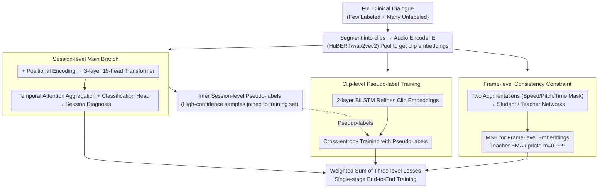

# Semi-Supervised Diseased Detection from Speech Dialogues with Multi-Level Data Modeling

**Conference**: ACL 2026 Findings  
**arXiv**: [2601.04744](https://arxiv.org/abs/2601.04744)  
**Code**: [GitHub](https://github.com/fispresent/semi_pathological)  
**Area**: Audio & Speech  
**Keywords**: Semi-supervised learning, pathological speech detection, multi-granularity modeling, pseudo-labeling, clinical dialogues

## TL;DR

This paper proposes an audio-only semi-supervised learning framework that jointly models pathological speech features at session, clip, and frame levels within clinical dialogues. By utilizing an EMA teacher-student network to dynamically generate high-quality pseudo-labels, the framework achieves 90% of fully supervised performance in depression and Alzheimer's detection using only 11 labeled samples.

## Background & Motivation

**Background**: Utilizing acoustic features from speech as biomarkers for disease detection is an increasingly important research direction. Existing methods primarily rely on fully supervised learning, using pre-trained audio encoders such as wav2vec2 or HuBERT for transfer learning. Multimodal approaches (combining audio, text, and vision) have also been explored but face challenges like modality conflict and ASR error propagation.

**Limitations of Prior Work**: (1) Annotation of medical speech data requires clinical experts, making acquisition costs extremely high and resulting in severe data scarcity; (2) Significant inter-rater subjective differences exist in clinical labeling, rendering the labels themselves noisy; (3) The core challenge is "remote weak supervision"—a several-minute dialogue has only one session-level label (e.g., "depressive vs. healthy"), yet pathological features are not uniformly distributed; (4) Existing methods process long recordings in independent segments, implicitly assuming symptoms are uniformly expressed in every clip, which is often false; (5) General semi-supervised methods in the audio domain cannot be directly migrated to medical scenarios because pathological patterns are sparsely distributed in speech.

**Key Challenge**: Supervision signals exist at the session level (macro), but meaningful acoustic features need to be extracted at the frame or clip level (micro). The model must learn to locate the most diagnostic segments from long dialogues without fine-grained annotations.

**Goal**: Design a semi-supervised framework specifically for medical speech that can simultaneously address weak supervision, data scarcity, and label noise.

**Key Insight**: Leveraging the hierarchical structure of clinical dialogues—frame-level acoustic features $\rightarrow$ clip-level (sentence) semantics $\rightarrow$ session-level diagnostic labels—and explicitly modeling this hierarchy rather than compressing all information into a single granularity.

**Core Idea**: Through the joint modeling of three granularity levels (session-level classification + clip-level pseudo-label refinement + frame-level consistency constraints), the framework dynamically generates and updates pseudo-labels during single-stage end-to-end training to achieve efficient utilization of unlabeled data.

## Method

### Overall Architecture

The framework adopts a teacher-student architecture comprising three levels of modeling: (1) Session-level main branch—encodes the full dialogue and aggregates features via Transformer for final diagnosis; (2) Clip-level—uses RNNs to model embeddings for each utterance, trained with pseudo-labels generated by the main branch; (3) Frame-level—imposes consistency constraints via a Siamese network. Teacher network parameters are updated via EMA and do not participate in gradient backpropagation.

### Key Designs

**1. Session-level Main Branch: Diagnosing full dialogues and generating pseudo-labels**

Previous methods focused on independent segment scoring, which loses cross-sentence context. Since pathological clues are scattered throughout a dialogue, this branch preserves the full dialogue: it segments the recording into clips where each clip embedding is computed as $embed_{clip_i} = POOL(E(clip_i))$ via encoder $E$. After sequence concatenation and positional encoding, a 3-layer 16-head Transformer generates session-level representations, aggregated via temporal attention for diagnosis. For unlabeled data, this branch infers session-level pseudo-labels, feeding high-confidence samples back into the training loop.

**2. Clip-level Pseudo-label Training: Learning to distinguish pathological segments**

Contrary to the assumption that every sentence from a patient is "pathological," only a few segments typically carry diagnostic information. The clip-level branch breaks the uniformity assumption: clip embeddings $embed_{clip_i}$ are processed by a 2-layer BiLSTM to get refined embeddings $embed_{clip_i} = RNN(clip_i)$, which are trained using pseudo-labels from the main branch. As pseudo-labels are refreshed during training, the encoder learns which utterances represent pathological expressions. This design also allows processing mixed dialogues containing both investigators and subjects without requiring speaker diarization.

**3. Frame-level Consistency Constraint: Providing noise-resistant stable anchors**

Session and clip levels rely on pseudo-labels, which can be noisy. The frame-level constraint bypasses pseudo-labels by using self-supervised consistency. A Siamese structure applies two sets of augmentations (speed perturbation, pitch shift, time masking) to the same input. Frame-level embeddings from student and teacher networks are aligned using MSE:

$$Loss_{frame} = MSELoss(embed_{teacher}, embed_{student})$$

The teacher network is updated via EMA: $\theta_{teacher} \leftarrow m \cdot \theta_{teacher} + (1-m) \cdot \theta_{student}$ with $m=0.999$. This learns label-agnostic acoustic patterns, providing inherent robustness to the framework even when high-level pseudo-labels are temporarily inaccurate.

### Loss & Training

The total loss is a weighted sum: $Loss = \alpha Loss_{session} + \beta Loss_{clip} + \gamma Loss_{frame}$. Training follows a single-stage online approach: after a $k_0$ warm-up, pseudo-labels are re-evaluated every $k$ steps. A threshold strategy (e.g., 0.75) determines which unlabeled samples are included in the training set.

## Key Experimental Results

### Main Results

**Detection Performance (Macro F1) under Different Label Proportions**

| Method | 100% | 50% | 40% | 30% | 20% | 10% |
|------|------|-----|-----|-----|-----|-----|
| Depression - Baseline | 59.53 | 57.41 | 55.78 | 56.04 | 55.00 | 51.73 |
| Depression - Ours | 63.26 | 62.00 | 58.51 | 58.59 | 57.70 | 54.37 |
| Alzheimer's - Baseline | 71.25 | 70.18 | 69.80 | 67.79 | 67.45 | 65.09 |
| Alzheimer's - Ours | 73.01 | 71.35 | 72.14 | 70.11 | 69.80 | 69.47 |

### Ablation Study

**Incremental Ablation of Hierarchical Components (Depression, Macro F1)**

| Method | 100% | 50% | 30% | 10% |
|------|------|-----|-----|-----|
| Baseline | 59.53 | 57.41 | 56.04 | 51.73 |
| +Session-level | - | 60.55 | 58.25 | 52.95 |
| +Clip-level | 60.78 | 58.30 | 56.55 | 52.50 |
| +Frame-level | 62.87 | 60.31 | 58.21 | 54.21 |
| Ours (Full + Finetuning) | 63.26 | 62.00 | 58.59 | 54.37 |

### Key Findings

- Performance with just 10% labels (approx. 11 samples) reaches 90% of the fully supervised baseline; 30% labels match full supervision.
- Even in fully supervised settings, the proposed method outperforms the baseline, indicating that multi-granularity modeling enhances feature learning.
- The frame-level component contributes the most to robustness against pseudo-label noise.
- The framework is robust across encoders (wav2vec2, HuBERT, WavLM), languages (Chinese/English), and diseases.
- Pseudo-label quality improves continuously during training, eventually exceeding the quality of additional manual labels.
- Substantially outperforms the FixMatch baseline at all labeling ratios.

## Highlights & Insights

- The joint modeling of three granularities is elegant—session level for global decisions, clip level for refinement, and frame level for consistency.
- Single-stage online pseudo-labeling avoids the complexity and inference costs of multi-stage SSL.
- No speaker diarization is required—the framework processes raw dialogues including investigator speech, with experiments showing minimal performance degradation.
- Clip-level analysis proves the model learns to distinguish subjects from investigators automatically.

## Limitations & Future Work

- Audio-only nature limits the use of textual and visual modality information.
- Dataset scales are relatively small (EATD-Corpus: 162 individuals, ADReSSo21: 237 individuals).
- Integration with multimodal methods remains unexplored.
- Cross-lingual pre-trained models show limitations, suggesting language-matched pre-training is crucial.

## Related Work & Insights

- **vs. FixMatch**: General SSL methods fail to model the hierarchical sparsity of pathological features, which this work addresses via multi-granularity modeling.
- **vs. Multimodal Methods (CAMFM, ACMA)**: While multimodal methods may show higher accuracy, audio-only methods offer advantages in deployment simplicity and cross-linguistic transfer.
- **vs. Traditional Supervised Methods**: Traditional methods treat clips independently, whereas this work explicitly models the sparse expression of symptoms.

## Rating

- Novelty: ⭐⭐⭐⭐ First multi-granularity SSL framework for medical speech; effective single-stage update.
- Experimental Thoroughness: ⭐⭐⭐⭐ Validated across two languages and diseases with detailed ablations.
- Writing Quality: ⭐⭐⭐⭐ Clear problem definition and hierarchical methodology description.
- Value: ⭐⭐⭐⭐ Practical SSL solution for low-resource medical speech analysis.

<!-- RELATED:START -->

## Related Papers

- [\[ACL 2026\] Data-efficient Targeted Token-level Preference Optimization for LLM-based Text-to-Speech](data-efficient_targeted_token-level_preference_optimization_for_llm-based_text-t.md)
- [\[ACL 2026\] \[b\] = \[d\] − \[t\] + \[p\]: Self-supervised Speech Models Discover Phonological Vector Arithmetic](bd-tp_self-supervised_speech_models_discover_phonological_vector_arithmetic.md)
- [\[ACL 2026\] An Exploration of Mamba for Speech Self-Supervised Models](an_exploration_of_mamba_for_speech_self-supervised_models.md)
- [\[ACL 2026\] SpeakerSleuth: Can Large Audio-Language Models Judge Speaker Consistency across Multi-turn Dialogues?](speakersleuth_can_large_audio-language_models_judge_speaker_consistency_across_m.md)
- [\[ICLR 2026\] EchoMind: An Interrelated Multi-level Benchmark for Evaluating Empathetic Speech Language Models](../../ICLR2026/audio_speech/echomind_an_interrelated_multi-level_benchmark_for_evaluating_empathetic_speech_.md)

<!-- RELATED:END -->
