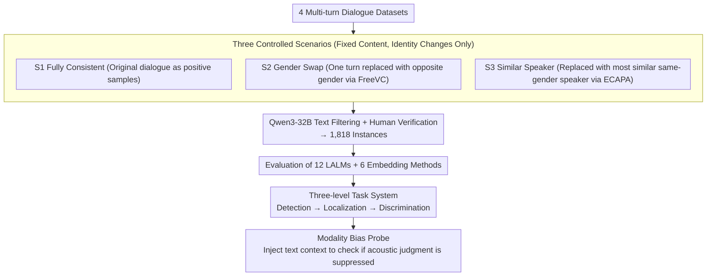

# SpeakerSleuth: Can Large Audio-Language Models Judge Speaker Consistency across Multi-turn Dialogues?

**Conference**: ACL 2026  
**arXiv**: [2601.04029](https://arxiv.org/abs/2601.04029)  
**Code**: [https://github.com/holi-lab/SpeakerSleuth](https://github.com/holi-lab/SpeakerSleuth)  
**Area**: Audio & Speech  
**Keywords**: Large Audio-Language Models, Speaker Consistency, Multi-turn Dialogue, Benchmarking, Modality Bias

## TL;DR

SpeakerSleuth constructs the first benchmark (1,818 instances) to evaluate the ability of LALMs to judge speaker consistency in multi-turn dialogues. Systematic evaluation of 12 LALMs and 6 embedding methods reveals that models struggle with detecting and localizing acoustic inconsistencies and exhibit severe modality bias where text dominates acoustics, although they perform better at comparing and ranking acoustic variants.

## Background & Motivation

**Background**: Speech synthesis technology has reached a level where it can generate natural human speech for applications like voice assistants, podcasts, movie dubbing, and dialogue agents. Maintaining speaker identity consistency (timbre, pitch, voice quality) throughout multi-turn dialogues is a fundamental requirement.

**Limitations of Prior Work**:
- Even the latest speech synthesis models suffer from speaker confusion, timbre drift, and voice quality variations.
- Existing evaluation methods rely on embedding models to calculate pairwise similarities, failing to evaluate dialogue-wide consistency holistically and requiring manual thresholds.
- While LALMs can process entire dialogues to output judgments, it remains unknown whether their acoustic discrimination capabilities are reliable.

**Key Challenge**: Theoretically, LALMs could serve as comprehensive audio-language judges, but there is a lack of systematic benchmarks to evaluate their acoustic discrimination reliability, particularly in multi-turn dialogue scenarios.

**Goal**: To build a benchmark for systematically evaluating the capability of LALMs and embedding methods in judging speaker consistency in multi-turn dialogues, uncovering their strengths, weaknesses, and core limitations.

**Key Insight**: Design three progressive tasks—Detection (is it consistent?) → Localization (which turn is inconsistent?) → Discrimination (compare and rank variants)—for a comprehensive assessment of acoustic discrimination at different levels.

**Core Idea**: Use a controlled experimental design (Same dialogue × Three scenarios: Fully Consistent / Gender Swap / Similar Speaker replacement) to isolate acoustic factors for systematic evaluation and reveal LALMs' modality bias.

## Method

### Overall Architecture

SpeakerSleuth aims to answer a previously unverified question: Can Large Audio-Language Models reliably judge whether "utterances claimed to be from the same person are acoustically consistent" in multi-turn dialogues? The benchmark collects multi-turn audio from 4 dialogue datasets, derives three controlled scenarios for each segment, applies voice conversion via FreeVC, filters text with Qwen3-32B, and performs human quality verification to obtain 1,818 instances. Based on this, 12 LALMs and 6 embedding methods are evaluated across detection, localization, and discrimination tasks. Additional text context is injected to probe for modality bias, dissecting acoustic discrimination capabilities layer by layer.

### Key Designs

**1. Three Controlled Scenarios: Isolating Performance to Acoustics**

The content, turns, and semantics of the entire dialogue remain constant; the only change is whether the speaker identity has been manipulated. Consequently, any drop in accuracy across scenarios can only be attributed to acoustic discrimination rather than content understanding. S1 (Fully Consistent) uses original dialogues; S2 (Gender Swap) replaces a random turn with an opposite-gender speaker via voice conversion for obvious inconsistency; S3 (Similar Speaker) replaces it with the most similar same-gender speaker based on ECAPA-TDNN cosine similarity, pushing difficulty to fine-grained boundaries. The S2 → S3 gradient reveals model performance gaps between "obvious" and "subtle" inconsistencies.

**2. Three-level Task System: From Coarse to Fine-grained TTS Workflows**

The three tasks are aligned with actual generation system repair pipelines: detecting issues, localizing the specific turn, and selecting the best re-generated output. Detection is an absolute judgment requiring models to determine if all turns belong to one person, relying on internal thresholds. Localization requires identifying the specific inconsistent turn via turn-level discrimination. Discrimination involves relative comparisons, where models rank three candidate audios by acoustic similarity, testing relative rather than absolute judgment. These levels identify exactly where a model fails.

**3. Modality Bias Probe: Exposing Textual Suppression of Acoustics**

In practice, LALMs receive both audio and text. The authors provide the text context of other turns to the model to observe changes in detection performance. If a model should judge inconsistency based on acoustics but instead switches to "consistent" because the text reads fluently, it demonstrates modality bias. In experiments, Gemini-2.5-Flash-Lite's performance dropped from 70.3 to 3.3 in the Gender Swap scenario, proving that "text takes priority over acoustics."

## Key Experimental Results

### Main Results (Detection - Balanced Accuracy)

| Model | S1 Acc | S2 Acc | S3 Acc | Balanced Acc | Note |
|-------|--------|--------|--------|--------------|------|
| Gemini-2.5-Pro | 73.9 | 71.6 | 39.3 | **64.7** | Strongest LALM |
| GPT-4o-audio | 72.9 | 32.8 | 29.5 | 52.0 | Weak detection capability |
| Pairwise (WavLM) | 91.8 | 38.4 | 37.7 | **64.9** | Strongest embedding method |
| Pairwise (ECAPA) | 36.0 | 88.4 | 86.3 | 61.7 | Over-detection |

### Discrimination Task

| Model | Classification Acc | NDCG@1 | Exact Match | Note |
|-------|--------------------|---------|-------------|------|
| Gemini-2.5-Pro | **81.5** | **88.8** | **71.5** | Strong relative judgment |
| Pairwise (ECAPA) | **99.2** | **99.6** | 58.6 | Excellent embedding ranking |

### Impact of Text Context (Detection)

| Model | S2 Audio-only | S2 + Text | Δ | Note |
|-------|---------------|-----------|---|------|
| GPT-4o-audio | 32.8 | 6.3 | **-26.5** | High text interference |
| Gemini-2.5-Flash-Lite | 70.3 | 3.3 | **-67.0** | Near-total failure |
| Gemini-2.5-Pro | 71.6 | 46.8 | -24.8 | Affected but retains some judgment |

### Key Findings
- **Unstable Detection Thresholds**: LALMs cluster on the anti-diagonals—either over-predicting consistency (e.g., MiniCPM-o) or over-predicting inconsistency (e.g., Qwen2.5-Omni-7B), lacking calibrated internal thresholds.
- **Weak Localization Capability**: Most models either default to marking no turns or indiscriminately mark all turns (e.g., Gemma-3n with 95% recall but only 19% precision).
- **Strong Performance in Discrimination**: The same models excel at relative comparisons or ranking acoustic variants (Gemini-2.5-Pro 88.8% NDCG@1), suggesting models possess inherent acoustic perception but lack reliable absolute judgment.
- **Severe Modality Bias**: When text context is added, models prioritize textual coherence over acoustic cues, failing to detect even obvious gender swaps.
- Embedding methods also show systematic bias: ECAPA-TDNN tends toward over-detection, while WavLM tends toward omissions.

## Highlights & Insights
- Discovered a fundamental "text-over-audio" modality bias in LALMs, serving as a critical warning for building reliable audio-language judges.
- The counter-intuitive finding of "poor detection but good discrimination" reveals that the problem is not a lack of acoustic perception, but a lack of reliable internal decision thresholds.
- The controlled design of the three scenarios (Consistent/Gender Swap/Similar Speaker) elegantly isolates acoustic factors.
- Benchmarking both LALMs and embedding methods side-by-side provides a fair comparison and complementary insights between the two approaches.

## Limitations & Future Work
- Voice conversion tools may introduce artifacts affecting naturalness in some scenarios.
- Only English dialogue data was tested; cross-lingual evaluation remains to be expanded.
- Each target speaker is fixed to 5 turns; consistency in significantly longer dialogues was not addressed.
- The evaluation set size (1,818 instances) is relatively limited; statistical power may be insufficient to distinguish minor differences between some models.

## Related Work & Insights
- **vs. Traditional Speaker Verification (ECAPA-TDNN)**: Traditional methods perform pairwise comparisons, while SpeakerSleuth evaluates holistic dialogue-level consistency.
- **vs. LALM-as-Judge (Speech Quality Assessment)**: Existing LALM judges focus primarily on single-dimension voice quality; SpeakerSleuth is the first to evaluate speaker consistency across turns.
- **vs. Speaker Identification/Diarization**: Traditional tasks identify "who is speaking," whereas SpeakerSleuth evaluates whether "utterances claimed to be the same person are acoustically consistent."

## Rating
- Novelty: ⭐⭐⭐⭐⭐ First benchmark for multi-turn speaker consistency; discovery of modality bias is highly insightful.
- Experimental Thoroughness: ⭐⭐⭐⭐⭐ Comprehensive evaluation across 12 LALMs, 6 embeddings, three task levels, and text/reference impacts.
- Writing Quality: ⭐⭐⭐⭐ Clear logic from task design and benchmark construction to experimental analysis.

<!-- RELATED:START -->

## Related Papers

- [\[ACL 2026\] Style Amnesia: Investigating Speaking Style Degradation and Mitigation in Multi-Turn Spoken Language Models](style_amnesia_investigating_speaking_style_degradation_and_mitigation_in_multi-t.md)
- [\[AAAI 2026\] DiffA: Large Language Diffusion Models Can Listen and Understand](../../AAAI2026/audio_speech/diffa_large_language_diffusion_models_can_listen_and_understand.md)
- [\[ACL 2025\] Who Can Withstand Chat-Audio Attacks? An Evaluation Benchmark for Large Audio-Language Models](../../ACL2025/audio_speech/who_can_withstand_chat-audio_attacks_an_evaluation_benchmark_for_large_audio-lan.md)
- [\[ACL 2026\] Closing the Modality Reasoning Gap for Speech Large Language Models](closing_the_modality_reasoning_gap_for_speech_large_language_models.md)
- [\[ACL 2026\] StressTest: Can YOUR Speech LM Handle the Stress?](stresstest_can_your_speech_lm_handle_the_stress.md)

<!-- RELATED:END -->
