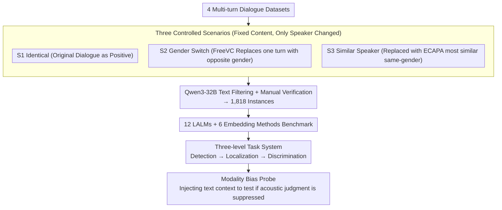

# SpeakerSleuth: Can Large Audio-Language Models Judge Speaker Consistency across Multi-turn Dialogues?

**Conference**: ACL 2026  
**arXiv**: [2601.04029](https://arxiv.org/abs/2601.04029)  
**Code**: [https://github.com/holi-lab/SpeakerSleuth](https://github.com/holi-lab/SpeakerSleuth)  
**Area**: Audio & Speech  
**Keywords**: Large Audio-Language Models, Speaker Consistency, Multi-turn Dialogue, Benchmark, Modality Bias

## TL;DR

SpeakerSleuth constructs the first benchmark (1,818 instances) to evaluate the ability of LALMs to judge speaker consistency in multi-turn dialogues. Systematic evaluations of 12 LALMs and 6 embedding methods reveal that models struggle to detect and localize acoustic inconsistencies and exhibit severe text-over-audio modality bias, though they perform better at comparing and ranking acoustic variants.

## Background & Motivation

**Background**: Speech synthesis technology can now generate natural human speech and is widely used in voice assistants, podcasts, movie dubbing, and dialogue agents. Maintaining speaker identity consistency (timbre, pitch, voice quality) across multi-turn dialogues is a fundamental requirement.

**Limitations of Prior Work**:
- Even the latest speech synthesis models suffer from speaker confusion, timbre drift, and voice quality variations.
- Existing evaluation methods calculate pairwise similarity based on embedding models, which cannot evaluate the consistency of an entire dialogue holistically and require manual threshold settings.
- While LALMs can theoretically process an entire dialogue and output judgments at once, it is unknown whether their acoustic discrimination capabilities are reliable.

**Key Challenge**: LALMs could theoretically serve as comprehensive audio-language judges, but there is a lack of systematic benchmarks to evaluate whether they possess reliable acoustic discrimination capabilities, especially in multi-turn dialogue scenarios.

**Goal**: To build a benchmark for systematically evaluating the capabilities of LALMs and embedding methods in judging speaker consistency in multi-turn dialogues, revealing their strengths, weaknesses, and core limitations.

**Key Insight**: Design three progressive tasks—Detection (consistency check) → Localization (identifying inconsistent turns) → Discrimination (comparing and ranking variants)—to comprehensively evaluate acoustic discrimination across different levels.

**Core Idea**: Through an experimental design with controlled variables (same dialogue × three scenarios: identical/gender switch/similar speaker replacement), acoustic factors are isolated for systematic evaluation to reveal the modality bias of LALMs.

## Method

### Overall Architecture

SpeakerSleuth aims to answer a question never systematically verified: whether Large Audio-Language Models can reliably judge "whether utterances claimed to be from the same person are acoustically consistent" in multi-turn dialogues. The benchmark collects multi-turn audio from 4 dialogue datasets, derives three controlled scenarios for each dialogue, uses FreeVC for voice conversion, Qwen3-32B for automatic text filtering, and manual verification for audio quality, resulting in 1,818 instances. Based on this, 12 LALMs and 6 embedding methods are evaluated on three progressive tasks (Detection, Localization, Discrimination), with additional text context injected to probe modality bias and deconstruct the levels of "acoustic discrimination capability."

### Key Designs

**1. Three Controlled Scenarios: Isolating Performance Differences to Acoustics**

The content, turns, and semantics of the entire dialogue remain consistent; the only variable is whether the speaker identity has been manipulated. Thus, any drop in accuracy between scenarios can only be attributed to acoustic discrimination rather than content understanding. S1 (Identical) uses the original dialogue as positive samples; S2 (Gender Switch) randomly selects one turn and replaces it with a speaker of the opposite gender using voice conversion to create the most obvious acoustic deviation; S3 (Similar Speaker) replaces it with a same-gender speaker with the highest cosine similarity in ECAPA-TDNN embeddings, pushing the difficulty to fine-grained boundaries. The increasing difficulty from S2 to S3 naturally forms an acoustic sensitivity gradient, revealing performance gaps between "obvious inconsistency" and "subtle inconsistency."

**2. Three-level Task System: From Coarse to Fine-grained for Real TTS Workflows**

The three tasks are deliberately aligned with the actual repair pipeline of generation systems—detecting if there is a problem, localizing which turn it is, and finally re-generating and selecting the best one. Detection is an absolute judgment requiring the model to determine if all turns belong to the same person, relying on a stable internal threshold. Localization requires precisely identifying the inconsistent turn, necessitating turn-level acoustic differentiation. Discrimination is a relative comparison where the model ranks three candidate audios by acoustic similarity (including classification and ranking forms), examining relative rather than absolute judgment. These three levels of difficulty reveal exactly where a model fails.

**3. Modality Bias Probe: Exposing Text Over Audio Suppression**

In practical applications, LALMs receive both audio and text. Besides the main experiment, the authors provide the text context of other speaker turns to the model to observe how detection performance changes. If the model, which should rely on acoustic cues to judge inconsistency, switches its judgment to consistent because the text reads coherently, performance collapses. In the experiments, Gemini-2.5-Flash-Lite dropped from 70.3 to 3.3 in the Gender Switch scenario, clearly proving a "text over audio" modality imbalance.

## Key Experimental Results

### Main Results (Detection - Balanced Accuracy)

| Model | S1 Acc | S2 Acc | S3 Acc | Balanced Acc | Note |
|------|--------|--------|--------|-----------|------|
| Gemini-2.5-Pro | 73.9 | 71.6 | 39.3 | **64.7** | Strongest LALM |
| GPT-4o-audio | 72.9 | 32.8 | 29.5 | 52.0 | Weak detection capability |
| Pairwise (WavLM) | 91.8 | 38.4 | 37.7 | **64.9** | Strongest embedding method |
| Pairwise (ECAPA) | 36.0 | 88.4 | 86.3 | 61.7 | Over-detection |

### Discrimination Task

| Model | Classification Acc | NDCG@1 | Exact Match | Note |
|------|-----------|--------|---------|------|
| Gemini-2.5-Pro | **81.5** | **88.8** | **71.5** | Strong relative judgment |
| Pairwise (ECAPA) | **99.2** | **99.6** | 58.6 | Excellent ranking for embeddings |

### Influence of Text Context (Detection)

| Model | S2 Audio-only | S2 + Text | Δ | Note |
|------|-------------|---------|---|------|
| GPT-4o-audio | 32.8 | 6.3 | **-26.5** | Serious text interference |
| Gemini-2.5-Flash-Lite | 70.3 | 3.3 | **-67.0** | Almost total failure |
| Gemini-2.5-Pro | 71.6 | 46.8 | -24.8 | Affected but retains some judgment |

### Key Findings
- **Unstable Detection Thresholds**: LALMs cluster on the anti-diagonal—either over-predicting consistency (e.g., MiniCPM-o) or over-predicting inconsistency (e.g., Qwen2.5-Omni-7B), lacking calibrated internal thresholds.
- **Extremely Weak Localization**: Most models either default to not flagging any turns or indiscriminately flag all turns (e.g., Gemma-3n, with 95% recall but only 19% precision).
- **Good Performance on Discrimination**: The same models perform excellently when comparing or ranking acoustic variants relatively (Gemini-2.5-Pro 88.8% NDCG@1), indicating that models possess inherent acoustic discrimination capabilities, but absolute judgments are unreliable.
- **Severe Text Bias**: When text context is added, models prioritize text coherence and ignore acoustic cues, failing to detect even obvious inconsistencies like gender switches.
- **Embedding biases**: ECAPA-TDNN tends towards over-detection, while WavLM tends towards misses.

## Highlights & Insights
- Discovered a fundamental "text-over-audio" modality bias in LALMs, which serves as a critical warning for building reliable audio-language judges.
- The counter-intuitive finding of "poor detection but good discrimination" reveals the essence of the problem: it is not a lack of acoustic perception, but a lack of reliable internal decision thresholds.
- The controlled design of the three scenarios (Identical/Gender Switch/Similar Speaker) is ingenious, cleanly isolating acoustic factors.
- benchmarking LALMs and embedding methods side-by-side provides fair comparisons and complementary insights for both approaches.

## Limitations & Future Work
- Voice conversion tools in the benchmark may introduce artifacts, affecting naturalness in some scenarios.
- Only English dialogue data was tested; cross-lingual evaluation remains to be expanded.
- Each target speaker is fixed at 5 turns; consistency evaluation in longer dialogues was not addressed.
- The evaluation set size (1,818 instances) is relatively limited, and statistical power might be insufficient to distinguish minor differences between some models.

## Related Work & Insights
- **vs. Traditional Speaker Verification (ECAPA-TDNN)**: Traditional methods perform pairwise comparisons; SpeakerSleuth evaluates holistic dialogue-level consistency judgments.
- **vs. LALM-as-Judge (Speech Quality Assessment)**: Existing LALM judges mainly focus on single-dimension speech quality; SpeakerSleuth is the first to evaluate speaker consistency across turns.
- **vs. Speaker Identification/Diarization**: Traditional tasks identify "who is speaking"; SpeakerSleuth evaluates "whether utterances claimed to be from the same person are acoustically consistent."

## Rating
- Novelty: ⭐⭐⭐⭐⭐ First evaluation benchmark for multi-turn dialogue speaker consistency; discovery of modality bias is highly insightful.
- Experimental Thoroughness: ⭐⭐⭐⭐⭐ Comprehensive coverage across 12 LALMs + 6 embedding methods, three-level tasks, text influence analysis, and reference audio analysis.
- Writing Quality: ⭐⭐⭐⭐ Clear logic from task design to benchmark construction and experimental analysis; key findings are well-summarized.

<!-- RELATED:START -->

## Related Papers

- [\[ACL 2025\] Who Can Withstand Chat-Audio Attacks? An Evaluation Benchmark for Large Audio-Language Models](../../ACL2025/audio_speech/who_can_withstand_chat-audio_attacks_an_evaluation_benchmark_for_large_audio-lan.md)
- [\[AAAI 2026\] DiffA: Large Language Diffusion Models Can Listen and Understand](../../AAAI2026/audio_speech/diffa_large_language_diffusion_models_can_listen_and_understand.md)
- [\[ACL 2026\] Style Amnesia: Investigating Speaking Style Degradation and Mitigation in Multi-Turn Spoken Language Models](style_amnesia_investigating_speaking_style_degradation_and_mitigation_in_multi-t.md)
- [\[ACL 2026\] Temporal Contrastive Decoding: A Training-Free Method for Large Audio-Language Models](temporal_contrastive_decoding_a_training-free_method_for_large_audio-language_mo.md)
- [\[ACL 2026\] Closing the Modality Reasoning Gap for Speech Large Language Models](closing_the_modality_reasoning_gap_for_speech_large_language_models.md)

<!-- RELATED:END -->
