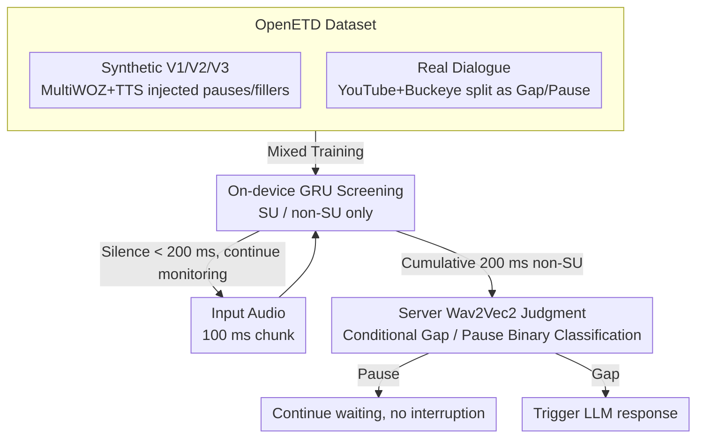

# Speculative End-Turn Detector for Efficient Speech Chatbot Assistant

**Conference**: ACL2026  
**arXiv**: [2503.23439](https://arxiv.org/abs/2503.23439)  
**Code**: The paper mentions the release of processing code and OpenETD data scripts; no full repository URL is provided in the main text.  
**Area**: Speech Dialogue / End-Turn Detection / Efficient Inference  
**Keywords**: End-Turn Detection, Speech Chat, OpenETD, Collaborative Inference, Low Latency

## TL;DR
The paper constructs the first public end-turn detection dataset, OpenETD, and proposes SpeculativeETD. This approach utilizes an on-device GRU to continuously monitor speaking/non-speaking states, invoking a server-side Wav2Vec2 to distinguish between Gaps and Pauses only when a 200 ms silence is encountered. On real speech, it achieves real-time turn-taking performance close to large models while reducing FLOPs by 38x and maintainining sub-millisecond on-device latency.

## Background & Motivation
**Background**: LLM-based voice assistants increasingly emphasize natural conversation. Systems must determine whether a user has finished speaking or is merely pausing to think. This task, known as end-turn detection (ETD), directly influences whether a voice assistant will interrupt prematurely, respond incorrectly, or suffer from excessive latency.

**Limitations of Prior Work**: Existing turn-taking data is either private or costly to use (such as the Fisher corpus), making ETD research difficult to replicate. Regarding models, transformer-based audio models like Wav2Vec2 offer high accuracy but are computationally heavy, making them unsuitable for continuous on-device execution every 100 ms. While small GRUs can be deployed in real-time, their accuracy is significantly lower, particularly in distinguishing between true ends of turns (Gaps) and hesitant pauses (Pauses).

**Key Challenge**: ETD must operate with high frequency, low latency, and low power consumption. However, the most difficult part—distinguishing Gaps from Pauses—requires stronger speech understanding capabilities. Running large models continuously is too expensive, while relying solely on small models leads to unstable interaction quality.

**Goal**: The authors aim to address both the data and inference bottlenecks by constructing the open OpenETD dataset, covering both synthetic and real conversational audio, and designing a cloud-edge collaborative framework where the large model is triggered only during necessary silent intervals.

**Key Insight**: The three-state classification of ETD can be decomposed into two sub-problems of varying difficulty. Distinguishing Speaking Units (SU) from non-SUs is relatively easy and sufficient for small models. Distinguishing Gaps from Pauses is harder and only requires a large model's judgment after a silent interval appears.

**Core Idea**: The structure of "fast screening by small models, sparse confirmation by large models" from speculative decoding is migrated to speech endpoint detection. However, instead of predicting the same distribution, the small and large models are responsible for different levels of categorical granularity.

## Method

### Overall Architecture

SpeculativeETD addresses the most awkward moments for voice assistants: when a user pauses to think, but the system incorrectly assumes the turn has ended and interrupts. It splits the ETD task into two layers based on difficulty. An on-device GRU runs continuously on 100 ms units to perform the simple "speaking vs. non-speaking" judgment. Only when consecutive silences accumulate to the 200 ms threshold commonly used in turn-taking literature is the silent segment sent to the server-side Wav2Vec2. The server model then adjudicates whether it is a Gap (user finished, trigger LLM response) or a Pause (user will continue). This maintains real-time low power consumption on the device while concentrating expensive large model computation on difficult discrimination moments. The training and evaluation data for this cloud-edge collaboration is provided by the OpenETD dataset established by the authors.

### Key Designs

**1. OpenETD: Publicly Trainable ETD Data**

Past ETD research has been hindered by private or expensive corpora, making replication difficult. The authors constructed a public dataset mixing synthetic and real data. The synthetic portion uses MultiWOZ text with TTS to generate three variants: V1 with no explicit pauses, V2 with injected silent pauses, and V3 with filler words before pauses. This allows the model to see controllable pause/gap patterns. The real portion is derived from two-person dialogues from YouTube and Buckeye, segmented via speaker diarization. Silences exceeding 200 ms are labeled as Pause or Gap based on whether the speaker changes. Synthetic data covers specific patterns, while real data addresses domain gaps in noise, accent, and speech rate.

**2. On-device GRU Screening: Compressing Continuous Detection to 202K Parameters**

Continuous real-time detection is the most resource-intensive stage and must reside on the lightest possible on-device model. Therefore, the authors intentionally simplify its task to SU/non-SU classification, removing the burden of semantic Gap/Pause judgment. Each 100 ms chunk is sampled at 16 kHz to extract 40-dimensional log-mel features. These are processed through a two-layer Conv2D frontend to yield 960-dimensional features, followed by a single-layer GRU (hidden size 64) and a linear head to output SU/non-SU logits. The total parameters are approximately 202K, with an on-device execution latency of only 0.26 ms.

**3. Server-side Wav2Vec2 Adjudication & Conditional Triggering: Bringing Speculative Concepts to Speech**

Difficult Gap/Pause distinction requires stronger speech understanding, but this should not run for every frame. The system is configured to send the segment following the start of silence to the server-side Wav2Vec2 for a single binary classification only when the on-device GRU predicts non-SU for 200 consecutive ms. This adopts the "small model filters, large model confirms" framework of speculative decoding. The key difference is that the models handle sub-tasks of different granularities rather than the same distribution—the small model determines "when to trigger," while the large model only solves the "hard problem after triggering." This reduces Wav2Vec2 calls by ~26.7x and overall FLOPs by ~38x on real audio.

### A Complete Example

Imagine a user says, "Help me book a flight to Beijing..." and then pauses. During the first few 100 ms chunks, the on-device GRU continuously outputs SU, and the system waits silently. When the user stops and two consecutive chunks are judged as non-SU (accumulating to 200 ms), the protocol triggers. The system sends the audio segment starting from the onset of silence to the server-side Wav2Vec2. If Wav2Vec2 identifies it as a Pause (the user is thinking of the destination), the assistant continues to wait without interrupting. If the user has actually finished and a Gap is detected, the assistant immediately begins generating a reply. Throughout this process, the large model is called only once at the point of silence; otherwise, the inexpensive on-device GRU remains on duty.

### Loss & Training

The paper does not propose a specialized loss function. Training uses AdamW for 10 epochs. The learning rate is randomly searched within $[3\times10^{-6},3\times10^{-4}]$, and weight decay within $[0.01,2.00]$. Batch sizes are adjusted based on model size. Training data consists of a mix of synthetic and real training splits. Evaluation is performed on separate held-out test splits for both. For the binary classification task, Precision, Recall, F1, and Accuracy are reported; for real-time segmentation, macro F1 and IoU for the three classes are evaluated every 100 ms.

## Key Experimental Results

### Main Results

| Model / Data | Synthetic F1 | Synthetic Acc. / IoU | Real F1 | Real Acc. / IoU | Note |
|--------|------|------|------|------|------|
| VAP Binary | 92.1 | Acc. 92.3 | 59.1 | Acc. 69.6 | Open-source turn-taking baseline |
| GRU Binary | 78.1 | Acc. 79.7 | 49.8 | Acc. 69.0 | Lightweight but low accuracy |
| Wav2Vec2 Binary | 99.2 | Acc. 99.3 | 75.2 | Acc. 81.2 | Highest accuracy but heavy |
| VAP Real-time Ternary | 90.6 | IoU 84.8 | 33.2 | IoU 25.9 | Weak generalization on real data |
| GRU Real-time Ternary | 58.0 | IoU 52.2 | 34.2 | IoU 31.7 | On-device capable but inaccurate |
| Wav2Vec2 Real-time Ternary | 94.7 | IoU 90.2 | 58.4 | IoU 46.2 | Accurate but computationally heavy |
| SpeculativeETD | 94.0 | IoU 88.9 | 45.6 | IoU 37.8 | Synthetic close to Wav2Vec2; Real significantly outperforms VAP/GRU |

### Ablation Study

| Configuration | Key Metrics | Note |
|------|---------|------|
| OpenETD synthetic | 122,481 samples, 148.26 h | V1/V2/V3 covers base, pause, filler word pause |
| OpenETD real | 166 h | From YouTube and Buckeye, two-person dialogue |
| Mixed training | Real F1 45.6, Real IoU 37.8 | synthetic + real yields best results |
| Real only | Real F1 43.1, Real IoU 36.3 | 2.5 F1 decrease compared to mix |
| Synthetic only | Real F1 44.0, Real IoU 36.7 | 1.6 F1 decrease compared to mix |
| SpeculativeETD FLOPs | 919.64 MFLOPs / 100 samples | 38x lower than Wav2Vec2 (34,971.68 MFLOPs) |
| SpeculativeETD W2V calls | 26.7x fewer W2V calls on real audio | Large model triggered only on necessary silence |
| GRU On-device latency | execute 0.26 ms | Compared to Wav2Vec2 execute 1500.32 ms |

### Key Findings
- OpenETD synthetic data totals 148.26 hours, with 96,773 samples / 116.83 h for training and 12,868 samples / 15.68 h for testing. Real data is sourced from natural dyadic conversations to bridge the domain gap.
- The gap/pause duration distributions of synthetic vs. real data are similar (gap duration KS=0.083, Cohen's d=0.12), indicating Erlang fitting effectively simulates silence length. However, the position distribution differs significantly; synthetic data is better for augmentation rather than being a direct replica of real dialogue.
- Manual verification shows an overall human-auto agreement of 85.4%, with 94.0% for Pause and 76.1% for Gap. Diarization quality averaged 4.17/5, suggesting that while Gap boundaries are harder to define, the labels are generally usable.
- End-to-end audio transmission RTT is approximately 106-116 ms on 5G and 98-140 ms on Wi-Fi, both below the 200 ms turn-taking threshold. Increasing the payload from 3.1 KB to 312.5 KB only adds about 10 ms on 5G.

## Highlights & Insights
- Splitting ETD into coarse on-device and fine server-side stages is highly intuitive. it matches the non-uniform difficulty of the task and the computational constraints of mobile deployment.
- The value of OpenETD is equal to that of the method itself. Many previous ETD works were restricted by private data; this paper provides an open benchmark mixing synthetic and real data.
- The "speculative" nature of SpeculativeETD is not a simple copy of LLM decoding but a redefinition of model roles: the small model handles trigger conditions, while the large model solves the difficult sub-problem. This architecture can be transferred to other streaming perception tasks.
- The experiment reports accuracy, FLOPs, on-device latency, and network RTT simultaneously, making it more relevant to real-world voice assistant deployment than reporting F1 alone.

## Limitations & Future Work
- The data primarily covers English conversations; turn-taking patterns, pause lengths, and filler words may vary across different languages and cultures.
- Gap/Pause classification depends on the server-side Wav2Vec2. Although RTT measurements are below 200 ms, real production systems face model queuing, network jitter, privacy concerns, and offline issues.
- There remains a gap between the position distribution of pause/gap in synthetic data and real data. Additionally, TTS possesses limited accents and voices, lacking enough diversity to cover all real users.
- Real data labeling relies on diarization and the 200 ms rule; the 76.1% human-auto agreement for Gaps indicates inherent boundary noise in the training target.
- SpeculativeETD’s Real F1 of 45.6 is notably lower than Wav2Vec2’s 58.4. It is an efficiency-oriented compromise; if an application is extremely sensitive to interruptions, it still requires a stronger server verifier or contextual language understanding.

## Related Work & Insights
- **vs. VAP**: VAP is a classic turn-taking model that performs well on synthetic data but has an F1 of only 33.2 on real data. SpeculativeETD improves real segmentation through data and two-stage inference.
- **vs. Full Wav2Vec2**: Wav2Vec2 offers the highest accuracy but consumes ~34,971.68 MFLOPs per 100 samples and ~1500 ms for on-device execution. SpeculativeETD reduces computation to 919.64 MFLOPs via conditional triggering.
- **vs. Pure GRU On-device**: GRU latency is extremely low, but accuracy is insufficient. SpeculativeETD maintains real-time performance while using the server to handle Gap/Pause difficulties.
- **Insight**: For streaming multimodal agents, tasks can be split into "inexpensive on-device sentry + expensive cloud discriminator." This can be applied to visual wake-up, anomaly detection, speech emotion shifts, or mobile privacy filtering.

## Rating
- Novelty: ⭐⭐⭐⭐ The two-stage ETD design is simple and effective; main innovation lies in task decomposition and the open dataset.
- Experimental Thoroughness: ⭐⭐⭐⭐ Covers binary classification, real-time segmentation, FLOPs, on-device latency, RTT, and data quality analysis.
- Writing Quality: ⭐⭐⭐⭐ Clear structure, strong deployment motivation, and direct explanations of data and methods.
- Value: ⭐⭐⭐⭐ Practical for real-time voice assistants; OpenETD is particularly valuable for subsequent research.

<!-- RELATED:START -->

## Related Papers

- [\[ACL 2026\] VAPO: End-to-end Slide-Enhanced Speech Recognition with Omni-modal Large Language Models](vapo_end-to-end_slide-enhanced_speech_recognition_with_omni-modal_large_language.md)
- [\[ACL 2025\] Distilling an End-to-End Voice Assistant Without Instruction Training Data](../../ACL2025/audio_speech/distilling_an_end-to-end_voice_assistant_without_instruction_training_data.md)
- [\[ACL 2026\] VoxMind: An End-to-End Agentic Spoken Dialogue System](voxmind_an_end-to-end_agentic_spoken_dialogue_system.md)
- [\[AAAI 2026\] End-to-end Contrastive Language-Speech Pretraining Model For Long-form Spoken Question Answering](../../AAAI2026/audio_speech/end-to-end_contrastive_language-speech_pretraining_model_for_long-form_spoken_qu.md)
- [\[ACL 2026\] Data-efficient Targeted Token-level Preference Optimization for LLM-based Text-to-Speech](data-efficient_targeted_token-level_preference_optimization_for_llm-based_text-t.md)

<!-- RELATED:END -->
