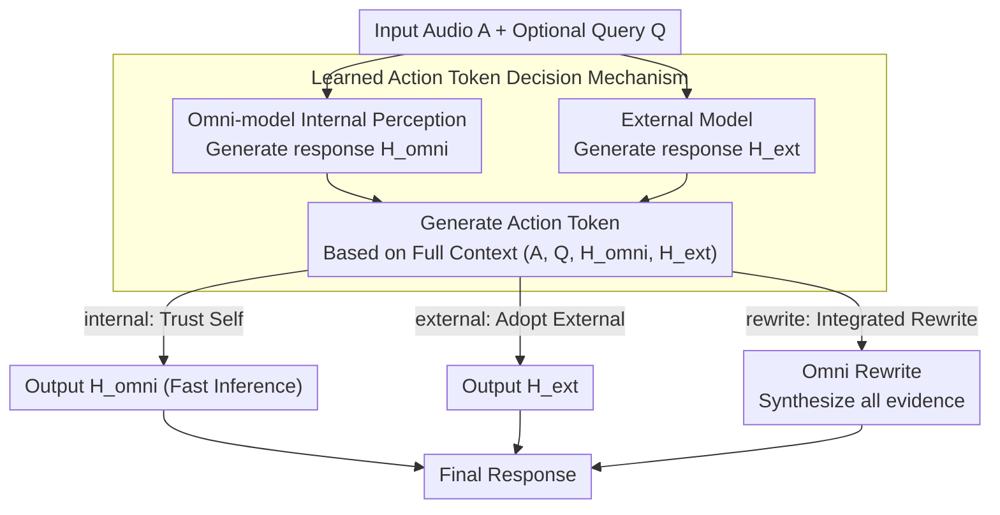

# Speech-Hands: A Self-Reflection Voice Agentic Approach to Speech Recognition and Audio Reasoning with Omni Perception

**Conference**: ACL2026 Oral  
**arXiv**: [2601.09413](https://arxiv.org/abs/2601.09413)  
**Code**: [GitHub](https://YukinoWan.github.io/Speech-Hands/)  
**Area**: Audio Speech  
**Keywords**: Speech Recognition, Audio Reasoning, Multi-modal Agent, Self-reflection, Generative Error Correction

## TL;DR

Speech-Hands is proposed as a learnable speech agent framework. By generating explicit action tokens (`<internal>`/`<external>`/`<rewrite>`) at inference time to decide whether to trust internal perception or external ASR hypotheses, it achieves an average WER reduction of 12.1% across 7 benchmarks on the OpenASR leaderboard and reaches 77.37% accuracy on Audio QA.

## Background & Motivation

Omni-modal models (e.g., Qwen2.5-Omni) can process audio and text simultaneously, yet a critical and counter-intuitive discovery is that naively fine-tuning these models to fuse speech recognition and external sound understanding tasks often **degrades performance**. Preliminary experiments show that using Qwen2.5-Omni for Generative Error Correction (GER) on Whisper's N-best hypotheses leads to WER deterioration (8.52%-9.05%) across 7 ASR benchmarks. Further zero-shot analysis reveals that base models lack intrinsic arbitration capabilities—their decisions are highly sensitive to prompt phrasing rather than the correctness of the answer. This indicates a need for an **explicit self-reflection mechanism** that allows the model to learn when to trust itself and when to seek external help.

## Method

### Overall Architecture

Speech-Hands models speech understanding as an agentic decision process. Given an input audio $A$ and an optional query $Q$, the omni-model first generates its own response $H_{omni}$ (internal perception) while simultaneously obtaining a response $H_{ext}$ from an external model. The model then explicitly generates an action token based on the complete context $(A, Q, H_{omni}, H_{ext})$ to guide the subsequent generation strategy: `<internal>` trusts itself, `<external>` adopts the external response, and `<rewrite>` rewrites by synthesizing all evidence (i.e., GER). The trust branches proceed directly to fast inference output, while only the rewrite branch enters the deeper Omni Rewrite. This action token mechanism is trained using labels constructed by "post-hoc comparison with ground truth" and learns the mapping from "evidence to action" end-to-end using a single cross-entropy loss.

### Key Designs

**1. Learned Action Token Decision Mechanism (Core Idea)**: The pain point of naive fusion is that the model becomes bewildered when internal perception conflicts with external hypotheses—zero-shot arbitration depends heavily on prompt wording rather than answer correctness. Speech-Hands moves away from implicit fusion; the omni-model first generates $H_{omni}$, combines it with $H_{ext}$, and explicitly outputs an action token based on $(A, Q, H_{omni}, H_{ext})$. This transforms uninterpretable information fusion into an interpretable strategic decision. The token is generated at inference time and directly conditions the subsequent output—trust branches utilize fast inference, and only the rewrite branch incurs the additional cost of Omni Rewrite.

**2. Action Token Label Construction via Result Comparison**: The decision mechanism requires supervision, but "which source is more credible" lacks ready-made labels. This work uses "post-hoc comparison with ground truth" to back-infer labels, applying two strategies based on task type. For ASR, errors are quantifiable: WER is calculated for internal transcription $T_{int}$, external $T_{ext}$, and GER fusion $T_{ger}$. The one with the lowest WER (or if internal WER=0) is labeled as the corresponding token, providing fine-grained strong supervision. Audio QA offers only discrete correctness, and external predictions are stochastic; thus, the external model is sampled 5 times, and a majority vote determines the label `<external>` or `<rewrite>` to stabilize the decision boundary and reduce interference from single-prediction randomness.

**3. Unified End-to-End Training**: Each sample is formatted as "action token + target text," using a single cross-entropy loss to jointly supervise "which action to select" and "what to generate under that action." This allows the model to internalize the mapping from "multi-modal evidence to action choice" within a single set of parameters. ASR and Audio QA thus reuse the same framework, naturally generalizing from speech recognition to audio question answering by merely switching the label construction strategy.

### Loss & Training

- Standard cross-entropy loss, jointly optimizing the action token and target sequence.
- Fine-tuned based on Qwen2.5-Omni for 5 epochs, batch size 64, learning rate 1e-4 (cosine decay), fp16 training.
- A maximum of 20,000 training samples per dataset (constrained by inference computation).

## Key Experimental Results

### Main Results

ASR Task (7 OpenASR datasets, WER%):

| Method | AMI | Tedlium | GigaSpeech | SPGISpeech | VoxPopuli | Libri-clean | Libri-other | Avg. WER↓ |
|------|-----|---------|------------|------------|-----------|-------------|-------------|----------|
| Whisper-v2-large | 16.88 | 4.32 | 11.45 | 3.94 | 7.57 | 2.91 | 5.15 | 7.17 |
| Qwen2.5-Omni | 19.77 | 5.17 | 11.26 | 4.58 | 6.59 | 2.09 | 3.85 | 7.33 |
| Phi-4-MM | 11.69 | 2.90 | 9.78 | 3.13 | 5.93 | 1.68 | 3.83 | 6.14 |
| GER ⇒ Whisper | 23.44 | 6.15 | 12.15 | 3.94 | 7.53 | 2.97 | 4.89 | 8.44 |
| **Speech-Hands ⇌ parakeet** | **11.20** | **4.37** | **11.10** | **2.26** | **6.02** | **1.67** | **3.18** | **5.69** |

Audio QA Task (Accuracy%):

| Method | Bio-acoustic | Soundscape | Complex QA | Avg. Acc↑ |
|------|-------------|------------|------------|----------|
| Qwen2.5-Omni | 47.32 | 56.32 | 59.89 | 57.87 |
| AudioFlamingo 3 | 71.88 | 57.31 | 81.26 | 74.49 |
| **Speech-Hands + majority** | **81.25** | **59.4** | **85.7** | **77.37** |

### Ablation Study

| Experiment | Key Finding |
|----------|----------|
| Prompt Ablation (GER SFT) | All prompt strategies failed (WER 8.44-9.05), proving implicit fusion is infeasible. |
| Zero-shot Arbitration | Model decisions are sensitive to prompt phrasing rather than answer correctness (verified by confusion matrix). |
| Action Token F1 | `<internal>` F1 > 0.8 (most datasets), `<external>` F1 0.65-0.89, `<rewrite>` F1 < 0.4 (limited by data sparsity). |
| Training Data Volume | Surpassed full-training baselines with only 20k samples per dataset. |

### Key Findings

- Cascaded GER (ASR followed by LLM correction) is **consistently inferior** to original ASR, whereas Speech-Hands' parallel agentic architecture is **consistently superior** to both baselines.
- Although `<rewrite>` labels are extremely sparse (<2%), the model maintains high precision upon trigger, reflecting cautious but reliable rewrite detection.
- On AMI (meeting speech, the noisiest scenario), Speech-Hands reduced Qwen2.5-Omni's WER from 19.77% to 11.20%, a 43% reduction.

## Highlights & Insights

- **Key Insight**: The fundamental problem of multi-modal models is not insufficient perception capacity, but rather the lack of a mechanism to arbitrate between multiple information sources. Explicit action tokens transform implicit information fusion into an interpretable decision process.
- **"Knowing what it doesn't know"**: The framework is analogous to self-reflection in developmental psychology, moving from an egocentric perspective to a stage where it can "step outside its own thinking" to evaluate belief reliability.
- **Natural Generalization**: The transition from ASR to Audio QA requires no architectural modifications, only an adjustment of the action token construction strategy.

## Limitations & Future Work

- Training data for the `<rewrite>` action is extremely sparse with low F1, requiring data augmentation strategies.
- Currently, only Qwen2.5-Omni is used as the backbone; generalization to other omni-models remains to be verified.
- Tool calling actions (e.g., calling external APIs) have not yet been implemented and represent a future direction.
- Multilingual ASR scenarios have not been explored.

## Related Work & Insights

- **Generative Error Correction (GER)** (Yang et al., 2023): Pure text cascaded correction cannot utilize raw audio; this paper proves this is a fundamental limitation of "non-agentic" approaches.
- **Qwen2.5-Omni / Phi-4-MM**: Current state-of-the-art omni-models, but lacking explicit arbitration mechanisms.
- **Self-reflection** (Madaan et al., 2023): Existing reflection methods intervene after perceptual fusion; Speech-Hands innovates by reflecting on the **perceptual behavior itself**.
- Insight: The action token approach can be extended to any multi-modal task requiring arbitration between multiple information sources.

## Rating

| Dimension | Score (1-10) |
|------|------------|
| Novelty | 8 |
| Experimental Thoroughness | 8 |
| Writing Quality | 7 |
| Value | 8 |
| Total Score | 7.8 |

## Rating
- Novelty: TBD
- Experimental Thoroughness: TBD
- Writing Quality: TBD
- Value: TBD

<!-- RELATED:START -->

## Related Papers

- [\[ACL 2026\] VAPO: End-to-end Slide-Enhanced Speech Recognition with Omni-modal Large Language Models](vapo_end-to-end_slide-enhanced_speech_recognition_with_omni-modal_large_language.md)
- [\[ACL 2026\] An Exploration of Mamba for Speech Self-Supervised Models](an_exploration_of_mamba_for_speech_self-supervised_models.md)
- [\[ACL 2026\] \[b\] = \[d\] − \[t\] + \[p\]: Self-supervised Speech Models Discover Phonological Vector Arithmetic](bd-tp_self-supervised_speech_models_discover_phonological_vector_arithmetic.md)
- [\[ACL 2026\] Beyond Transcription: Unified Audio Schema for Perception-Aware AudioLLMs](beyond_transcription_unified_audio_schema_for_perception-aware_audiollms.md)
- [\[ACL 2025\] SpeechIQ: Speech-Agentic Intelligence Quotient Across Cognitive Levels in Voice Understanding by Large Language Models](../../ACL2025/audio_speech/speechiq_speechagentic_intelligence_quotient_across_cognitive.md)

<!-- RELATED:END -->
