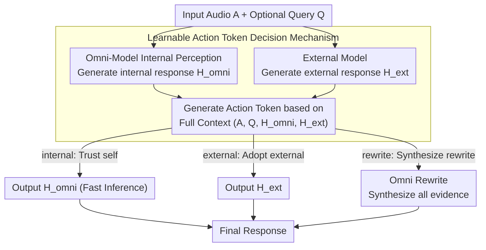

<!-- Generated automatically by src/gen_stubs.py -->
# Speech-Hands: A Self-Reflection Voice Agentic Approach to Speech Recognition and Audio Reasoning with Omni Perception

**Conference**: ACL2026 Oral  
**arXiv**: [2601.09413](https://arxiv.org/abs/2601.09413)
**Code**: [GitHub](https://YukinoWan.github.io/Speech-Hands/)
**Area**: Audio & Speech
**Keywords**: Speech Recognition, Audio Reasoning, Multimodal Agent, Self-Reflection, Generative Error Correction

## TL;DR

Speech-Hands is proposed as a learnable speech agent framework that decides whether to trust its own perception or external ASR hypotheses by generating explicit action tokens (`<internal>`/`<external>`/`<rewrite>`) at inference time. It achieves an average WER reduction of 12.1% across 7 benchmarks on the OpenASR leaderboard and reaches 77.37% accuracy in audio QA.

## Background & Motivation

Omni-multimodal models (e.g., Qwen2.5-Omni) can process audio and text simultaneously. However, a key counter-intuitive finding is that naively fine-tuning omni-models to fuse speech recognition and external sound understanding tasks often **degrades performance**. Preliminary experiments indicate that using Qwen2.5-Omni for Generative Error Correction (GER) on Whisper's N-best hypotheses worsens WER by 8.52%-9.05% across 7 ASR benchmarks. Further zero-shot analysis shows that base models lack intrinsic arbitration capabilities—their decisions are highly sensitive to prompt wording rather than the correct answer. This suggests the need for an **explicit self-reflection mechanism** so the model can learn when to trust itself and when to seek external assistance.

## Method

### Overall Architecture

Speech-Hands models speech understanding as an agentic decision process. Given an input audio $A$ and an optional query $Q$, the omni-model first generates its own response $H_{omni}$ (internal perception) while obtaining a response $H_{ext}$ from an external model. The model then explicitly generates an action token based on the full context $(A, Q, H_{omni}, H_{ext})$ to guide the subsequent generation strategy: `<internal>` trusts itself, `<external>` adopts the external result, and `<rewrite>` synthesizes all evidence (i.e., GER). The trust branches proceed with fast inference, while only the rewrite branch enters the deeper Omni Rewrite. This action token mechanism is trained using labels constructed via "post-hoc comparison with ground truth" and learns the "evidence-to-action" mapping end-to-end using a single cross-entropy loss.

### Key Designs

**1. Learnable Action Token Decision Mechanism (Core)**: A major pain point in naive fusion is the model's confusion when internal perception conflicts with external hypotheses—zero-shot arbitration depends more on prompt wording than answer correctness. Speech-Hands replaces implicit fusion with an explicit decision where the omni-model first generates $H_{omni}$ and then, combined with $H_{ext}$, outputs an action token: `<internal>`, `<external>`, or `<rewrite>`. This transforms uninterpretable information fusion into an interpretable strategic decision. Action tokens are generated during inference to directly condition subsequent output—trust branches utilize fast inference, and only the rewrite branch incurs additional costs for Omni Rewrite.

**2. Action Token Label Construction via Result Comparison**: Since there are no ready-made labels for "which source is more credible," this work uses post-hoc comparison with ground truth. In ASR, WER is quantified: WER is calculated for internal transcript $T_{int}$, external transcript $T_{ext}$, and GER fused transcript $T_{ger}$. The source with the lowest WER (or $T_{int}$ if its WER=0) is labeled. For Audio QA, which has discrete correctness and random external predictions, 5 external samples are taken and a majority vote determines the label between `<external>` and `<rewrite>` to stabilize the decision boundary.

**3. Unified End-to-End Training**: Each sample is formatted as "Action Token + Target Text." A single cross-entropy loss jointly optimizes which action to select and what to generate under that action. This allows the model to internalize the mapping from multimodal evidence to action selection within a single set of parameters, allowing natural generalization from ASR to Audio QA by merely switching the label construction strategy.

### Loss & Training

- Standard cross-entropy loss to jointly optimize action tokens and target sequences.
- Fine-tuning based on Qwen2.5-Omni for 5 epochs, batch size 64, learning rate 1e-4 (cosine decay), and fp16 training.
- A maximum of 20,000 training samples per dataset are used (constrained by inference computation).

## Key Experimental Results

### Main Results

ASR Task (7 OpenASR datasets, WER%):

| Method | AMI | Tedlium | GigaSpeech | SPGISpeech | VoxPopuli | Libri-clean | Libri-other | Average WER↓ |
|------|-----|---------|------------|------------|-----------|-------------|-------------|----------|
| Whisper-v2-large | 16.88 | 4.32 | 11.45 | 3.94 | 7.57 | 2.91 | 5.15 | 7.17 |
| Qwen2.5-Omni | 19.77 | 5.17 | 11.26 | 4.58 | 6.59 | 2.09 | 3.85 | 7.33 |
| Phi-4-MM | 11.69 | 2.90 | 9.78 | 3.13 | 5.93 | 1.68 | 3.83 | 6.14 |
| GER ⇒ Whisper | 23.44 | 6.15 | 12.15 | 3.94 | 7.53 | 2.97 | 4.89 | 8.44 |
| **Ours ⇌ parakeet** | **11.20** | **4.37** | **11.10** | **2.26** | **6.02** | **1.67** | **3.18** | **5.69** |

Audio QA Task (Accuracy%):

| Method | Bio-acoustic | Soundscape | Complex QA | Average Acc↑ |
|------|-------------|------------|------------|----------|
| Qwen2.5-Omni | 47.32 | 56.32 | 59.89 | 57.87 |
| AudioFlamingo 3 | 71.88 | 57.31 | 81.26 | 74.49 |
| **Ours + majority** | **81.25** | **59.4** | **85.7** | **77.37** |

### Ablation Study

| Experiment | Key Findings |
|----------|----------|
| Prompt Ablation (GER SFT) | All prompt strategies failed (WER 8.44-9.05), proving implicit fusion is unfeasible. |
| Zero-shot Arbitration | Model decisions are sensitive to prompt wording rather than answer correctness (verified by confusion matrix). |
| Action Token F1 | `<internal>` F1 > 0.8 (most datasets), `<external>` F1 0.65-0.89, `<rewrite>` F1 < 0.4 (due to data sparsity). |
| Training Data Volume | Surpassed full-training baselines with only 20k samples per dataset. |

### Key Findings

- Cascaded GER (ASR followed by LLM correction) is **consistently inferior** to original ASR, whereas the parallel agentic architecture of Speech-Hands is **consistently superior** to both baselines.
- Although `<rewrite>` labels are extremely sparse (<2%), the model maintains high precision when triggered, demonstrating cautious but reliable rewrite detection.
- On AMI (meeting speech, most noisy scenario), Speech-Hands reduced the Qwen2.5-Omni WER from 19.77% to 11.20%, a 43% Gain.

## Highlights & Insights

- **Core Insight**: The fundamental problem with multimodal models is not insufficient perception, but a lack of mechanisms to arbitrate between multiple information sources. Explicit action tokens transform implicit information fusion into an interpretable decision process.
- **"Knowing what you don't know"**: The framework draws an analogy to the development of self-reflection in developmental psychology, moving from an egocentric perspective to a stage where belief reliability can be assessed by "stepping outside one's own thinking."
- **Natural Generalization**: The transition from ASR to Audio QA requires no architectural modifications, only an adjustment in the action token construction strategy.

## Limitations & Future Work

- Training data for the `<rewrite>` action is extremely sparse, resulting in low F1; data augmentation strategies are needed.
- Currently, only Qwen2.5-Omni is used as the backbone; generalization to other omni-models remains to be verified.
- Tool calling actions (e.g., calling external APIs) have not been implemented and represent a future direction.
- Multilingual ASR scenarios have not been explored.

## Related Work & Insights

- **Generative Error Correction (GER)** (Yang et al., 2023): Pure-text cascaded correction cannot utilize original audio; this paper demonstrates this as a fundamental limitation of being "non-agentic."
- **Qwen2.5-Omni / Phi-4-MM**: Current state-of-the-art omni-models, but they lack explicit arbitration mechanisms.
- **Self-Reflection** (Madaan et al., 2023): Existing reflection methods intervene after perceptual fusion; the innovation of Speech-Hands lies in reflecting on the **perceptual behavior itself**.
- Insight: The concept of action tokens can be extended to any multimodal task requiring arbitration between multiple information sources.

## Rating

| Dimension | Score (1-10) |
|------|------------|
| Novelty | 8 |
| Experimental Thoroughness | 8 |
| Writing Quality | 7 |
| Value | 8 |
| Total Score | 7.8 |

## Rating
- Novelty: TBD
- Experimental Thoroughness: TBD
- Writing Quality: TBD
- Value: TBD

<!-- RELATED:START -->

## Related Papers

- [\[ACL 2026\] VAPO: End-to-end Slide-Enhanced Speech Recognition with Omni-modal Large Language Models](vapo_end-to-end_slide-enhanced_speech_recognition_with_omni-modal_large_language.md)
- [\[ACL 2026\] An Exploration of Mamba for Speech Self-Supervised Models](an_exploration_of_mamba_for_speech_self-supervised_models.md)
- [\[ACL 2026\] \[b\] = \[d\] − \[t\] + \[p\]: Self-supervised Speech Models Discover Phonological Vector Arithmetic](bd-tp_self-supervised_speech_models_discover_phonological_vector_arithmetic.md)
- [\[ACL 2026\] Closing the Modality Reasoning Gap for Speech Large Language Models](closing_the_modality_reasoning_gap_for_speech_large_language_models.md)
- [\[ACL 2025\] SpeechIQ: Speech-Agentic Intelligence Quotient Across Cognitive Levels in Voice Understanding by Large Language Models](../../ACL2025/audio_speech/speechiq_speechagentic_intelligence_quotient_across_cognitive.md)

<!-- RELATED:END -->
