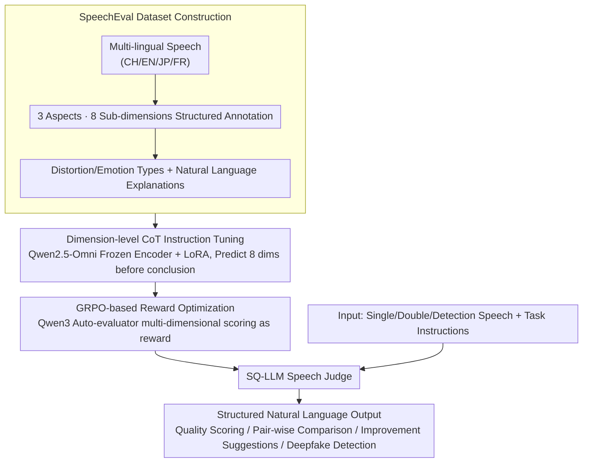

# SpeechLLM-as-Judges: Towards General and Interpretable Speech Quality Evaluation

**Conference**: ACL 2026  
**arXiv**: [2510.14664](https://arxiv.org/abs/2510.14664)  
**Code**: https://github.com/NKU-HLT/SpeechLLM-as-Judges  
**Area**: Speech Quality Assessment / Multimodal Large Models / LLM Safety  
**Keywords**: Speech Quality Evaluation, Multi-task Evaluation, SpeechEval, CoT Reasoning, GRPO

## TL;DR
This paper extends speech quality assessment from "assigning a score" to "interpretable speech judging" by constructing the SpeechEval dataset, which contains 32,207 multi-lingual audios and 128,754 annotations. By utilizing CoT instruction tuning and GRPO training, SQ-LLM was developed, outperforming existing speech LLMs and expert models across four task categories: quality scoring, pair-wise comparison, improvement suggestions, and deepfake detection.

## Background & Motivation
**Background**: Generative speech systems now cover scenarios such as TTS, speech translation, speech dialogue, and singing voice generation. Evaluation typically relies on MOS, AB preference tests, objective metrics like MCD/STOI, or specialized quality predictors such as MOSNet, UTMOS, and Audiobox Aesthetics.

**Limitations of Prior Work**: Most of these methods provide either scalar scores or binary judgments, failing to explain "why the speech is poor." They also struggle to simultaneously handle real-world demands for multi-lingual, multi-source, and multi-task evaluation. For speech system developers, a 3.7 MOS score does not indicate whether they should fix pronunciation clarity, dynamic range, emotional expression, or distorted segments.

**Key Challenge**: Speech quality is inherently multi-dimensional, subjective, and task-dependent, yet existing evaluation protocols tend to compress it into a single number. Furthermore, while general speech LLMs possess multimodal input capabilities, they lack fine-grained quality supervision, resulting in weak alignment with human judgment when used as judges.

**Goal**: The authors aim to establish a unified framework where a model can listen to audio, understand task instructions, provide quality judgments, explain rationales, compare two samples, propose improvement suggestions, and provide reliable classification for deepfake detection.

**Key Insight**: The key observation is that speech quality assessment is not merely a signal processing problem but can be modeled as a multimodal judging task with structured rationales. With annotations covering multiple tasks, languages, and fine-grained dimensions, speech LLMs can learn judging processes similar to human reviewers.

**Core Idea**: Use SpeechEval to provide multi-dimensional quality supervision, then train Qwen2.5-Omni into an interpretable LLM judge for speech quality through CoT instruction tuning and preference-based reward optimization.

## Method

### Overall Architecture

This paper reformulates speech quality assessment from "outputting a MOS scalar" to "providing reasoned judgments like a human reviewer." The approach consists of two steps: constructing the SpeechEval multi-task dataset and training the SQ-LLM interpretable speech judge. During inference, inputs can be single, double, or authentication-pending speech samples paired with natural language task instructions. The model uses a speech encoder to extract acoustic representations, which are fed into a speech-aware language decoder along with task prompts to output structured natural language answers. Four types of tasks—single-sample scoring, dual-sample comparison, improvement suggestions, and deepfake detection—share the same model and instruction interface.

### Key Designs

**1. SpeechEval: Using "Rationales Behind Scores" as Supervision**
Traditional datasets are mostly mono-lingual scalar ratings for single tasks, which cannot train general judging capabilities. Thus, the authors constructed SpeechEval with 32,207 multi-lingual audios and 128,754 annotations across Chinese, English, Japanese, and French. The protocol decomposes quality into three high-level aspects: Overall Quality, Production Quality, and Content Enjoyment, further refined into 8 sub-dimensions: Intelligibility, Distortion, Rate, Dynamic Range, Emotional Impact, Artistic Expression, and Subjective Experience. Extra labels for distortion types, emotion types, speaker gender, and open-ended descriptions were also collected. Both structured labels and natural language explanations serve as supervision, allowing the model to learn "why the score was given."

**2. Dimension-level CoT Instruction Tuning: Thinking Through Dimensions First**
Supervising only the final answer can lead to reasonable-looking but inconsistent explanations. Therefore, the authors require the model to explicitly predict the 8 quality dimensions before delivering the final judgment. SQ-LLM is based on Qwen2.5-Omni-7B, with the speech encoder frozen and fine-tuned using LoRA. The training objective covers both intermediate predictions and the final answer: $$L=\lambda\sum_i L_{dim}^{(i)}+L_{ans}$$, where $$\lambda=0.3$$. Explicitly injecting structural information from human annotations makes the judging rationale closer to human logic.

**3. GRPO-based Reward Optimization: Aligning Open-ended Suggestions via Auto-evaluators**
While SFT teaches format and basic capabilities, open-ended tasks like "improvement suggestions" require higher answer quality. The authors use a frozen Qwen3 as an auto-evaluator to score outputs for Assessment, Comparison, and Suggestion across four dimensions: Helpfulness, Relevance, Accuracy, and Detail, aggregated into a weighted reward (1, 1, 2, 0.5). For detection tasks, the reward is simply "equality with the label." This uses multi-dimensional feedback to push generation quality toward human preferences without additional manual preference pairs; ablation shows the suggestion task benefits most from GRPO.

### Loss & Training
SQ-LLM is trained in two stages. The first stage is instruction tuning with dimension-level CoT (8 epochs, batch size 4, learning rate 1e-4). The second stage is GRPO (batch size 1, 4 candidates sampled per prompt, LoRA learning rate 1e-6). Total training cost is approximately 43 A100 GPU hours (SFT ~12h, GRPO ~31h).

## Key Experimental Results

### Main Results

| Task / Metric | Strongest Direct Speech LLM | Strongest Training Baseline | SQ-LLM | Conclusion |
|--------|------|------|------|------|
| Quality Assessment LScore | MiDashengLM 5.536 | Qwen2.5-7B + AES-E 6.533 | 6.833 | SQ-LLM Highest |
| Quality Comparison LScore | Qwen2-Audio 4.591 | FT Qwen2-Audio 5.648 | 6.434 | SQ-LLM Significantly Leads |
| Improvement Suggestion SBERT / FENSE | MiDashengLM 0.600 / 0.490 | FT Qwen2-Audio 0.708 / 0.708 | 0.735 / 0.735 | Suggestions most consistent |
| Overall Quality PCC | Audiobox Aesthetics 0.464 | Qwen2.5-7B + AES-E 0.457 | 0.520 | Most aligned with human PCC |
| Comparison Task Overall ACC | UTMOS 0.741 | FT Qwen2-Audio 0.587 | 0.751 | Outperforms expert & LLM baselines |
| Deepfake Detection EER / ACC | MiDashengLM ACC 67.480 | FT Qwen2-Audio 8.593 / 89.312 | 6.249 / 89.358 | EER Lowest, ACC slightly better |

### Ablation Study

| Configuration | SQA LScore ↑ | SQC LScore ↑ | SQI LScore ↑ | DSD EER ↓ | Description |
|------|------|------|------|------|------|
| SQ-LLM Full | 6.833 | 6.434 | 7.420 | 6.249 | CoT + GRPO |
| W/o GRPO | 6.804 | 6.420 | 7.018 | 6.264 | Largest drop in Suggestion task |
| Weakened CoT/Reward | 6.657 | 6.316 | 6.733 | 8.574 | Significant drop in Detection robustness |

### Key Findings
- Direct calls to multimodal speech LLMs cannot reliably complete speech quality judging; Qwen2-Audio, Qwen2.5-Omni, and MiDashengLM lag significantly behind the specialized SQ-LLM in PCC, ACC, and generation quality.
- CoT primarily contributes to structured judgment and deepfake detection robustness. GRPO gains are most evident in the improvement suggestion task, where open-ended suggestions rely more on preference-based feedback.
- The dataset itself is a key asset: SpeechEval not only expands sample counts but also unifies scoring, comparison, suggestions, and detection into interpretable natural language outputs.
- Expert models remain competitive in certain individual metrics (e.g., UTMOS in comparison accuracy) but lack natural language explanations and cross-task capabilities.
- The suggestion task demonstrates a new use case: evaluating models can convert assessment results into actionable development feedback.

## Highlights & Insights
- The paper transforms speech quality assessment from "predicting MOS" to "LLM-as-Judge," a paradigm closer to real-world development where developers need to know specific problems and how to fix them.
- SpeechEval's annotation design is practical; structured labels provide trainable intermediate supervision, while natural language explanations make outputs readable. This combination is better for training judges than simple manual scores.
- Using a single frozen LLM evaluator for multi-dimensional rewards in GRPO is a scalable post-training path for speech quality assessment, offering low cost and coverage for open-ended tasks.

## Limitations & Future Work
- SpeechEval currently covers 4 languages and 4 fixed task types; scenarios like low-resource languages, code-switching, emotional nuance, and speaker consistency are not fully covered.
- While deepfake detection achieves the lowest EER, performance is not perfectly balanced across languages; Chinese and French detection are relatively weaker, suggesting domain shifts in multi-lingual forgery traces.
- The automatic reward model depends on Qwen3; reward quality may be affected by evaluator bias. Future work could include human preference calibration or multi-evaluator ensembles.
- Training depends on multimodal LLMs and A100 resources, posing cost challenges for small teams to replicate the full process.
- The paper mainly reports offline benchmark results and has yet to demonstrate closed-loop evaluation gains in real TTS/dialogue system iterations.

## Related Work & Insights
- **vs MOSNet / UTMOS / Audiobox Aesthetics**: These expert models excel at single-quality prediction. SQ-LLM covers scoring, comparison, suggestions, and detection, offering task unification and interpretability at the cost of higher training and inference overhead.
- **vs QualiSpeech / ALLD-dataset**: Existing natural language quality datasets focus mostly on English or few tasks. SpeechEval extends to multi-lingual settings and 4 task categories with complete dimensional labeling.
- **vs General Speech LLMs**: Qwen2-Audio, Qwen2.5-Omni, and MiDashengLM have auditory input capabilities but lack specific supervision for quality judging. This work shows that "understanding speech" and "evaluating speech quality" are distinct capabilities.
- **Insight**: Multimodal assessment tasks can be constructed via the combination of "structured dimensions + natural language rationales + preference optimization." This logic can be transferred to image, video generation, and robotic trajectory quality assessment.

## Rating
- Novelty: ⭐⭐⭐⭐☆ Systematically introduces LLM-as-Judge to speech evaluation with a large-scale multi-task dataset.
- Experimental Thoroughness: ⭐⭐⭐⭐☆ Covers four tasks, multiple languages, various LLM and expert baselines; real-world cross-domain deployment could be expanded.
- Writing Quality: ⭐⭐⭐⭐☆ Complete structure for data, methods, and results; tables are dense but logically clear.
- Value: ⭐⭐⭐⭐⭐ Direct reference value for automated evaluation, quality diagnosis, and safety detection of speech generation systems.

<!-- RELATED:START -->

## Related Papers

- [\[ACL 2026\] UniSRM: A Unified Speech Reward Model for Fine-Grained Speech Evaluation](unisrm_a_unified_speech_reward_model_for_reasoning-based_fine-grained_assessment.md)
- [\[ICML 2026\] Sparse Autoencoders for Interpretable Emotion Control in Text-to-Speech](../../ICML2026/audio_speech/sparse_autoencoders_for_interpretable_emotion_control_in_text-to-speech.md)
- [\[ICML 2026\] Position: Towards Responsible Evaluation for Text-to-Speech](../../ICML2026/audio_speech/position_towards_responsible_evaluation_for_text-to-speech.md)
- [\[ICLR 2026\] TTSDS2: Resources and Benchmark for Evaluating Human-Quality Text to Speech Systems](../../ICLR2026/audio_speech/ttsds2_resources_and_benchmark_for_evaluating_human-quality_text_to_speech_syste.md)
- [\[ACL 2026\] MTR-DuplexBench: Towards a Comprehensive Evaluation of Multi-Round Conversations for Full-Duplex Speech Language Models](mtr-duplexbench_towards_a_comprehensive_evaluation_of_multi-round_conversations_.md)

<!-- RELATED:END -->
