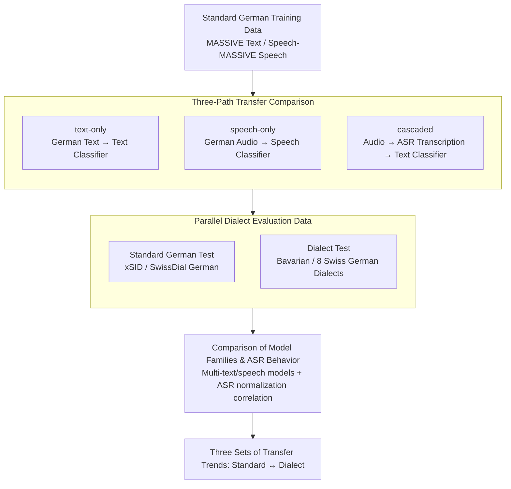

# Standard-to-Dialect Transfer Trends Differ across Text and Speech: A Case Study on Intent and Topic Classification in German Dialects

**Conference**: ACL2026  
**arXiv**: [2510.07890](https://arxiv.org/abs/2510.07890)  
**Code**: https://github.com/mainlp/dialects-text-vs-speech  
**Area**: Speech / Dialect NLP  
**Keywords**: Dialect Transfer, Speech Understanding, Intent Classification, ASR Cascade, German Dialects

## TL;DR
This paper systematically compares three transfer paths—text-only, speech-only, and ASR cascaded—using German-Bavarian intent classification and German-Swiss German topic classification. It finds that the optimal setup for standard languages does not necessarily suit dialects: while text models perform best for standard German, speech models are generally more robust for dialect inputs.

## Background & Motivation
**Background**: A common setting in dialect NLP involves having only standard language training data and a small amount of dialect evaluation data. Consequently, researchers typically train standard language text models and transfer them directly to dialect text. This paradigm has revealed significant performance drops in written dialects, particularly as non-standard spelling disrupts subword tokenization.

**Limitations of Prior Work**: Many dialects exist primarily in oral form rather than stable written forms. Studying only text input simplifies away the speech issues found in real-world applications and ignores a critical variable: speech models process continuous acoustic signals without relying on fixed vocabularies, potentially making them more robust to dialects with unstable spelling.

**Key Challenge**: In high-resource standard language tasks, text models often outperform speech models, and cascaded systems (ASR followed by text classification) are generally reasonable. However, for low-resource, non-standardized dialects, ASR might either "standardize" the dialect into text or produce severe errors. Direct speech models might bypass spelling issues but lack task-specific labeled data.

**Goal**: The authors aim to determine whether the trends across text-only, speech-only, and ASR cascaded input paths remain consistent in the same standard-to-dialect transfer task, and whether these trends are reproducible across two content classification tasks: intent classification and topic classification.

**Key Insight**: The paper focuses on German and its closely related dialects, constructing or utilizing parallel standard language and dialect data across text and speech modalities. This allows the same content to be compared across different input modalities. The main task is virtual assistant intent classification, with SwissDial topic classification as a secondary task.

**Core Idea**: Instead of assuming that "the strongest input modality for standard language is also the best for dialects," the authors treat text, speech, and ASR cascades as three comparable transfer paths and directly measure the differences in their trends between standard languages and dialects.

## Method

### Overall Architecture
The paper compares three settings. The text-only setting uses German text to train a classifier and tests it on German and dialect text. The speech-only setting uses German audio to train a speech classifier and tests it on German and dialect audio. The cascaded setting uses ASR to transcribe audio into text, which is then processed by a standard language text classifier.

The main experiments are based on German training data from MASSIVE / Speech-MASSIVE and test data from xSID (German and Bavarian). The authors recorded xSID-audio, providing speech versions for the same sets of German and Bavarian sentences. Secondary experiments use SwissDial, where German text is parallel in content to eight Swiss German dialects for topic classification.

### Key Designs
**1. Three-path transfer comparison: Direct comparison of text, speech, and ASR cascades within the same standard-to-dialect framework.**

Focusing solely on text models allows non-standard spelling to dominate conclusions, while focusing only on ASR might lead to biased results from transcription errors. This study contrasts all three paths: text-only (trained and tested on standard German and dialect text), speech-only (trained and tested on audio), and cascaded (standard text classifier processing ASR-transcribed audio). Since all models are trained or tuned only on standard German and encounter dialect inputs only during testing, the variables of "input modality difference" and "standard-to-dialect difference" can be decoupled.

**2. Parallel or comparable dialect evaluation data: Ensuring performance differences arise from linguistic variants and modalities, not labels or content distributions.**

Dialect resources are naturally fragmented. If tasks and label sets are inconsistent, cross-modality conclusions become uninterpretable. This paper aligns evaluation data: in intent classification, MASSIVE labels are mapped to the 10 intent labels in xSID, resulting in a 2.5k/459/361 train/dev/test split with 412 xSID test instances. The authors also recorded xSID-audio to provide speech versions for the same German and Bavarian sentences. For topic classification, SwissDial was organized into 10 topics (1.5k/194/396), ensuring German text and eight Swiss German dialects are parallel in content. Label alignment and parallel test sets ensure cross-modality comparisons focus on "same content, different input."

**3. Granular comparison of model families and ASR behavior: Confirming trends are not driven by specific model scales or individual ASR systems.**

Testing only one or two models makes it difficult to distinguish inherent modality traits from individual cases. Thus, this study examines multiple model families: mBERT, mDeBERTa, and XLM-R (base/large) for text; and mHuBERT, XLS-R, MMS, and various Whisper sizes for speech. The cascaded system also tests additional ASR systems. Crucially, the authors record the correlation between ASR error rates and classification performance differences. This addresses "normalization" in ASR for dialects: transcriptions often lean toward standard German, which sometimes aids text classification while other times producing nonsensical output. Analyzing ASR behavior alongside classification results explains the inconsistent performance of cascaded paths.

### Loss & Training
The paper primarily utilizes fine-tuning of pre-trained encoders with classification heads, reporting the average accuracy across three random seeds. Learning rates and epoch counts are selected based on the German train/dev sets. The authors intentionally avoid instruction-tuned text or audio LLMs, as those introduce unknown classification-related instruction data, making it difficult to discern whether differences arise from input representations or the model's training corpus.

## Key Experimental Results

### Main Results
The primary finding is not the highest score of a single model, but rather the trend: text is strongest for standard German; speech-only is more advantageous for dialects; and ASR cascades depend on whether the transcription effectively normalizes the dialect.

| Comparison Item | Standard German Trend | Dialect Trend | Key Figures |
|-----------------|-----------------------|---------------|-------------|
| Overall Performance Gap | Standard usually higher than dialect | Significant gap persists in dialects | Intent gap: 6.1-36.7 pp; Topic gap: 7.9-12.0 pp |
| text-only vs speech-only | Text is usually best | Speech models are usually more robust | Text-speech gap up to 23.8 pp in German; speech can outperform text by 14.8 pp in Bavarian |
| speech-only vs cascaded | Gap near 0 in German | Speech-only comprehensively outperforms cascaded in Bavarian | Bavarian speech-only is 5.6-17.9 pp higher than cascaded |
| cascaded vs text-only | Cascaded often lower than gold text | Good ASR can make cascaded outperform dialect text | Best cascaded in Swiss German approaches German text-only |

The scales of data and tasks are as follows.

| Data/Task | Language/Dialect | Modality | Scale | Description |
|-----------|------------------|----------|-------|-------------|
| MASSIVE / Speech-MASSIVE | German | Text & Speech | 2.5k / 459 / 361 | Train/Dev/Test for intent classification |
| xSID / xSID-audio | German, Bavarian | Text & Speech | 412 test instances | First German-Bavarian dialect audio intent classification set |
| SwissDial | German, 8 Swiss German dialects | Text (DE), Text & Speech (Dialect) | 1.5k / 194 / 396 | Topic classification, 10 topics |

ASR analysis indicates that the success of cascaded systems depends heavily on transcription quality, particularly proximity to standard German text.

| Analysis Item | Result | Implication |
|---------------|--------|-------------|
| German ASR Error vs. cascaded-text gap | Pearson r ≈ -0.72 to -0.98 | Closer transcription to standard text yields results closer to text-only |
| Swiss German Error vs. German Reference | r ≈ -0.94 to -0.99 | Dialect audio normalized to German is better handled by text models |
| Bavarian Correlation | r ≈ -0.85 to -0.92 (DE ref); r ≈ -0.66 to -0.93 (dialect ref) | Both normalization and preservation of dialect info affect classification |
| xSID Manual ASR Observation | 125 DE/BAR samples | Intent keywords are often preserved even if the sentence is not fully fluent |

### Ablation Study
This is not a traditional module-ablation paper; instead, it provides an analytical "modality choice" ablation through controlled settings.

| Configuration | Finding | Explanation |
|---------------|---------|-------------|
| Text input only | Strongest for standard German, significant drop for dialect text | Standard writing matches pre-trained vocab; dialect spelling variance causes tokenization and lexical issues |
| Direct speech input | Not necessarily best for German, but more stable for dialects | Continuous acoustic representation bypasses non-standard spelling; dialect differences are primarily phonological |
| Text classification after ASR | Good for German, high variance for dialects | ASR can act as a dialect-to-standard normalizer or generate noisy text |
| Using ASR-tuned speech encoder | Usually outperforms non-ASR-tuned speech models | ASR pre-training helps understand utterance content even if the task is not transcription |

### Key Findings
- The common conclusion that "text outperforms speech" in standard languages does not directly transfer to dialect scenarios.
- In dialect input, speech-only systems are more stable than cascaded ones, especially in Bavarian intent classification.
- The upper bound of cascaded systems comes from ASR normalization capabilities, while the risk comes from ASR mis-transcribing low-resource dialects.
- mBERT is among the few text models whose documentation includes Bavarian, resulting in unique performance on Bavarian text compared to general text models.

## Highlights & Insights
- The paper transforms the question "should dialect NLP focus on text or speech" into a measurable problem rather than a choice based on intuition.
- The value of xSID-audio is high: it enables intent classification comparisons across text and speech within the same content, speaker, and linguistic variant.
- Results serve as a reminder that ASR is not just a preprocessing module; it rewrites dialect input into a specific text variant, and this normalization is itself a model behavior.
- For low-resource oral dialects, building speech evaluation sets may be more relevant to real-world applications than simply expanding written dialect data.

## Limitations & Future Work
- Language coverage is limited to German, Bavarian, and Swiss German, preventing direct generalization to languages with greater phonological or script differences.
- The scale of dialect audio is still small; xSID-audio consists of read speech, which is not equivalent to spontaneous speech in natural dialogue environments.
- Cascaded systems were primarily trained on gold standard text. Although the appendix verifies similar trends for ASR-text training, complex ASR adaptation remains unexplored.
- The exclusion of instruction-tuned audio/text LLMs means the study does not address whether end-to-end speech understanding in large models would alter these trends.
- Future work could investigate dialect speech understanding under multi-speaker, multi-regional, noisy environments, and real-world virtual assistant interactions.

## Related Work & Insights
- **vs xSID written dialect work**: Existing work focuses on standard language transfer for written dialects; this study extends it to the speech modality, showing that the bottleneck in dialect NLP is not limited to spelling.
- **vs Speech-MASSIVE / spoken intent datasets**: These datasets typically cover multiple languages or standard accents; this paper emphasizes differences between standard and non-standard variants within a single language.
- **vs cascaded SLU**: Traditional cascaded SLU assumes that better ASR leads to better downstream performance. This study further notes that "more standardized" ASR output may benefit text classification more than verbatim dialect preservation.
- **vs token-free dialect models**: While token-free text models attempt to bypass spelling issues, speech-only models bypass writing systems entirely from the input level.
- **Insight**: Dialect applications should not be selected based solely on standard language benchmarks; they must be validated on the target dialect, modality, and task.

## Rating
- Novelty: ⭐⭐⭐⭐☆ Clear problem setup, extending dialect transfer from text to speech/cascaded comparisons with valuable data contributions.
- Experimental Thoroughness: ⭐⭐⭐⭐☆ Comprehensive model families, modalities, tasks, and ASR analysis, though limited in language and speech scenario breadth.
- Writing Quality: ⭐⭐⭐⭐☆ Conclusions are built around three interpretable trends; tables are informative, though some results in the original are dense.
- Value: ⭐⭐⭐⭐☆ Directly informs dialect NLP, speech SLU, and low-resource data design.

<!-- RELATED:START -->

## Related Papers

- [\[ACL 2025\] Advancing Zero-shot Text-to-Speech Intelligibility across Diverse Domains via Preference Alignment](../../ACL2025/audio_speech/advancing_zero-shot_text-to-speech_intelligibility_across_diverse_domains_via_pr.md)
- [\[ACL 2026\] FC-TTS: Style and Timbre Control in Zero-Shot Text-to-Speech with Disentangled Speech Representations](fc-tts_style_and_timbre_control_in_zero-shot_text-to-speech_with_disentangled_sp.md)
- [\[ACL 2026\] Computational Narrative Understanding for Expressive Text-to-Speech](computational_narrative_understanding_for_expressive_text-to-speech.md)
- [\[ACL 2026\] ImmersiveTTS: Environment-Aware Text-to-Speech with Multimodal Diffusion Transformer and Domain-Specific Representation Alignment](immersivetts_environment-aware_text-to-speech_with_multimodal_diffusion_transfor.md)
- [\[AAAI 2026\] A Mind Cannot Be Smeared Across Time](../../AAAI2026/audio_speech/a_mind_cannot_be_smeared_across_time.md)

<!-- RELATED:END -->
