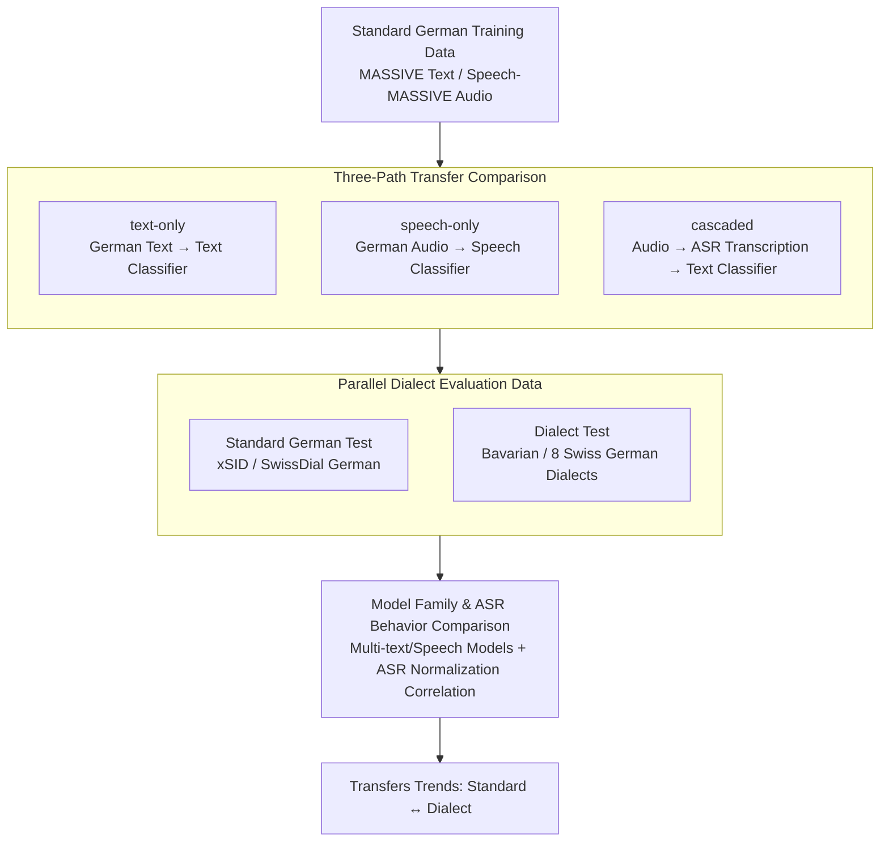

# Standard-to-Dialect Transfer Trends Differ across Text and Speech: A Case Study on Intent and Topic Classification in German Dialects

**Conference**: ACL2026  
**arXiv**: [2510.07890](https://arxiv.org/abs/2510.07890)  
**Code**: https://github.com/mainlp/dialects-text-vs-speech  
**Area**: Speech / Dialect NLP  
**Keywords**: Dialect Transfer, Speech Understanding, Intent Classification, ASR Cascade, German Dialects

## TL;DR
This paper systematically compares three transfer paths—text, speech, and ASR cascade—using German-Bavarian intent classification and German-Swiss German topic classification. The study finds that optimal solutions for standard language do not necessarily apply to dialects: while text models excel on standard German, speech models are generally more robust on dialectal input.

## Background & Motivation
**Background**: A common setup in dialect NLP involves training on standard language data and evaluating on small dialect sets. Researchers typically train standard text models and transfer them directly to dialect text. For written dialects, this paradigm has revealed significant performance drops, particularly as non-standard spelling disrupts subword tokenization.

**Limitations of Prior Work**: Many dialects exist primarily in oral forms rather than stable written formats. Studying only text input oversimplifies speech-related issues in real-world applications and ignores a critical variable: speech models process continuous acoustic signals without relying on fixed vocabularies, potentially making them more robust to spelling-unstable dialects.

**Key Challenge**: In high-resource standard language tasks, text models usually outperform speech models, and cascaded systems (ASR followed by text classification) are often preferred. However, for low-resource, non-standardized dialects, ASR may either "standardize" dialects into text or produce severe errors. Direct speech models might bypass spelling issues but lack task-specific labeled data.

**Goal**: The authors aim to determine whether transfer trends across text-only, speech-only, and ASR cascaded paths are consistent for the same standard-to-dialect transfer task, and whether these trends are reproducible across intent and topic classification.

**Key Insight**: The paper selects German and its closely related dialects, utilizing parallel standard/dialect and text/speech data to ensure content remains comparable across different input modalities. The primary task is virtual assistant intent classification, with SwissDial topic classification as a secondary task.

**Core Idea**: Instead of assuming "modality-best for standard language is best for dialects," the authors treat text, speech, and ASR cascades as three comparable transfer paths to directly measure trend differences between standard and dialectal languages.

## Method

### Overall Architecture
The paper compares three settings. The text-only setting trains a classifier on German text and tests on both German and dialect text. The speech-only setting trains a speech classifier on German audio and tests on both German and dialect audio. The cascaded setting uses ASR to transcribe audio into text, which is then processed by the standard text classifier.

The main experiment uses German training data from MASSIVE / Speech-MASSIVE and test data from xSID (German and Bavarian). The authors recorded xSID-audio to provide speech versions for the same xSID sentences. The auxiliary experiment uses SwissDial, where German text is parallel to eight Swiss German dialects for topic classification.

### Key Designs
**1. Three-Path Transfer Comparison: Direct comparison of text, speech, and ASR cascades within the same standard-to-dialect framework.**

Focusing solely on text models results in conclusions dominated by non-standard spelling, while focusing only on ASR might be biased by transcription errors. This paper aligns the three transfer paths: text-only (trained and tested on text), speech-only (trained and tested on audio), and cascaded (ASR transcription followed by text classification). All paths are trained or tuned only on standard German, allowing the decoupling of "input modality differences" and "standard-to-dialect differences."

**2. Parallel or Comparable Dialect Evaluation Data: Ensuring performance gaps stem from linguistic variants and modalities rather than label or content distribution.**

Dialect resources are naturally fragmented. This paper aligns evaluation data to ensure cross-modal conclusions are interpretable. For intent classification, MASSIVE labels are mapped to the 10 intents used in xSID (2.5k/459/361 train/dev/test split), using 412 xSID test instances. The authors also recorded xSID-audio for these instances. For topic classification, SwissDial is organized into 10 topics (1.5k/194/396), ensuring German text is parallel to eight Swiss German dialects.

**3. Fine-grained Comparison of Model Families and ASR Behavior: Confirming trends are not specific to certain model scales or ASR systems.**

The study spans multiple model families: mBERT, mDeBERTa, and XLM-R (base/large) for text; mHuBERT, XLS-R, MMS, and various Whisper sizes for speech. Crucially, the authors record the correlation between ASR error rates and classification performance. This addresses "normalization" in ASR, where transcriptions lean toward standard German, which sometimes aids text classification and other times produces nonsensical output.

### Loss & Training
The authors predominantly use fine-tuning with a pre-trained encoder plus a classification head, reporting the average accuracy of three random seeds. Learning rates and epoch counts are selected based on the German train/dev sets. Instruction-tuned text or audio LLMs are intentionally avoided to prevent the introduction of unknown task-related training data, ensuring differences stem from input representations.

## Key Experimental Results

### Main Results
The primary finding is a trend: text is strongest for standard German, while speech-only is more advantageous for dialects. ASR cascade performance depends on whether the transcription effectively "standardizes" the dialect.

| Comparison | Standard German Trend | Dialect Trend | Key Figures |
|------------|-----------------------|---------------|-------------|
| Overall Performance Gap | Standard consistently higher | Significant dialect drop remains | Intent diff: 6.1-36.7 pp; Topic diff: 7.9-12.0 pp |
| text-only vs speech-only | Text is usually best | Speech models more robust | Text-Speech gap in German up to 23.8 pp; Speech exceeds Text by 14.8 pp in Bavarian |
| speech-only vs cascaded | Minimal gap in German | Speech-only outperforms cascaded in Bavarian | Speech-only is 5.6-17.9 pp higher than cascaded in Bavarian |
| cascaded vs text-only | Cascaded < Gold Text | Superior ASR can exceed dialectal text | Best cascaded Swiss German approaches German text-only |

Data and task scales:

| Data / Task | Language / Dialect | Modality | Scale | Note |
|-------------|--------------------|----------|-------|------|
| MASSIVE / Speech-MASSIVE | German | Text & Speech | 2.5k / 459 / 361 | Train, dev, test for intent classification |
| xSID / xSID-audio | German, Bavarian | Text & Speech | 412 test instances | First German-Bavarian audio intent classification set |
| SwissDial | German, 8 Swiss Dialects | Text & Speech | 1.5k / 194 / 396 | Topic classification, 10 topics |

ASR analysis shows high dependence on transcription quality and standardization.

| Analysis Item | Result | Meaning |
|---------------|--------|---------|
| German ASR Error vs. Cascaded-Text Gap | Pearson r ≈ -0.72 to -0.98 | Closer transcription to standard text yields higher Cascaded performance |
| Swiss German Error (vs. German Ref) | r ≈ -0.94 to -0.99 | Normalization to German aids text models in processing dialect audio |
| Bavarian Correlation | r ≈ -0.85 to -0.92 (Std Ref); r ≈ -0.66 to -0.93 (Dia Ref) | Both normalization and preservation of dialect info impact classification |
| Manual ASR Observation (xSID) | 125 samples | Intent-specific keywords are often preserved even if fluency is poor |

### Ablation Study
The paper uses comparative configurations to analyze "modality choice."

| Configuration | Finding | Explanation |
|---------------|---------|-------------|
| Text-only input | Strongest for standard German; sharp drop for dialect | Standard text matches pre-trained vocab; dialect spelling causes tokenization issues |
| Direct speech input | Not always best for German, but most stable for dialect | Continuous acoustic signals bypass spelling; dialect differences are primarily phonetic |
| Text classification after ASR | Good for German; high variance for dialect | ASR can either provide dialect-to-standard normalization or generate noise |
| ASR-tuned speech encoder | Usually better than non-ASR-tuned | ASR pre-training helps extract utterance content even for non-transcription tasks |

### Key Findings
- The standard conclusion that "text outperforms speech" does not directly transfer to dialect scenarios.
- For dialectal inputs, speech-only systems are more stable than cascaded ones, especially in Bavarian intent classification.
- The upper bound of cascaded systems is defined by ASR normalization capability, while the risk lies in incorrect transcriptions of low-resource dialects.
- mBERT performs uniquely well on Bavarian text as it is one of the few models including Bavarian in its pre-training; it does not represent general text model trends.

## Highlights & Insights
- The paper transforms the question of "should dialect NLP use text or speech" into a measurable problem.
- xSID-audio allows for the comparison of text vs. speech across identical content, speakers, and linguistic variants.
- ASR acts as more than a preprocessing module; its "normalization" of dialect toward standard language is a significant behavioral factor.
- For low-resource oral dialects, building speech evaluation sets may be more relevant to real-world applications than expanding written dialect data.

## Limitations & Future Work
- Language coverage is limited to German dialects; findings may not generalize to languages with larger phonological or script differences.
- The scale of dialect audio remains small; xSID-audio uses read speech, which differs from spontaneous speech in natural interaction.
- Cascaded systems were fine-tuned on gold text; more complex ASR adaptation was not fully explored.
- The exclusion of instruction-tuned LLMs leaves open questions regarding how end-to-end multi-modal models might change these trends.
- Future work could address multi-speaker, noisy environments, and real-world virtual assistant interactions.

## Related Work & Insights
- **vs xSID written dialect work**: Previous work focused on standard-to-dialect transfer for written text; this paper extends this to speech, showing spelling is not the only bottleneck.
- **vs Speech-MASSIVE / spoken intent datasets**: Existing data often cover multiple languages or standard accents; this work emphasizes standard vs. non-standard variants within one language.
- **vs cascaded SLU**: While traditional SLU assumes better ASR leads to better downstream results, this paper shows that "more standardized" ASR output may be more beneficial than verbatim dialect preservation for text classifiers.
- **vs token-free dialect models**: While token-free models bypass spelling issues in text, speech-only models bypass the writing system entirely at the input level.

## Rating
- Novelty: ⭐⭐⭐⭐☆ Clear problem setting, extending dialect transfer to speech/cascade comparisons with valuable data contributions.
- Experimental Thoroughness: ⭐⭐⭐⭐☆ Comprehensive analysis of model families, modalities, and tasks, though language scope is limited.
- Writing Quality: ⭐⭐⭐⭐☆ Conclusions are well-structured around interpretable trends.
- Value: ⭐⭐⭐⭐☆ Highly insightful for dialect NLP, speech SLU, and low-resource data design.

<!-- RELATED:START -->

## Related Papers

- [\[ACL 2025\] Advancing Zero-shot Text-to-Speech Intelligibility across Diverse Domains via Preference Alignment](../../ACL2025/audio_speech/advancing_zero-shot_text-to-speech_intelligibility_across_diverse_domains_via_pr.md)
- [\[ACL 2026\] FC-TTS: Style and Timbre Control in Zero-Shot Text-to-Speech with Disentangled Speech Representations](fc-tts_style_and_timbre_control_in_zero-shot_text-to-speech_with_disentangled_sp.md)
- [\[AAAI 2026\] A Mind Cannot Be Smeared Across Time](../../AAAI2026/audio_speech/a_mind_cannot_be_smeared_across_time.md)
- [\[ACL 2026\] Computational Narrative Understanding for Expressive Text-to-Speech](computational_narrative_understanding_for_expressive_text-to-speech.md)
- [\[ACL 2026\] ImmersiveTTS: Environment-Aware Text-to-Speech with Multimodal Diffusion Transformer and Domain-Specific Representation Alignment](immersivetts_environment-aware_text-to-speech_with_multimodal_diffusion_transfor.md)

<!-- RELATED:END -->
