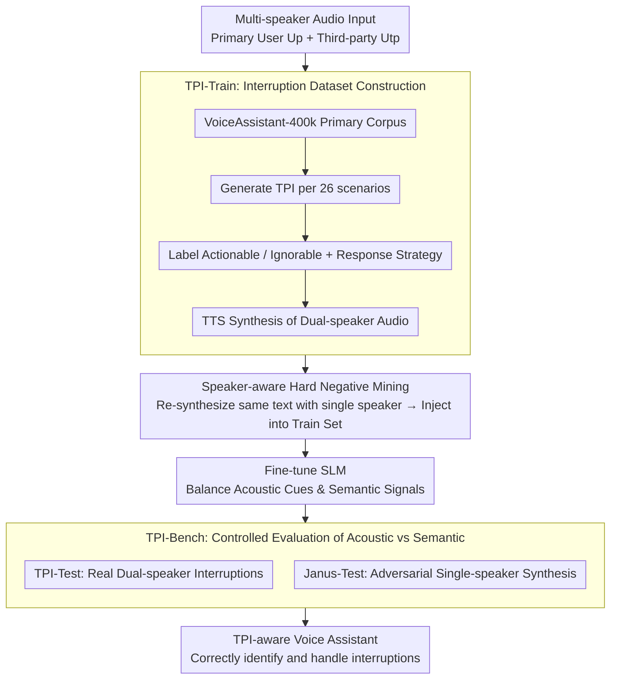

# Still Between Us? Evaluating and Improving Voice Assistant Robustness to Third-Party Interruptions

**Conference**: ACL 2026  
**arXiv**: [2604.17358](https://arxiv.org/abs/2604.17358)  
**Code**: [GitHub](https://github.com/pleasedpenguin/tpi-va)  
**Area**: Audio and Speech  
**Keywords**: Voice assistant, third-party interruption, speaker-awareness, hard negative mining, semantic shortcut learning

## TL;DR

Addressing the inability of voice assistants to distinguish third-party interruptions (TPI) from primary user speech, this paper proposes the TPI-Train dataset with 88K training instances and the TPI-Bench evaluation framework. Through a speaker-aware hard negative mining strategy, it eliminates semantic shortcut learning, enabling models to truly rely on acoustic cues for interruption detection.

## Background & Motivation

**Background**: Spoken Language Models (SLMs) are widely deployed in real-world voice assistant scenarios to provide human-like natural dialogue, but they are primarily designed for one-on-one interactions.

**Limitations of Prior Work**: In real-life scenarios, users interacting with voice assistants are often interrupted by third parties (e.g., comments from bystanders or background conversations). Current SLMs cannot distinguish these third-party interruptions, blindly concatenating multi-speaker speech into a single continuous stream, leading to incorrect or nonsensical responses.

**Key Challenge**: A "semantic shortcut learning" phenomenon exists in multimodal speech data training—models tend to exploit semantic patterns in text (such as contradictions or topic shifts) to detect interruptions while ignoring acoustic signals (such as changes in the speaker's voice), making them extremely vulnerable in textually ambiguous scenarios.

**Goal**: To build a comprehensive TPI awareness framework, including training data, evaluation benchmarks, and training strategies, allowing voice assistants to correctly identify and handle third-party interruptions.

**Key Insight**: Starting from a linguistic classification system for interruptions, the paper defines 26 real-world interruption scenarios to systematically construct training and evaluation data.

**Core Idea**: Through speaker-aware hard negative mining (re-synthesizing dual-persona interruption text using a single speaker’s voice), the model is forced to abandon semantic shortcuts and truly learn acoustic cues.

## Method

### Overall Architecture

The entire work revolves around the goal of "making voice assistants truly listen to sounds rather than guessing based on text," forming a closed loop of data, training, and evaluation. The input consists of multi-speaker speech containing third-party interruptions (primary user speech $U_p$ + third-party interruption $U_{tp}$). First, TPI-Train provides 88K training instances covering 26 real-world interruption scenarios to teach the model when to incorporate and when to ignore interruptions. The core training technique is speaker-aware hard negative mining, where "text that looks like an interruption" is re-synthesized with a single speaker's voice to force the model to rely on acoustic identity changes. Finally, TPI-Bench (comprising the standard TPI-Test and the adversarial Janus-Test) strictly tests whether the model relies on acoustic or semantic cues for judgment.

### Key Designs

**1. TPI-Train: Mapping Interruptions to a Linguistic Taxonomy.** Existing speech dialogue corpora rarely contain systematic third-party interruption scenarios, and there is a lack of guidance on how models should respond to such interruptions. This work extends 7 classic types of two-person interruption classifications into a "Primary User—Third Party—Model" triadic setting, deriving 26 real-world scenarios including corrections, topic shifts, and emotional expressions. By sampling primary user utterances from VoiceAssistant-400k and generating corresponding third-party interruptions using an LLM, followed by TTS synthesis and filtering, approximately 80K real dual-speaker samples were obtained. Each interruption is labeled as "actionable" (should be incorporated into the response) or "ignorable" (should be ignored), paired with a corresponding response strategy.

**2. Speaker-aware Hard Negative Mining: Eliminating Shortcuts.** When fine-tuned only on interruption data, models often take a "shortcut" by relying on textual contradictions or topic shifts to guess if an interruption occurred. To close this loophole, the authors create hard negative samples where the text is identical to real dual-speaker interruptions, but the audio is entirely re-synthesized by a single speaker. Since the text is identical, the model can no longer find the answer in textual patterns and must listen for changes in speaker identity. t-SNE visualizations confirm that without hard negatives, embeddings of different speaker configurations overlap significantly; with them, embeddings cluster clearly according to acoustic identity.

**3. TPI-Bench and Janus-Test: Forcing Evidence through Controlled Variables.** Observing normal samples alone cannot distinguish whether a model has truly understood the audio or is just guessing from the text. Thus, evaluation is divided into two layers. TPI-Test assesses general situational judgment and response capabilities using dual-speaker samples. The true litmus test is Janus-Test—taking content that textually resembles an interruption but is actually a single-person self-correction and re-synthesizing it with the primary speaker's voice. If a model relies on semantic shortcuts, it will fail here by misidentifying self-correction as a third-party interruption. Evaluation also employs RSF (Response Strategy Following) and OH (Overall Helpfulness) metrics for interpretability.

## Key Experimental Results

### Main Results

| Test Set | Metric | Baseline SLM | TPI-Full | Gain |
|----------|--------|--------------|----------|------|
| TPI-Test | Detection Accuracy | Low (Blind Concatenation) | High | Significant |
| Janus-Test | Adversarial Robustness | Near-total failure | Robust | Significant |
| Human Eval | Naturalness Preference | Low | Highly Preferred | - |

### Ablation Study

| Configuration | Key Metric | Remarks |
|---------------|------------|---------|
| Without Hard Negatives | t-SNE clustering overlap | Reliance on semantic shortcuts |
| With Hard Negatives (TPI-Full) | t-SNE clusters clearly separated | Reliance on acoustic cues |
| Semantic-only Training | Janus-Test failure | Misidentifies self-correction as interruption |
| Complete Training | Robust on both test sets | Balanced acoustic/semantic signals |

### Key Findings

- Semantic shortcut learning is a critical trap in multimodal speech model training: models exploit textual patterns rather than "listening" to voice changes.
- After hard negative training, the model's embedding space shifts from a chaotic mix to clearly separated clusters, proving the model has learned to differentiate based on acoustic identity.
- Human evaluations confirm that the embedded response strategies are significantly preferred for their effectiveness and naturalness.
- The classification of "Actionable vs Ignorable" is vital for response strategies—the model must know when to incorporate third-party content.

## Highlights & Insights

- The concept of **semantic shortcut learning** has broad significance: it applies to any multimodal training where a model might take a "text shortcut" while ignoring other modal signals.
- The **design of the Janus-Test** is ingenious: it uses controlled variables (same text, different voice) to strictly verify if the model truly understands acoustic signals.
- Constructing the dataset based on a **linguistic classification system** ensures systematicity and comprehensiveness across 26 interruption types.
- **High Utility**: Directly addresses a real-world pain point for voice assistants with deployable response strategies.

## Limitations & Future Work

- Primarily focused on English; generalization across different languages and accents remains to be verified.
- While systematic, the 26 interruption scenarios may not cover all real-life possibilities.
- The framework currently relies on TTS re-synthesis for hard negatives; synthesis quality may affect training outcomes.
- Complex multi-party dialogue scenarios (more than two speakers) have not yet been addressed.
- Performance and latency in real-time streaming scenarios need to be evaluated.

## Related Work & Insights

- **vs Traditional Speaker Diarization**: TPI requires not just detecting speaker changes but also judging whether the interruption should influence the response strategy, representing higher-level semantic understanding.
- **vs Multi-turn Dialogue Models**: Existing research focuses on continuous dialogue with a single user and does not account for third-party intervention.
- **vs Hard Negative Mining**: Borrowed the concept from contrastive learning but innovatively applied it to eliminate cross-modal (text vs acoustics) shortcuts.

## Rating

- Novelty: ⭐⭐⭐⭐ First to systematically define and solve the TPI problem for voice assistants; findings on semantic shortcuts are insightful.
- Experimental Thoroughness: ⭐⭐⭐⭐ Includes large-scale datasets, adversarial test sets, ablation studies, and human evaluation.
- Writing Quality: ⭐⭐⭐⭐ Clear problem definition and intuitive project presentation.
- Value: ⭐⭐⭐⭐ Addresses a real-world pain point with direct engineering application value.

<!-- RELATED:START -->

## Related Papers

- [\[ACL 2026\] DRInQ: Evaluating Conversational Implicature with Controlled Context Variation](drinq_evaluating_conversational_implicature_with_controlled_context_variation.md)
- [\[ACL 2025\] Does Your Voice Assistant Remember? Analyzing Conversational Context Recall and Utilization in Voice Interaction Models](../../ACL2025/audio_speech/does_your_voice_assistant_remember_analyzing_conversational_context_recall_and_u.md)
- [\[ACL 2025\] Distilling an End-to-End Voice Assistant Without Instruction Training Data](../../ACL2025/audio_speech/distilling_an_end-to-end_voice_assistant_without_instruction_training_data.md)
- [\[ACL 2026\] Speculative End-Turn Detector for Efficient Speech Chatbot Assistant](speculative_end-turn_detector_for_efficient_speech_chatbot_assistant.md)
- [\[ACL 2026\] S2S-Arena: Evaluating Paralinguistic Instruction Following in Speech-to-Speech Models](s2s-arena_evaluating_paralinguistic_instruction_following_in_speech-to-speech_mo.md)

<!-- RELATED:END -->
