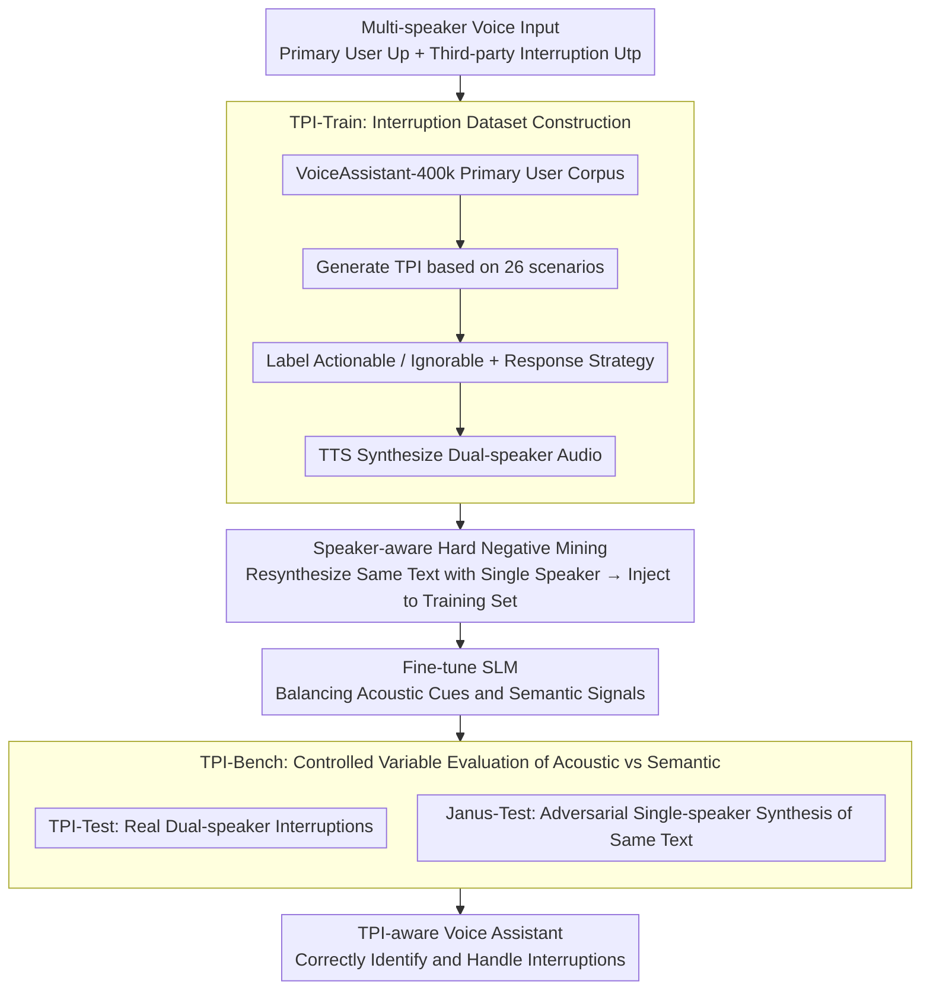

# Still Between Us? Evaluating and Improving Voice Assistant Robustness to Third-Party Interruptions

**Conference**: ACL 2026  
**arXiv**: [2604.17358](https://arxiv.org/abs/2604.17358)  
**Code**: [GitHub](https://github.com/pleasedpenguin/tpi-va)  
**Area**: Audio and Speech  
**Keywords**: Voice Assistant, Third-Party Interruption, Speaker Awareness, Hard Negative Mining, Semantic Shortcut Learning

## TL;DR

Addressing the inability of voice assistants to distinguish Third-Party Interruptions (TPI) from primary user speech, this work proposes the TPI-Train dataset with 88K training instances and the TPI-Bench evaluation framework. Through a speaker-aware hard negative mining strategy, semantic shortcut learning is eliminated, forcing the model to rely on acoustic cues for interruption detection.

## Background & Motivation

**Background**: Spoken Language Models (SLMs) have been widely deployed in real-world voice assistant scenarios, enabling human-like natural dialogue, but they are primarily designed for one-on-one interactions.

**Limitations of Prior Work**: In real life, third-party interruptions (e.g., bystander comments, background talk) frequently occur during user interactions with voice assistants. Current SLMs fail to distinguish these interruptions and blindly concatenate multi-speaker speech into a single continuous stream, leading to erroneous or nonsensical responses.

**Key Challenge**: A "semantic shortcut learning" phenomenon exists in multimodal speech data training—models tend to utilize semantic patterns in text (e.g., contradictions, topic shifts) to detect interruptions while ignoring acoustic signals (e.g., changes in speaker voice), making the models extremely fragile in semantically ambiguous scenarios.

**Goal**: To construct a comprehensive TPI-aware framework, including training data, evaluation benchmarks, and training strategies, enabling voice assistants to correctly identify and handle third-party interruptions.

**Key Insight**: Leveraging linguistic interruption classification systems, 26 real-world interruption scenarios are defined to systematically construct training and evaluation data.

**Core Idea**: Through speaker-aware hard negative mining (resynthesizing dual-speaker interruption text using a single speaker’s voice), the model is forced to abandon semantic shortcuts and truly learn acoustic cues.

## Method

### Overall Architecture

The entire work revolves around the goal of "making voice assistants truly listen to the sound rather than guessing the text," forming a closed loop across data, training, and evaluation. The input consists of multi-speaker speech containing third-party interruptions (primary user speech $U_p$ + third-party interruption $U_{tp}$). First, TPI-Train provides 88K training instances covering 26 real-world scenarios to teach the model when to incorporate or ignore interruptions. The core training mechanism is speaker-aware hard negative mining, where "text that looks like an interruption" is resynthesized with a single speaker's voice to force the model to listen for speaker changes. Finally, TPI-Bench (including the standard TPI-Test and adversarial Janus-Test) strictly verifies whether the model relies on acoustics or semantics, ultimately delivering a voice assistant capable of correctly processing interruptions.

### Key Designs

**1. TPI-Train: Grounding Interruptions in Linguistic Classification.** Existing voice dialogue corpora rarely contain systematic third-party interruption scenarios, nor do they instruct models on how to respond. This work extends 7 classical categories of dyadic interruption into a "Primary User—Third Party—Model" triadic setting, deriving 26 real-world scenarios such as correction/clarification, topic shift, and emotional expression. Primary user utterances are sampled from VoiceAssistant-400k, paired with LLM-generated TPI for specific scenarios, and filtered via TTS synthesis and inference models to yield ~80K real dual-speaker samples. Each interruption is labeled as "Actionable" (should be included in the response) or "Ignorable" (should be ignored), paired with a corresponding response strategy, ensuring training signals go beyond simple detection to response logic.

**2. Speaker-aware Hard Negative Mining: Closing the Shortcut.** Fine-tuning on interruption data alone allows the model to "cheat" by detecting interruptions through textual contradictions or topic shifts without listening to the audio. To block this shortcut, hard negative samples are created where the text is identical to real dual-speaker interruptions, but the audio is resynthesized using only a single speaker. Since the text is identical, the model cannot derive the answer from textual patterns and must rely on detecting speaker identity changes. t-SNE visualizations confirm this; without hard negatives, embeddings for different speaker configurations overlap, whereas adding them causes embeddings to cluster by acoustic identity.

**3. TPI-Bench and Janus-Test: Forcing Evidence via Controlled Variables.** To distinguish whether a model truly listens to audio or guesses based on text, the evaluation is split. TPI-Test uses real dual-speaker samples to assess standard context discrimination and response capabilities. The "litmus test" is Janus-Test, where text that appears to be an interruption but is actually single-speaker self-correction is resynthesized using the primary speaker's voice. The insight is straightforward: if the text looks like an interruption but the voice is the same, the model should not tag it as TPI. Models relying on semantic shortcuts fail here by misidentifying self-corrections as interruptions. Evaluation is complemented by LLM-based metrics: RSF (Response Strategy Following) and OH (Overall Helpfulness).

## Key Experimental Results

### Main Results

| Test Set | Metric | Baseline SLM | TPI-Full | Gain |
|----------|--------|--------------|----------|------|
| TPI-Test | Detection Accuracy | Low (Blind Join) | High | Significant |
| Janus-Test | Adversarial Robustness | Near Total Failure | Robust | Significant |
| Human Eval | Naturalness Preference | Low | Highly Preferred | - |

### Ablation Study

| Configuration | Key Metric | Note |
|---------------|------------|------|
| No Hard Negatives | t-SNE Overlap | Model relies on semantic shortcuts |
| With Hard Negatives (TPI-Full) | Clear t-SNE Clustering | Model relies on acoustic cues |
| Semantic-only Training | Janus-Test Failure | Misidentifies self-correction as TPI |
| Full Training | Robust on both sets | Balanced acoustic and semantic signals |

### Key Findings

- Semantic shortcut learning is a critical pitfall in multimodal speech model training: models exploit textual patterns (contradictions, shifts) rather than truly "hearing" voice changes.
- After hard negative training, the embedding space shifts from a disordered mix of labels to clearly separated clusters, proving the model learned to differentiate based on acoustic identity.
- Human evaluations confirm that the embedded response strategies are highly favored by users for effectiveness and naturalness.
- The classification of Actionable vs. Ignorable is crucial for response strategies—the model must know when to incorporate interruption content and when to dismiss it.

## Highlights & Insights

- The concept of **semantic shortcut learning** has broad implications: beyond TPI, models in any multimodal training task may take "textual shortcuts" while ignoring other modal signals.
- The **Janus-Test design** is ingenious: using controlled variables (identical text, different voices) to strictly test if the model truly understands acoustic signals.
- Constructing the dataset from a **linguistic classification system** ensures the scenarios are systematic and comprehensive (26 interruption types).
- **Strong practicality**: Directly addresses real-world pain points of voice assistants, with response strategies ready for deployment.

## Limitations & Future Work

- Primarily focused on English; generalization across languages and accents remains to be verified.
- While the 26 scenarios are systematic, they may not exhaust all real-world possibilities.
- The current framework relies on TTS resynthesis for hard negatives; synthesis quality may impact training efficacy.
- Complex multi-party dialogue scenarios involving more than two speakers have not yet been addressed.
- Performance and latency in real-time streaming scenarios require further evaluation.

## Related Work & Insights

- **vs. Traditional Speaker Diarization**: TPI requires not just detecting speaker changes but also judging whether the interruption should influence the response strategy, representing higher-level semantic understanding.
- **vs. Multi-turn Dialogue Models**: Existing research focuses on continuous single-user dialogue, ignoring third-party intervention.
- **vs. Hard Negative Mining**: Borrows concepts from contrastive learning but innovatively applies them to cross-modal (text vs. acoustic) shortcut elimination.

## Rating

- Novelty: ⭐⭐⭐⭐ First to systematically define and solve the third-party interruption problem for voice assistants; findings on semantic shortcuts are insightful.
- Experimental Thoroughness: ⭐⭐⭐⭐ Includes large-scale datasets, adversarial test sets, ablation studies, and human evaluation.
- Writing Quality: ⭐⭐⭐⭐ Clear problem definition and intuitive project presentation.
- Value: ⭐⭐⭐⭐ Addresses real-world voice assistant pain points with direct engineering application value.

<!-- RELATED:START -->

## Related Papers

- [\[ACL 2025\] Does Your Voice Assistant Remember? Analyzing Conversational Context Recall and Utilization in Voice Interaction Models](../../ACL2025/audio_speech/does_your_voice_assistant_remember_analyzing_conversational_context_recall_and_u.md)
- [\[ACL 2026\] DRInQ: Evaluating Conversational Implicature with Controlled Context Variation](drinq_evaluating_conversational_implicature_with_controlled_context_variation.md)
- [\[ACL 2025\] Distilling an End-to-End Voice Assistant Without Instruction Training Data](../../ACL2025/audio_speech/distilling_an_end-to-end_voice_assistant_without_instruction_training_data.md)
- [\[ACL 2026\] Speculative End-Turn Detector for Efficient Speech Chatbot Assistant](speculative_end-turn_detector_for_efficient_speech_chatbot_assistant.md)
- [\[ACL 2026\] DuIVRS-2: An LLM-based Interactive Voice Response System for Large-scale POI Attribute Acquisition](duivrs-2_an_llm-based_interactive_voice_response_system_for_large-scale_poi_attr.md)

<!-- RELATED:END -->
