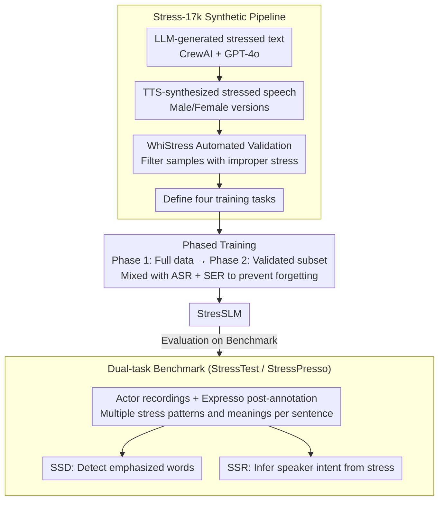

# StressTest: Can YOUR Speech LM Handle the Stress?

**Conference**: ACL 2026  
**arXiv**: [2505.22765](https://arxiv.org/abs/2505.22765)  
**Code**: [Project Homepage](https://pages.cs.huji.ac.il/adiyoss-lab/stresstest)  
**Area**: Speech Understanding  
**Keywords**: Sentence Stress, Speech Language Models, Prosody Understanding, Benchmarking, Synthetic Data

## TL;DR

The authors propose the StressTest benchmark to evaluate the ability of Speech Language Models (SLMs) to understand the meaning of sentence stress. Findings indicate that existing models struggle to reason about speaker intent based on stress patterns. StresSLM, trained via the Stress-17k synthetic data pipeline, significantly outperforms frontier models on stress detection and reasoning tasks.

## Background & Motivation

**Background**: Speech Language Models (e.g., GPT-4o-audio, Gemini 1.5 Pro, Qwen2-Audio) can directly process audio for reasoning, bypassing traditional ASR cascades to leverage paralinguistic information.

**Limitations of Prior Work**: Sentence stress is a crucial prosodic element—the same sentence "I didn't say she stole the money" can convey entirely different meanings depending on the stress placement. However, this has been almost entirely overlooked in SLM evaluation and development. Existing benchmarks focus on speech recognition and emotion detection, lacking evaluations for stress understanding.

**Key Challenge**: Understanding sentence stress requires models not only to "hear what was said" but also to understand "how it was said." This necessitates a deep integration of prosodic cues (pitch, loudness, duration) and semantic reasoning, a capability lacking in current SLMs.

**Goal**: Construct a sentence stress understanding benchmark, evaluate the capability gap of frontier SLMs, and train a model capable of stress understanding using synthetic data.

**Key Insight**: Design a dual-task evaluation (Sentence Stress Detection - SSD + Sentence Stress Reasoning - SSR) and build a complete pipeline for synthetic data generation, validation, and multi-task training.

**Core Idea**: Create training data through a pipeline of LLM-generated stressed text + TTS-synthesized stressed speech + automated validation/filtering. This enables the fine-tuned SLM to generalize stress understanding to real-world recordings.

## Method

### Overall Architecture

This work addresses "how to measure" and "how to fix" simultaneously. On the measurement side is the StressTest benchmark: professional actors recorded sentences with at least two stress patterns and corresponding meanings, supplemented by the StressPresso set post-annotated from the Expresso dataset to test intent inference from stress. On the improvement side is the Stress-17k training pipeline: starting with sentences whose meanings change with stress, it follows a "LLM text generation → TTS synthesis → WhiStress validation → Multi-task training" workflow to fine-tune Qwen2-Audio in stages, resulting in StresSLM.

### Key Designs

**1. Dual-task Benchmark: Detection followed by Reasoning.** Understanding the meaning of stress requires first knowing which word was emphasized. Thus, the benchmark is split into two complementary layers. SSD (Sentence Stress Detection) requires the model to label emphasized words given audio and transcript, aligning with existing research for comparison. SSR (Sentence Stress Reasoning) provides only audio and requires the model to choose the intended meaning from two candidates, serving as the novel task proposed in this work. This sequence enables localization of whether the model "hears" the stress and understands its "meaning."

**2. Stress-17k Pipeline: High-quality data via automated workflows.** Since not all sentences are suitable for stress variants and manual recording is not scalable, the authors automated production. Text generation uses CrewAI + GPT-4o to produce sentences where stress changes the meaning. Speech synthesis uses OpenAI TTS with asterisk markers for stressed words. Critically, the WhiStress model validates the actual stress placement in synthesized audio to filter out failures. Finally, four tasks are defined: detection, end-to-end reasoning, detailed reasoning with explanations, and cascaded reasoning (detect then infer), providing multi-angle supervision.

**3. Phased Training: Broad to refined, preventing forgetting.** Training solely on clean data lacks volume, while unvalidated data introduces noise. A curriculum-based two-phase fine-tuning is adopted. Phase 1 uses the full Stress-17k (including unvalidated data) for one epoch to establish foundational stress understanding. Phase 2 switches to the high-quality subset validated by WhiStress for refinement. Both phases mix in ASR (LibriLight) and Speech Emotion Recognition (MELD) to prevent catastrophic forgetting of original capabilities.

## Key Experimental Results

### Main Results (SSR Accuracy)

| Model | StressTest | StressPresso |
|------|-----------|-------------|
| Human (Majority Vote) | 96.0 | 96.0 |
| StresSLM (Ours) | **86.2** | **87.6** |
| Gemini 1.5 Pro | 77.5 | 72.7 |
| GPT-4o-audio | 68.8 | 64.8 |
| Qwen2-Audio-7B | 53.2 | 51.4 |
| SALMONN | 55.9 | 52.4 |
| Cascade (WhiStress → GPT-4o) | 83.4 | 79.7 |

### SSD Performance (F1 Score)

| Model | StressTest | StressPresso |
|------|-----------|-------------|
| StresSLM | **86.9** | **80.6** |
| Gemini 1.5 Pro | 48.5 | 40.7 |
| GPT-4o-audio | 46.1 | 36.9 |
| WhiStress (Specialized Model) | 88.3 | 83.5 |

### Key Findings
- Existing SLMs perform near chance (50-55%) on stress reasoning, with Gemini 1.5 Pro being the only model exceeding 70%.
- StresSLM (7B) outperforms all SLMs including GPT-4o and Gemini, and also exceeds the cascade baseline.
- Models trained on synthetic data generalize well to real-world recordings (87.6% on StressPresso).
- End-to-end approaches outperform cascade approaches, as direct audio processing avoids the loss of prosodic information.
- StresSLM maintains performance on original ASR and SER tasks with negligible degradation.

## Highlights & Insights
- **Filling a Critical Gap**: Sentence stress is vital in linguistics but ignored in SLM evaluation; this work provides the first systematic assessment.
- **Clever Synthetic Pipeline**: The automated LLM + TTS + Validation pipeline is reproducible for other prosodic feature research.
- **Evidence for End-to-End Superiority**: Demonstrates the advantages of direct audio processing for nuanced prosody understanding.
- **Small Model Outperforming Large Models**: StresSLM-7B outperforms GPT-4o and Gemini 1.5 Pro, highlighting the value of targeted training data.

## Limitations & Future Work
- **Language Scope**: Evaluation is restricted to English; stress functions differently across languages and requires cross-lingual expansion.
- **Synthetic Training Data**: Despite good generalization, a gap remains between TTS-generated and natural speech.
- **Narrow Focus**: The study focuses only on sentence stress, excluding other prosodic features such as intonation, pauses, or rhythm.
- **Future Directions**: Expansion to multi-lingual datasets, natural speech training, and more complex prosodic reasoning tasks.

## Related Work & Insights
- **vs. WhiStress**: WhiStress is a specialized model for detection only; this work adds reasoning capabilities.
- **vs. VocalBench/URO-Bench**: While these evaluate SLM expressive capabilities, they do not specifically address stress understanding.
- **vs. Cascade Solutions**: This work proves that end-to-end models are superior to "ASR + Stress Detection + LLM Reasoning" pipelines.

## Rating
- Novelty: ⭐⭐⭐⭐⭐ First to propose sentence stress reasoning tasks and benchmarks; synthetic pipeline is innovative.
- Experimental Thoroughness: ⭐⭐⭐⭐ Covers 8+ SLMs, multiple settings, human evaluation, and ablation studies.
- Writing Quality: ⭐⭐⭐⭐ Clear motivation and comprehensive method descriptions.
- Value: ⭐⭐⭐⭐⭐ Establishes a new direction for prosodic understanding in SLMs.

<!-- RELATED:START -->

## Related Papers

- [\[ACL 2026\] SpeakerSleuth: Can Large Audio-Language Models Judge Speaker Consistency across Multi-turn Dialogues?](speakersleuth_can_large_audio-language_models_judge_speaker_consistency_across_m.md)
- [\[CVPR 2026\] How Far Can We Go With Synthetic Data for Audio-Visual Sound Source Localization?](../../CVPR2026/audio_speech/how_far_can_we_go_with_synthetic_data_for_audio-visual_sound_source_localization.md)
- [\[AAAI 2026\] DiffA: Large Language Diffusion Models Can Listen and Understand](../../AAAI2026/audio_speech/diffa_large_language_diffusion_models_can_listen_and_understand.md)
- [\[NeurIPS 2025\] Can LLMs Outshine Conventional Recommenders? A Comparative Evaluation](../../NeurIPS2025/audio_speech/can_llms_outshine_conventional_recommenders_a_comparative_evaluation.md)
- [\[ACL 2025\] Does Your Voice Assistant Remember? Analyzing Conversational Context Recall and Utilization in Voice Interaction Models](../../ACL2025/audio_speech/does_your_voice_assistant_remember_analyzing_conversational_context_recall_and_u.md)

<!-- RELATED:END -->
