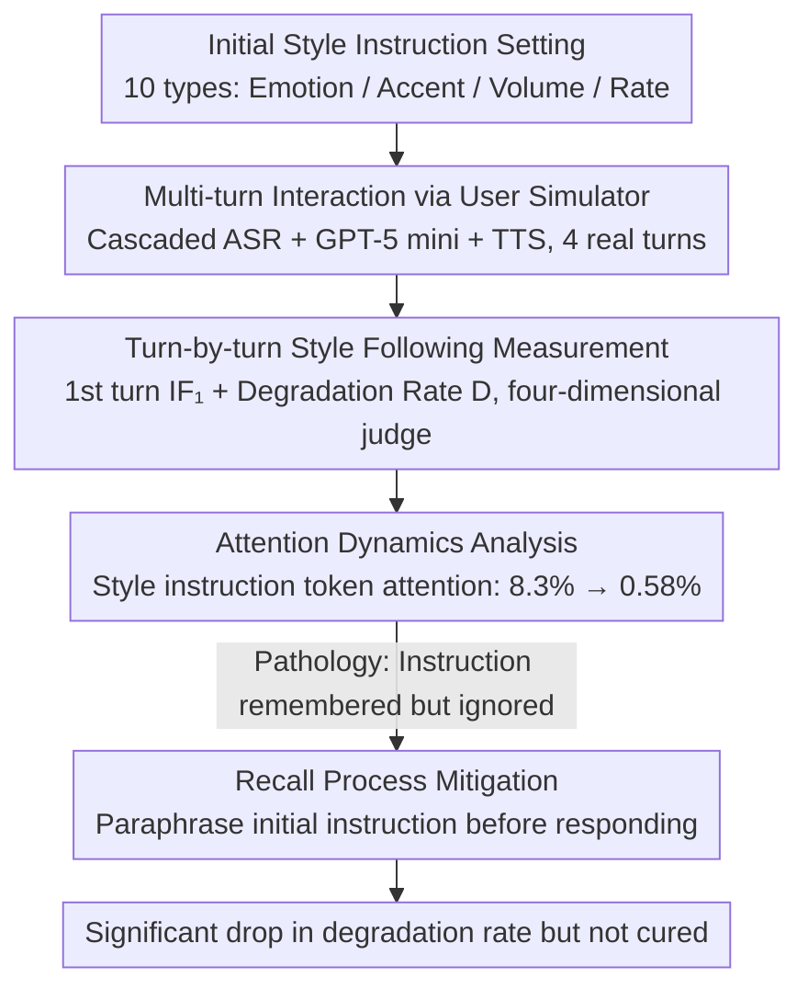

# Style Amnesia: Investigating Speaking Style Degradation and Mitigation in Multi-Turn Spoken Language Models

**Conference**: ACL 2026 Findings  
**arXiv**: [2512.23578](https://arxiv.org/abs/2512.23578)  
**Code**: [GitHub](https://github.com/YuXiangLin1234/SLM-Style-Amnesia)  
**Area**: Spoken Language Models  
**Keywords**: Spoken language models, style amnesia, multi-turn dialogue, speaking style, instruction following

## TL;DR

This paper discovers that Spoken Language Models (SLMs) fail to maintain initially specified speaking styles (emotion, accent, volume, speaking rate) during multi-turn dialogues, a phenomenon termed "Style Amnesia." Through attention analysis, the study reveals the cause (attention decay) and proposes an explicit recall process as a mitigation method.

## Background & Motivation

**Background**: Spoken Language Models (e.g., GPT-4o, Gemini Live, Qwen2.5-Omni) have demonstrated impressive expressive capabilities by following user-specified speaking styles (emotion, accent, rate, etc.) in single-turn interactions.

**Limitations of Prior Work**: Existing research almost entirely focuses on single-turn evaluation, while the ability to maintain style consistency in multi-turn dialogues remains unexplored. In practical applications, users set a style at the start and expect the SLM to maintain it throughout the session without repeating instructions every turn.

**Key Challenge**: SLMs follow style instructions well in the first turn, but the following rate drops sharply as dialogue turns increase. Models do not "forget" the instruction (recall tests show they can accurately paraphrase it) but rather "fail to execute" the instruction they remember.

**Goal**: Systematically evaluate and analyze the style maintenance capabilities of SLMs in multi-turn dialogues, identify the underlying causes, and explore mitigation strategies.

**Key Insight**: Construct an end-to-end evaluation framework using a user simulator for realistic interactive multi-turn dialogues, measuring the style following rate turn-by-turn.

**Core Idea**: The root cause of style amnesia is attention dilution—as dialogue turns increase, the model's attention weight on the style instruction tokens decays from ~8% to <0.6%, rather than actual memory loss.

## Method

### Overall Architecture

This paper performs a diagnostic study rather than proposing a new model: it builds an end-to-end evaluation framework to quantify the phenomenon of style degradation in multi-turn SLM interactions, identifies the "pathology," and tests a mitigation strategy. The process starts with a style instruction—10 types covering emotion (sad/happy/angry/neutral), accent (American/Indian English), volume (high/low), and speaking rate (fast/slow). Dialogue topics are drawn from 100 diverse openers in the Soda dataset. Interactions are conducted using a cascaded SLM (ASR + GPT-5 mini + TTS) as a user simulator for 4 real turns. Style following rates are measured turn-by-turn, causes are located via attention analysis, and an explicit recall process is tested for mitigation.

### Key Designs

**1. Turn-by-turn Style Following Measurement: Analyzing degradation turn by turn.** Aggregating scores into a global metric hides information about when and how the model fails; therefore, this paper insists on turn-by-turn statistics. It uses the first-turn following rate $IF_1$ to characterize the baseline capability and the degradation rate $D = \sum_{j=2}^{K} \frac{\max(IF_1(s) - IF_j(s), 0)}{K-1}$ to average the drop from the 2nd to the $K$-th turn relative to the first. Four specialized automatic judges are used: Emotion2vec-Large for emotion, Voxlect for accent, LUFS for volume, and WPM for speaking rate.

**2. Attention Dynamics Analysis: Distinguishing "forgotten" from "unable to execute."** Does style fade because the model forgets the instruction or because it can no longer execute it? This determines whether to use prompt engineering or architectural changes. The paper extracts the average attention weight on style instruction tokens during response generation in the open-source Step-Audio 2 mini. Results show a cliff-like dilution: ~8.3% in turn 1, ~1.6% in turn 2, ~0.87% in turn 3, and ~0.58% in turn 4—a 14x decay within four turns. This curve aligns highly with the IF rate degradation, confirming that the model "remembers the instruction (near-perfect recall scores) but stops paying attention to it."

**3. Recall Process: Testing mitigation via explicit reminders.** Since the issue lies in attention allocation, a simple countermeasure is requiring the model to paraphrase the initial style instruction before processing user input in each turn. Experiments show most models recall instructions accurately (closed-source models near 100%), and this step significantly lowers the degradation rate—GPT-4o mini's sadness degradation dropped from 65.3% to 30.3%. Notably, different models achieve styles differently: semantics and acoustics fade together in emotion, while for "fast speaking," Gemini Live reduces word count and GPT-4o uses acoustic acceleration, yet both suffer from shrinking WPM gaps over turns.

## Key Experimental Results

### Main Results

| Model | Style | IF₁ (1st Turn) | Degradation D |
|------|------|----------|---------|
| GPT-4o mini | Sadness | ~85% | 65.3% |
| GPT-4o mini | Indian Accent | ~75% | 49.7% |
| GPT-4o | Sadness | ~95% | 26.7% |
| Gemini Live | Sadness | ~85% | 21.3% |
| Step-Audio 2 mini | Sadness | ~70% | 14.0% |
| Cascaded Baseline (TTS) | All Emotion | ~95% | <3.0% |

### Ablation Study

| Configuration | Key Metric | Description |
|------|---------|------|
| Instruction in System Message | IF₁ drop 30-80% | System messages are harder to follow |
| Instruction in User Message | Higher IF₁ | Default setting works better |
| + Recall Process | D reduction 3-35% | GPT-4o mini benefits most |
| Attention Weight | 8.3%→0.58% | 14x decay within 4 turns |

### Key Findings
- All 5 evaluated models (3 closed-source + 2 open-source) exhibit style amnesia without exception.
- Models "remember" but "cannot do"—recall rates are near 100% while IF rates consistently decline.
- **System Message Paradox**: System messages are designed for global persistence, yet SLMs follow style instructions in system messages significantly worse than in user messages.
- **Default Style Bias**: Models tend to revert to "Happy/Neutral" emotions and "North American" accents.
- The cascaded baseline (providing style instructions to TTS every turn) shows almost no degradation, proving the issue lies in the end-to-end SLM architecture.

## Highlights & Insights
- **Discovered an important, previously overlooked issue**: Style amnesia is a key barrier to the practical application of SLMs.
- **Distinguished "Memory" vs. "Execution"**: Pinpointed the problem in attention allocation rather than memory loss through recall tests, providing a direction for solutions.
- **Comprehensive Evaluation**: High reliability achieved through realistic interaction simulations, four specialized judges, and human verification.
- **Value of the System Message Paradox**: Reveals deep-seated issues in current SLM architectural designs.

## Limitations & Future Work
- **Limited Style Variety**: Only 4 paralinguistic attributes covered; complex styles like intonation changes or role-playing were not included.
- **No Style Composition**: Current models cannot maintain even a single style; multi-style composition is left for future work.
- **Restricted Attention Analysis**: Internal attention was only analyzed for the open-source Step-Audio 2 mini.
- Future Directions: Style-anchored attention mechanisms, persistent representations for style embeddings, and following multi-style compositions.

## Related Work & Insights
- **vs. Multi-Bench**: Also evaluates multi-turn SLMs but only aggregates global scores; this work provides turn-by-turn analysis.
- **vs. VocalBench/VoxDialogue**: Uses predefined dialogues rather than real interactions, preventing turn-by-turn degradation analysis.
- **vs. Text LLM Multi-turn Research**: Similar performance degradation has been found in the text domain; this work extends it to paralinguistic features in the speech domain.

## Rating
- Novelty: ⭐⭐⭐⭐⭐ First to systematically reveal the SLM style amnesia phenomenon with the "remember but fail" insight.
- Experimental Thoroughness: ⭐⭐⭐⭐ Covers 5 models, 10 styles, 1000 dialogues, with attention analysis and mitigation experiments.
- Writing Quality: ⭐⭐⭐⭐⭐ Clear problem definition, progressive experimentation, and intuitive visualizations.
- Value: ⭐⭐⭐⭐⭐ Identifies a critical barrier for SLM deployment with clear implications for model design and training.

<!-- RELATED:START -->

## Related Papers

- [\[ACL 2026\] SpeakerSleuth: Can Large Audio-Language Models Judge Speaker Consistency across Multi-turn Dialogues?](speakersleuth_can_large_audio-language_models_judge_speaker_consistency_across_m.md)
- [\[ICLR 2026\] When Style Breaks Safety: Defending LLMs Against Superficial Style Alignment](../../ICLR2026/audio_speech/when_style_breaks_safety_defending_llms_against_superficial_style_alignment.md)
- [\[ACL 2026\] ReStyle-TTS: Relative and Continuous Style Control for Zero-Shot Speech Synthesis](restyle-tts_relative_and_continuous_style_control_for_zero-shot_speech_synthesis.md)
- [\[ACL 2026\] FC-TTS: Style and Timbre Control in Zero-Shot Text-to-Speech with Disentangled Speech Representations](fc-tts_style_and_timbre_control_in_zero-shot_text-to-speech_with_disentangled_sp.md)
- [\[ACL 2026\] MTR-DuplexBench: Towards a Comprehensive Evaluation of Multi-Round Conversations for Full-Duplex Speech Language Models](mtr-duplexbench_towards_a_comprehensive_evaluation_of_multi-round_conversations_.md)

<!-- RELATED:END -->
