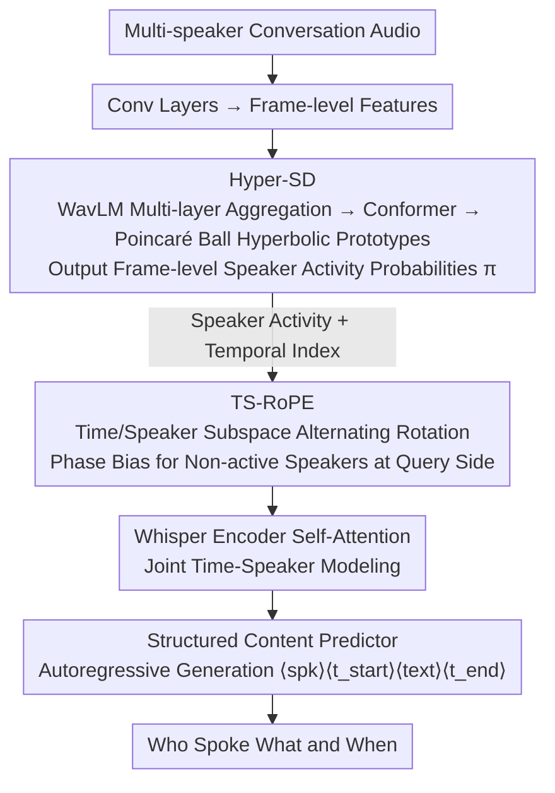

# TellWhisper: Tell Whisper Who Speaks When

**Conference**: ACL 2026  
**arXiv**: [2601.03712](https://arxiv.org/abs/2601.03712)  
**Code**: [Project Homepage](https://walker-hyf.github.io/TellWhisper)  
**Area**: Audio and Speech  
**Keywords**: Multi-speaker ASR, Speaker Diarization, Rotary Positional Embedding, Hyperbolic Space Classification, Whisper

## TL;DR

This paper proposes TellWhisper, which achieve joint modeling of "who spoke what and when" by designing Time-Speaker-aware Rotary Positional Embedding (TS-RoPE) to unify speaker identity and temporal information within the speech encoder's self-attention. Combined with a Hyperbolic Space Speaker Diarization model (Hyper-SD), it achieves state-of-the-art performance on multi-speaker ASR tasks.

## Background & Motivation

**Background**: Multi-speaker Automatic Speech Recognition (MASR) aims to predict "who spoke what and when" from multi-party conversation speech. Traditional pipelines merge Speaker Diarization (SD) and single-speaker ASR through timestamp alignment, but alignment is challenging in scenarios with overlapping speech and rapid speaker turns.

**Limitations of Prior Work**: Even recent methods attempting to unify SD and ASR essentially handle temporal and speaker modeling separately. This is reflected in the limitations of three common strategies: (1) Masking non-target areas with SD labels before encoding, which causes hallucinations due to blank inputs; (2) Attempting to separate target speaker speech, which requires extra speaker prompts and fails in overlaps; (3) Linearly mixing via speaker posterior weighting after encoder output, which entangles semantics with speaker cues.

**Key Challenge**: Separate modeling of temporal structure and speaker identity is inherently fragile in rapid speaker-switch and overlapping speech scenarios—time and speaker are coupled and should be modeled jointly rather than concatenated post-hoc.

**Goal**: Naturally model temporal and speaker information jointly within the speech encoder via positional embedding, allowing the self-attention mechanism to focus on "when" and "who" simultaneously.

**Key Insight**: Inspired by multidimensional RoPE in vision and multimodal domains for cross-axis encoding, this work extends RoPE from purely temporal encoding to simultaneously encoding time and speaker activity status.

**Core Idea**: Design TS-RoPE by partitioning Query/Key channels into temporal and speaker subspaces, achieving joint time-speaker modeling in self-attention via region-specific rotation angles.

## Method

### Overall Architecture

TellWhisper uses Whisper large-v3-turbo as the backbone to predict "who spoke what and when" in a single pass, integrating the traditionally separate speaker diarization and ASR into a single encoder for joint modeling. Multi-speaker speech first passes through convolutional layers to obtain frame-level features; Hyper-SD then estimates the speaker activity probability for each frame. This activity information, along with temporal indices, is fed into TS-RoPE as a multidimensional positional embedding injected into the self-attention mechanism, coupling "when" and "who" internally. Finally, a structured content predictor autoregressively outputs an ordered sequence of "speaker labels + timestamps + transcriptions".

### Key Designs

**1. TS-RoPE: Integrating Time and Speaker Identity into Rotary Positional Embedding**

Traditional RoPE only encodes temporal positions, requiring speaker information to be processed separately after encoding, which leads to misalignment during overlaps. TS-RoPE divides the channel dimension $D$ for each frame into groups of 16, where 8 rotation pairs are alternately assigned between temporal and four speaker subspaces: $[\psi_{time}, \psi_{spk_1}, \psi_{time}, \psi_{spk_2}, \psi_{time}, \psi_{spk_3}, \psi_{time}, \psi_{spk_4}]$. The temporal phase is the frame index $\psi_{time}(f_t) = t$, while the speaker phase is the sum of cumulative speaker turn counts and current activity probability: $\psi_{spk_s}(f_t) = \mathcal{C}_{t,s} + \pi_{t,s}$.

With this design, consecutive frames of the same speaker have similar rotation angles, leading to higher attention weights. Conversely, speaker shifts or overlaps create large angular differences, pulling attention apart. To further bias attention toward active speakers, an additional phase bias is added to the speaker subspace at the Query side: $\psi'_{spk_s}(f_t) = \psi_{spk_s}(f_t) + (1 - \pi_{t,s})$—the less active a speaker, the larger the bias, pushing them further away in attention space.

**2. Hyper-SD: Amplifying Separability of Similar Timbres in Hyperbolic Space**

TS-RoPE relies on reliable frame-level speaker activity probabilities $\pi_{t,s}$, but speakers with similar timbres are difficult to separate in Euclidean space. Hyper-SD aggregates multi-layer WavLM features, applies a Conformer for context, and maps Euclidean features into a Poincaré ball. Learnable hyperbolic prototypes $\mathbf{p}_n$ are assigned for each of the $2^4=16$ possible speaker combinations (silence, single speaker, various overlaps). Category probabilities are calculated using the hyperbolic distance $d_{t,n} = d_{\mathbb{B}_c}(\mathbf{v}'_t, \mathbf{p}_n)$, which are then marginalized back to frame-level activity $\pi_{t,s} = \sum_n b_{s,n} \sigma(-d_{t,n})$.

Hyperbolic space is used because its negative curvature provides exponential volume growth, amplifying small feature offsets into significant distance differences, making similar timbres easier to distinguish.

**3. Structured Content Predictor: Unifying "Speaker + Timestamp + Text" into a Sequence**

Traditional pipelines require timestamp alignment between SD and ASR outputs, which is error-prone. This module treats continuous speech from the same speaker as an independent segment, represented as a token sequence: $\langle spk_s \rangle, \langle t_{start} \rangle, \langle text \rangle, \langle t_{end} \rangle$. All segments are concatenated chronologically into a single target. The model is trained via next-token prediction, determining speaker attribution, temporal boundaries, and text in a single decoding pass, fundamentally bypassing post-hoc alignment issues.

### Loss & Training

A two-stage fine-tuning strategy is adopted: initial pre-finetuning on single-speaker speech (LibriSpeech) to learn the structured prediction format, followed by fine-tuning on multi-speaker conversation data. Hyper-SD is trained with NLLLoss, using RiemannianAdam for the hyperbolic classifier and AdamW for other components.

## Key Experimental Results

### Main Results

| Dataset | Metric | TellWhisper | Dicow (Prev. SOTA) | Gain |
|--------|------|-------------|----------------|------|
| AMI | CP-WER↓ | 32.53 | 33.57 | -1.04 |
| NotSoFar | CP-WER↓ | 34.48 | 35.22 | -0.74 |
| LibriCSS | CP-WER↓ | 9.88 | 10.62 | -0.74 |
| AMI | TCP-WER↓ | 33.47 | 34.02 | -0.55 |
| NotSoFar | TCP-WER↓ | 34.51 | 35.64 | -1.13 |
| LibriCSS | TCP-WER↓ | 11.06 | 11.33 | -0.27 |

### Ablation Study

| Configuration | AMI CP-WER | AMI TCP-WER | Description |
|------|-----------|-------------|------|
| TellWhisper (Full) | 32.53 | 33.47 | All components enabled |
| w/o Query Phase Bias | 35.02 | 35.26 | CP-WER +2.49 |
| w/o Speaker Turn Count | 36.22 | 36.68 | CP-WER +3.69 |
| w/o Speaker Activity | 36.84 | 36.89 | Largest degradation |

### Key Findings

- Hyper-SD outperforms Pyannote3 and Diarizen across all 6 SD datasets, confirming that hyperbolic classification is superior to Euclidean linear classification.
- The most significant DER improvement occurred on AliMeeting (13.03 → 10.76), indicating that hyperbolic speaker separation is particularly effective in real meeting scenarios.
- Ablation experiments prove that the three components of TS-RoPE (activity probability, turn count, and Query bias) contribute layer by layer, with the activity signal being the most critical.
- TellWhisper shows more pronounced advantages in real meeting datasets (AMI, NotSoFar) compared to simulated data (Libri2Mix), as the latter lacks the complex temporal speaker shifts where TS-RoPE excels.

## Highlights & Insights

- The design of TS-RoPE is elegant—injecting joint time-speaker information through channel partitioning and angular modulation without altering the model's core architecture.
- Using hyperbolic space for speaker activity estimation is clever, leveraging exponential volume growth to amplify distances between timbre-similar speakers.
- The intuition for the Query-side phase bias is clear: non-active speakers receive a larger bias, pushing them away so attention favors active speakers.
- Visualizations show that the 16 class prototypes are uniformly distributed in hyperbolic space without hierarchical structure, which suits the needs of frame-level classification.

## Limitations & Future Work

- The current TS-RoPE design supports 1-4 speakers; extending this to more speakers requires further research.
- Hyper-SD only performs hyperbolic classification after feature extraction; end-to-end hyperbolic learning across the encoder and classifier might yield further gains.
- Experiments were primarily conducted on English datasets; cross-lingual generalization remains to be verified.
- The advantage on Libri2Mix is less significant, suggesting limited gains in scenarios with extreme overlap but no speaker switching.

## Related Work & Insights

- **vs. Dicow (Polok et al.)**: Dicow filters with speaker masks before encoding, potentially causing hallucinations; TellWhisper fuses speaker information via positional embeddings inside the encoder, making it more seamless.
- **vs. SortFormer (Park et al.)**: SortFormer adds speaker sinusoidal kernel weighting after the encoder, entangling semantics and speakers through linear mixing; TS-RoPE achieves decoupled joint modeling via rotation angles.
- **vs. Multidimensional RoPE (Vision)**: While vision-based RoPE encodes spatial axes (width/height), TellWhisper innovatively introduces speaker activity as a new dimension.

## Rating

- Novelty: ⭐⭐⭐⭐⭐ TS-RoPE's extension of RoPE to joint time-speaker encoding is highly innovative and elegantly implemented.
- Experimental Thoroughness: ⭐⭐⭐⭐ Extensive testing on 4 MASR and 6 SD datasets with detailed ablations.
- Writing Quality: ⭐⭐⭐⭐ Clear methodological descriptions and complete mathematical derivations.
- Value: ⭐⭐⭐⭐⭐ Significant contribution to multi-speaker speech understanding; the TS-RoPE concept is extensible to other multidimensional sequence tasks.

<!-- RELATED:START -->

## Related Papers

- [\[ACL 2026\] When Misinformation Speaks and Converses: Rethinking Fact-Checking in Audio Platforms](when_misinformation_speaks_and_converses_rethinking_fact-checking_in_audio_platf.md)
- [\[ICLR 2026\] Knowing When to Quit: Probabilistic Early Exits for Speech Separation](../../ICLR2026/audio_speech/knowing_when_to_quit_probabilistic_early_exits_for_speech_separation.md)
- [\[ICLR 2026\] When and Where to Reset Matters for Long-Term Test-Time Adaptation](../../ICLR2026/audio_speech/when_and_where_to_reset_matters_for_long-term_test-time_adaptation.md)
- [\[ICLR 2026\] When Style Breaks Safety: Defending LLMs Against Superficial Style Alignment](../../ICLR2026/audio_speech/when_style_breaks_safety_defending_llms_against_superficial_style_alignment.md)
- [\[CVPR 2026\] When AVSR Meets Video Conferencing: Dataset, Degradation, and the Hidden Mechanism Behind Performance Collapse](../../CVPR2026/audio_speech/when_avsr_meets_video_conferencing_dataset_degradation_and_the_hidden_mechanism_.md)

<!-- RELATED:END -->
