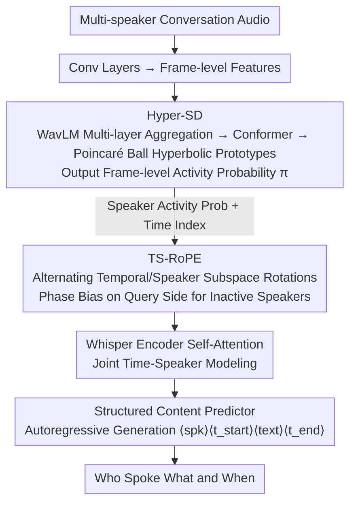

# TellWhisper: Tell Whisper Who Speaks When

**Conference**: ACL 2026  
**arXiv**: [2601.03712](https://arxiv.org/abs/2601.03712)  
**Code**: [Project Homepage](https://walker-hyf.github.io/TellWhisper)  
**Area**: Audio & Speech  
**Keywords**: Multi-speaker Speech Recognition, Speaker Diarization, Rotary Positional Embedding, Hyperbolic Space Classification, Whisper

## TL;DR

This paper proposes TellWhisper, which achieves joint modeling of "who spoke what and when" by designing Time-Speaker Aware Rotary Positional Embedding (TS-RoPE) to unify speaker identity and temporal information within the self-attention of the speech encoder. Coupled with a Hyperbolic space Speaker Diarization model (Hyper-SD), it achieves state-of-the-art performance in multi-speaker ASR tasks.

## Background & Motivation

**Background**: Multi-speaker Automatic Speech Recognition (MASR) aims to predict "who spoke what and when" from multi-party conversation audio. Traditional solutions fuse Speaker Diarization (SD) and single-speaker ASR through timestamp alignment, but alignment is difficult in overlapping speech and rapid speaker change scenarios.

**Limitations of Prior Work**: Even late efforts to unify SD and ASR essentially process temporal and speaker modeling separately. The limitations of three specific strategies are: (1) Masking non-target regions with SD labels before encoding, which causes hallucinations due to empty inputs; (2) Attempting to separate target speaker speech, which requires extra speaker prompts and fails in overlapping regions; (3) Linear mixing via speaker posterior weighting after the encoder output, which entangles semantic and speaker cues.

**Key Challenge**: The separate modeling of temporal structure and speaker identity is inherently fragile in scenarios with rapid speaker changes and overlapping speech—time and speaker are coupled and should be modeled jointly rather than concatenated post-hoc.

**Goal**: Naturally model temporal and speaker information jointly via positional encoding within the speech encoder, enabling the self-attention mechanism to simultaneously focus on "when" and "who."

**Key Insight**: Inspired by multidimensional RoPE that encodes across axes in vision and multi-modal tasks, RoPE is extended from purely temporal encoding to simultaneously encoding time and speaker activity status.

**Core Idea**: Design TS-RoPE to partition Query/Key channels into temporal and speaker subspaces, achieving joint time-speaker modeling in self-attention via region-specific rotation angles.

## Method

### Overall Architecture

TellWhisper uses Whisper large-v3-turbo as the backbone, aiming to predict "who spoke what and when" at once from multi-party conversation audio, integrating the split SD and ASR from traditional pipelines into a single encoder. Multi-speaker speech first passes through convolutional layers to obtain frame-level features; Hyper-SD estimates the speaker activity probability for each frame based on these features; this activity info, along with temporal indices, is fed into TS-RoPE, forming a multidimensional positional encoding injected into self-attention, coupling "when" and "who" within the attention mechanism. Finally, a structured content predictor emits an ordered sequence of "speaker labels + start/end timestamps + transcription" in an autoregressive manner.

### Key Designs

**1. TS-RoPE: Making Rotary Positional Embedding Carry Time and Speaker Identity**

Traditional RoPE only encodes temporal position, requiring speaker information to be handled separately post-encoding, which leads to misalignment during overlaps and rapid speaker changes. TS-RoPE partitions the channel dimension $D$ of each frame into groups of 16 dimensions, with 8 rotation pairs inside each group alternating between temporal and 4 speaker subspaces: $[\psi_{time}, \psi_{spk_1}, \psi_{time}, \psi_{spk_2}, \psi_{time}, \psi_{spk_3}, \psi_{time}, \psi_{spk_4}]$. The temporal phase is directly the frame index $\psi_{time}(f_t) = t$; the speaker phase is the sum of the cumulative speaker turn count and the current activity probability $\psi_{spk_s}(f_t) = \mathcal{C}_{t,s} + \pi_{t,s}$.

With this design, continuous frames of the same speaker have similar rotation angles and naturally higher attention weights, while angle differences are large at speaker switches or overlaps, pulling attention apart. The continuity within speakers and transitions between speakers are directly characterized by the rotation angles. To further push attention toward active speakers, an additional phase bias is added to the speaker subspace on the Query side $\psi'_{spk_s}(f_t) = \psi_{spk_s}(f_t) + (1 - \pi_{t,s})$—the less active a speaker, the larger the bias and the further they are pushed. Removing this Query bias increases CP-WER by 2.49 in ablations, and removing the activity signal causes the largest degradation, showing that time-speaker coupling is the primary source of performance.

**2. Hyper-SD: Maximizing Separability of Similar Timbres in Hyperbolic Space**

TS-RoPE relies on reliable frame-level speaker activity probabilities $\pi_{t,s}$, but speakers with similar timbres are hard to distinguish in Euclidean space. Hyper-SD first aggregates WavLM multi-layer features with weights, adds context via a Conformer, and maps Euclidean features into the Poincaré ball. A learnable hyperbolic prototype $\mathbf{p}_n$ is assigned to each of the $2^4=16$ speaker combination classes (silence, single speaker, various overlap combinations). Class probabilities are calculated based on the hyperbolic distance from frame embeddings to prototypes $d_{t,n} = d_{\mathbb{B}_c}(\mathbf{v}'_t, \mathbf{p}_n)$, which are then marginalized back to frame-level activities for each speaker $\pi_{t,s} = \sum_n b_{s,n} \sigma(-d_{t,n})$.

Hyperbolic space is used because the exponential volume growth provided by negative curvature amplifies tiny feature offsets into significant distance differences, making similar timbres easier to separate. In experiments, Hyper-SD outperforms Pyannote3 and Diarizen across 6 SD datasets; on AliMeeting, DER drops from 13.03 to 10.76, reflecting this separability in real meetings.

**3. Structured Content Predictor: Unifying Speaker, Timestamps, and Text into a Single Sequence**

Traditional pipelines require timestamp alignment between SD and ASR outputs, which is prone to misalignment during overlaps. Here, time-continuous speech from the same speaker is treated as an independent segment, written as a token sequence $\langle spk_s \rangle, \langle t_{start} \rangle, \langle text \rangle, \langle t_{end} \rangle$. All segments are concatenated into a single target in chronological order. The model is trained for next-token prediction in an autoregressive manner; during decoding, it generates tokens until EOS. Speaker attribution, temporal boundaries, and text are determined in a single decoding pass, fundamentally bypassing the post-hoc alignment problem.

### Loss & Training

A two-stage fine-tuning approach is adopted: first pre-fine-tuning on single-speaker speech (LibriSpeech) to learn the structured prediction format, then moving to multi-speaker conversation speech. Hyper-SD is trained with NLLLoss, using RiemannianAdam for the hyperbolic classifier and AdamW for other components. WavLM uses a smaller learning rate, while other modules use a larger one.

## Key Experimental Results

### Main Results

| Dataset | Metric | TellWhisper (Ours) | Dicow (Prev. SOTA) | Gain |
|--------|------|-------------|----------------|------|
| AMI | CP-WER↓ | 32.53 | 33.57 | -1.04 |
| NotSoFar | CP-WER↓ | 34.48 | 35.22 | -0.74 |
| LibriCSS | CP-WER↓ | 9.88 | 10.62 | -0.74 |
| AMI | TCP-WER↓ | 33.47 | 34.02 | -0.55 |
| NotSoFar | TCP-WER↓ | 34.51 | 35.64 | -1.13 |
| LibriCSS | TCP-WER↓ | 11.06 | 11.33 | -0.27 |

### Ablation Study

| Configuration | AMI CP-WER | AMI TCP-WER | Description |
|------|-----------|-------------|------|
| Full TellWhisper | 32.53 | 33.47 | All components enabled |
| w/o Query Phase Bias | 35.02 | 35.26 | CP-WER +2.49 |
| w/o Speaker Turn Count | 36.22 | 36.68 | CP-WER +3.69 |
| w/o Speaker Activity | 36.84 | 36.89 | Largest degradation |

### Key Findings

- Hyper-SD outperforms Pyannote3 and Diarizen on all 6 SD datasets, confirming that hyperbolic space classification is superior to Euclidean linear classification.
- The most significant DER improvement occurred on AliMeeting (13.03→10.76), indicating that hyperbolic speaker separation is particularly effective in real meeting scenarios.
- Ablation studies prove that the three components of TS-RoPE (activity probability, turn count, Query bias) contribute layer by layer, with the speaker activity signal being the most critical.
- TellWhisper's advantages are more pronounced in real meeting scenarios (AMI, NotSoFar) than in simulated data (Libri2Mix), as overlaps in simulated data often start from time zero without speaker switching, limiting the benefit of TS-RoPE.

## Highlights & Insights

- The design of TS-RoPE is elegant—it injects time-speaker coupling information via channel partitioning and angle modulation of RoPE without changing the internal model architecture.
- Using hyperbolic space for speaker activity estimation is clever—leveraging the exponential volume growth of negative curvature space to amplify distances between speakers with similar timbres.
- The intuition for the extra phase bias on the Query side is clear: inactive speakers receive a larger bias → attention is more inclined toward active speakers.
- Visualizations show that the 16 class prototypes are uniformly distributed in hyperbolic space without hierarchical structure, matching the requirements of frame-level classification.

## Limitations & Future Work

- The current TS-RoPE design supports 1-4 speakers; extending to more speakers requires further research.
- Hyper-SD only performs hyperbolic classification after feature extraction; since the encoder and classifier remain in different embedding spaces, end-to-end hyperbolic learning may offer further improvements.
- Experiments were primarily conducted on English datasets; cross-lingual generalization remains to be verified.
- The advantage on Libri2Mix is less obvious, suggesting limited gains for TS-RoPE in scenarios with extreme overlapping but no speaker switches.

## Related Work & Insights

- **vs Dicow (Polok et al.)**: Dicow filters via speaker masks before encoding, which may trigger hallucinations; TellWhisper fuses speaker information via positional encoding within the encoder, making it more seamless.
- **vs SortFormer (Park et al.)**: SortFormer adds speaker sinusoidal kernel weighting after the encoder output, entangling semantics and speaker info via linear mixing; TS-RoPE achieves decoupled joint modeling through rotation angles.
- **vs Multidimensional RoPE (Vision)**: Visual RoPE encodes spatial axes like width/height; TellWhisper innovatively introduces speaker activity as a new dimension into RoPE.

## Rating

- Novelty: ⭐⭐⭐⭐⭐ TS-RoPE elegantly extends RoPE to joint time-speaker encoding.
- Experimental Thoroughness: ⭐⭐⭐⭐ 4 MASR datasets + 6 SD datasets, multiple baseline comparisons, and detailed ablations.
- Writing Quality: ⭐⭐⭐⭐ Clear methodological descriptions and complete formula derivations.
- Value: ⭐⭐⭐⭐⭐ Significantly advances multi-speaker speech understanding; TS-RoPE concepts are extensible to other multidimensional sequence modeling tasks.

<!-- RELATED:START -->

## Related Papers

- [\[ACL 2026\] When Misinformation Speaks and Converses: Rethinking Fact-Checking in Audio Platforms](when_misinformation_speaks_and_converses_rethinking_fact-checking_in_audio_platf.md)
- [\[ACL 2026\] From Isolation to Entanglement: When Do Interpretability Methods Identify and Disentangle Known Concepts?](from_isolation_to_entanglement_when_do_interpretability_methods_identify_and_dis.md)
- [\[ACL 2026\] Phun-Bench: Evaluating LLMs on Phonological Understanding in Chinese](phun-bench_evaluating_llms_on_phonological_understanding_in_chinese.md)
- [\[ICLR 2026\] Knowing When to Quit: Probabilistic Early Exits for Speech Separation Networks](../../ICLR2026/audio_speech/knowing_when_to_quit_probabilistic_early_exits_for_speech_separation_networks.md)
- [\[ICLR 2026\] When and Where to Reset Matters for Long-Term Test-Time Adaptation](../../ICLR2026/audio_speech/when_and_where_to_reset_matters_for_long-term_test-time_adaptation.md)

<!-- RELATED:END -->
