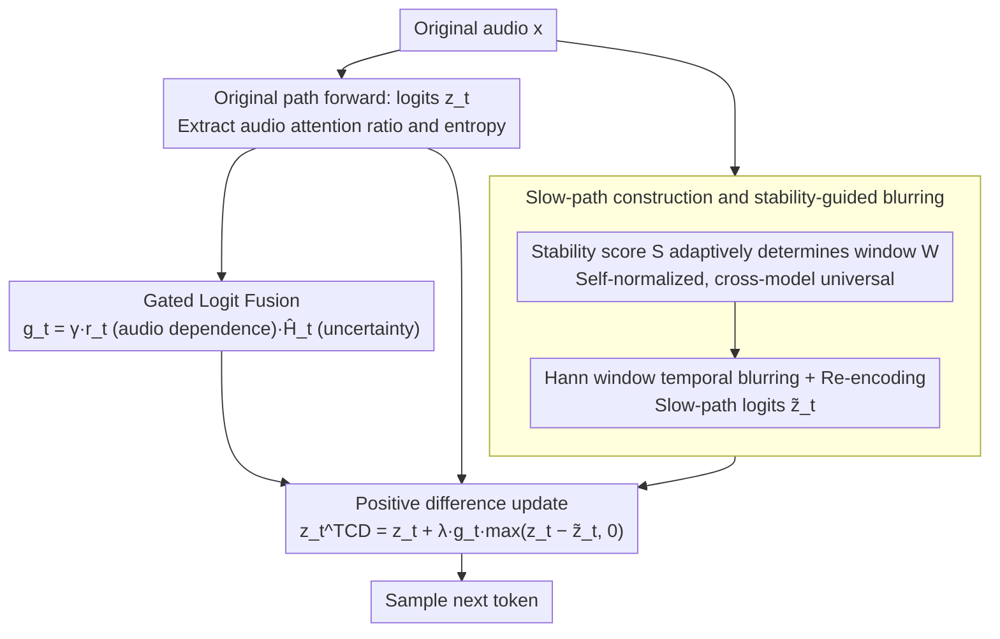

# Temporal Contrastive Decoding: A Training-Free Method for Large Audio-Language Models

**Conference**: ACL 2026 Findings  
**arXiv**: [2604.15383](https://arxiv.org/abs/2604.15383)  
**Code**: None  
**Area**: Audio & Speech  
**Keywords**: Large Audio-Language Models, Contrastive Decoding, Temporal Smoothing Bias, Training-free Inference, Gated Update

## TL;DR

TCD is proposed as a training-free inference-time decoding method: by contrasting the logit differences between original audio and a temporally blurred slow-path view, combined with stability-guided blurring windows and uncertainty gating, unified audio-language models better utilize transient acoustic cues. It achieves consistent improvements on MMAU and AIR-Bench.

## Background & Motivation

**Background**: Large Audio-Language Models (LALMs) such as Qwen2-Audio and Qwen2.5-Omni adopt unified architectures, representing audio as time-aligned token sequences that share a causal decoder with text.

**Limitations of Prior Work**: Unified decoders suffer from "temporal smoothing bias"—transient acoustic cues (e.g., number of phone rings, short sound effect changes) may be suppressed by temporally smooth contexts and language priors, leading to generations insensitive to key transient events.

**Key Challenge**: The autoregressive nature of language models naturally favors temporally smooth predictions, whereas critical information in audio is often transient.

**Goal**: Design a training-free decoding-time intervention to enable models to better utilize transient acoustic cues.

**Key Insight**: Drawing an analogy to visual contrastive decoding, one can construct a temporally blurred "slow-path" audio view and contrast the logits of the two views to identify the contribution of transient cues.

**Core Idea**: Use a Hann window to temporally blur the original audio for the slow path. Contrast the positive differences between the two sets of logits as transient cue signals, using stability-adaptive windows and uncertainty + audio-dependency gating to restrict the update range.

## Method

### Overall Architecture

TCD is an inference-time decoding intervention that does not modify model weights. It specifically directs unified LALMs to refocus on transient acoustic cues flattened by language priors. In each decoding step, two forward passes are run: one for the original audio and one for the temporally blurred "slow-path" audio view. In the positive difference $d_t = z_t - \tilde{z}_t$, the portion preferred by the original audio but erased by the slow path corresponds to the contribution of transient cues. TCD performs a gate-constrained sparse update on the original logits before sampling the next token.

### Key Designs

**1. Slow Path Construction and Stability-Guided Blurring: Creating a "transient-free" reference**

To identify transient contributions, a reference representation with smooth structures but no transients is needed. TCD applies temporal smoothing to the original waveform $\tilde{x} = \mathcal{K}(x)$ using a normalized Hann window, then re-encodes it into the slow-path representation $\tilde{H}$. Blurring intensity is not fixed: window size $W$ is adaptively determined by a self-normalized stability score $S$, calculated from the magnitude and temporal flux of encoder layers and weighted by audio attention. 

Key is self-normalization—hidden state scales vary significantly across models and layers. Direct use of absolute magnitudes would break the window strategy across models; self-normalization removes scale differences, allowing the same stability criteria to work for both Qwen2-Audio and Qwen2.5-Omni. Removing stability adaptation and using a fixed window drops performance by 0.8 on average.

**2. Gated Logit Fusion: Acting only when "audio-dependent and uncertain"**

Unconditionally adding differences can lead to over-intervention, harming confident and correct steps. TCD uses a gate $g_t = \min\{\gamma \cdot r_t \cdot \hat{H}_t^\alpha, 1.0\}$ to control update intensity, where $r_t$ is the audio attention ratio (how much the step relies on audio evidence) and $\hat{H}_t$ is the top-K normalized entropy (model uncertainty). Updates are restricted to a candidate set $\Omega_t$. 

The design philosophy is conservative: for audio-independent steps or steps where the model is already confident, the gate approaches zero; it activates only when the step is highly audio-dependent yet uncertain. Removing the gate drops performance by 1.2 on average, making it the most critical component and proving that "minimal intervention" is effective intervention.

**3. Positive Difference Update: Enhancing without suppressing**

The fusion only considers the positive part of the difference $d_t^+ = \max(z_t - \tilde{z}_t, 0)$. The update is $z_t^{\text{TCD}}(j) = z_t(j) + \lambda \cdot g_t \cdot d_t^+(j)$. Negative differences are discarded because they represent tokens favored by both the language prior and the slow path; there is no need to suppress them. Only positive differences correspond to transient cues that the "original audio wants more than the smooth view." Including negative values (full difference update) drops performance by 0.5, indicating negative differences introduce noise.

### Loss & Training

Completely training-free, introducing no learnable parameters. The cost is one additional slow-path forward pass per step (approx. 2x inference overhead).

## Key Experimental Results

### Main Results

| Model | Sound | Music | Speech | Avg |
|------|-------|-------|--------|-----|
| Qwen2.5-Omni | 73.9 | 62.9 | 76.7 | 71.2 |
| + TCD | **75.2** | **68.0** | 75.8 | **73.2** |
| Qwen2-Audio | 63.5 | 48.3 | 67.1 | 59.6 |
| + TCD | **65.8** | **51.2** | **68.4** | **61.8** |

### Ablation Study

| Configuration | Avg Δ | Description |
|------|-------|------|
| w/o Gating | -1.2 | Over-intervention |
| w/o Stability Adaptation | -0.8 | Fixed window |
| Full Difference (incl. negative) | -0.5 | Negatives introduce noise |

### Key Findings

- TCD is consistently effective for unified LALMs but ineffective for semantic bottleneck architectures—it requires time-aligned audio representations.
- Improvements are largest in Music and Sound domains (dependent on transient cues) and smaller in the Speech domain.

## Highlights & Insights

- **Concept of "temporal smoothing bias"** is explicitly proposed for the first time.
- **Self-normalized stability score** is elegantly designed—no dataset calibration required.
- **Gating design** ensures conservatism—most steps remain unaffected.

## Limitations & Future Work

- Not applicable to semantic bottleneck architectures.
- 2x inference overhead may be unacceptable in real-time scenarios.
- Hann window is a heuristic choice; other time-frequency transformations remain unexplored.

## Related Work & Insights

- **vs AAD**: Whole-modality ablation vs. temporal resolution contrast; TCD is more fine-grained.
- **vs Visual Contrastive Decoding**: TCD transfers this paradigm to the audio temporal dimension.

## Rating

- Novelty: ⭐⭐⭐⭐ Temporal contrastive decoding is a novel idea, drawing inspiration from the vision domain.
- Experimental Thoroughness: ⭐⭐⭐⭐ MMAU + AIR-Bench + Ablations + Architecture analysis.
- Writing Quality: ⭐⭐⭐⭐ Clear framework diagrams.
- Value: ⭐⭐⭐⭐ Practical value for optimizing unified LALM inference.

<!-- RELATED:START -->

## Related Papers

- [\[AAAI 2026\] Listening Between the Frames: Bridging Temporal Gaps in Large Audio-Language Models](../../AAAI2026/audio_speech/listening_between_the_frames_bridging_temporal_gaps_in_large_audio-language_mode.md)
- [\[ACL 2026\] Towards Fine-Grained and Multi-Granular Contrastive Language-Speech Pre-training](towards_fine-grained_and_multi-granular_contrastive_language-speech_pre-training.md)
- [\[ACL 2026\] SEPT: Semantically Expanded Prompt Tuning for Audio-Language Models](generalizable_prompt_tuning_for_audio-language_models_via_semantic_expansion.md)
- [\[ACL 2026\] Closing the Modality Reasoning Gap for Speech Large Language Models](closing_the_modality_reasoning_gap_for_speech_large_language_models.md)
- [\[ACL 2026\] Do We Need Distinct Representations for Every Speech Token? Unveiling and Exploiting Redundancy in Large Speech Language Models](do_we_need_distinct_representations_for_every_speech_token_unveiling_and_exploit.md)

<!-- RELATED:END -->
