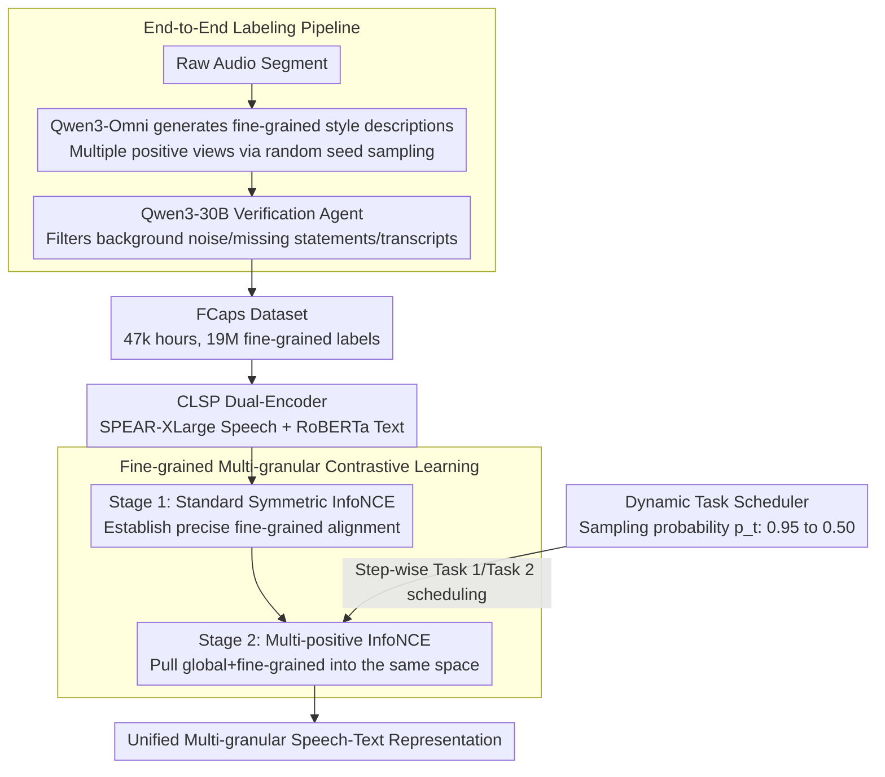

# Towards Fine-Grained and Multi-Granular Contrastive Language-Speech Pre-training

**Conference**: ACL 2026  
**arXiv**: [2601.03065](https://arxiv.org/abs/2601.03065)  
**Code**: [GitHub](https://github.com/yfyeung/CLSP)  
**Area**: Audio & Speech  
**Keywords**: Speaking style modeling, contrastive learning pre-training, fine-grained labeling, speech-text alignment, paralinguistics

## TL;DR

This paper proposes the FCaps large-scale dataset (47k hours of speech, 19M fine-grained labels) and the CLSP model. By utilizing an end-to-end labeling pipeline and fine-grained multi-granular contrastive supervision, it achieves the first speech-text alignment model capable of unifying global and fine-grained speech style representations.

## Background & Motivation

**Background**: Speaking style conveys rich paralinguistic information, including intrinsic speaker characteristics (gender, age, accent) and situational features (speed, emotion, expressiveness). Existing speech-text representation learning methods often rely on coarse-grained labels or task-specific supervision, failing to capture the fine-grained temporal structure of speech styles.

**Limitations of Prior Work**: Existing speech style annotation datasets primarily adopt cascaded labeling pipelines—labeling speech with discrete tags first, then rewriting tags into natural language descriptions using LLMs. This approach suffers from a fundamental information bottleneck: discrete labels compress rich, continuous, and time-varying paralinguistic information into limited pre-defined categories, leading to significant information loss and semantic bias.

**Key Challenge**: Fine-grained speech style modeling requires high-quality, large-scale free-text descriptions, but current methods either rely on manual annotation (high cost, poor consistency) or use cascaded pipelines (introducing error propagation and information loss).

**Goal**: (1) Construct a large-scale end-to-end fine-grained speech style annotation dataset to bypass the information bottleneck of cascaded pipelines; (2) Train a contrastive learning model that can uniformly represent multi-granular speech styles.

**Key Insight**: Leveraging the latest multimodal annotation models (Qwen3-Omni) to generate fine-grained descriptions directly from audio, bypassing the intermediate discrete label step, and ensuring quality through an LLM-based verification agent.

**Core Idea**: An end-to-end labeling pipeline combined with fine-grained multi-granular contrastive learning to eliminate information bottlenecks and achieve unified speech-text representation from global to fine-grained levels.

## Method

### Overall Architecture

The work follows two tracks: data and modeling, aiming to train the first speech-text alignment model for unified global and fine-grained style representation. For data, the FCaps dataset is constructed using an end-to-end pipeline, consisting of FCaps-Emilia (46,787 hours, 18M labels) and FCaps-PSCBase (267 hours, 140k global + 930k fine-grained labels), generating free-text descriptions directly from audio. For modeling, CLSP uses a dual-encoder (SPEAR-XLarge speech encoder + RoBERTa text encoder) with a two-stage curriculum learning approach: standard contrastive alignment on large-scale fine-grained data, followed by multi-positive contrastive learning to unify global and fine-grained granularities into the same embedding space. The second stage is controlled by a dynamic task scheduler.

### Key Designs

**1. End-to-End Labeling Pipeline: Bypassing Discrete Label Bottlenecks**

Mainstream methods use cascaded pipelines—first tagging speech with discrete labels, then having an LLM rewrite them into natural language. This causes information loss as continuous signals are compressed into categories. This work uses Qwen3-Omni-30B as a detailed annotator to generate fine-grained descriptions directly from audio segments. Prompts constrain the output to focus on speaker style while suppressing transcript content and ambient noise. Multiple positive views are obtained by sampling with different random seeds for the same segment.

The end-to-end approach is effective because generation is conditioned on the raw audio, preserving paralinguistic signals. An LLM agent (Qwen3-30B) serves as a validator, filtering low-quality annotations based on a checklist (e.g., presence of background noise descriptions, missing declarations, or non-style transcript content). Ablations show E2E labeling outperforms cascaded pipelines in Correctness/Coverage/Naturalness (4.42/4.55/4.92 vs. 3.30/3.10/4.15).

**2. Fine-grained Multi-granular Contrastive Learning: Two-Stage Curriculum**

The first stage establishes precise fine-grained speech-text correspondence on large-scale data using standard symmetric InfoNCE:

$$\mathcal{L} = -\frac{1}{2N}\sum_{i=1}^{N}\Big(\log\frac{\exp(\mathbf{s}_i \cdot \mathbf{t}_{Fi}/\tau)}{\sum_j \exp(\mathbf{s}_i \cdot \mathbf{t}_{Fj}/\tau)} + \text{reverse}\Big)$$

The second stage switches to multi-positive InfoNCE: each speech clip is paired with two texts (one global and one fine-grained, or two different fine-grained ones). Probability mass is distributed to multiple positives via a soft target distribution $D_{i,j}$ with $\lambda=0.5$. The loss is a bidirectional cross-entropy $\mathcal{L} = \frac{1}{2}(\mathrm{CE}(\mathbf{L}/\tau, \mathbf{D}) + \mathrm{CE}(\mathbf{L}^\top/\tau, \mathbf{D}'))$. This allows the model to perform both global and fine-grained retrieval.

**3. Dynamic Task Scheduler: Progressive Learning Transitions**

Stage 2 balances "cross-granular generalization" and "fine-grained discrimination." The scheduler randomly selects between Task 1 (global + fine-grained pair) or Task 2 (two different fine-grained pairs) at each step. The sampling probability $p_t$ for Task 1 decays linearly from $p_0=0.95$ to $p_{min}=0.50$ over $T=10000$ steps:

$$p_t = \max\Big(p_{min},\; p_0 - \frac{t}{T}(p_0 - p_{min})\Big)$$

Task 1 dominates early training to align global and fine-grained granularities, while Task 2 increases later to strengthen discrimination between fine-grained styles.

### Loss & Training

CLSP consists of 724M parameters (SPEAR-XLarge 599M + RoBERTa 125M), trained on 8 A100 80GB GPUs. Stage 1 takes 1.2M steps, while Stage 2 involves 4k steps of fine-tuning. ScaledAdam and Eden scheduler are used, with peak learning rates of 0.045 and 0.001 respectively. The temperature $\tau$ is learnable.

## Key Experimental Results

### Main Results

| Task | Metric | CLSP | Prev. SOTA (ParaCLAP) | Gain |
|------|------|------|-------------------|------|
| Global Retrieval S→T | R@1 | 45.6 | 2.1 | +43.5 |
| Global Retrieval T→S | R@1 | 40.3 | 0.4 | +39.9 |
| Fine-grained Retrieval S→T | R@1 | 68.1 | 1.2 | +66.9 |
| Fine-grained Retrieval T→S | R@1 | 67.2 | 1.2 | +66.0 |
| Zero-shot Emotion (IEMOCAP) | WA/UA | 57.2/56.1 | 46.1/46.5 | +11.1/+9.6 |
| Zero-shot Gender (RAVDESS) | WA/UA | 100.0/100.0 | 99.2/99.2 | +0.8 |
| Style Similarity (Intrinsic) | Pearson r | 0.893 | 0.663 | +0.230 |
| Style Similarity (Situational) | Pearson r | 0.903 | 0.323 | +0.580 |

### Ablation Study

| Configuration | Description | Effect |
|------|------|------|
| E2E vs. Cascaded Labeling | Correctness/Coverage/Naturalness | 4.42/4.55/4.92 vs. 3.30/3.10/4.15 |
| Static vs. Dynamic Scheduler | Task sampling strategy | Dynamic outperforms static |
| $\lambda=0.5$ vs. others | Multi-positive weight | 0.5 is optimal |

### Key Findings

- CLSP significantly outperforms existing methods across all tasks, with massive jumps in retrieval (R@1 from single digits to 40-68%).
- E2E labeling quality is superior to cascaded labeling: Correctness +1.12, Coverage +1.45, Naturalness +0.77.
- Speech style similarity scores show high consistency with human judgment (Pearson r > 0.88), particularly in situational features (0.903 vs. 0.323 for ParaCLAP).
- Strong zero-shot performance (57.2% WA for emotion, 100% for gender) indicates learned representations effectively encode paralinguistic information.

## Highlights & Insights

- FCaps is currently the largest fine-grained speech style annotation dataset (47k hours, 19M labels), filling a critical data gap.
- The E2E labeling pipeline bypasses information bottlenecks by generating descriptions directly from raw signals.
- The two-stage curriculum learning strategy is highly efficient, significantly improving cross-granular alignment in just 4k fine-tuning steps.
- CLSP serves as a reliable speech style evaluator, with high human correlation making it a potential alternative to expensive subjective assessments.

## Limitations & Future Work

- Currently limited to English speech; cross-lingual style modeling remains to be explored.
- The E2E pipeline depends on Qwen3-Omni, and model biases may propagate into the labels.
- Uses RoBERTa-base (125M); scaling up the text encoder might yield further gains.
- Temporal alignment within fine-grained annotations (e.g., precise timestamps for style shifts) was not explored.

## Related Work & Insights

- **vs. ParaCLAP (Jing et al.)**: ParaCLAP focuses on emotion-centric supervision; CLSP covers broader paralinguistic dimensions via multi-granular supervision.
- **vs. GLAP (Dinkel et al.)**: GLAP uses transcript pairs for lexical-level supervision; CLSP uses style descriptions for paralinguistic-level supervision.
- **vs. CapSpeech (Wang et al.)**: CapSpeech uses a cascaded pipeline; CLSP's E2E pipeline avoids bottlenecks, resulting in higher label quality.

## Rating

- Novelty: ⭐⭐⭐⭐⭐ 
- Experimental Thoroughness: ⭐⭐⭐⭐⭐ 
- Writing Quality: ⭐⭐⭐⭐ 
- Value: ⭐⭐⭐⭐⭐ 

<!-- RELATED:START -->

## Related Papers

- [\[ACL 2026\] Temporal Contrastive Decoding: A Training-Free Method for Large Audio-Language Models](temporal_contrastive_decoding_a_training-free_method_for_large_audio-language_mo.md)
- [\[ACL 2026\] SegTune: Structured and Fine-Grained Control for Song Generation](segtune_structured_and_fine-grained_control_for_song_generation.md)
- [\[ICML 2026\] MECAT: A Multi-Experts Constructed Benchmark for Fine-Grained Audio Understanding Tasks](../../ICML2026/audio_speech/mecat_a_multi-experts_constructed_benchmark_for_fine-grained_audio_understanding.md)
- [\[AAAI 2026\] MF-Speech: Achieving Fine-Grained and Compositional Control in Speech Generation via Factor Disentanglement](../../AAAI2026/audio_speech/mf-speech_achieving_fine-grained_and_compositional_control_in_speech_generation_.md)
- [\[CVPR 2026\] Unlocking Strong Supervision: A Data-Centric Study of General-Purpose Audio Pre-Training Methods](../../CVPR2026/audio_speech/unlocking_strong_supervision_a_data-centric_study_of_general-purpose_audio_pre-t.md)

<!-- RELATED:END -->
