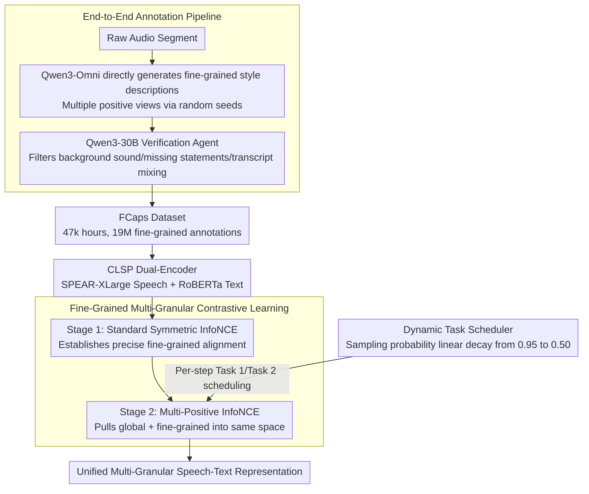

# Towards Fine-Grained and Multi-Granular Contrastive Language-Speech Pre-training

**Conference**: ACL 2026  
**arXiv**: [2601.03065](https://arxiv.org/abs/2601.03065)  
**Code**: [GitHub](https://github.com/yfyeung/CLSP)  
**Area**: Audio Speech  
**Keywords**: Speaking style modeling, contrastive learning pre-training, fine-grained annotation, speech-text alignment, paralinguistics

## TL;DR

This paper proposes the FCaps large-scale dataset (47k hours of speech, 19M fine-grained annotations) and the CLSP contrastive learning model. Through an end-to-end annotation pipeline and fine-grained multi-granular contrastive supervision, it realizes the first speech-text alignment model capable of unifying global and fine-grained speaking style representations.

## Background & Motivation

**Background**: Speaking style conveys rich paralinguistic information, including intrinsic speaker characteristics (gender, age, accent) and situational characteristics (speaking rate, emotion, expressiveness). Existing speech-text representation learning methods typically rely on coarse-grained labels or task-specific supervision, failing to capture the fine-grained temporal structure of speaking styles.

**Limitations of Prior Work**: Current speaking style annotation datasets mainly adopt a cascaded annotation pipeline—first labeling speech with discrete tags, then using large language models to rewrite the tags into natural language descriptions. This approach has a fundamental information bottleneck: the intermediate discrete tags compress rich, continuous, and time-varying paralinguistic information into limited predefined categories, leading to significant information loss and semantic bias.

**Key Challenge**: Fine-grained speaking style modeling requires high-quality, large-scale free-text descriptions, but existing methods either rely on manual annotation (high cost, poor consistency) or use cascaded pipelines (introducing error propagation and information loss).

**Goal**: (1) Construct a large-scale end-to-end fine-grained speaking style annotation dataset to avoid the information bottleneck of cascaded pipelines; (2) Train a contrastive learning model capable of unifying multi-granular speaking style representations.

**Key Insight**: Utilize the latest multimodal annotation models (Qwen3-Omni) to directly generate fine-grained descriptions from audio, bypassing intermediate discrete label steps, and ensure annotation quality through an agent-based verification process.

**Core Idea**: End-to-end annotation pipeline + fine-grained multi-granular contrastive learning, eliminating information bottlenecks and achieving unified speech-text representation from global to fine-grained levels.

## Method

### Overall Architecture

The work follows two lines—data and model—with the goal of training the first speech-text alignment model capable of unifying global and fine-grained speaking style representations. On the data side, the FCaps dataset is constructed using an end-to-end pipeline, including FCaps-Emilia (46,787 hours, 18M fine-grained annotations) and FCaps-PSCBase (267 hours, 140k global annotations + 930k fine-grained annotations), generating free-text descriptions directly from audio to bypass intermediate discrete label layers. On the model side, CLSP is a dual-encoder (SPEAR-XLarge speech encoder + RoBERTa text encoder) following a two-stage curriculum learning: first, standard contrastive alignment on large-scale fine-grained data, then using multi-positive contrastive learning to unify both global and fine-grained granularities into the same embedding space. The second stage is controlled by a dynamic task scheduler, gradually shifting the training focus from cross-granular alignment to fine-grained discrimination.

### Key Designs

**1. End-to-End Annotation Pipeline: Direct generation from audio to bypass discrete label bottlenecks**

Mainstream methods use cascaded pipelines—first tagging speech with discrete labels, then letting LLMs rewrite labels into natural language. However, intermediate discrete labels compress continuous, time-varying paralinguistic information into limited categories, causing information loss and semantic bias. Ours changes to end-to-end: using Qwen3-Omni-30B as a detailed annotator, directly taking audio segments as input to generate fine-grained descriptions, with prompts constraining output to focus on speaker style and suppress transcripts and environmental sounds. Multiple positive views are naturally obtained by sampling with different random seeds for the same segment.

Discrete labels are omitted because generation is conditioned directly on the raw audio, preserving full paralinguistic signals, and multi-sampling based on audio signals is more reliable than pure text rewriting. After generation, a Qwen3-30B reasoning model acts as a verification agent to filter low-quality annotations based on a predefined checklist (e.g., mixing in background sounds/ambient noise, missing statements, including style-less transcripts). Ablations show end-to-end annotation scores 4.42/4.55/4.92 in correctness/coverage/naturalness, significantly outperforming the cascaded pipeline's 3.30/3.10/4.15.

**2. Fine-Grained Multi-Granular Contrastive Learning: Two-stage curriculum from precise alignment to cross-granular generalization**

The first stage establishes precise fine-grained speech-text correspondence on large-scale data using standard symmetric InfoNCE:

$$\mathcal{L} = -\frac{1}{2N}\sum_{i=1}^{N}\Big(\log\frac{\exp(\mathbf{s}_i \cdot \mathbf{t}_{Fi}/\tau)}{\sum_j \exp(\mathbf{s}_i \cdot \mathbf{t}_{Fj}/\tau)} + \text{symmetric}\Big)$$

The second stage switches to multi-positive InfoNCE: each speech is paired with two texts (one global and one fine-grained, or two different fine-grained ones). Through a soft target distribution $D_{i,j}$, probability mass is distributed to multiple positives with $\lambda=0.5$. The loss is bidirectional cross-entropy $\mathcal{L} = \frac{1}{2}(\mathrm{CE}(\mathbf{L}/\tau, \mathbf{D}) + \mathrm{CE}(\mathbf{L}^\top/\tau, \mathbf{D}'))$. This setup aims to first establish pure fine-grained alignment, then use mixed global + fine-grained supervision to pull different granularities into consistency, allowing the model to perform both global and fine-grained retrieval.

**3. Dynamic Task Scheduler: Progressively transitioning from cross-granular alignment to fine-grained discrimination**

The second stage balances "cross-granular generalization" and "fine-grained discrimination," where a fixed ratio is suboptimal. The scheduler randomly selects between Task 1 (global + fine-grained pairing) or Task 2 (two different fine-grained pairings) at each training step. The sampling probability $p_t$ linearly decreases from $p_0=0.95$ to $p_{min}=0.50$ over $T=10000$ steps:

$$p_t = \max\Big(p_{min},\; p_0 - \frac{t}{T}(p_0 - p_{min})\Big)$$

Early in training, Task 1 dominates to align global and fine-grained levels; later, Task 2 increases to strengthen discrimination between fine-grained samples, reflecting a progressive "generalization-then-discrimination" learning pattern. Dynamic scheduling outperformed static scheduling in ablations.

### Loss & Training

CLSP consists of 724M parameters (SPEAR-XLarge 599M + RoBERTa 125M), trained on 8 A100 80GB GPUs. Stage 1 involves 1.2M steps, while Stage 2 includes 4k steps of fine-tuning. The optimizer is ScaledAdam with an Eden learning rate scheduler. Peak learning rates for the two stages are 0.045 and 0.001, respectively, with a learnable temperature parameter $\tau$.

## Key Experimental Results

### Main Results

| Task | Metric | CLSP | Prev. SOTA (ParaCLAP) | Gain |
|------|------|------|-------------------|------|
| Global Retrieval S→T | R@1 | 45.6 | 2.1 | +43.5 |
| Global Retrieval T→S | R@1 | 40.3 | 0.4 | +39.9 |
| Fine-grained Retrieval S→T | R@1 | 68.1 | 1.2 | +66.9 |
| Fine-grained Retrieval T→S | R@1 | 67.2 | 1.2 | +66.0 |
| Zero-shot Emotion (IEMOCAP) | WA/UA | 57.2/56.1 | 46.1/46.5 | +11.1/+9.6 |
| Zero-shot Gender (RAVDESS) | WA/UA | 100.0/100.0 | 99.2/99.2 | +0.8 |
| Style Similarity (Intrinsic) | Pearson r | 0.893 | 0.663 | +0.230 |
| Style Similarity (Situational) | Pearson r | 0.903 | 0.323 | +0.580 |

### Ablation Study

| Configuration | Description | Effect |
|------|------|------|
| End-to-end vs Cascaded | Correctness/Coverage/Naturalness | 4.42/4.55/4.92 vs 3.30/3.10/4.15 |
| Static vs Dynamic Sched. | Task sampling strategy | Dynamic > Static |
| $\lambda=0.5$ vs others | Multi-positive weight | 0.5 is optimal |

### Key Findings

- CLSP significantly leads existing methods across all tasks, especially in retrieval (R@1 increases from single digits to 40-68%).
- End-to-end annotation quality consistently outperforms cascaded annotation: Correctness +1.12, Coverage +1.45, Naturalness +0.77.
- High consistency with human judgment in speaking style similarity scores (Pearson r > 0.88), particularly in situational features (0.903 vs. 0.323 for ParaCLAP), far exceeding existing methods.
- Strong zero-shot classification performance, with emotion recognition WA reaching 57.2% and gender recognition 100%, indicating well-encoded paralinguistic information.

## Highlights & Insights

- FCaps is currently the largest fine-grained speaking style annotation dataset (47k hours, 19M annotations), filling a critical data gap.
- The end-to-end annotation pipeline design is worth promoting—generating descriptions directly from raw signals avoids information bottlenecks, while agent-based verification ensures quality.
- The two-stage curriculum learning strategy from fine-grained to cross-granular training is effective; only 4k steps of fine-tuning significantly improved cross-granular capabilities.
- CLSP can serve as a speaking style evaluator; its high correlation with human judgment makes it a potential alternative to expensive subjective assessments.

## Limitations & Future Work

- Currently supports only English speech; cross-lingual speaking style modeling remains to be explored.
- The end-to-end pipeline relies on Qwen3-Omni's quality; the model's inherent biases may propagate to annotations.
- The text encoder uses RoBERTa-base (125M); larger text encoders might further improve performance.
- Fine-grained temporal alignment within annotations has not been explored—current descriptions cover style changes within an utterance but lack precise timestamps.

## Related Work & Insights

- **vs ParaCLAP (Jing et al.)**: ParaCLAP focuses on emotion-centric supervision; CLSP covers broader paralinguistic dimensions via fine-grained multi-granular supervision.
- **vs GLAP (Dinkel et al.)**: GLAP uses transcript text pairs for lexical-level supervision; CLSP uses style descriptions for paralinguistic-level supervision.
- **vs CapSpeech (Wang et al.)**: CapSpeech uses a cascaded annotation pipeline; CLSP's end-to-end pipeline avoids information bottlenecks and provides higher quality.

## Rating

- Novelty: ⭐⭐⭐⭐⭐ End-to-end pipeline and multi-granular contrastive learning are major innovations; FCaps dataset is a significant contribution.
- Experimental Thoroughness: ⭐⭐⭐⭐⭐ Comprehensive annotation quality assessment, four types of downstream tasks, and correlation analysis with human judgment.
- Writing Quality: ⭐⭐⭐⭐ Clear method descriptions and detailed dataset construction process.
- Value: ⭐⭐⭐⭐⭐ Both dataset and model are open-sourced, with broad impact on speaking style modeling and evaluation.

<!-- RELATED:START -->

## Related Papers

- [\[ACL 2026\] Temporal Contrastive Decoding: A Training-Free Method for Large Audio-Language Models](temporal_contrastive_decoding_a_training-free_method_for_large_audio-language_mo.md)
- [\[ACL 2026\] SegTune: Structured and Fine-Grained Control for Song Generation](segtune_structured_and_fine-grained_control_for_song_generation.md)
- [\[ACL 2026\] FIGMA: Towards Fine-Grained Music Retrieval](figma_towards_fine-grained_music_retrieval.md)
- [\[ICML 2026\] MECAT: A Multi-Experts Constructed Benchmark for Fine-Grained Audio Understanding Tasks](../../ICML2026/audio_speech/mecat_a_multi-experts_constructed_benchmark_for_fine-grained_audio_understanding.md)
- [\[AAAI 2026\] MF-Speech: Achieving Fine-Grained and Compositional Control in Speech Generation via Factor Disentanglement](../../AAAI2026/audio_speech/mf-speech_achieving_fine-grained_and_compositional_control_in_speech_generation_.md)

<!-- RELATED:END -->
