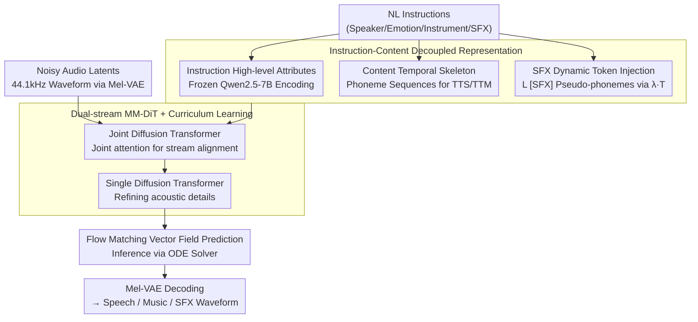

# UniSonate: A Unified Model for Speech, Music, and Sound Effect Generation with Text Instructions

**Conference**: ACL2026 Oral  
**arXiv**: [2604.22209](https://arxiv.org/abs/2604.22209)  
**Code**: No public code; Demo: https://qiangchunyu.github.io/UniSonate/  
**Area**: Audio & Speech  
**Keywords**: Unified Audio Generation, Text Instruction Control, Flow Matching, Dynamic SFX Tokens, MM-DiT

## TL;DR
UniSonate utilizes a unified Instruction-Content representation, dynamic SFX token injection, and multi-stage curriculum learning to integrate Text-to-Speech (TTS), Text-to-Music (TTM), and Text-to-Audio (TTA) into a single flow-matching MM-DiT. It achieves performance comparable to or exceeding specialized models in TTS and TTM while maintaining functional sound effect generation capabilities in TTA.

## Background & Motivation
**Background**: Audio generation has long been divided into specialized tasks. TTS focuses on speech naturalness, timbre, and phoneme alignment; TTM emphasizes lyrics, rhythm, instrumentation, and musical structure; TTA handles open-domain ambient sounds, events, and soundscapes. Powerful models exist for each, but input interfaces, control signals, and training data formats remain fragmented.

**Limitations of Prior Work**: Existing unified models often only cover speech and singing, or rely on reference audio for timbre control. Systems supporting multiple tasks often require different input formats, task labels, or subsequent fine-tuning. For a truly general audio generation model, a more natural user interface should be pure text instructions describing the speaker, emotion, instrument, atmosphere, or sound events.

**Key Challenge**: Speech and music are highly structured, typically possessing discrete temporal skeletons like phonemes, lyrics, and beats. In contrast, ambient sound effects (SFX) are more like continuous textures without natural token boundaries. Directly mixing TTS, TTM, and TTA data for training leads to negative transfer, where the high variance of unstructured SFX interferes with speech articulation and musical structure.

**Goal**: The authors aim for a single model that satisfies three criteria: unified generation of speech/music/sound effects, unified reference-free natural language instruction input, and fine-grained control across all three domains.

**Key Insight**: The paper decouples conditions into two semantic lines: Instruction and Content. Instructions handle high-level attributes (e.g., male voice, sad tone, jazz piano, footsteps on a street). Content handles temporal structure: phoneme/lyric sequences for speech and music, and dynamic-length learnable `[SFX]` tokens to provide a "pseudo-phoneme" skeleton for sound effects.

**Core Idea**: By symbolizing unstructured SFX with dynamic `[SFX]` tokens, sound effect generation is transformed into a sequence modeling problem within the same phoneme-driven Transformer. A curriculum learning strategy—from speech to music and then to sound effects—is employed to reduce cross-modal optimization conflicts.

## Method

### Overall Architecture

UniSonate unifies "Text → Speech/Music/SFX" into a conditional flow matching problem. Users provide only a natural language instruction, which the model uses to generate corresponding audio within a single network. The condition side is decoupled into two semantic lines: instructions are encoded by a frozen Qwen2.5-7B (capturing high-level attributes like "male voice" or "jazz piano"), and content provides the temporal skeleton (phoneme sequences for TTS/TTM, and learnable `[SFX]` tokens for SFX). On the audio side, a pre-trained Mel-VAE compresses 44.1kHz waveforms into continuous latents with a downsampling rate of 1024.

The architecture is a dual-stream MM-DiT: the Text Stream processes instruction-content conditions, and the Audio Stream processes noisy latents. The initial Joint Diffusion Transformer layers align the two streams via joint attention, allowing audio latents to attend to both global style and local structure tokens. The subsequent Single Diffusion Transformer layers refine acoustic details solely on the audio stream. Training involves learning the vector field from noise to real latents, while inference uses an ODE solver for integration followed by VAE decoding.

### Key Designs

**1. Instruction-Content Decoupled Representation: Unifying Tasks into a Single Condition Space**  
Unlike past unified models that used task labels, UniSonate accepts natural language instructions and projects different tasks into a unified "high-level instruction + temporal content" space. TTS content consists of text phonemes, and TTM involves lyric phonemes. This unifies the user interface to pure text while maintaining the necessary temporal structure for each task.

**2. Dynamic SFX Token Injection: Creating Temporal Skeletons for Unstructured SFX**  
Ambient sounds lack natural token boundaries. Rather than using a global duration prompt or a specialized branch, the authors estimate an average phoneme density $\lambda$ from speech data. For a target duration $T_{target}$, they generate $L_{sfx} = \lfloor \lambda \cdot T_{target} \rfloor$ `[SFX]` tokens. These act as temporal anchors traverses by cross-attention, effectively rewriting SFX as a "pseudo-linguistic sequence" for unified modeling and duration control.

**3. Dual-stream MM-DiT + Multi-stage Curriculum Learning: Cross-modal Data Integration**  
To prevent high-variance SFX from degrading speech and music structures, the model uses joint attention for deep text-audio interaction followed by audio-only refinement. Training follows a curriculum based on structural strength: starting with "speech anchoring" (aligning pronunciation and prosody), expanding to "speech + music" (introducing mid-to-long-term rhythm), and finally adding "sound effects" (expanding timbre and environmental coverage).

### Loss & Training
The objective is conditional flow matching. Given a clean latent $x_0$, noise $x_1$, time $t$, and text condition $C_{text}$, the model predicts a vector field $v_\theta(t, C_{text}, x_t)$ to approximate the velocity from $x_0$ to $x_1$. The 1.34B parameter MM-DiT consists of 14 Joint and 6 Single Diffusion Transformer layers with RoPE for temporal awareness. Data includes 50K hours of speech, 20K hours of music, and 1.5M SFX clips, all unified to 44.1kHz. Training was performed on 32 A800 GPUs using Adam with a learning rate of $1\text{e-}4$.

## Key Experimental Results

### Main Results
The authors evaluate TTS using WER, instruction accuracy, and MOS; TTM via SongEval and musicality MOS; and TTA using FAD, FD, and CLAP scores on AudioCaps.

| Task | Metric | Strong Baseline | UniSonate | Conclusion |
|------|--------|-----------------|-----------|------------|
| TTS (EN) | WER↓ | InstructAudio 1.52, ZipVoice 1.70 | 1.47 | Unified training improves intelligibility |
| TTS (ZH) | WER↓ | InstructAudio 1.35, F5-TTS 1.53 | 1.25 | Matching Ground Truth (1.25) |
| TTS Instruction | Dialogue accuracy↑ | InstructAudio 90.00 | 93.33 | Superior multi-speaker control |
| TTM | SongEval Coherence↑ | InstructAudio 3.08 | 3.18 | Highest musical consistency |
| TTM | Musicality MOS↑ | InstructAudio 2.91 | 3.01 | Best subjective musicality |
| TTA | FAD↓ | Stable Audio 4.19, GenAU-L 2.07 | 4.21 | Functional, but lags behind specialized SOTA |
| TTA | CLAP score | GenAU-L 0.300 | 0.156 | Text-audio alignment is not the strongest point |

### Ablation Study
Ablations comparison between single-task training and joint data training demonstrates positive transfer.

| Configuration | EN WER↓ | ZH WER↓ | Speaker Sim↑ | LSD↓ | MCD↓ |
|---------------|---------|---------|--------------|------|------|
| UniSonate (TTS-only data) | 2.24 | 1.40 | 0.63 | 2.63 | 8.70 |
| UniSonate (Joint data) | 1.47 | 1.25 | 0.77 | 1.79 | 5.46 |

| Configuration | Coherence↑ | Musicality↑ | Memorability↑ | Clarity↑ |
|---------------|------------|-------------|---------------|----------|
| UniSonate (TTM-only data) | 3.11 | 3.00 | 3.04 | 2.92 |
| UniSonate (Joint data) | 3.18 | 3.07 | 3.10 | 2.99 |

### Key Findings
- Joint training yields positive transfer for structured tasks: WER, pitch error, and SongEval scores improve compared to single-task training.
- Dynamic SFX tokens enable unified modeling, though UniSonate still lags behind GenAU-L in FAD metrics.
- Curriculum learning is essential; introducing high-variance SFX too early disrupts alignment mechanisms.

## Highlights & Insights
- Treating SFX as "pseudo-phoneme sequences without text" is a clever design for structural unification without specialized branches.
- The paper demonstrates positive transfer: SFX data increases acoustic diversity, making speech reconstruction more robust, while speech alignment skills transfer to music structure.
- The Instruction-Content decoupling is highly generalizable and could be applied to video or multimodal generation.
- A unified interface (NL instructions) is arguably more valuable than the model unification itself, as it removes the need for task-specific input formats.

## Limitations & Future Work
- SFX quality remains lower than specialized TTA models (FAD 4.21 vs. GenAU-L 2.07).
- Evaluation focused on 2–20s clips; long-form audio like audiobooks or complex soundscapes requires hierarchical planning.
- Text instructions suffer from one-to-many ambiguity; without reference cues, matching a user's exact mental sound is difficult.
- Inference costs for a 1.3B flow-matching model are high; real-time applications may need distillation or fewer sampling steps.

## Related Work & Insights
- **vs. InstructAudio**: UniSonate extends the instruction framework to SFX using dynamic tokens.
- **vs. CosyVoice / Vevo2**: Focuses on reference-free text instructions rather than audio prompting.
- **vs. AudioLDM / GenAU-L**: Specialized TTA models have higher fidelity in ambient textures, but UniSonate provides a single interface for all audio types.
- **vs. AudioBox / UniAudio**: UniSonate improves on these by aligning phoneme-driven structures with unstructured SFX.

## Rating
- Novelty: ⭐⭐⭐⭐☆ Dynamic SFX token injection is a clear and effective approach to unified modeling.
- Experimental Thoroughness: ⭐⭐⭐⭐☆ Strong across TTS and TTM; SFX evaluation could be more granular.
- Writing Quality: ⭐⭐⭐⭐☆ Clear motivation and logic; some TTA metrics could be explained more deeply.
- Value: ⭐⭐⭐⭐⭐ A significant reference for unifying diverse audio tasks via text instructions and structured tokens.

<!-- RELATED:START -->

## Related Papers

- [\[AAAI 2026\] USE: A Unified Model for Universal Sound Separation and Extraction](../../AAAI2026/audio_speech/use_a_unified_model_for_universal_sound_separation_and_extraction.md)
- [\[AAAI 2026\] DualSpeechLM: Towards Unified Speech Understanding and Generation via Dual Speech Token Modeling](../../AAAI2026/audio_speech/dualspeechlm_towards_unified_speech_understanding_and_generation_via_dual_speech.md)
- [\[ACL 2026\] FC-TTS: Style and Timbre Control in Zero-Shot Text-to-Speech with Disentangled Speech Representations](fc-tts_style_and_timbre_control_in_zero-shot_text-to-speech_with_disentangled_sp.md)
- [\[ICML 2026\] Attend to Anything: Foundation Model for Unified Human Attention Modeling](../../ICML2026/audio_speech/attend_to_anything_foundation_model_for_unified_human_attention_modeling.md)
- [\[ACL 2026\] Anchored Cyclic Generation: A Novel Paradigm for Long-Sequence Symbolic Music Generation](anchored_cyclic_generation_a_novel_paradigm_for_long-sequence_symbolic_music_gen.md)

<!-- RELATED:END -->
