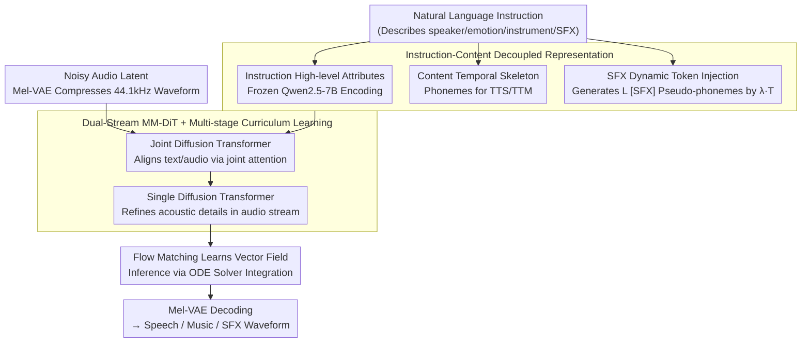

# UniSonate: A Unified Model for Speech, Music, and Sound Effect Generation with Text Instructions

**Conference**: ACL2026 Oral  
**arXiv**: [2604.22209](https://arxiv.org/abs/2604.22209)  
**Code**: No public code; Demo: https://qiangchunyu.github.io/UniSonate/  
**Area**: Audio & Speech  
**Keywords**: Unified audio generation, text instruction control, Flow Matching, dynamic SFX tokens, MM-DiT

## TL;DR
UniSonate integrates text-to-speech, text-to-music, and text-to-sound effects into a single flow-matching MM-DiT using a unified Instruction-Content representation, dynamic SFX token injection, and multi-stage curriculum learning. It achieves performance matching or exceeding specialized models in TTS and TTM while maintaining usable generation capabilities in TTA.

## Background & Motivation
**Background**: Audio generation has long been partitioned into specialized tasks. TTS focuses on speech naturalness, timbre, and phoneme alignment; TTM focuses on lyrics, rhythm, instruments, and musical structure; and TTA processes open-domain environmental sounds, events, and soundscapes. Strong models exist for each path, but input interfaces, control signals, and training data formats remain fragmented.

**Limitations of Prior Work**: Existing unified models often cover only speech and singing or depend on reference audio for timbre control. Systems supporting multiple tasks frequently require distinct input formats, task labels, or subsequent fine-tuning. For a truly general audio generation model, a more natural interface should be pure text instructions: describing the speaker, emotion, instrument, atmosphere, or sound event for direct generation.

**Key Challenge**: Speech and music are highly structured, typically possessing discrete temporal backbones like phonemes, lyrics, and beats. Environmental sound effects (SFX) are more akin to continuous textures without natural token boundaries. Directly mixing TTS, TTM, and TTA data for training results in the high variance of unstructured SFX interfering with speech articulation and musical structure, causing negative transfer.

**Goal**: The authors aim to satisfy three objectives within a single model: unified generation of speech/music/SFX, unified use of reference-free natural language instruction input, and fine-grained control across all three modalities.

**Key Insight**: The paper decouples conditions into two semantic lines: Instruction and Content. Instruction manages high-level attributes (e.g., male voice, sad tone, jazz piano, street footsteps), while Content manages temporal structure. TTS and TTM use phoneme/lyric sequences, whereas SFX utilizes dynamic-length learnable `[SFX]` tokens to fill the "pseudo-phoneme" backbone.

**Core Idea**: Use dynamic `[SFX]` tokens to symbolize unstructured sound effects, allowing SFX to be treated as a sequence modeling problem by the same phoneme-driven Transformer. Cross-modal optimization conflicts are reduced through curriculum learning progressing from speech to music and finally to sound effects.

## Method

### Overall Architecture

UniSonate unifies "Text $\rightarrow$ Speech/Music/SFX" into a conditional flow matching problem. Given only a natural language instruction, the model generates the corresponding audio within the same network. The condition side is decoupled into two semantic lines: instructions are encoded by a frozen Qwen2.5-7B to describe high-level attributes, while content provides the temporal skeleton. Content for TTS/TTM consists of phoneme sequences derived from text or lyrics, while SFX uses a sequence of learnable `[SFX]` tokens as "pseudo-phonemes." The audio side uses a pre-trained Mel-VAE to compress 44.1kHz waveforms into continuous latents with a downsampling rate of 1024.

The network is a dual-stream MM-DiT: the Text Stream processes instruction-content conditions, and the Audio Stream processes noisy latents. The initial Joint Diffusion Transformer layers align the two streams via joint attention, ensuring audio latents attend to both global style and local structural tokens. The subsequent Single Diffusion Transformer layers refine acoustic details solely on the audio stream. The training learns the vector field from noise to real latents, and inference is performed using an ODE solver followed by VAE decoding.

### Key Designs

**1. Instruction-Content Decoupled Representation: Projecting Arbitrary Audio Tasks to a Unified Condition Space**

Previous unified models mostly concatenated task labels to the input, requiring users to remember task-specific formats. UniSonate always accepts natural language instructions, which the model internally projects into a unified representation of "high-level instruction + temporal content." The instruction describes acoustic attributes, while content provides temporal anchors. TTS content consists of phonemes from the text, TTM uses phonemes from lyrics/vocals, and SFX utilizes special tokens described in the next section. This unifies the interface to pure text while retaining necessary temporal structures.

**2. Dynamic SFX Token Injection: Creating a temporal skeleton for unstructured sound effects**

Environmental sounds lack natural token boundaries. Using only a global duration hint makes it difficult to control internal progression, while adding a dedicated SFX branch would break the unified architecture. The authors propose estimating the average phoneme density $\lambda$ from speech data and generating $L_{sfx}=\lfloor \lambda \cdot T_{target} \rfloor$ `[SFX]` tokens based on the target duration. These repeated tokens serve as a series of temporal anchors traversed by cross-attention, effectively rewriting SFX as a "pseudo-linguistic sequence" for unified modeling and duration control.

**3. Dual-Stream MM-DiT + Multi-stage Curriculum Learning: Absorbing three data types without interference**

Mixing speech, music, and SFX directly during training causes the high variance of unstructured SFX to interfere with speech articulation and musical structure. Architecturally, joint attention enables deep interaction between text conditions and audio latents, followed by audio-only layers for quality refinement. Training follows a curriculum based on structural strength: starting with speech anchoring to stabilize alignment mechanisms, expanding to speech + music to introduce medium-to-long-term rhythmic structures, and finally adding high-variance sound effects to extend timbre and environmental coverage. This ensures stable alignment forms before accommodating noisier data.

### Loss & Training

The training objective is conditional flow matching: given clean latent $x_0$, noise $x_1$, time $t$, and text condition $C_{text}$, the model predicts the vector field $v_\theta(t, C_{text}, x_t)$ to approximate the velocity from $x_0$ to $x_1$. The specific model is a 1.34B parameter MM-DiT with 14 Joint Diffusion Transformer layers and 6 Single Diffusion Transformer layers, using RoPE for temporal position awareness. Data includes 50K hours of speech, 20K hours of music, and 1.5M SFX clips, unified to 44.1kHz, 2–20 second segments, trained on 32 A800 80GB GPUs using Adam with an initial learning rate of $1\text{e-}4$.

## Key Experimental Results

### Main Results
The authors evaluate TTS, TTM, and TTA. TTS uses Seed-TTS WER, instruction control accuracy, similarity, and MOS; TTM uses SongEval, control accuracy, and musicality MOS; TTA uses FAD, FD, IS, and CLAP scores on AudioCaps.

| Task | Metric | Strong Baselines | UniSonate | Conclusion |
|------|------|--------|-----------|------|
| TTS English | WER↓ | InstructAudio 1.52, ZipVoice 1.70 | 1.47 | Unified training did not dilute intelligibility; achieved best result |
| TTS Chinese | WER↓ | InstructAudio 1.35, F5-TTS 1.53 | 1.25 | Matched Ground Truth 1.25 |
| TTS Instruction | Dialogue accuracy↑ | InstructAudio 90.00, CosyVoice2 N/A | 93.33 | Stronger multi-speaker dialogue control |
| TTM | SongEval Coherence↑ | ACE-Step 2.89, InstructAudio 3.08 | 3.18 | Highest musical structure consistency |
| TTM | Musicality MOS↑ | ACE-Step 2.88, InstructAudio 2.91 | 3.01 | Best subjective musicality |
| TTA | FAD↓ | AudioLDM-L 4.32, Stable Audio 4.19, GenAU-L 2.07 | 4.21 | Close to some TTA baselines but behind specialized SOTA |
| TTA | CLAP score | AudioLDM-L 0.208, GenAU-L 0.300 | 0.156 | Text-audio alignment is not the strongest suit |

### Ablation Study
The critical ablation compares single-task data training vs. joint data training within the same architecture to verify positive transfer.

| Configuration | EN WER↓ | ZH WER↓ | Speaker Sim↑ | LSD↓ | MCD↓ | MSEP↓ | MR↓ |
|------|---------|---------|--------------|------|------|-------|-----|
| UniSonate (TTS-only data) | 2.24 | 1.40 | 0.63 | 2.63 | 8.70 | 574.67 | 0.426 |
| UniSonate (Joint data) | 1.47 | 1.25 | 0.77 | 1.79 | 5.46 | 422.36 | 0.31 |

| Configuration | Coh↑ | Mus↑ | Mem↑ | Cla↑ | Nat↑ | Description |
|------|------|------|------|------|------|------|
| UniSonate (TTM-only data) | 3.11 | 3.00 | 3.04 | 2.92 | 2.84 | Trained only on music data |
| UniSonate (Joint data) | 3.18 | 3.07 | 3.10 | 2.99 | 2.90 | Comprehensive improvement after adding speech and SFX |

### Key Findings
- Joint training produces positive transfer for structured tasks: speech WER, spectral distortion, pitch error, and SongEval metrics for music all surpass single-task training.
- The value of dynamic SFX tokens lies in "accessibility" rather than directly defeating specialized TTA models: UniSonate unifies SFX generation, but lags significantly behind GenAU-L in FAD.
- Curriculum learning is essential: introducing high-variance environmental sounds early disrupts speech pronunciation and musical structure. Establishing speech alignment first is more effective.

## Highlights & Insights
- The most elegant design is treating SFX as "pseudo-phoneme sequences without text." This is more unified than a separate branch and provides better temporal anchors than duration tokens.
- The paper emphasizes positive transfer: SFX does not hinder speech but increases acoustic diversity, making speech reconstruction more robust; strong speech alignment training also transfers to musical structure.
- Instruction-Content decoupling has strong transferability. Similar logic could apply to video or multimodal generation: instructions for high-level attributes, content tokens for temporal/spatial skeletons.
- A unified interface is more important than a unified model. If users must remember different formats, the practical value of model unification is limited; UniSonate unifies the interface to natural language instructions.

## Limitations & Future Work
- SFX quality remains inferior to specialized TTA models (FAD 4.21 vs. GenAU-L 2.07), indicating unified representations do not yet fully cover diverse environmental textures.
- Training and evaluation focus on 2-20s clips; long songs, dialogues, or complex soundscapes require hierarchical planning mechanisms.
- Pure text instructions are inherently ambiguous (e.g., "sad song" or "deep male voice"); matching a user's exact mental model is difficult without reference cues.
- The 1.3B diffusion model has high inference costs; real-time TTS or interactive design requires distillation or fewer-step sampling.
- High-fidelity generation poses risks of deepfakes and copyright infringement, requiring watermarking and usage restrictions.

## Related Work & Insights
- **vs InstructAudio**: InstructAudio uses instructions for speech and music but lacks SFX; UniSonate extends this using dynamic `[SFX]` tokens.
- **vs CosyVoice / Vevo2**: These models excel in speech/singing quality but rely on reference audio or limited tasks; UniSonate emphasizes reference-free text and multimodal unification.
- **vs AudioLDM / GenAU-L**: Specialized TTA models have better fidelity (especially GenAU-L); UniSonate's advantage is single-model coverage across speech/music/SFX.
- **vs AudioBox / UniAudio**: These proved unified generation is feasible; UniSonate's contribution is aligning phoneme-driven structures with unstructured SFX.

## Rating
- Novelty: ⭐⭐⭐⭐☆ Dynamic SFX token injection is a clean approach to unified modeling; architecture builds effectively on MM-DiT.
- Experimental Thoroughness: ⭐⭐⭐⭐☆ Excellent coverage of TTS and TTM, though human evaluation and SFX fine-grained control could be more extensive.
- Writing Quality: ⭐⭐⭐⭐☆ Clear motivation and methodology; some tables are crowded and TTA metric explanations are brief.
- Value: ⭐⭐⭐⭐⭐ Highly insightful for general audio generation, especially as a framework for unifying multi-audio tasks via instructions and structural tokens.

<!-- RELATED:START -->

## Related Papers

- [\[AAAI 2026\] USE: A Unified Model for Universal Sound Separation and Extraction](../../AAAI2026/audio_speech/use_a_unified_model_for_universal_sound_separation_and_extraction.md)
- [\[CVPR 2026\] Omni2Sound: Towards Unified Video-Text-to-Audio Generation](../../CVPR2026/audio_speech/omni2sound_towards_unified_video-text-to-audio_generation.md)
- [\[AAAI 2026\] DualSpeechLM: Towards Unified Speech Understanding and Generation via Dual Speech Token Modeling](../../AAAI2026/audio_speech/dualspeechlm_towards_unified_speech_understanding_and_generation_via_dual_speech.md)
- [\[ACL 2026\] Anchored Cyclic Generation: A Novel Paradigm for Long-Sequence Symbolic Music Generation](anchored_cyclic_generation_a_novel_paradigm_for_long-sequence_symbolic_music_gen.md)
- [\[ACL 2026\] FC-TTS: Style and Timbre Control in Zero-Shot Text-to-Speech with Disentangled Speech Representations](fc-tts_style_and_timbre_control_in_zero-shot_text-to-speech_with_disentangled_sp.md)

<!-- RELATED:END -->
