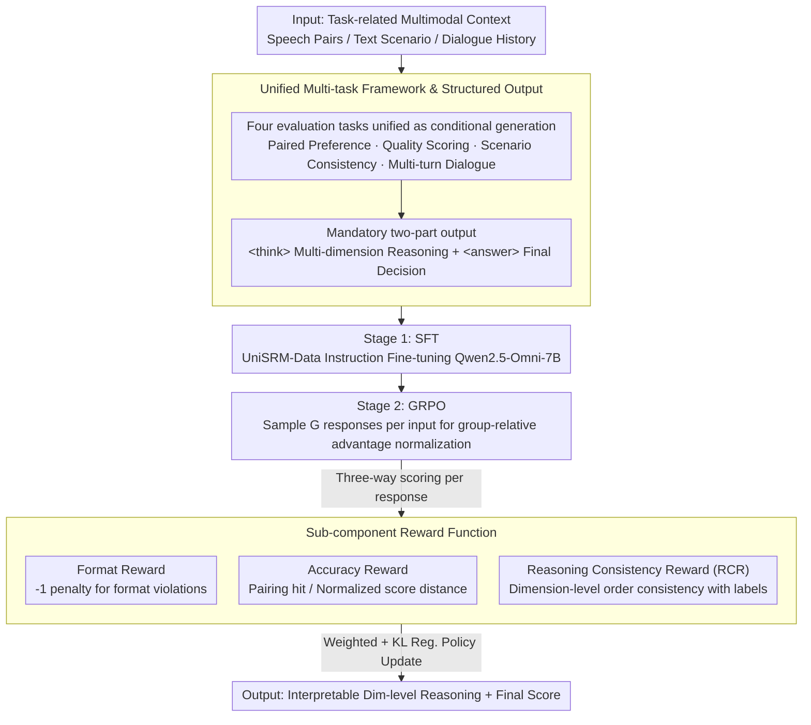

# UniSRM: A Unified Speech Reward Model for Fine-Grained Speech Evaluation

**Conference**: ACL 2026  
**arXiv**: [2605.23261](https://arxiv.org/abs/2605.23261)  
**Code**: https://github.com/lavendery/UniSRM  
**Area**: Speech Evaluation / Reward Model  
**Keywords**: Speech Reward Model, Multi-dimensional Evaluation, Reasoning Consistency, Speech Synthesis Evaluation

## TL;DR
This paper proposes UniSRM, a unified speech reward model. Through two-stage training (SFT + GRPO) and a Reasoning Consistency Reward (RCR) mechanism, it supports multi-dimensional, interpretable speech evaluation ranging from utterance-level quality to dialogue-level coherence, significantly outperforming existing methods across multiple evaluation tasks.

## Background & Motivation

**Background**: Speech generation quality evaluation has long relied on Mean Opinion Scores (MOS), which are costly, subjective, and difficult to scale. Recent research has begun exploring the use of Large Audio-Language Models (LALMs) as automatic scorers, such as WavReward, SageLM, and SpeechJudge.

**Limitations of Prior Work**: (1) Existing methods cover limited tasks—most only handle utterance-level quality or single-turn dialogues, neglecting multi-turn interactions and contextual consistency; (2) Evaluation dimensions are incomplete—certain methods omit critical metrics like speaker similarity; (3) The reasoning process is uncontrollable—rule-based RL provides insufficient supervision for reasoning steps, leading to inconsistencies between generated rationales and final decisions; (4) Scoring lacks transparency—traditional metrics (WER, SIM, UTMOS) each capture only a single aspect.

**Key Challenge**: The contradiction between the diversity of speech evaluation tasks (from isolated utterances to dialogue contexts) and the single-adapter nature of existing reward models; the tension between the freedom of rationale generation and the accuracy of final scoring.

**Goal**: To construct a unified reward model capable of (1) supporting diverse speech evaluation tasks; (2) outputting interpretable multi-dimensional scores and reasoning processes; (3) ensuring consistency between reasoning and final decisions.

**Key Insight**: It was observed that existing LLM-based scorers perform poorly when integrating text or multi-turn dialogue context—this suggests that improvements can be made through superior training strategies and reasoning supervision. Furthermore, multi-dimensional decomposition of the evaluation process aligns with the intuitive logic of human scoring.

**Core Idea**: Replace the pure end-to-end fine-tuning paradigm with a "staged training + reasoning consistency reward" approach, providing explicit supervision for the model to generate dimension-level intermediate reasoning, thereby improving overall reliability.

## Method

### Overall Architecture

UniSRM treats "multi-dimensional scoring of a speech segment (or pair)" as a generative reward model that performs reasoning before reaching a conclusion, trained in two stages. The first stage (SFT) involves instruction fine-tuning Qwen2.5-Omni-7B-thinker on the unified UniSRM-Data, teaching it to output dimension-level scores and reasoning in a structured format. The second stage utilizes Group Relative Policy Optimization (GRPO), introducing a Reasoning Consistency Reward (RCR) to further align model predictions with human preferences. The input is task-related multimodal context, and the output is fixed into two parts: dimension-by-dimension reasoning within `<think>` tags, and the final decision (binary preference or MOS-like score) within `<answer>` tags.

### Key Designs

**1. Unified Multi-task Framework & Structured Output: One model for four evaluation tasks**

UniSRM processes four complementary tasks within a single model: utterance-level paired preference, utterance-level quality scoring, scenario-aware style consistency with text context, and multi-turn dialogue evaluation. By unifying all tasks into a conditional generation problem, the system prompt enforces a two-part structure (reasoning + answer). Different tasks only vary in the answer format (binary decision vs. multi-dimensional score vector), while the reasoning part consistently includes task-related dimension-level scores. This unified format enables the model to learn general evaluation capabilities across tasks and allows RL to penalize format violations.

**2. Sub-component Reward Function: Format, Accuracy, and Consistency**

The final reward during the GRPO stage is a weighted sum of three terms: $R(x,o) = \lambda_{\text{fmt}}R_{\text{fmt}}(o) + \lambda_{\text{acc}}R_{\text{acc}}(o) + \lambda_{\text{rc}}R_{\text{rc}}(o)$. The format reward applies a $-1$ penalty for non-compliant outputs. The accuracy reward uses $\mathbf{1}[y^{(g)} = y^{\star}]$ for pairing tasks and normalized distance for quality scoring. The consistency reward is the RCR detailed below. These components constrain the model in terms of "format compliance, answer correctness, and reasoning self-consistency."

**3. Reasoning Consistency Reward (RCR): Forcing "Process-wide Self-consistency"**

RCR is the most critical component and the core contribution of this work. Pure result-based accuracy rewards can induce models to take shortcuts—making correct final predictions despite self-contradictory intermediate dimension scores, rendering interpretability meaningless. RCR directly constrains intermediate steps: for pairing tasks, it calculates dimension-level consistency $R_{\text{rc}}(o) = \frac{1}{D}\sum_{i=1}^{D}\mathbf{1}[\text{sign}(a_i - b_i) = \text{sign}(a_i^{\star} - b_i^{\star})]$, requiring the relative order of samples in each dimension to match the labels. For quality scoring, normalized multi-dimensional error is used. By shifting the optimization goal from "correct last step" to "logical consistency at every dimension," the potential for "cheating" is significantly reduced.

### Loss & Training

The SFT stage uses the standard autoregressive maximum likelihood objective. In the GRPO stage, $G$ responses are sampled from the current policy for each input $x$, using the group mean and standard deviation for advantage normalization: $A^{(g)} = (R^{(g)} - \mu(x))/(\sigma(x) + \epsilon)$, followed by updates using a clipped policy gradient objective with KL regularization.

## Key Experimental Results

### Main Results

| Model | Task 1 (Pairing) | Task 2 (Quality Score) | Task 3-EN (Scenario) | Task 3-CN | Task 4 (Dialogue) |
|------|-------------|----------------|-----------------|---------|------------|
| WER / SIM / UTMOS / DNSMOS | 59.24–84.10 | 0.274–0.449 | 33.21–61.44 | 48.19–63.04 | 40.48–50.79 |
| GPT-4o-Audio | 61.04 | 0.060 | 64.02 | 64.82 | 71.96 |
| Gemini-2.5-Flash | 60.44 | 0.522 | 65.68 | 71.74 | 71.43 |
| **UniSRM (Ours)** | **65.06** | **0.551** | **85.61** | **91.30** | **88.89** |

UniSRM achieves optimal performance across all tasks, particularly in tasks requiring integration of text or dialogue context (Tasks 3 and 4), where it shows gains of over 20 percentage points compared to the strongest baselines.

### Ablation Study

| Configuration | Task 1 | Task 2 | Task 3-EN | Task 3-CN | Task 4 |
|------|------|------|--------|--------|------|
| SFT Only (w/o GRPO) | 60.24 | 39.20 | 67.16 | 70.95 | 74.60 |
| GRPO without RCR | 60.44 | 37.58 | 80.81 | 81.42 | 82.54 |
| **UniSRM Full** | **65.06** | **39.74** | **85.61** | **91.30** | **88.89** |

**Key Findings**: (1) Adding GRPO consistently improves performance over pure SFT; (2) The inclusion of RCR generally brings further improvements, with a maximum gain of 8.88 percentage points (Task 4); (3) **Counter-intuitive phenomenon**: GRPO without RCR performed worse than SFT in certain dimensions, indicating that pure accuracy rewards encourage "shortcuts," which RCR effectively prevents via dimension-level supervision.

### Cross-dataset Generalization

| Dataset | Metric | DNSMOS | Gemini-2.5-Pro | **UniSRM** |
|--------|------|--------|----------------|-----------|
| BVCC | PCC | 0.299 | 0.339 | **0.498** |
| SOMOS-Clean | PCC | 0.048 | 0.250 | **0.261** |
| SOMOS-Full | PCC | 0.053 | 0.222 | **0.235** |

On external human-annotated datasets (BVCC, SOMOS), UniSRM demonstrates strong cross-domain capability, indicating that the model has learned genuine evaluation skills rather than over-fitting to LLM-generated labels.

## Highlights & Insights

- **Ingenious RCR Design**: RCR does not simply penalize errors but enforces "logical self-consistency" at the dimension level by ensuring consistent relative comparisons. This constraint shifts optimization from "final-step correctness" to "process-wide rationality," reducing the model's room for "cheating."
- **Synergy of Unified Data and Multi-task Learning**: Diverse tasks are unified into a "multi-dimensional reasoning + structured answer" format through UniSRM-Data, enabling a single model to acquire general evaluation capabilities across different scenarios.
- **SFT and GRPO Collaboration**: SFT teaches the model to imitate the rationales and decisions of annotators, while GRPO improves final accuracy and enhances reasoning diversity and interpretability through group sampling.

## Limitations & Future Work

**Limitations**: (1) Current benchmarks have limited coverage of difficult scenarios such as heavy accents or overlapping speech; (2) High computational costs for training and inference limit scalability and low-latency deployment.

**Self-identified Limitations**: (1) Fixed evaluation dimensions may not adapt to emerging applications (e.g., multilingual mixing, specific character accents); (2) Reliance on LLM-generated labels in data sourcing—while cross-dataset generalization is proven, LLM systematic biases might be implicitly imported.

**Future Work**: (1) Explore distillation strategies to make UniSRM lightweight; (2) Introduce active learning to prioritize annotating high-uncertainty samples; (3) Research adaptive dimension selection.

## Related Work & Insights

- **vs. WavReward / SageLM**: These methods focus on single-turn or utterance-level evaluation and often use rule-based RL. UniSRM covers richer task scenarios and explicitly constrains dimension-level consistency via RCR.
- **vs. SpeechJudge**: While the latter generates rationales, it targets the utterance level with limited dimensions. UniSRM extends this to dialogue-level evaluation.
- **vs. QualiSpeech / AudioJudge**: These focus on low-level quality features, whereas UniSRM incorporates high-level, context-aware evaluation.

## Rating

- **Novelty**: ⭐⭐⭐⭐⭐ The RCR design is an innovative improvement for multi-step reasoning evaluation. The unified framework is comprehensive and executed at the state-of-the-art level.
- **Experimental Thoroughness**: ⭐⭐⭐⭐⭐ Includes 4 complementary tasks, 3 levels of ablation, fine-grained dimension analysis, and cross-dataset validation.
- **Writing Quality**: ⭐⭐⭐⭐ Logical and well-motivated, though discussions on the trade-off between computational cost and practicality are slightly brief.
- **Value**: ⭐⭐⭐⭐⭐ Provides a reusable paradigm and open dataset for speech generation reward modeling, contributing significantly to the speech RLHF ecosystem.

<!-- RELATED:START -->

## Related Papers

- [\[ACL 2026\] UniVocal：统一的语音-歌唱代码混用合成](univocal_unified_speech-singing_code-switching_synthesis.md)
- [\[ACL 2026\] VoxMind: An End-to-End Agentic Spoken Dialogue System](voxmind_an_end-to-end_agentic_spoken_dialogue_system.md)
- [\[ACL 2026\] Music Audio-Visual Question Answering Requires Specialized Multimodal Designs](music_audio-visual_question_answering_requires_specialized_multimodal_designs.md)
- [\[ACL 2026\] Analyzing Reasoning Shifts in Audio Deepfake Detection under Adversarial Attacks: The Reasoning Tax versus Shield Bifurcation](analyzing_reasoning_shifts_in_audio_deepfake_detection_under_adversarial_attacks.md)
- [\[ACL 2026\] Mind the Pause: Disfluency-Aware Objective Tuning for Multilingual Speech Correction with LLMs](mind_the_pause_disfluency-aware_objective_tuning_for_multilingual_speech_correct.md)

<!-- RELATED:END -->
