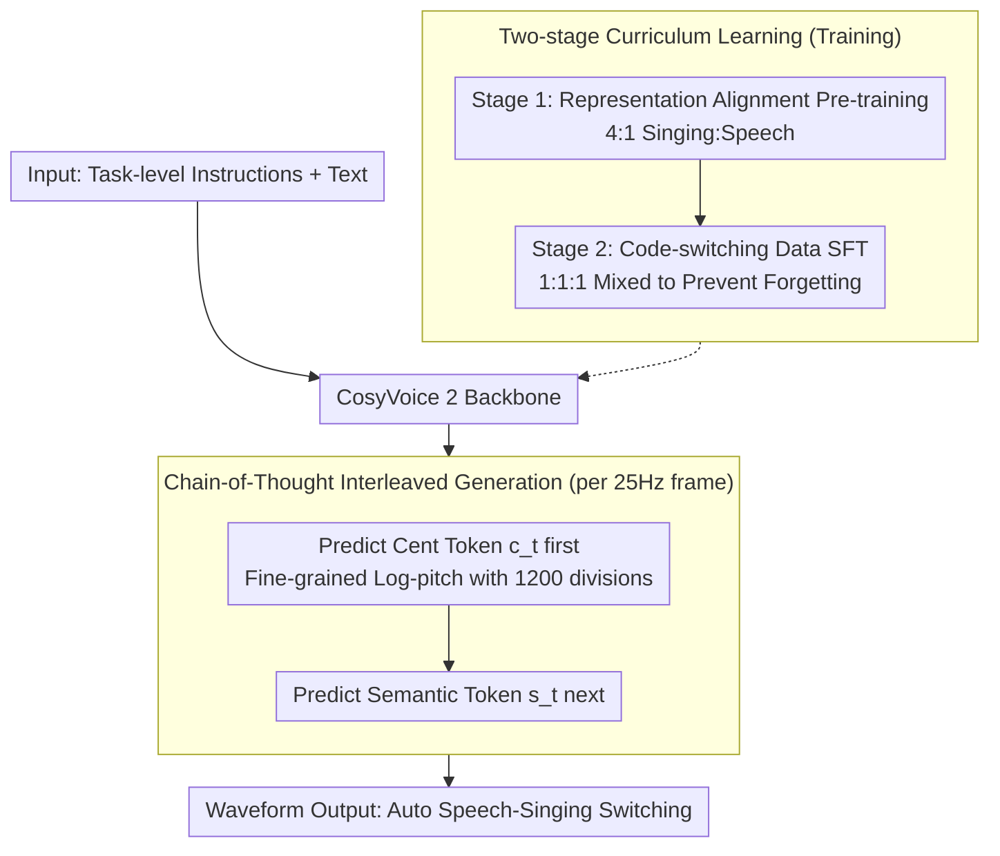

# UniVocal: Unified Speech-Singing Code-Mixed Synthesis

**Conference**: ACL 2026  
**arXiv**: [2606.01677](https://arxiv.org/abs/2606.01677)  
**Code**: https://github.com/FunAudioLLM/FunResearch/tree/main/UniVocal  
**Area**: Speech-Singing Synthesis / Multi-modal Audio Generation  
**Keywords**: Speech-Singing Code-Mixing, Chain-of-Thought Generation, Fine-grained Pitch Representation

## TL;DR
UniVocal achieves SOTA performance on the newly constructed SCSBench benchmark by utilizing fine-grained cent tokens and two-stage curriculum learning, enabling the model to automatically infer speech/singing switching points from raw text semantics without explicit labels.

## Background & Motivation

**Background**: Text-to-Speech (TTS), Singing Voice Synthesis (SVS), and music generation focus on individual domains but struggle to collaborate. Conventional solutions either generate a single mode or require manual control over transitions using explicit labels (e.g., `<sing>`/`<speech>`).

**Limitations of Prior Work**: Humans naturally mix speech and singing in daily communication—humming a melody during a conversation or using songs to assist memory. Existing systems fail to capture this *automatic semantics-based switching*. While systems like Bark attempt mixed-mode generation, they rely on explicit labels and lack semantic awareness, leading to unstable transitions.

**Key Challenge**: TTS lacks melodic expressiveness, while SVS is constrained by musical rules and scores. The implicit representation spaces of both differ significantly, causing learning failures when directly mixed. Furthermore, semantic tokenizers discard fine-grained pitch information, making it impossible to accurately model intonation and melody.

**Goal**: To define the "Speech-Singing Code-Mixed (SCS) Synthesis" task, enabling the model to: (1) infer when to speak and when to sing from raw text; (2) transition smoothly between modes; and (3) maintain speaker identity consistency.

**Key Insight**: A two-stage curriculum learning approach is adopted—first aligning the implicit representation spaces of both modes, then learning semantic trigger mechanisms on synthetic data. Simultaneously, a high-resolution pitch representation (fine-grained cent tokens) is introduced as a structural constraint for "plan-then-generate" synthesis.

**Core Idea**: Use 1200-division fine-grained cent tokens to explicitly supplement pitch information lost by the semantic tokenizer. Supplemented by Chain-of-Thought (CoT) generation, the model is forced to pre-plan a musical/tonal framework before generating content. This design enhances melodic precision and inadvertently stimulates the model's textual empathy capability.

## Method

### Overall Architecture

UniVocal uses CosyVoice 2 as its backbone, framing "Speech-Singing Code-Mixed Synthesis" as a unified framework that automatically infers switching points from raw text. Inputs consist of task-level natural language instructions (e.g., "Generate a podcast" or "Generate a song") and the target text. The output consists of a sequence of fine-grained cent tokens, followed by semantic tokens, and finally the waveform. The core mechanism is interleaved CoT generation: at each 25Hz frame, the model predicts the pitch first, then the content, decomposing the process into "pitch trajectory planning" and "semantic filling." The ability to learn switching points from raw text is achieved via two-stage curriculum learning—aligning speech/singing representations before learning semantic triggers on synthetic code-mixed data.

### Key Designs

**1. Fine-grained Cent Tokens: Recovering Pitch Lost by Semantic Tokenizers**

Conventional semantic tokenizers discard fine-grained pitch, leading to flat intonation and distorted melodies. UniVocal adopts a log-frequency representation relative to 440Hz, quantizing pitch within a single octave: first calculating $f_{cent}=1200 \log_2(f_{Hz}/440)$, then mapping it to tokens $I(f_{cent})=\lceil f_{cent} \bmod 1200 \rceil$, with silent regions marked as -1. The modulo 1200 operation maps the human vocal range across multiple octaves into a unified token space. The 1200-cent resolution is far more precise than 12 semitones and more controllable than raw F0, with a maximum quantization error of approximately 1 cent (0.08% frequency deviation), making it perceptually near-lossless.

**2. Chain-of-Thought Interleaved Generation: Plan Pitch Before Lyrics**

To prevent conflict between semantic and musical objectives, UniVocal forces the model to output a cent token before a semantic token at each timestep. The CosyVoice 2 vocabulary is expanded with 1201 cent tokens (1200 values + 1 silence), with independently initialized embeddings. The joint probability is decomposed as $P(\mathbf{Y}|\mathbf{X})=\prod_t P(c_t|\mathbf{X},\mathbf{Y}_{<t}) \cdot P(s_t|\mathbf{X},\mathbf{Y}_{<t},c_t)$, where $c_t$ and $s_t$ are cent and semantic tokens, respectively. During inference, logit masking enforces this order. The model must plan the overall pitch contour (e.g., low-to-high tones) before generating specific lexical details. A correlation coefficient of $\rho=0.679$ confirms that cent tokens act as structural planners.

**3. Two-stage Curriculum Learning: Aligning Modes then Triggering Switches**

Implicit representation distributions for speech and singing differ vastly, making convergence difficult when training on mixed data (a single-stage variant saw F1 drop to 0.496). Thus, a two-step approach is used: Stage 1 involves continued pre-training on aligned data with a 4:1 singing-to-speech ratio to stabilize individual modes; Stage 2 performs Supervised Fine-Tuning (SFT) on synthetic code-mixed data, mixing code-mixed, speech, and singing data at a 1:1:1 ratio to prevent catastrophic forgetting. Aligning the representation space is a prerequisite for achieving the "automatic switching via text semantics" capability.

### Loss & Training

Since code-mixed data is naturally scarce, UniVocal generates its training set via a three-step pipeline. First, Gemini 2.5 Pro generates "fuzzy boundary" scripts (monologues, podcasts, audiobooks) containing both implicit triggers (prose for speech, lyrics for singing) and explicit triggers (e.g., "that reminds me of a song"). Second, Stage 1 models synthesize all fragments; speech segments are conditioned on 9 emotion reference audios from Expresso to maintain consistency, while singing segments are conditioned only on speaker embeddings to stabilize timbre. Finally, Whisper-v3 calculates WER for quality filtering, discarding samples with WER $\geq 20\%$ and retaining the 10–20% range to increase diversity. This yielded 11,769 samples (262 hours). Training took 5 days for Stage 1 and 1 day for Stage 2 on 4 A800 GPUs.

## Key Experimental Results

### Main Results

| Model | SCSBench-Implicit F1(O) | F1(S) | SCSBench-Explicit F1(O) | F1(S) | SCSBench-Mixed F1(O) | F1(S) |
|------|---|---|---|---|---|---|
| Gemini + Bark | 0.414 | 0.142 | 0.533 | 0.250 | 0.465 | 0.199 |
| Gemini + Cosy2 + LeVo | 0.752 | 0.685 | 0.572 | 0.489 | 0.607 | 0.566 |
| **UniVocal** | **0.626** | **0.595** | **0.714** | **0.635** | **0.871** | **0.810** |

In mixed scenarios (both implicit and explicit triggers), UniVocal achieves SOTA in both Objective F1 and Whisper F1. It also maintains the lowest WER (5.83-10.90%) and the highest UTMOS (4.36).

### Ablation Study

| Variant | Empathy E-MOS | P-MOS | Singing Naturalness N-MOS | M-MOS | Switch Accuracy SCS F1 |
|---------|--------------|-------|-----------------|-------|-----------------|
| UniVocal (Full) | 2.26 | 2.22 | 2.23 | 2.18 | 0.716 |
| w/o CoT | 2.03 | 1.84 | 2.20 | 1.86 | 0.810 |
| w/o CL | 2.24 | 2.23 | 2.29 | 2.17 | 0.496 |

Removing CoT improves switching stability (F1 $\rightarrow$ 0.810) at the cost of significantly reduced expressiveness. Removing curriculum learning causes the switching capability to collapse (F1 $\rightarrow$ 0.496).

### Key Findings

- **Crucial Role of Explicit Triggers**: Samples containing trigger phrases like "let me sing" show significantly higher switching accuracy.
- **Humming Anomalies**: Humming, which lacks semantic content but has unique textual forms (e.g., "mm-mm"), performs well as a "strong implicit trigger."
- **Superior Speaker Consistency**: While global speaker similarity is slightly lower (0.65), intra-sentence consistency is significantly higher than cascaded baselines when measured across temporal segments.
- **Real-time Performance**: Training on 4 A800 GPUs took 5 days for Stage 1 and 1 day for Stage 2, totaling 6 days.

## Highlights & Insights

- **"Plan $\rightarrow$ Generate" Causal Chain**: CoT interleaved generation allows the model to explicitly model the pitch trajectory before filling in lexical tokens, breaking the "black box" of traditional end-to-end generation. Correlation analysis ($\rho=0.679$) validates that cent tokens serve as structural planners.
- **Data Synthesis Paradigm**: The closed-loop pipeline—using LLMs for semantically coherent code-mixed scripts, two-stage model synthesis, and quality filtering—ensures naturalness while avoiding manual annotation.
- **Hidden Gain—Textual Empathy**: The CoT mechanism, originally introduced to enhance musical modeling, unexpectedly stimulated the model's emotional expressiveness (E-MOS +0.48 vs. baseline).
- **Cascaded vs. Unified Trade-off**: Cascaded systems show higher global similarity but significant intra-sentence timbre drift; UniVocal shows stronger overall consistency despite slightly lower global metrics.

## Limitations & Future Work

**Limitations acknowledged by the authors**:
1. Synthetic singing data is limited by source separation and ASR tools, resulting in robotic artifacts and lyric alignment errors.
2. Distribution gaps exist between synthetic training data and complex real-world scenarios; pure implicit switching remains insufficiently robust.
3. F1 evaluation often results in binary outcomes for single short samples, leading to limited sample-level correlation.

**Self-identified limitations**:
- Generalization to "real-world" scenarios is limited (Raw Real SCS F1=0.201), requiring explicit triggers to recover performance.
- The 4:1 singing-to-speech ratio in curriculum learning was manually tuned; a systematic search for the optimal ratio is missing.

**Future Directions**: Collect high-quality real singing data; explore finer-grained semantic understanding as supplementary triggers for implicit switching; extend the CoT mechanism to other multi-constraint generation tasks.

## Related Work & Insights

- **vs. Bark (Mixed-mode Generation)**: Bark relies on explicit labels and exhibits unstable transitions. UniVocal infers switches from text semantics with higher stability (F1 0.871 vs. 0.465).
- **vs. UniSyn/UniAudio (Unified Audio Generation)**: While these support multiple tasks, they only generate single modes and do not support intra-sequence switching. UniVocal is specifically optimized for mixed generation.
- **vs. Vevo2 (Unified Acoustic Modeling)**: Vevo2 uses chromagram tokens for acoustic modeling (12-semitone resolution) and requires reference audio to determine the mode. UniVocal uses 1200-division cent tokens and infers from raw text, providing finer granularity and fewer input requirements.
- **Insight**: Explicit pitch modeling is vital for multi-modal acoustic generation; the "plan-then-generate" CoT paradigm can be generalized to other generation tasks governed by multiple constraints.

## Rating

- Novelty: ⭐⭐⭐⭐⭐ First to define and solve automatic speech-singing code-mixing, introducing the combination of fine-grained cent tokens and CoT generation.
- Experimental Thoroughness: ⭐⭐⭐⭐ Constructed the SCSBench benchmark covering implicit/explicit/mixed scenarios; comprehensive ablation; though sample-level correlation is limited, system-level validation is robust.
- Writing Quality: ⭐⭐⭐⭐⭐ Clear logic, well-motivated, complete methodological detail, and rich appendices.
- Value: ⭐⭐⭐⭐ First realization of automatic speech-singing transitions in an end-to-end framework; academic novelty with high application potential; all code and data are open-sourced.

<!-- RELATED:START -->

## Related Papers

- [\[ACL 2026\] UniSRM：用于细粒度语音评估的统一语音奖励模型](unisrm_a_unified_speech_reward_model_for_reasoning-based_fine-grained_assessment.md)
- [\[ACL 2026\] An Exploration of Mamba for Speech Self-Supervised Models](an_exploration_of_mamba_for_speech_self-supervised_models.md)
- [\[ACL 2026\] SpeechLLM-as-Judges: Towards General and Interpretable Speech Quality Evaluation](speechllm-as-judges_towards_general_and_interpretable_speech_quality_evaluation.md)
- [\[ACL 2026\] Data-efficient Targeted Token-level Preference Optimization for LLM-based Text-to-Speech](data-efficient_targeted_token-level_preference_optimization_for_llm-based_text-t.md)
- [\[ACL 2026\] Mind the Pause: Disfluency-Aware Objective Tuning for Multilingual Speech Correction with LLMs](mind_the_pause_disfluency-aware_objective_tuning_for_multilingual_speech_correct.md)

<!-- RELATED:END -->
