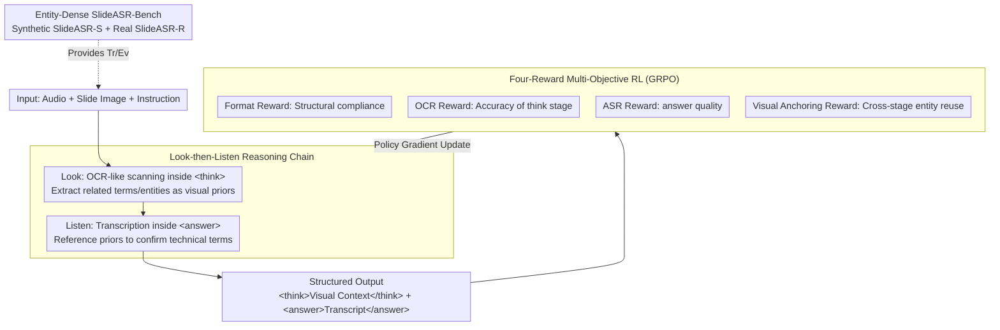

# VAPO: End-to-end Slide-Enhanced Speech Recognition with Omni-modal Large Language Models

**Conference**: ACL2026  
**arXiv**: [2510.08618](https://arxiv.org/abs/2510.08618)  
**Code**: https://github.com/isruihu/SlideASR-Bench  
**Area**: Reinforcement Learning  
**Keywords**: Omni-modal Large Language Models, Slide-enhanced Speech Recognition, Reinforcement Learning, Visual Anchoring, Contextual ASR  

## TL;DR
This paper discovers that end-to-end Omni-modal Large Language Models (OLLMs) tend to miscopy slide text as speech content when performing SlideASR. It proposes VAPO, which utilizes a "Look-then-Listen" structured reasoning chain and multi-objective reinforcement learning to transform slide text into semantic anchors for speech recognition rather than sources of interference.

## Background & Motivation
**Background**: Traditional ASR has achieved high performance on general speech but remains prone to missing domain terms, rare entities, and proprietary nouns in academic reports, technical demonstrations, and professional lectures. Slides typically contain these keywords, leading SlideASR to use slide images as visual context to enhance transcription.

**Limitations of Prior Work**: Current mainstream SlideASR methods mostly adopt a pipeline approach: first extracting slide text via OCR, then selecting keywords, and finally feeding this text as context to an audio-language model. Such cascaded systems involve many modules, are complex to implement, and propagate errors from OCR or keyword selection. OLLMs appear capable of processing images, audio, and text simultaneously, making them seemingly natural candidates for end-to-end SlideASR.

**Key Challenge**: End-to-end OLLM does not equate to automatic modality fusion. The authors observed "visual interference": when slides contain prominent text, the model tends to favor visual text, even outputting slide words that were never spoken. Thus, visual context, intended to assist with technical terms, instead suppresses the auditory signal.

**Goal**: The paper aims to establish a truly end-to-end SlideASR paradigm that inputs audio, slide images, and instructions directly while explicitly distinguishing visual perception from auditory transcription in the reasoning process to avoid "copying whatever is seen."

**Key Insight**: The authors draw inspiration from human habits: people usually scan slides first to form topic and entity priors, then listen to the speech to align heard words with those visual priors. VAPO explicitly models this as a "Look-then-Listen" chain, optimized via RL rewards.

**Core Idea**: Use `<think>` to extract visual priors from slides, then `<answer>` to generate speech transcriptions, optimizing this structured strategy through four rewards: format, OCR, ASR, and visual anchoring.

## Method
The core of VAPO is not simply adding an image but changing the temporal sequence of how the model utilizes the image. When a vanilla OLLM receives image and audio simultaneously, strong visual text may dominate decoding. VAPO forces the model to write visual content into `<think>` first, then generate the transcript in `<answer>` based on audio. This transforms the visual signal into a referable intermediate memory rather than a competitor with the audio signal.

The paper defines and quantifies Visual Interference Rate (VIR). Given slide word set $V_{slide}$ and ground truth speech word set $V_{audio}$, exclusively visual words are found via $V_{exclusive}=V_{slide}\setminus V_{audio}$. If these words appear in the prediction $V_{pred}$, the sample is considered interfered with.

### Overall Architecture
VAPO inputs audio, slide images, and instructions, outputting a structured sequence: `<think>visual context</think><answer>transcription</answer>`. In the `<think>` stage, the model performs OCR-like scanning to extract keywords and entities. In the `<answer>` stage, it prioritizes audio while using the extracted entities as semantic anchors.

The authors use Qwen2.5-Omni 3B/7B as base models, optimized with GRPO on the SlideASR-S dataset. The model is pulled toward four objectives: correct format, accurate visual priors, precise transcription, and effective cross-stage entity referencing.

The SlideASR-Bench was constructed to solve data scarcity. SlideASR-S (synthetic) includes 8,467 samples, while SlideASR-R contains 60 real academic report segments across chemistry, medicine, biology, and AI with manual entity annotations.

### Key Designs

**1. Look-then-Listen Reasoning Chain**: Decoupling "looking" and "listening" temporally ensures visual content acts as an anchor rather than the answer. By writing visual content into an intermediate memory first, the auditory signal retains decision priority.

**2. Multi-Objective Strategy Optimization**: Four rewards are used. Format Reward ensures structural integrity. OCR Reward uses $R_{OCR}=\max(1-WER,0)$ for `<think>` text. ASR Reward uses $R_{ASR}=\max(1-WER,0)$ for `<answer>` quality. The **Visual Anchoring (VA) Reward** tracks if key entities appear in **both** stages, effectively acting as a recall constraint for "using what was seen to aid what was heard."

**3. Entity-Dense SlideASR-Bench**: To prevent models from hiding rare word failures behind high general ASR scores, this benchmark focuses on NE-WER (Named Entity WER) and NE-FNR (Named Entity False Negative Rate), forcing the model to be tested on difficult entity recognition.

### Loss & Training
VAPO uses GRPO for post-training. The total reward is $R_{total}=\lambda_1R_{Format}+\lambda_2R_{OCR}+\lambda_3R_{ASR}+\lambda_4R_{VA}$. Training involves 800 steps with AdamW, LR $1e^{-6}$, and global batch size 32 on 4 A100 GPUs.

## Key Experimental Results

### Main Results
On SlideSpeech, simply adding slide text or images often worsened baseline performance, while VAPO simultaneously reduced WER and improved keyword recall.

| Method | Setting | Dev WER | Dev Recall | Test WER | Test Recall |
|------|------|---------|------------|----------|-------------|
| Qwen2.5-Omni-7B | Audio-only | 11.75 | 94.78 | 11.75 | 94.78 |
| Qwen3-Omni-30B-A3B | Audio-only | 10.87 | 95.04 | 11.71 | 95.50 |
| Qwen3-Omni-30B-A3B | Slide text pipeline | 50.43 | 96.45 | 57.12 | 96.34 |
| Qwen3-Omni-30B-A3B | Slide image end-to-end | 19.85 | 95.59 | 24.13 | 94.74 |
| VAPO-3B | Slide image end-to-end | 9.84 | 96.54 | 10.73 | 96.57 |
| VAPO-7B | Slide image end-to-end | 8.62 | 97.61 | 10.31 | 97.32 |

### Ablation Study
Ablations show that ASR reward provides the foundation for stable generation, OCR reward improves visual priors, and Visual Anchoring reward further reduces entity omission.

| Model | ASR Reward | OCR Reward | VA Reward | SlideASR-R NE-WER | SlideASR-R NE-FNR |
|------|------------|------------|-----------|-------------------|------------------|
| Qwen2.5-Omni-3B | Yes | Yes | No | 29.97 | 22.28 |
| Qwen2.5-Omni-3B | Yes | Yes | Yes | 27.28 | 19.31 |

### Key Findings
- **Visual interference is prevalent**: MiniCPM-o-2.6 reaches 63.28% VIR on SlideSpeech, while Qwen2.5-Omni-7B stays at 12.87%.
- **Context can cause degradation**: Vanilla OLLMs often treat slide text as the transcript.
- **RL outperforms SFT**: While SFT with `<think>` improves performance, RL optimization for visual anchoring leads to significant further gains.

## Highlights & Insights
- Breaks the intuition that "more modal input is always better" by showing that modality competition can be harmful without reasoning constraints.
- VIR serves as an excellent diagnostic metric for identifying "miscopying" errors.
- Connects CoT to cross-modal perception—the `<think>` phase acts as a visual entity cache.
- Visual Anchoring Reward is the "glue" that ensures visual information is actually utilized for the final transcription.

## Limitations & Future Work
- High dependence on slide text; less effective for non-textual visual cues like charts or diagrams.
- Training data is primarily synthetic, which may not cover all real-world complexities.
- Higher inference latency due to structured output sequences.
- VA reward requires explicit entity and slide text annotations.

## Related Work & Insights
- **Ours vs. Pipeline**: Eliminates error propagation by using end-to-end input with explicit structural separation during output.
- **Ours vs. Contextual ASR**: Automatically extracts context from images rather than relying on manual keyword lists.
- **Ours vs. SFT with CoT**: RL specifically enforces the utilization of intermediate visual reasoning in the final answer.

## Rating
- Novelty: ⭐⭐⭐⭐☆
- Experimental Thoroughness: ⭐⭐⭐⭐⭐
- Writing Quality: ⭐⭐⭐⭐☆
- Value: ⭐⭐⭐⭐⭐

<!-- RELATED:START -->

<!-- RELATED:END -->

## Related Papers

- [\[ACL 2025\] Contextual Biasing with the Knowledgeable External Language Model for End-to-End Speech Recognition](../../ACL2025/audio_speech/contextual_biasing_with_the_knowledgeable_external_language_model_for_end-to-end.md)
- [\[ACL 2026\] Speculative End-Turn Detector for Efficient Speech Chatbot Assistant](speculative_end-turn_detector_for_efficient_speech_chatbot_assistant.md)
- [\[ACL 2026\] VoxMind: An End-to-End Agentic Spoken Dialogue System](voxmind_an_end-to-end_agentic_spoken_dialogue_system.md)
- [\[ACL 2026\] Closing the Modality Reasoning Gap for Speech Large Language Models](closing_the_modality_reasoning_gap_for_speech_large_language_models.md)
- [\[AAAI 2026\] End-to-end Contrastive Language-Speech Pretraining Model For Long-form Spoken Question Answering](../../AAAI2026/audio_speech/end-to-end_contrastive_language-speech_pretraining_model_for_long-form_spoken_qu.md)

<!-- RELATED:END -->
