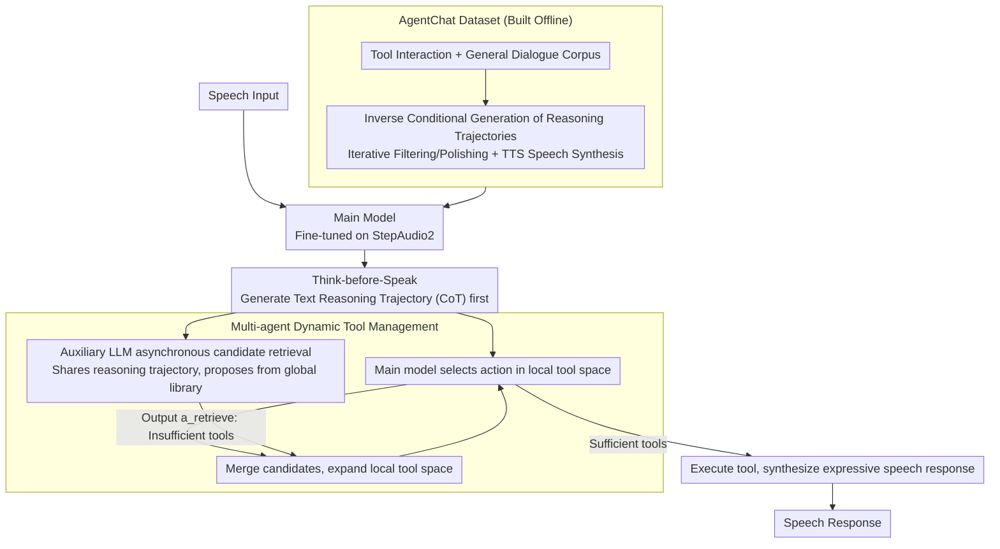

# VoxMind: An End-to-End Agentic Spoken Dialogue System

**Conference**: ACL 2026  
**arXiv**: [2604.15710](https://arxiv.org/abs/2604.15710)  
**Code**: [GitHub](https://github.com/MM-Speech/VoxMind)  
**Area**: Dialogue Systems / Agent  
**Keywords**: End-to-end spoken dialogue, Tool calling, Think-before-Speak mechanism, Multi-agent dynamic tool management, Speech Agent

## TL;DR

VoxMind is proposed as a unified framework that endows end-to-end speech dialogue models with agentic capabilities. By implementing a "Think-before-Speak" mechanism for explicit reasoning and a multi-agent dynamic tool management architecture to decouple inference latency from tool scale, the task completion rate is improved from a 34.88% baseline to 74.57%, surpassing Gemini-2.5-Pro.

## Background & Motivation

**Background**: End-to-end speech dialogue models (e.g., Kimi-Audio, Qwen2.5-Omni, StepAudio2) have developed rapidly, enabling the direct modeling of paralinguistic information and generation of expressive speech responses while avoiding information loss and latency inherent in traditional cascaded ASR-LLM-TTS pipelines.

**Limitations of Prior Work**: (1) Existing end-to-end speech models primarily optimize for reactive dialogue, lacking reasoning, planning, and external knowledge acquisition capabilities; (2) The field lacks a unified definition and evaluation standard for "End-to-End Speech Agents"; (3) Speech inputs require more tokens than text, which, when combined with large-scale tool descriptions, creates significant computational overhead; (4) There is a shortage of speech data annotated with agent behaviors (reasoning trajectories, tool interactions).

**Key Challenge**: A trade-off exists between the agentic capabilities (tool calling and reasoning planning) of speech models and their inference efficiency—integrating more tools enhances capability but increases latency, while speech interaction is highly sensitive to response time.

**Goal**: (1) Define end-to-end speech agents; (2) Empower speech models with reasoning and tool-calling capabilities; (3) Decouple inference latency from the scale of the tool library.

**Key Insight**: Leverage successful experiences from text agents (ReAct, tool calling) while adapting to the specific requirements of speech scenarios—low latency, paralinguistic preservation, and speech data scarcity.

**Core Idea**: Utilize a "Think-before-Speak" mechanism to let the speech model generate text reasoning trajectories before generating speech responses, combined with an asynchronous auxiliary model to maintain a dynamic local tool space by selecting candidates from a global tool library.

## Method

### Overall Architecture

The core problem VoxMind addresses is enabling end-to-end speech models to reason, plan, and call tools like text agents without allowing large-scale tool libraries to degrade the strict latency requirements of speech interaction. Upon receiving speech input, the main model first produces a text reasoning trajectory (CoT) to clarify intent and task planning, subsequently selecting actions within a "local tool space" based on this reasoning. Simultaneously, an auxiliary LLM shares the same reasoning trajectory and asynchronously retrieves candidate tools from the global tool library. Only when the main model determines its current tools are insufficient does it incorporate candidates into the local space to trigger expansion; otherwise, it executes the action directly and synthesizes an expressive speech response. The "Think-before-Speak" process handles capability, while "On-demand tool expansion" ensures efficiency, with both lines progressing in parallel. The training corpus supporting these capabilities is provided by the offline-constructed AgentChat dataset.

### Key Designs

**1. Think-before-Speak: Generating text reasoning before speaking**

End-to-end speech models typically perform direct $x \to y$ mapping, which struggles with complex tasks requiring multi-step planning. VoxMind transforms this into $x \to z \to y$: prior to responding with speech, the model samples a text reasoning trajectory $\mathbf{c}_t \sim \pi_\theta^{\text{think}}(\mathbf{c} \mid \mathbf{o}_t, \mathcal{H}_{t-1}, \mathcal{T}_t^{local})$. Intent understanding, context analysis, and task planning are completed within this trajectory, which then serves as a condition for selecting the action $\mathbf{a}_t \sim \pi_\theta^{\text{act}}(\mathbf{a} \mid \mathbf{c}_t, \mathbf{o}_t, \mathcal{H}_{t-1})$. This explicit "thinking" layer provides the planning stage missing in reactive dialogue models. Training data is constructed at scale via inverse conditional generation (generating reasoning processes for existing Q&A pairs), bypassing the scarcity of reasoning annotations in the speech domain.

**2. Multi-agent Dynamic Tool Management: Decoupling latency from tool library scale**

Inserting all tool descriptions into the context in every turn causes tokens to expand linearly with the number of tools. Given that speech tokens are more numerous than text, this leads to unacceptable latency. VoxMind instead maintains a local tool space $\mathcal{T}_t^{local} \subset \mathcal{T}^{all}$ that is significantly smaller than the full library. The main model only selects actions from this small space, while an auxiliary LLM shares the reasoning trajectory to asynchronously propose candidates from the global library. Only when the main model explicitly outputs $a_{\text{retrieve}}$, acknowledging insufficient tools, is the merge $\mathcal{T}_{t+1}^{local} = \mathcal{T}_t^{local} \cup \mathcal{T}_t^{cand}$ executed to expand the local space. Retrieval and reasoning operate in parallel, and expansion is triggered on-demand, ensuring that even if the global library expands to 40 tools, latency only increases by approximately 20%.

**3. AgentChat Dataset: Completing training corpora with reasoning annotations for Speech Agents**

The speech domain lacks data annotated with agent behaviors (reasoning trajectories, tool interactions). The authors constructed AgentChat: 14,805 tool interaction samples (from ToolACE, APIGen-MT, and custom data) and 31,481 general dialogue samples, totaling approximately 470 hours. Reasoning trajectories for each sample were synthesized using inverse conditional generation $R \sim p_{\text{LM}}(R \mid Q, A)$, controlled for quality via iterative filtering (quality threshold 7/10, maximum 3 retries) and text polishing. Finally, TTS was used for speech synthesis, migrating mature agent data from the text domain to speech scenarios.

### A Complete Example

Example: "Help me check high-speed trains from Beijing to Shanghai next week and book a ticket." Upon receiving the speech input, the main model first decomposes the plan into "search trains $\to$ select train $\to$ place order" in the reasoning trajectory. If the current local space only contains general Q&A tools, the main model outputs $a_{\text{retrieve}}$. Meanwhile, the asynchronous auxiliary LLM has already retrieved candidates like `train_search` and `ticket_booking` from the global library and merged them into the local space. In the next turn, the main model calls `train_search` in the expanded space to get train details, then calls `ticket_booking` to complete the order, finally broadcasting the result to the user using natural speech. Throughout this process, retrieval remains parallel to reasoning, ensuring perceived latency does not rise as the backend tool library grows.

### Loss & Training

Based on StepAudio2 fine-tuning, using the AdamW optimizer, a learning rate of 1e-5, DeepSpeed ZeRO-3, bfloat16 precision, and gradient checkpointing. Training was conducted on 2 H20-NVLink GPUs.

## Key Experimental Results

### Main Results

| Model | Single Task TS/PF | Task Decomposition TS/PF | Parallel Processing TS/PF | Proactive Seek TU | Overall |
|------|------------|-------------|-------------|-----------|---------|
| StepAudio2 | 78.70/48.87 | 60.32/26.98 | 53.33/33.33 | 3.12 | 34.88 |
| Kimi-Audio | 78.45/56.89 | 48.15/22.75 | 79.05/55.24 | 13.64 | 54.94 |
| Gemini-2.5-pro | 90.98/75.19 | 82.54/52.38 | 88.57/69.52 | 26.87 | 71.51 |
| **VoxMind** | **98.50/72.18** | **95.24/38.10** | **89.52/61.59** | **68.66** | **74.57** |

### Ablation Study

| Configuration | Overall | Description |
|------|---------|------|
| w/o think, 1:1 | 68.83 | No reasoning, Tool/Dialogue 1:1 |
| w/o think, 1:0.5 | 70.97 | No reasoning, less dialogue data |
| w/ think, 1:1 | 71.97 | With reasoning |
| w/ think, 1:0.5 | **74.57** | Reasoning + higher proportion of tool data |

### Key Findings

- The Think-before-Speak mechanism provides an average improvement of 3-6%, with the largest gain in "Proactive tool seeking" (from 31.34% to 68.66%).
- A tool/dialogue data ratio of 1:0.5 outperformed 1:1, indicating that a higher proportion of Agent data benefits tool-calling capabilities.
- Dynamic tool management ensures that latency does not increase significantly with the number of tools; latency increased by only ~20% with 40 tools.
- VoxMind maintained general dialogue quality on VoiceBench without degradation from Agent training.

## Highlights & Insights

- **Formal definition of End-to-End Speech Agents** fills a gap in the field—the four-dimensional framework (Profile, Memory, Planning, Action) provides a standard for subsequent research.
- **Asynchronous parallel dynamic tool management** is an elegant design—the auxiliary model and main model share reasoning trajectories while retrieving independently, achieving a decoupling of capability and efficiency.
- **Inverse conditional generation of reasoning trajectories** is a practical data construction method—generating reasoning processes from existing Q&A pairs is more efficient than manual annotation.

## Limitations & Future Work

- AgentChat data is primarily synthesized via TTS, which may lack the richness of natural speech.
- Evaluation is mainly performed on custom test sets, lacking a community-recognized speech agent benchmark.
- The impact of the auxiliary LLM's selection and scale on overall performance has not been fully ablated.
- Streaming reasoning scenarios (starting reasoning while the user is still speaking) have not been explored.

## Related Work & Insights

- **vs Cascaded Systems (Qwen3+Whisper)**: Cascaded systems utilize the agent capabilities of text LLMs but lose paralinguistic information and increase latency; VoxMind maintains end-to-end advantages.
- **vs WavRAG/Stream RAG**: These only support single agent functions like retrieval augmentation; VoxMind supports full tool calling and reasoning planning.
- **vs Gemini-2.5-pro**: While the closed-source model has advantages in individual capabilities, VoxMind surpasses it in overall agent tasks and is open-source and deployable.

## Rating

- Novelty: ⭐⭐⭐⭐⭐ First systematic end-to-end speech agent framework; complete definition, data, and method.
- Experimental Thoroughness: ⭐⭐⭐⭐ Comprehensive comparisons but lacks community standard benchmarks.
- Writing Quality: ⭐⭐⭐⭐ Clear formal definitions and intuitive architecture diagrams.
- Value: ⭐⭐⭐⭐⭐ Open-source framework and dataset significantly advance the speech agent field.

<!-- RELATED:START -->

## Related Papers

- [\[AAAI 2026\] End-to-end Contrastive Language-Speech Pretraining Model For Long-form Spoken Question Answering](../../AAAI2026/audio_speech/end-to-end_contrastive_language-speech_pretraining_model_for_long-form_spoken_qu.md)
- [\[ACL 2026\] VAPO: End-to-end Slide-Enhanced Speech Recognition with Omni-modal Large Language Models](vapo_end-to-end_slide-enhanced_speech_recognition_with_omni-modal_large_language.md)
- [\[ACL 2025\] DNCASR: End-to-End Training for Speaker-Attributed ASR](../../ACL2025/audio_speech/dncasr_end-to-end_training_for_speaker-attributed_asr.md)
- [\[ACL 2026\] Speculative End-Turn Detector for Efficient Speech Chatbot Assistant](speculative_end-turn_detector_for_efficient_speech_chatbot_assistant.md)
- [\[ACL 2025\] OmniFlatten: An End-to-end GPT Model for Seamless Voice Conversation](../../ACL2025/audio_speech/omniflatten_an_end-to-end_gpt_model_for_seamless_voice_conversation.md)

<!-- RELATED:END -->
