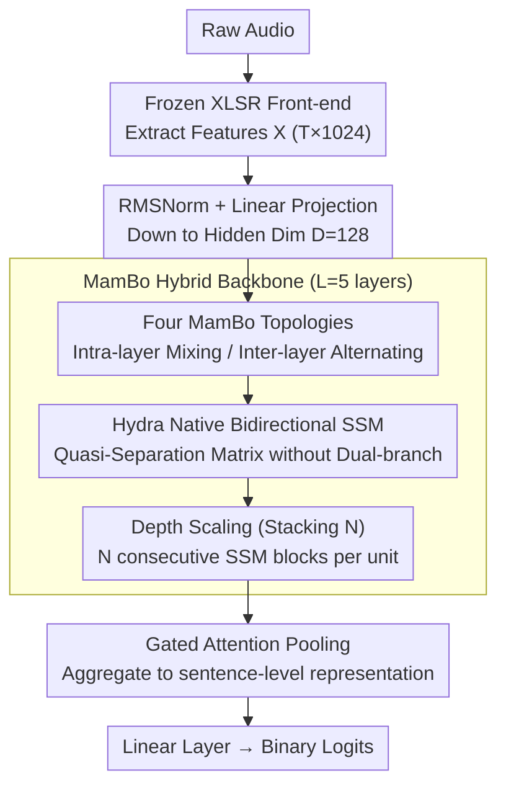

# XLSR-MamBo: Scaling the Hybrid Mamba-Attention Backbone for Audio Deepfake Detection

**Conference**: ACL 2026 Findings  
**arXiv**: [2601.02944](https://arxiv.org/abs/2601.02944)  
**Code**: [GitHub](https://github.com/saki-ciallo/XLSR-MamBo)  
**Area**: AI Security / Audio Deepfake Detection  
**Keywords**: Audio Deepfake Detection, Mamba, Hybrid Architecture, State Space Models, XLSR

## TL;DR
The XLSR-MamBo framework is proposed to systematically explore four topological designs of Mamba-Attention hybrid architectures and various SSM variants (Mamba2, Hydra, GDN) for audio deepfake detection. Among them, MamBo-3-Hydra achieves competitive performance on multiple benchmarks by leveraging Hydra's native bidirectional modeling, while increasing backbone depth effectively mitigates the performance instability of shallow models.

## Background & Motivation

**Background**: Audio Deepfake Detection (ADD) has shifted from handcrafted features to end-to-end architectures. XLSR as a front-end feature extractor combined with attention-based classifiers like Conformer is a mainstream solution. Recently, State Space Models (SSMs) like Mamba have gained attention due to their linear complexity.

**Limitations of Prior Work**: Purely causal SSMs are unidirectional, making it difficult to capture the content-based retrieval capabilities required for global frequency-domain forgery traces. Existing bidirectional Mamba extensions rely on manually designed dual-branch strategies (e.g., concatenating forward and backward passes), which introduce structural redundancy. The quadratic complexity of Transformers limits efficiency for long sequences.

**Key Challenge**: SSMs excel at efficient temporal compression and capturing local high-frequency artifacts, whereas Attention is proficient in global correlation and content retrieval—deepfake signals simultaneously exhibit local high-frequency artifacts and global spectral inconsistencies, making a single mechanism insufficient.

**Goal**: Systematically explore the optimal topological combinations of SSM-Attention hybrid architectures in ADD and evaluate the impact of depth scaling on performance stability.

**Key Insight**: Inspired by hybrid architectures in LLMs like Jamba and Zamba, this work performs customized exploration for the ADD task, specifically introducing Hydra (a native bidirectional SSM) to replace heuristic dual-branch bidirectional strategies.

**Core Idea**: The complementarity of SSM and Attention (temporal compression vs. content retrieval) is particularly crucial in ADD. Hydra's native bidirectional parameterization is more elegant than dual-branch strategies, and increasing the SSM stacking depth $N$ can alleviate performance instability.

## Method

### Overall Architecture

The premise of XLSR-MamBo is that deepfake signals contain both local high-frequency artifacts and global spectral inconsistencies. SSMs are adept at efficient temporal compression and local capture, while Attention excels at global correlation and content retrieval. A single mechanism is not sufficient, so the two are hybridized into one backbone. Raw audio is first processed by a frozen XLSR front-end to extract features $X \in \mathbb{R}^{T \times 1024}$, followed by RMSNorm and linear projection to a hidden dimension $D=128$, then encoded by $L=5$ MamBo hybrid layers. Finally, gated attention pooling aggregates tokens into a sentence-level representation, and a linear layer outputs binary classification logits. The primary contribution lies in a systematic comparison of multiple topological combinations of SSM and Attention and their depth scaling behavior—the following three key designs are applied to this MamBo hybrid backbone.

### Key Designs

**1. Four MamBo Topologies: Intra-layer Mixing vs. Inter-layer Alternating**

To determine how to combine SSM and Attention, the authors enumerate four topologies: MamBo-1 replaces multi-head attention directly with pure SSM; MamBo-2 (Mamer) follows the SSM with an MHA layer to replace the FFN (intra-layer mixing); MamBo-3 alternates Mamba layers and Transformer layers; MamBo-4 alternates Mamba layers and Mamer layers. The first two explore "intra-layer" fusion, while the latter two explore "inter-layer" interleaving. Each topology can be equipped with different SSM variants (Mamba, Mamba2, Hydra, GDN). This all-factorial exploration reveals for each forgery trace the preferences for different processing methods, concluding that inter-layer alternating (MamBo-3) is generally optimal.

**2. Hydra Native Bidirectional SSM: Eliminating Dual-Branch Heuristics with Quasi-Separable Matrices**

Deepfake artifacts can be distributed throughout the audio, requiring non-causal global context for detection. Conventional bidirectional Mamba relies on manual strategies like concatenating forward and backward passes, leading to structural redundancy. Hydra addresses this at the parameterization level: unifying forward and backward scans into a single quasi-separable matrix. Its lower triangle carries past information, and its upper triangle carries future information. The overall computation follows $\text{shift}(SS(X)) + \text{flip}(\text{shift}(SS(\text{flip}(X)))) + DX$, achieving native bidirectional processing within linear complexity. This provides the non-causal vision needed for "causal consistency violation" cues more elegantly than dual-branching.

**3. Depth Scaling (Stacking N): Suppressing Shallow Instability by Stacking Layers**

Experiments found that performance variance in shallow models is high, with results fluctuating for the same configuration. This is because fewer SSM layers result in insufficient representation depth to stably characterize complex forgery traces. The authors introduce a stacking hyperparameter $N$, allowing $N$ consecutive SSM blocks within a single unit to deepen the representation. Results suggest that $N=3$ is optimal for the balance between performance and stability, while $N=1$ shallow models show significantly larger variance—the rule that "deepening mitigates instability" has direct value for practical deployment.

### Loss & Training

Uses FocalLoss to handle class imbalance. AdamW optimizer ($lr=10^{-5}$), 10% linear warmup + cosine decay. Mixed precision training (BF16/FP32), maximum 20 epochs, early stopping with patience=7. Trained on the ASVspoof 2019 LA training set, evaluating generalization across datasets.

## Key Experimental Results

### Main Results

| Model | ASV21LA EER↓ | ASV21DF EER↓ | ITW EER↓ |
|------|-------------|-------------|----------|
| XLSR-Conformer (Baseline) | ~1.0 | ~2.5 | ~5.0 |
| MamBo-1-Mamba (N=1) | 1.19 | 2.08 | 4.65 |
| MamBo-3-Hydra (N=3) | Best | Competitive | Competitive |
| RawBMamba | - | - | - |

### Ablation Study

| Configuration | ASV21LA | Note |
|------|---------|------|
| MamBo-1 (Pure SSM) | Baseline | SSM replaces Attention |
| MamBo-2 (Mamer) | Slightly Better | Intra-layer mixing is helpful |
| MamBo-3 (Alternating) | Best | Inter-layer alternating is most effective |
| N=1 vs N=3 | Variance↓ | Depth scaling significantly improves stability |

### Key Findings
- MamBo-3 (Mamba-Transformer alternating) performs best on most benchmarks, proving that inter-layer alternation is superior to intra-layer mixing.
- Hydra performs best in MamBo-3; its native bidirectional modeling is more effective than the heuristic dual-branching of Mamba.
- Increasing SSM stacking depth $N$ from 1 to 3 significantly reduces performance variance; shallow model instability is a risk for practical deployment.
- It maintains robustness to diffusion and flow-matching synthesis methods on the DFADD dataset, demonstrating generalization ability.
- GDN's delta rule memory management also performs well in certain scenarios.

## Highlights & Insights
- Systematic topological exploration (4 designs × 4 SSM variants × different depths) provides a comprehensive design guide for SSM-Attention hybrid architectures in speech tasks. This methodology is transferable to other speech tasks.
- The advantage of Hydra's native bidirectional capability in ADD validates the hypothesis of "causal consistency violation" as a key forgery detection cue.
- "Depth scaling mitigates shallow instability" is a practical engineering insight with direct guidance for actual deployment.

## Limitations & Future Work
- Training only on the ASVspoof 2019 LA training set limits training data diversity.
- The model scale is relatively small ($D=128, L=5$); the behavior of larger-scale models has not been explored.
- Performance on the ITW dataset still has room for improvement.
- End-to-end training (unfreezing XLSR parameters) was not explored.
- Future work could explore more hybrid topologies and cross-lingual generalization.

## Related Work & Insights
- **vs XLSR-Conformer**: Pure attention architecture; our hybrid SSM improves both efficiency and performance.
- **vs RawBMamba**: Manual bidirectional Mamba strategy; our use of Hydra's native bi-directionality is more elegant.
- **vs Jamba/Samba**: Hybrid architectures in the LLM field; this work is the first to systematically apply this paradigm to ADD.

## Rating
- Novelty: ⭐⭐⭐⭐ Systematic exploration of SSM-Attention hybrid in ADD; introduction of Hydra is novel.
- Experimental Thoroughness: ⭐⭐⭐⭐⭐ 4 topologies × 4 variants × multi-depth × multi-dataset; very comprehensive.
- Writing Quality: ⭐⭐⭐⭐ Rich background information, clear experimental organization.
- Value: ⭐⭐⭐⭐ Provides a systematic reference for architectural choices in the ADD field.

<!-- RELATED:START -->

## Related Papers

- [\[ACL 2026\] HCFD: A Benchmark for Audio Deepfake Detection in Healthcare](hcfd_a_benchmark_for_audio_deepfake_detection_in_healthcare.md)
- [\[ACL 2026\] RTCFake: Speech Deepfake Detection in Real-Time Communication](rtcfake_speech_deepfake_detection_in_real-time_communication.md)
- [\[ACL 2026\] An Exploration of Mamba for Speech Self-Supervised Models](an_exploration_of_mamba_for_speech_self-supervised_models.md)
- [\[ACL 2026\] Analyzing Reasoning Shifts in Audio Deepfake Detection under Adversarial Attacks: The Reasoning Tax versus Shield Bifurcation](analyzing_reasoning_shifts_in_audio_deepfake_detection_under_adversarial_attacks.md)
- [\[ACL 2026\] Semi-Supervised Diseased Detection from Speech Dialogues with Multi-Level Data Modeling](semi-supervised_diseased_detection_from_speech_dialogues_with_multi-level_data_m.md)

<!-- RELATED:END -->
