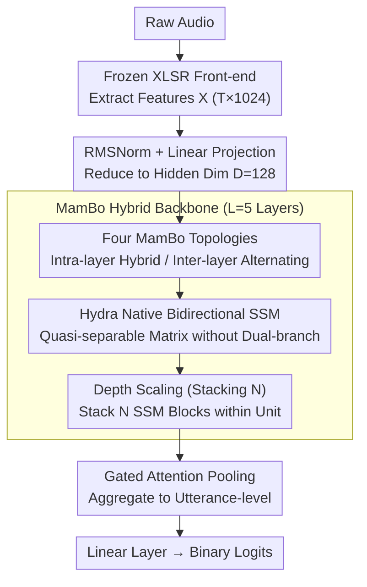

# XLSR-MamBo: Scaling the Hybrid Mamba-Attention Backbone for Audio Deepfake Detection

**Conference**: ACL 2026 Findings  
**arXiv**: [2601.02944](https://arxiv.org/abs/2601.02944)  
**Code**: [GitHub](https://github.com/saki-ciallo/XLSR-MamBo)  
**Area**: AI Security / Audio Deepfake Detection  
**Keywords**: Audio Deepfake Detection, Mamba, Hybrid Architecture, State Space Models, XLSR

## TL;DR
The XLSR-MamBo framework is proposed to systematically explore four topological designs and various SSM variants (Mamba2, Hydra, GDN) within hybrid Mamba-Attention architectures for audio deepfake detection. Among these, MamBo-3-Hydra utilizes the native bidirectional modeling of Hydra to achieve competitive performance across multiple benchmarks, while increasing backbone depth effectively mitigates the performance instability observed in shallow models.

## Background & Motivation

**Background**: Audio Deepfake Detection (ADD) has transitioned from handcrafted features to end-to-end architectures. The mainstream approach involves using XLSR as a front-end feature extractor combined with attention-based classifiers like Conformer. Recently, State Space Models (SSMs) such as Mamba have attracted attention due to their linear complexity.

**Limitations of Prior Work**: Purely causal SSMs are unidirectional, making it difficult to capture the content-based retrieval capabilities required for identifying global frequency-domain forgery traces. Existing bidirectional Mamba extensions rely on manually designed dual-branch strategies (e.g., concatenating forward and backward passes), which result in structural redundancy. Furthermore, the quadratic complexity of Transformers limits efficiency for long sequences.

**Key Challenge**: SSMs excel at efficient temporal compression and capturing local high-frequency artifacts, while Attention is proficient in global correlation and content retrieval. Since deepfake signals manifest as both local high-frequency artifacts and global spectral inconsistencies, neither mechanism alone is sufficient.

**Goal**: To systematically explore the optimal topological combination of SSM-Attention hybrid architectures for ADD and evaluate the impact of depth scaling on performance stability.

**Key Insight**: Inspired by hybrid LLM architectures like Jamba and Zamba, this work performs customized exploration for the ADD task, specifically introducing Hydra (a native bidirectional SSM) to replace heuristic dual-branch strategies.

**Core Idea**: The complementarity between SSMs and Attention (temporal compression vs. content retrieval) is crucial for ADD. The native bidirectional parameterization of Hydra is more elegant than dual-branch strategies, and increasing the SSM stacking depth $N$ can alleviate performance instability.

## Method

### Overall Architecture

The starting point for XLSR-MamBo is that deepfake signals contain both local high-frequency artifacts and global spectral inconsistencies. SSMs are suited for efficient temporal compression and local capture, while Attention is suited for global association and content retrieval. Combining both into a single backbone addresses these needs. Raw audio is first processed by a frozen XLSR front-end to extract features $X \in \mathbb{R}^{T \times 1024}$, followed by RMSNorm and linear projection to a hidden dimension $D=128$. The features are then encoded by $L=5$ MamBo hybrid layers. Finally, gated attention pooling aggregates these into utterance-level representations, and a linear layer outputs binary classification logits. The primary contribution lies in the systematic comparison of multiple topological combinations of SSM and Attention and their depth scaling behavior.

### Key Designs

**1. Four MamBo Topologies: Intra-layer Hybrid vs. Inter-layer Alternating**

To determine how to combine SSM and Attention, the authors enumerated four topologies: MamBo-1 replaces Multi-Head Attention (MHA) directly with pure SSM; MamBo-2 (Mamer) follows the SSM with an MHA layer to replace the FFN (intra-layer hybrid); MamBo-3 alternates between Mamba layers and Transformer layers; MamBo-4 alternates between Mamba layers and Mamer layers. The first two explore "intra-layer" fusion, while the latter two explore "inter-layer" interleaving. Each topology can be equipped with different SSM variants (Mamba, Mamba2, Hydra, GDN). Experimental results indicate that inter-layer alternating (MamBo-3) is generally optimal.

**2. Hydra Native Bidirectional SSM: Eliminating Dual-branch Heuristics via Quasi-separable Matrices**

Deepfake artifacts may be distributed across the entire audio segment, requiring non-causal global context. Traditional bidirectional Mamba depends on manual dual-branch strategies like concatenating forward and backward scans, which are redundant. Hydra solves this at the parameterization level by unifying forward and backward scans into a single quasi-separable matrix. The lower triangle carries past information and the upper triangle carries future information. The overall computation follows $\text{shift}(SS(X)) + \text{flip}(\text{shift}(SS(\text{flip}(X)))) + DX$, achieving native bidirectional processing within linear complexity. It captures non-causal cues like "causal consistency violations" more elegantly than dual-branch methods.

**3. Depth Scaling (Stacking N): Suppressing Instability through Stacking**

Experiments revealed high performance variance in shallow models, where results for the same configuration fluctuated significantly because the limited number of layers lacked the representational depth to stably characterize complex forgery traces. The authors introduced a stacking hyperparameter $N$, allowing $N$ consecutive SSM blocks to be stacked within a single unit to deepen the representation. $N=3$ was found to be optimal for balancing performance and stability, whereas $N=1$ showed significantly higher variance.

### Loss & Training

FocalLoss is used to handle class imbalance. The AdamW optimizer is employed ($lr=10^{-5}$) with 10% linear warmup and cosine decay. Training uses mixed precision (BF16/FP32) for up to 20 epochs with a patience of 7 for early stopping. Models are trained on the ASVspoof 2019 LA training set, and generalization is evaluated across different datasets.

## Key Experimental Results

### Main Results

| Model | ASV21LA EER↓ | ASV21DF EER↓ | ITW EER↓ |
|------|-------------|-------------|----------|
| XLSR-Conformer (Baseline) | ~1.0 | ~2.5 | ~5.0 |
| MamBo-1-Mamba (N=1) | 1.19 | 2.08 | 4.65 |
| MamBo-3-Hydra (N=3) | Best | Competitive | Competitive |
| RawBMamba | - | - | - |

### Ablation Study

| Configuration | ASV21LA | Description |
|------|---------|------|
| MamBo-1 (Pure SSM) | Baseline | SSM replaces Attention |
| MamBo-2 (Mamer) | Slightly better | Intra-layer hybrid is helpful |
| MamBo-3 (Alternating) | Best | Inter-layer alternating works best |
| N=1 vs N=3 | Variance↓ | Depth scaling significantly improves stability |

### Key Findings
- MamBo-3 (alternating Mamba-Transformer) performs best on most benchmarks, proving inter-layer alternating is superior to intra-layer hybrid.
- Hydra performs best within MamBo-3, as its native bidirectional modeling is more effective than Mamba's heuristic dual-branch approach.
- Increasing SSM stacking depth $N$ from 1 to 3 significantly reduces performance variance; the instability of shallow models is a risk for practical deployment.
- Robustness is maintained against diffusion and flow-matching synthesis methods on the DFADD dataset, demonstrating generalization ability.
- GDN's delta rule memory management also performs well in specific scenarios.

## Highlights & Insights
- The systematic topological exploration (4 designs × 4 SSM variants × different depths) provides a comprehensive design guide for applying SSM-Attention hybrid architectures to speech tasks.
- The advantage of Hydra's native bidirectional capability in ADD validates the hypothesis of "causal consistency violation" as a key forgery detection cue.
- The insight that "depth scaling mitigates shallow instability" is a practical engineering observation with direct implications for deployment.

## Limitations & Future Work
- Training is limited to the ASVspoof 2019 LA set, resulting in limited data diversity.
- Model scale is relatively small ($D=128, L=5$); the performance of larger models remains unexplored.
- Performance on the ITW (In-The-Wild) dataset still has room for improvement.
- End-to-end training (unfreezing XLSR parameters) was not explored.
- Future work could investigate more hybrid topologies and cross-lingual generalization.

## Related Work & Insights
- **vs. XLSR-Conformer**: Pure attention architecture; the hybrid SSM proposed here improves both efficiency and performance.
- **vs. RawBMamba**: Relying on manual bidirectional Mamba strategies; this work uses the more elegant Hydra native bidirectional approach.
- **vs. Jamba/Samba**: Hybrid architectures in the LLM field; this work systematically applies this paradigm to ADD for the first time.

## Rating
- Novelty: ⭐⭐⭐⭐ Systematic exploration of SSM-Attention hybrids in ADD; introduction of Hydra is innovative.
- Experimental Thoroughness: ⭐⭐⭐⭐⭐ Comprehensive evaluation across 4 topologies, 4 variants, multiple depths, and datasets.
- Writing Quality: ⭐⭐⭐⭐ Detailed background and clear experimental organization.
- Value: ⭐⭐⭐⭐ Provides a systematic reference for architectural choices in the ADD field.

<!-- RELATED:START -->

## Related Papers

- [\[ACL 2026\] HCFD: A Benchmark for Audio Deepfake Detection in Healthcare](hcfd_a_benchmark_for_audio_deepfake_detection_in_healthcare.md)
- [\[ACL 2026\] An Exploration of Mamba for Speech Self-Supervised Models](an_exploration_of_mamba_for_speech_self-supervised_models.md)
- [\[ACL 2026\] RTCFake: Speech Deepfake Detection in Real-Time Communication](rtcfake_speech_deepfake_detection_in_real-time_communication.md)
- [\[ACL 2026\] Analyzing Reasoning Shifts in Audio Deepfake Detection under Adversarial Attacks: The Reasoning Tax versus Shield Bifurcation](analyzing_reasoning_shifts_in_audio_deepfake_detection_under_adversarial_attacks.md)
- [\[ACL 2026\] Semi-Supervised Diseased Detection from Speech Dialogues with Multi-Level Data Modeling](semi-supervised_diseased_detection_from_speech_dialogues_with_multi-level_data_m.md)

<!-- RELATED:END -->
