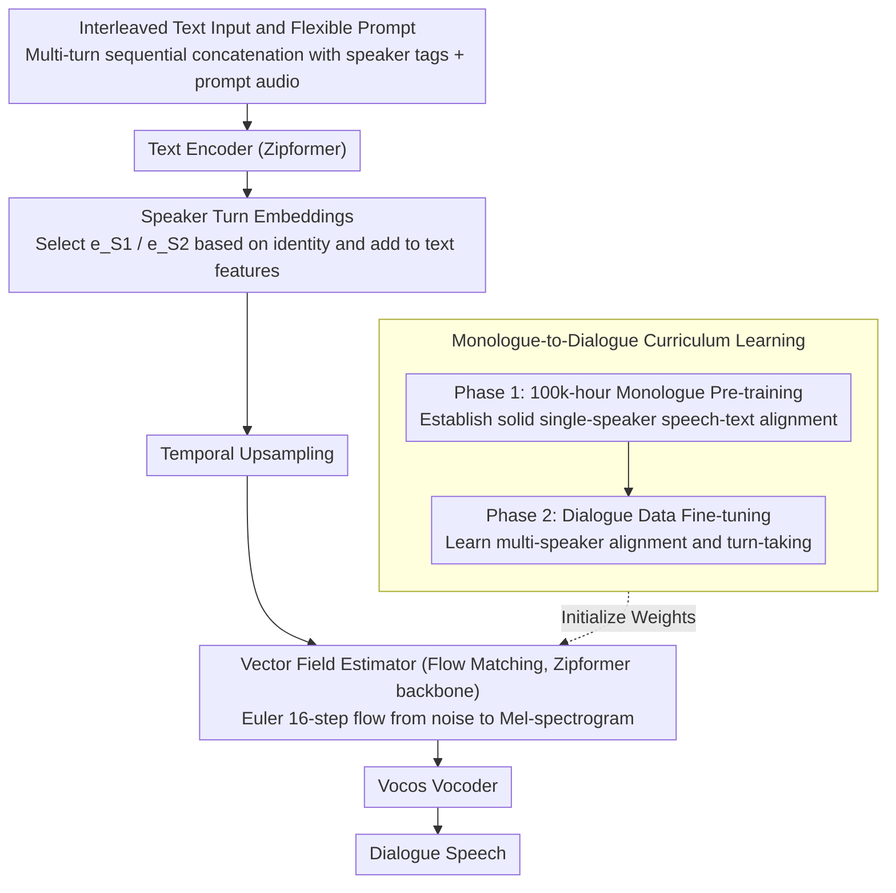

# ZipVoice-Dialog: Non-Autoregressive Spoken Dialogue Generation with Flow Matching

**Conference**: ACL 2026 Findings  
**arXiv**: [2507.09318](https://arxiv.org/abs/2507.09318)  
**Code**: [https://github.com/k2-fsa/ZipVoice](https://github.com/k2-fsa/ZipVoice)  
**Area**: Image generation  
**Keywords**: Dialogue speech generation, non-autoregressive, flow matching, speaker turns, curriculum learning

## TL;DR

This paper proposes ZipVoice-Dialog, the first flow-matching-based non-autoregressive (NAR) zero-shot dialogue speech generation model. Through two simple designs—a curriculum learning strategy and speaker turn embeddings—the model resolves issues of speech unintelligibility and turn confusion when flow matching is directly applied to dialogue scenarios. Additionally, the first large-scale open-source dialogue speech dataset, OpenDialog (6.8k hours), is released.

## Background & Motivation

**Background**: Text-to-speech (TTS) technology has achieved excellent results in single-speaker monologue scenarios. However, synthesizing natural multi-speaker dialogues remains a significant challenge, as dialogue requires accurate, natural speaker turn-taking and the maintenance of distinct timbres for different speakers.

**Limitations of Prior Work**: Current state-of-the-art dialogue speech generation methods primarily rely on autoregressive (AR) architectures (e.g., MoonCast, Dia). However, AR models possess two inherent flaws: (1) high inference latency due to step-by-step sequential generation; (2) serious robustness issues, where exposure bias leads to instabilities such as word repetition or skipping.

**Key Challenge**: While flow matching has demonstrated outstanding performance as an NAR method in monologue TTS, the authors' preliminary experiments revealed that directly applying flow-matching architectures to dialogue generation results in completely unintelligible speech. Although the model can mimic the style and timbre of the prompt audio, it fails entirely to reflect the content of the input text. This occurs because the presence of two different speaker timbres in a dialogue makes learning speech-text alignment extremely difficult.

**Goal**: To design effective methods that adapt flow-matching architectures for multi-speaker dialogue generation while addressing the scarcity of training data.

**Key Insight**: The authors observe that the root cause lies in the difficulty of alignment learning for multi-speaker timbres. Consequently, they approach the problem from a curriculum learning perspective ("learn alignment before dialogue") and provide clear speaker cues through explicit speaker turn embeddings.

**Core Idea**: Use curriculum learning (monologue pre-training followed by dialogue fine-tuning) to solve the alignment problem and employ learnable speaker turn embeddings to handle turn-taking. This allows the flow-matching NAR architecture to achieve both high speed and high stability in dialogue generation.

## Method

### Overall Architecture

ZipVoice-Dialog adapts ZipVoice, a mature monologue flow-matching TTS model, into a dialogue generator. Interleaved multi-speaker text and a prompt audio segment are input; the text encoder (Zipformer) first encodes the text into features. The vector field estimator (also based on a Zipformer backbone) iteratively "flows" noise into target Mel-spectrograms within a conditional flow-matching framework. Finally, a pre-trained Vocos vocoder restores the Mel-spectrograms into complete dialogue speech. The entire model does not rely on any external duration predictors; token durations and turn switches are implicitly learned via the flow-matching objective. A speech infilling task is also integrated to achieve zero-shot cloning capabilities. The primary challenges addressed are preventing model collapse in dual-speaker scenarios and distinguishing between two voices.

### Key Designs

**1. Monologue-to-Dialogue Curriculum Learning: Mastering Alignment Before Dialogue**

Training a flow-matching model from scratch on dialogue data leads to immediate failure, where speech-text alignment collapses completely. The WER increases from approximately 5% in monologue tasks to over 100%, with the model merely mimicking the prompt's timbre without pronouncing the text. The root cause is the simultaneous presence of two speaker timbres, which drastically increases the difficulty of learning "which audio segment corresponds to which character." The curriculum learning approach breaks the task into two stages of increasing difficulty: Phase 1 uses ZipVoice weights pre-trained on 100k hours of monologue data to establish a robust alignment foundation. Phase 2 fine-tunes on dialogue data, allowing the model to focus on alignment adaptation, timbre assignment, and natural turn-taking in multi-speaker contexts. The WER of 116.10 in the "No Curriculum Learning" ablation serves as direct evidence of alignment collapse.

**2. Speaker Turn Embeddings: Tagging Identities with Learnable Vectors**

Distinguishing who is speaking and assigning the correct timbre to each turn requires more than inserting delimiters "|" or tags like [S1]/[S2] in the text. These methods resulted in cpWER as high as 37.82 / 31.34, significantly higher than standard WER, indicating that while content was correct, speaker assignment was confused. This work introduces two randomly initialized, learnable embedding vectors bound to [S1] and [S2] respectively. For each token $y_i$ in the text sequence, the corresponding embedding $e_{speaker(i)}$ is retrieved based on the speaker's identity and added directly to the text features: $\widetilde{y_i} = \hat{y_i} + e_{speaker(i)}$. Temporal upsampling follows. By injecting identity information into the feature space as continuous vectors rather than discrete symbols, the model stably aligns timbres with turns, reducing cpWER to 5.82 with nearly perfect turn accuracy.

**3. Interleaved Text Input and Flexible Prompt: End-to-End Duration via Sequence Concatenation**

Dialogue input is naturally complex, involving multiple people and turns. Here, all utterances are sorted chronologically and concatenated into a single interleaved text sequence, with each segment prefixed by a speaker identifier. During training, dialogue audio prefixes of varying lengths are randomly intercepted as prompts; during inference, the model supports prompt audio of an arbitrary number of turns. Crucially, the model does not introduce predefined timestamps or external duration predictors. The durations of tokens and turns are implicitly modeled by the flow-matching objective, making training and inference simpler while avoiding the cascading errors associated with timestamp prediction.

### Mechanism

Taking a two-person Chinese dialogue as an example: The input consists of interleaved text "[S1] Have you eaten? [S2] Not yet" plus a short prompt audio where both speakers A and B have spoken one sentence. The text encoder encodes the entire sequence. When encountering tokens in the [S1] segment, $e_{S1}$ is added; for [S2] tokens, $e_{S2}$ is added, followed by frame-level upsampling. The vector field estimator, conditioned on the prompt audio, starts from Gaussian noise and uses an Euler solver for 16 iterations to "flow" out the Mel-spectrogram. The first half automatically applies speaker A's timbre for the first sentence, and the second half switches to speaker B's timbre for the second sentence. The turn-switching point is determined autonomously by the flow matching. Finally, Vocos converts the Mel-spectrogram into a waveform, resulting in dialogue speech with clear timbre distinction and natural transitions.

### Loss & Training

Training utilizes the Conditional Flow Matching (CFM) loss, calculated only on masked regions:

$$L_{CFM} = \mathbb{E}_{t,q(x_1),p_0(x_0)} \| (v_t(x_t, z, (1-m) \odot x_1; \theta) - (x_1 - x_0)) \odot m \|^2$$

Phase 2 involves fine-tuning for 60k steps on OpenDialog plus internal data (totaling ~7.6k hours), with a total batch size of approximately 4k seconds. Inference uses an Euler solver with 16 sampling steps.

## Key Experimental Results

### Main Results

Comparison with open-source dialogue speech generation models (Chinese and English test sets):

| Model | Parameters | RTF↓ | Chinese WER↓ | English WER↓ | cpSIM↑ | UTMOS↑ |
|------|--------|------|-----------|-----------|--------|--------|
| Dia | 1.61B | 1.663 | - | 11.80 | 0.333 | 1.87 |
| MoonCast | 2.67B | 0.953 | 15.85 | 23.62 | 0.356 | 2.37 |
| ZipVoice-Dialog | **123M** | **0.063** | **3.17** | **3.25** | **0.437** | **3.07** |

ZipVoice-Dialog achieves total dominance with only 123M parameters: it is over 15 times faster in inference and reduces WER by 3-7 times.

### Ablation Study

| Configuration | English WER↓ | English Short cpWER↓ | Description |
|------|-----------|---------------|------|
| Full Model (Curriculum + Embedding) | 3.25 | 3.27 | Optimal |
| No Curriculum Learning | 116.10 | 116.31 | Alignment collapse, unintelligible |
| Separator "|" instead of Embedding | 5.34 | 37.82 | Poor turn accuracy |
| Text tags instead of Embedding | 5.57 | 31.34 | Poor turn accuracy |
| OpenDialog data only | 3.34 | 3.53 | Data alone achieves a strong baseline |

### Key Findings

- Curriculum learning is indispensable: without it, the model fails to work entirely (WER >100%), indicating that multi-speaker alignment is the core bottleneck for flow-matching dialogue generation.
- Speaker turn embeddings are extremely simple yet highly effective: two learnable vectors reduce the turn error rate from >30% to <1%.
- In subjective evaluations (CMOS/SMOS), ZipVoice-Dialog significantly outperforms MoonCast (CMOS gap of -1.17, SMOS 3.86 vs 2.35).
- Using OpenDialog data alone can train a model that surpasses the baseline, validating the high quality of the dataset.

## Highlights & Insights

- The **minimalist yet highly effective design philosophy** is impressive—curriculum learning plus two learnable embeddings transform the flow-matching architecture from "unusable" to "dominating AR baselines." This approach of achieving maximum effect with minimal modifications is worth emulating.
- The open-source contribution of the **OpenDialog dataset** is highly valuable—it is the first large-scale (6.8k hours) open-source dialogue speech dataset, filling a gap in the field. The data construction pipeline (VAD → Diarization → ASR → LLM Classification → WhisperD Refinement → Rule Filtering) is reusable.
- The 123M parameter model outperforms 1.6B-2.7B AR models across all metrics, proving the immense potential of NAR architectures in dialogue scenarios.

## Limitations & Future Work

- Model and data scales are limited; small models have a ceiling on expressiveness, which larger models and more data might further elevate.
- Subjective evaluation was restricted to Chinese; subjective quality in English remains unverified.
- Currently limited to two-person dialogues; although the method is scalable to more speakers, it has not been validated.
- More natural dialogue phenomena, such as overlapped speech and backchannels, have not yet been explored.

## Related Work & Insights

- **vs MoonCast**: MoonCast employs a hybrid AR+NAR architecture (LLM → Flow Matching → Vocoder) with 2.67B parameters. However, the AR component leads to serious word skipping and instability (WER 23.62%). ZipVoice-Dialog, a pure NAR model with only 123M parameters, achieves 3.25% WER and is 15 times faster.
- **vs Dia**: Dia is a pure AR model that directly predicts audio tokens. Despite having 1.61B parameters, it has a WER of 11.80% and the lowest timbre similarity (cpSIM 0.333). This indicates that the pure AR route lacks sufficient robustness in dialogue scenarios.

## Rating

- Novelty: ⭐⭐⭐⭐ The first work to successfully apply flow matching to dialogue speech generation, though the core techniques (curriculum learning, embeddings) are not inherently new.
- Experimental Thoroughness: ⭐⭐⭐⭐⭐ Comprehensive ablation studies, subjective and objective evaluations, dataset comparisons, and benchmark establishment.
- Writing Quality: ⭐⭐⭐⭐⭐ Clear structure; the logical chain from problem motivation to solution is very smooth and easy to follow.
- Value: ⭐⭐⭐⭐⭐ Triple contribution of model, dataset, and benchmark; the OpenDialog dataset is particularly important for the community.

<!-- RELATED:START -->

## Related Papers

- [\[ACL 2026\] VoxMind: An End-to-End Agentic Spoken Dialogue System](voxmind_an_end-to-end_agentic_spoken_dialogue_system.md)
- [\[ACL 2026\] SDiaReward: Modeling and Benchmarking Spoken Dialogue Rewards with Modality and Colloquialness](sdiareward_modeling_and_benchmarking_spoken_dialogue_rewards_with_modality_and_c.md)
- [\[ICLR 2026\] Flow2GAN: Hybrid Flow Matching and GAN with Multi-Resolution Network for Few-step High-Fidelity Audio Generation](../../ICLR2026/audio_speech/flow2gan_hybrid_flow_matching_and_gan_with_multi-resolution_network_for_few-step.md)
- [\[NeurIPS 2025\] Shallow Flow Matching for Coarse-to-Fine Text-to-Speech Synthesis](../../NeurIPS2025/audio_speech/shallow_flow_matching_for_coarse-to-fine_text-to-speech_synthesis.md)
- [\[ICLR 2026\] AlignSep: Temporally-Aligned Video-Queried Sound Separation with Flow Matching](../../ICLR2026/audio_speech/alignsep_temporally-aligned_video-queried_sound_separation_with_flow_matching.md)

<!-- RELATED:END -->
