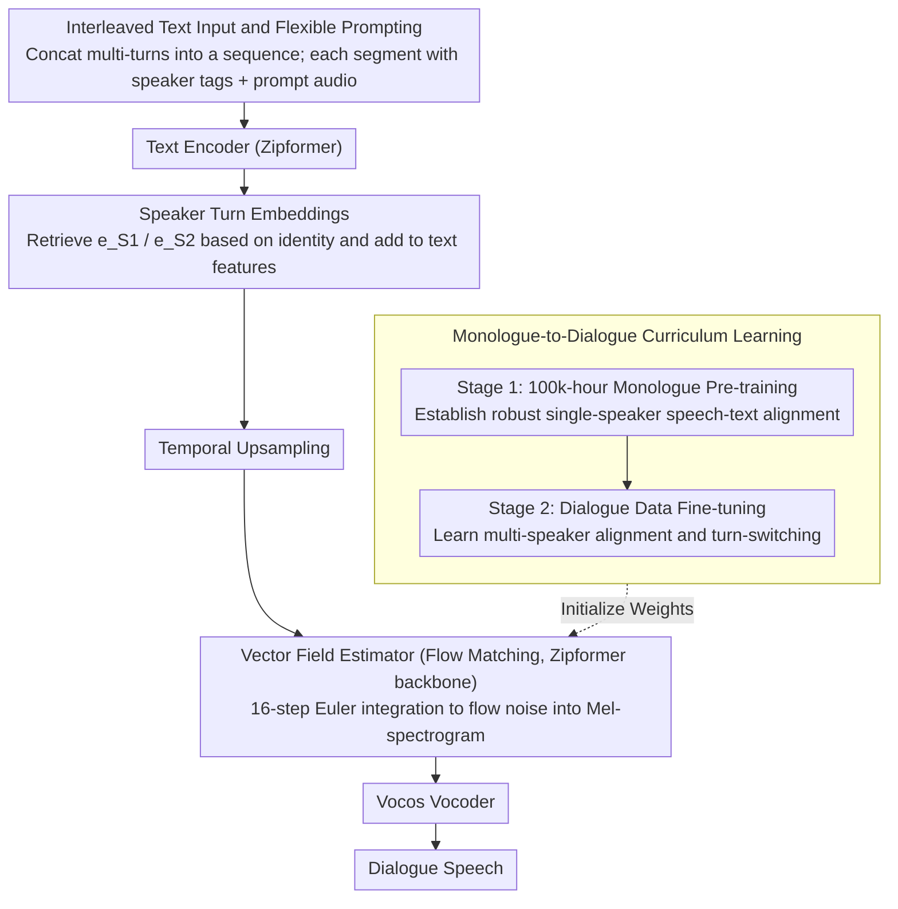

# ZipVoice-Dialog: Non-Autoregressive Spoken Dialogue Generation with Flow Matching

**Conference**: ACL 2026 Findings  
**arXiv**: [2507.09318](https://arxiv.org/abs/2507.09318)  
**Code**: [https://github.com/k2-fsa/ZipVoice](https://github.com/k2-fsa/ZipVoice)  
**Area**: Image Generation  
**Keywords**: Dialogue speech generation, non-autoregressive, flow matching, speaker turn-taking, curriculum learning

## TL;DR

Ours proposes ZipVoice-Dialog, the first non-autoregressive zero-shot dialogue speech generation model based on flow matching. Through two simple designs—a curriculum learning strategy and speaker turn embeddings—the model resolves issues of unintelligibility and turn confusion encountered when applying flow matching directly to dialogue scenarios. Additionally, the first large-scale open-source dialogue speech dataset, OpenDialog (6.8k hours), is released.

## Background & Motivation

**Background**: Text-to-speech (TTS) technology has achieved excellent results in single-speaker monologue scenarios. However, synthesizing natural multi-speaker dialogues remains a major challenge, as dialogues require accurate and natural speaker turn-switching and the preservation of distinct timbres for different speakers.

**Limitations of Prior Work**: Current state-of-the-art dialogue speech generation methods primarily rely on autoregressive (AR) architectures (e.g., MoonCast, Dia). However, AR models suffer from two inherent defects: (1) high inference latency due to the requirement for step-by-step sequential generation; (2) severe robustness issues, where exposure bias leads to unstable phenomena such as word repetition or skipping.

**Key Challenge**: While flow matching has demonstrated outstanding performance in monologue TTS as a non-autoregressive method, the authors' preliminary experiments found that directly applying flow matching architectures to dialogue generation results in completely unintelligible speech. Although the model can mimic the style and timbre of the prompt audio, it fails entirely to reflect the content of the input text. This occurs because the presence of two different speaker timbres in dialogues makes speech-text alignment learning extremely difficult.

**Goal**: To design effective methods that adapt flow matching architectures for multi-speaker dialogue generation while addressing the scarcity of training data.

**Key Insight**: The authors observed that the root of the problem lies in the difficulty of alignment learning for multi-speaker timbres. Consequently, they approached the problem from a curriculum learning perspective ("learn alignment before dialogue") and provided clear speaker cues through explicit speaker turn embeddings.

**Core Idea**: Use curriculum learning (monologue pre-training followed by dialogue fine-tuning) to solve the alignment problem and employ learnable speaker turn embeddings to resolve turn-switching issues. This ensures that the flow matching NAR architecture achieves both high speed and high stability in dialogue generation.

## Method

### Overall Architecture

ZipVoice-Dialog transforms the mature monologue flow matching TTS model, ZipVoice, into a dialogue generator. Interleaved multi-speaker text and a segment of prompt audio serve as inputs. The text encoder (Zipformer) first encodes the text into features. The vector field estimator (also based on the Zipformer backbone) then gradually "flows" noise into the target Mel-spectrogram within a conditional flow matching framework. Finally, a pre-trained Vocos vocoder restores the Mel-spectrogram into complete dialogue speech. The entire model does not rely on any external duration predictors; token duration and turn-switching are implicitly learned by the flow matching objective. A speech infilling task is also integrated to achieve zero-shot cloning capabilities. The main challenge lies not in the backbone, but in two aspects: preventing the collapse of a model originally designed for single-speaker alignment in multi-speaker scenarios and enabling it to distinguish between two voices. These are addressed by the designs below.

### Key Designs

**1. Monologue-to-Dialogue Curriculum Learning: Learn Alignment, Then Dialogue**

Training a flow matching model from scratch using dialogue data leads to immediate failure—speech-text alignment collapses completely, with WER skyrocketing from approximately 5% in monologues to over 100%. The model only mimics the prompt's timbre without pronouncing the text. This is because the simultaneous presence of two speakers' timbres significantly increases the difficulty of learning which segment of sound corresponds to which character. The curriculum learning approach splits the task into two stages of increasing difficulty: Stage 1 uses weights initialized from ZipVoice pre-trained on 100k hours of monologue data to establish a robust foundation for single-speaker alignment; Stage 2 then fine-tunes on dialogue data, allowing the model to focus on alignment adaptation, timbre assignment, and natural turn-switching within a multi-speaker context. The "W/O Curriculum Learning" entry in the ablation study (WER 116.10) serves as direct evidence of alignment collapse.

**2. Speaker Turn Embeddings: Tagging Identities with Two Learnable Vectors**

To help the model distinguish who is speaking and assign the correct timbre to each turn, inserting separators like "|" or tags like [S1]/[S2] into the text is insufficient. These approaches yield cpWERs as high as 37.82 / 31.34, much higher than the standard WER, indicating that while words are correct, speaker identities are misassigned. Ours introduces two randomly initialized, learnable embedding vectors bound to [S1] and [S2], respectively. For each token $y_i$ in the text sequence, the corresponding embedding $e_{speaker(i)}$ is retrieved based on the speaker identity and added directly to the text features: $\widetilde{y_i} = \hat{y_i} + e_{speaker(i)}$. This is followed by temporal upsampling. By injecting identity information into the feature space as continuous vectors rather than discrete symbols, the model can stably match timbres with turns. Consequently, cpWER drops to 5.82, and turn accuracy becomes nearly perfect.

**3. Interleaved Text Input and Flexible Prompting: End-to-End Duration Modeling**

Dialogue inputs are inherently complex, involving multiple people and turns in sequence. All utterances are sorted chronologically and concatenated into a single interleaved text sequence, with speaker identifiers prefixed to each segment. During training, dialogue audio prefixes of varying lengths are randomly intercepted as prompts. During inference, any number of prompt audio turns are supported. Crucially, no predefined timestamps or external duration predictors are introduced; token and turn durations are implicitly modeled by the flow matching objective, simplifying both training and inference while avoiding the cascading of timestamp prediction errors.

### Mechanism

Taking a Chinese dialogue between two people as an example: the input is the interleaved text "[S1] Have you eaten? [S2] Not yet," along with a short prompt audio where A and B have each spoken one sentence. The text encoder encodes the entire sequence; tokens in the [S1] segment are added with $e_{S1}$, and those in the [S2] segment with $e_{S2}$. These are then upsampled to the frame level. Conditioned on the prompt audio, the vector field estimator starts from Gaussian noise and uses an Euler solver to iteratively "flow" out the Mel-spectrogram in 16 steps. The first half automatically applies A's timbre for the first sentence, and the second half switches to B's timbre for the second sentence. The switch point is decided by the flow matching model itself. Finally, Vocos converts the Mel-spectrogram into a waveform, resulting in dialogue speech with clear timbre distinction and natural transitions.

### Loss & Training

Training utilizes the Conditional Flow Matching (CFM) loss, calculated only on the masked regions:

$$L_{CFM} = \mathbb{E}_{t,q(x_1),p_0(x_0)} \| (v_t(x_t, z, (1-m) \odot x_1; \theta) - (x_1 - x_0)) \odot m \|^2$$

Stage 2 involves fine-tuning on OpenDialog plus internal data (totaling approx. 7.6k hours) for 60k steps, with a total batch size of about 4k seconds. Inference uses 16-step sampling with an Euler solver.

## Key Experimental Results

### Main Results

Comparison with open-source dialogue speech generation models (Chinese and English test sets):

| Model | Params | RTF↓ | Chn. WER↓ | Eng. WER↓ | cpSIM↑ | UTMOS↑ |
|-------|--------|------|-----------|-----------|--------|--------|
| Dia | 1.61B | 1.663 | - | 11.80 | 0.333 | 1.87 |
| MoonCast | 2.67B | 0.953 | 15.85 | 23.62 | 0.356 | 2.37 |
| ZipVoice-Dialog | **123M** | **0.063** | **3.17** | **3.25** | **0.437** | **3.07** |

ZipVoice-Dialog achieves total superiority with only 123M parameters: inference speed is over 15 times faster, and WER is reduced by 3-7 times.

### Ablation Study

| Configuration | Eng. WER↓ | Eng. Short cpWER↓ | Description |
|---------------|-----------|-------------------|-------------|
| Full Model (Curriculum + Embedding) | 3.25 | 3.27 | Optimal |
| W/O Curriculum Learning | 116.10 | 116.31 | Alignment collapse, unintelligible |
| Separator "|" instead of Embeddings | 5.34 | 37.82 | Poor turn accuracy |
| Text Tags instead of Embeddings | 5.57 | 31.34 | Poor turn accuracy |
| OpenDialog Data Only | 3.34 | 3.53 | Data alone reaches strong baseline |

### Key Findings

- Curriculum learning is indispensable: without it, the model fails completely (WER >100%), indicating that multi-speaker alignment is the core bottleneck for flow matching in dialogue generation.
- Speaker turn embeddings are extremely simple yet effective: two learnable vectors reduce the turn error rate from >30% to <1%.
- In subjective evaluations (CMOS/SMOS), ZipVoice-Dialog significantly leads MoonCast (CMOS gap -1.17, SMOS 3.86 vs 2.35).
- Using OpenDialog data alone can train a model that exceeds baselines, validating the high quality of the dataset.

## Highlights & Insights

- **The minimalist yet highly effective design philosophy** is impressive—utilizing only curriculum learning and two learnable embeddings allows the flow matching architecture to transition from "completely unusable" to "outperforming AR baselines." This approach of achieving maximum impact with minimal modifications is worth noting.
- **The contribution of the OpenDialog dataset** is highly valuable. As the first large-scale (6.8k hours) open-source dialogue speech dataset, it fills a gap in the field. The data construction pipeline (VAD → Speaker Diarization → ASR → LLM Classification → WhisperD Refinement → Rule-based Filtering) is reusable.
- The 123M parameter model outperforms 1.6B–2.7B AR models across all metrics, proving the immense potential of the NAR architecture in dialogue scenarios.

## Limitations & Future Work

- Model and data scales are limited; small models have a ceiling on expressiveness, which larger models and more data might further elevate.
- Subjective evaluations were limited to Chinese; subjective quality for English remains unverified.
- Currently restricted to two-person dialogues; while the method is extensible to more participants, it has not been verified.
- More natural dialogue phenomena, such as overlapping speech and backchannels, have not yet been explored.

## Related Work & Insights

- **vs MoonCast**: MoonCast employs a hybrid AR+NAR architecture (LLM → Flow Matching → Vocoder) with 2.67B parameters. However, the AR component leads to significant instability and skipping (WER 23.62%). ZipVoice-Dialog's pure NAR approach uses only 123M parameters, achieves a WER of 3.25%, and is 15 times faster.
- **vs Dia**: Dia is a pure AR model that directly predicts audio tokens. With 1.61B parameters, it still results in a WER of 11.80% and the lowest speaker similarity (cpSIM 0.333). This suggests that pure AR routes lack sufficient robustness for dialogue scenarios.

## Rating

- Novelty: ⭐⭐⭐⭐ First work to successfully apply flow matching to dialogue speech generation, though core techniques (curriculum learning, embeddings) are not inherently new.
- Experimental Thoroughness: ⭐⭐⭐⭐⭐ Comprehensive ablation studies, subjective/objective evaluations, dataset comparisons, and benchmark establishment.
- Writing Quality: ⭐⭐⭐⭐⭐ Clear structure; the logical chain from problem motivation to proposed solution is very smooth and easy to understand.
- Value: ⭐⭐⭐⭐⭐ Triple contribution of model, dataset, and benchmark, with OpenDialog being particularly important to the community.

<!-- RELATED:START -->

## Related Papers

- [\[ACL 2026\] VoxMind: An End-to-End Agentic Spoken Dialogue System](voxmind_an_end-to-end_agentic_spoken_dialogue_system.md)
- [\[ICLR 2026\] Flow2GAN: Hybrid Flow Matching and GAN with Multi-Resolution Network for Few-step High-Fidelity Audio Generation](../../ICLR2026/audio_speech/flow2gan_hybrid_flow_matching_and_gan_with_multi-resolution_network_for_few-step.md)
- [\[ACL 2026\] SDiaReward: Modeling and Benchmarking Spoken Dialogue Rewards with Modality and Colloquialness](sdiareward_modeling_and_benchmarking_spoken_dialogue_rewards_with_modality_and_c.md)
- [\[NeurIPS 2025\] Shallow Flow Matching for Coarse-to-Fine Text-to-Speech Synthesis](../../NeurIPS2025/audio_speech/shallow_flow_matching_for_coarse-to-fine_text-to-speech_synthesis.md)
- [\[ACL 2025\] WavRAG: Audio-Integrated Retrieval Augmented Generation for Spoken Dialogue Models](../../ACL2025/audio_speech/wavrag_audio-integrated_retrieval_augmented_generation_for_spoken_dialogue_model.md)

<!-- RELATED:END -->
