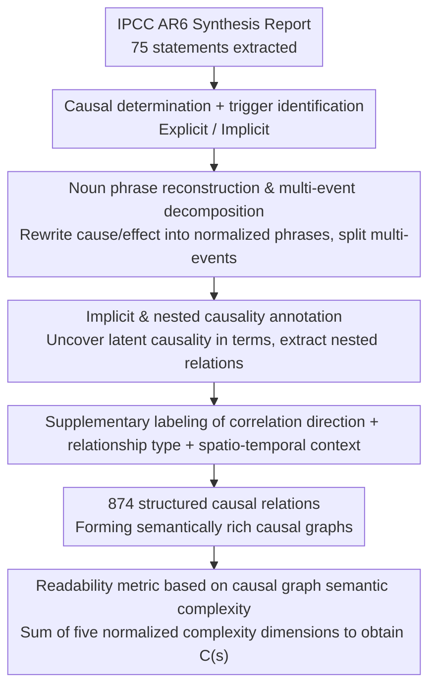

# ClimateCause: Complex and Implicit Causal Structures in Climate Reports

**Conference**: ACL 2026 Findings  
**arXiv**: [2604.14856](https://arxiv.org/abs/2604.14856)  
**Code**: [GitHub](https://github.com/laallein/ClimateCause)  
**Area**: Causal Reasoning / Datasets  
**Keywords**: Causal Discovery, Climate Change, Implicit Causality, Nested Causality, IPCC Reports

## TL;DR
ClimateCause constructs the first expert-annotated dataset (874 causal relations) targeting complex and implicit causal structures in climate reports, supporting nested causality, multi-event decomposition, correlation direction, and spatio-temporal context annotation. It proposes a readability metric based on the semantic complexity of causal graphs, with LLM benchmarks revealing that causal chain reasoning remains a significant challenge.

## Background & Motivation

**Background**: Textual causal discovery datasets (e.g., BioCause, BECauSE, CNC) primarily originate from news and social media, focusing on explicit and direct causal relations. Existing datasets lack annotations for implicit causality (inferred through semantics rather than explicit triggers), nested causality (where one relation is embedded within another cause or effect), and multi-event decomposition.

**Limitations of Prior Work**: Causal relationships in climate change are inherently complex—causal networks are multi-layered, restricted by spatio-temporal contexts, and involve uncertainty and confounding factors. Existing datasets cannot represent this complexity, particularly abbreviations like CO2-FFI (CO2 emissions from fossil fuel combustion and industrial processes) which nest multiple causal relationships.

**Key Challenge**: The causal structure complexity of scientific reports far exceeds the representational capacity of current NLP resources, leading to insufficient evaluation of LLMs in causal reasoning tasks.

**Goal**: To construct a high-quality annotated dataset covering implicit, nested, and complex causal structures, and to explore its applications in readability metrics and LLM causal reasoning benchmarks.

**Key Insight**: Extract statements from the IPCC Sixth Assessment Report (AR6) for causal relationship annotation by experts in linguistics and argumentation.

**Core Idea**: Noun phrase reconstruction + multi-event decomposition + nested causality and spatio-temporal context annotation $\rightarrow$ construction of semantically rich causal graphs.

## Method

### Overall Architecture

ClimateCause is an annotation methodology centered on standardized labeling of intertwined causal relationships in climate science reports. 75 statements were extracted from the IPCC AR6 Synthesis Report and processed by two experts following detailed guidelines: first, determining the presence of causality and identifying triggers (explicit vs. implicit); next, reconstructing causes and effects into normalized noun phrases, decomposing multi-event parts into atomic causal pairs, and labeling nested structures; finally, adding correlation directions, relationship types, and spatio-temporal contexts. After processing through this pipeline, 874 structured causal relations are produced, which can form semantically rich causal graphs. Three designs address "representation normalization," "uncovering hidden causality," and "quantifying complexity."

### Key Designs

**1. Noun Phrase Reconstruction and Multi-event Decomposition: Standardizing Causal Components for Pairwise Comparison**

Existing datasets often retain mixed expressions from the original text, making it difficult to match events or verify them pairwise in causal graphs. This work requires rewriting every cause and effect as a noun phrase. For example, "Unsustainable agricultural expansion increases ecosystem vulnerability" is split into cause: "unsustainable agricultural expansion" and effect: "increased ecosystem vulnerability." When one side contains multiple events (e.g., "damages in terrestrial, freshwater, cryospheric ecosystems"), it is further decomposed into independent causal pairs, using `Belongs_to` and `Combined` fields to distinguish between "mere examples" and "joint synergistic effects." This ensures each relation is an atomic, comparable unit.

**2. Implicit and Nested Causality Annotation: Uncovering Causal Links Hidden in Terms**

Scientific reports contain numerous causal relations that rely on domain knowledge rather than explicit triggers like "because." Implicit causality, such as "anthropogenic greenhouse gas emissions," lacks triggers but semantically implies humans $\rightarrow$ greenhouse gas emissions. Nested causality, like the abbreviation CO2-FFI, compresses multiple relations: fossil fuel combustion $\rightarrow$ CO2 emissions and industrial processes $\rightarrow$ CO2 emissions. This work uses a `Nested` field to mark these structures and extracts them as independent causal pairs, making hidden hierarchies explicit.

**3. Readability Metric Based on Causal Graph Semantic Complexity: Quantifying the Cognitive Burden of Causal Reasoning**

Traditional readability metrics (e.g., Flesch Reading Ease) rely on word and sentence length, failing to measure the cognitive effort required for causal reasoning. This paper proposes a five-dimensional complexity metric based on the causal graph's semantic structure: common cause/effect structure complexity $C^{com}$, example expansion complexity $C^{ex}$, nested causality complexity $C^{nest}$ (with a $T_i \log T_i$ penalty for deep nesting), correlation direction complexity $C^{corr}$, and relationship type complexity $C^{pol}$. The total complexity $C(s)$ is obtained by summing min-max normalized values. This metric evaluates the comprehensibility of reports for non-experts and guides simplification.

## Key Experimental Results

### Main Results

| Metric | Value |
|------|------|
| Annotated Statements | 75 (63 containing causality) |
| Number of Causal Relations | 874 |
| Unique Relations | 653 (after quantifier removal) |
| Unique Triggers | 95 |
| Explicit vs. Implicit | Mostly explicit, but implicit ratio is significantly higher than existing datasets |
| Positive vs. Negative | Mostly positive |

### Ablation Study

| LLM Task | Challenge | Description |
|---------|------|------|
| Correlation Inference | Medium | LLMs perform reasonably well on positive/negative judgment |
| Causal Chain Reasoning | Hard | Multi-hop causal reasoning is a key bottleneck for LLMs |

### Key Findings
- 57.33% of statements contain complex causal structures ($C(s) > 0$), with a maximum complexity of 1.821.
- Statement length is significantly positively correlated with causal complexity ($r = 0.590, p < 0.01$).
- All nested causal relations are positive; negative correlations appear only in explicit relations ($\chi^2 = 26.53, p < 0.01$).
- LLM performance on causal chain reasoning is significantly worse than on correlation inference, highlighting a critical deficiency in current LLMs.

## Highlights & Insights
- **Readability metric for causal structures** is a novel and practical idea that helps organizations like the IPCC assess the accessibility of their reports for policymakers.
- The annotation design is thorough, particularly the distinction between `Belongs_to`/`Combined` and the inclusion of spatio-temporal context, demonstrating how causal annotation can transcend simple (cause, effect) tuples.
- The concept of nested causality can be generalized to other professional domains (e.g., medical reports, legal documents) that are filled with term-level implicit causality.

## Limitations & Future Work
- The dataset size is small (75 statements, 874 relations), limiting the potential for LLM fine-tuning.
- Data is exclusively from the IPCC AR6 Synthesis Report, covering limited climate topics.
- Annotation heavily depends on domain knowledge; low initial inter-annotator agreement (trigger identification $\kappa = -0.075$) indicates high task difficulty.
- The readability metric assumes equal weighting of dimensions, which is a simplification not yet validated cognitively.

## Related Work & Insights
- **vs BioCause**: A biomedical causal dataset featuring cross-sentence causality but lacking nested structures and spatio-temporal context.
- **vs BECauSE 2.0**: A news-sourced causal dataset with trigger annotations but lacking implicit causality.
- **vs PolarIs3CAUS/PolarIs4CAUS**: Also in the climate domain but sourced from social media and smaller in scale; ClimateCause utilizes authoritative scientific reports.

## Rating
- Novelty: ⭐⭐⭐⭐ Implicit/nested causal annotation and causal readability metrics are new contributions.
- Experimental Thoroughness: ⭐⭐⭐ Comprehensive dataset analysis but small scale and preliminary LLM benchmarking.
- Writing Quality: ⭐⭐⭐⭐ Clear and detailed description of annotation design, though the readability section is notation-heavy.

<!-- RELATED:START -->

## Related Papers

- [\[ICML 2026\] Controllable Generative Sandbox for Causal Inference](../../ICML2026/causal_inference/controllable_generative_sandbox_for_causal_inference.md)
- [\[CVPR 2026\] A Polynomial Chaos Framework for Causal Discovery in Nonlinear Uncertain Systems](../../CVPR2026/causal_inference/a_polynomial_chaos_framework_for_causal_discovery_in_nonlinear_uncertain_systems.md)
- [\[ICML 2026\] Evaluating Bivariate Causal Statements Based on Mutual Compatibility](../../ICML2026/causal_inference/evaluating_bivariate_causal_statements_based_on_mutual_compatibility.md)
- [\[AAAI 2026\] I-CAM-UV: Integrating Causal Graphs over Non-Identical Variable Sets Using Causal Additive Models with Unobserved Variables](../../AAAI2026/causal_inference/i-cam-uv_integrating_causal_graphs_over_non-identical_variable_sets_using_causal.md)
- [\[AAAI 2026\] CaDyT: Causal Structure Learning for Dynamical Systems with Theoretical Score Analysis](../../AAAI2026/causal_inference/causal_structure_learning_for_dynamical_systems_with_theoretical_score_analysis.md)

<!-- RELATED:END -->
