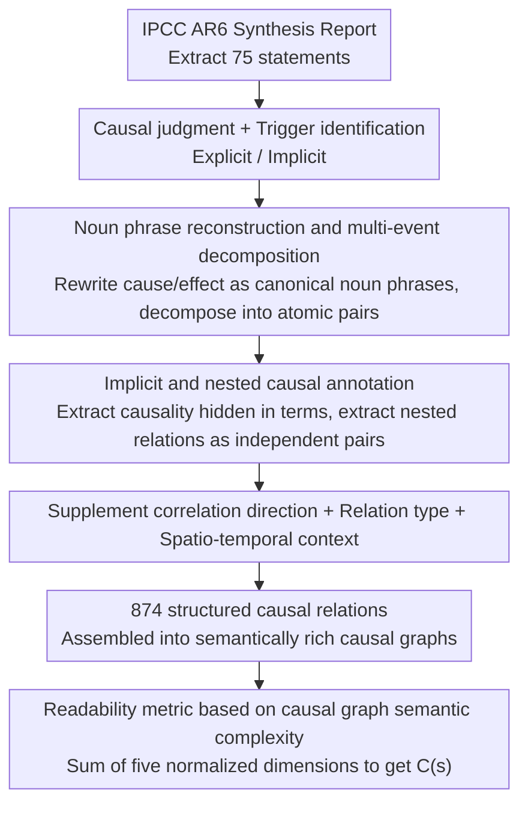

# ClimateCause: Complex and Implicit Causal Structures in Climate Reports

**Conference**: ACL 2026 Findings  
**arXiv**: [2604.14856](https://arxiv.org/abs/2604.14856)  
**Code**: [GitHub](https://github.com/laallein/ClimateCause)  
**Area**: Causal Inference / Datasets  
**Keywords**: Causal Discovery, Climate Change, Implicit Causality, Nested Causality, IPCC Reports

## TL;DR
ClimateCause constructs the first expert-annotated dataset for complex and implicit causal structures in climate reports (874 causal relations), supporting nested causality, multi-event decomposition, correlation direction, and spatio-temporal context labeling. It proposes a readability metric based on causal graph semantic complexity, with LLM benchmarking revealing that causal chain reasoning remains a significant challenge.

## Background & Motivation

**Background**: Textual causal discovery datasets (e.g., BioCause, BECauSE, CNC) are primarily sourced from news and social media, focusing on explicit and direct causal relations. Existing datasets lack annotations for implicit causality (inferred via semantics rather than explicit triggers), nested causality (causal relations embedded within a cause or effect), and multi-event decomposition.

**Limitations of Prior Work**: Causal relationships in climate change are inherently complex—characterized by multi-layered nested networks, spatio-temporal constraints, uncertainties, and confounding factors. Existing datasets fail to represent this complexity, particularly where abbreviations like CO2-FFI (CO2 emissions from fossil fuel combustion and industrial processes) encapsulate multiple nested causalities.

**Key Challenge**: The complexity of causal structures in scientific reports far exceeds the representational capacity of existing NLP resources, leading to insufficient evaluation of LLMs on causal reasoning tasks.

**Goal**: To build a high-quality annotated dataset covering implicit, nested, and complex causal structures, and to explore its application in readability metrics and LLM causal reasoning benchmarks.

**Key Insight**: Extract statements from the IPCC Sixth Assessment Report (AR6) and have them annotated by experts in linguistics and argumentation.

**Core Idea**: Noun phrase reconstruction + multi-event decomposition + nested and spatio-temporal context annotation → construction of semantically rich causal graphs.

## Method

### Overall Architecture

ClimateCause is an annotation methodology centered on standardizing the "entangled" causal relations found in climate science reports. Seventy-five statements were extracted from the IPCC AR6 Synthesis Report and processed by two experts following detailed guidelines: first, determining the presence of causality and identifying triggers (explicit vs. implicit); then, reconstructing causes and effects into canonical noun phrases, decomposing multi-event segments, and labeling nested structures; finally, adding correlation directions, relation types, and spatio-temporal contexts. A single raw statement expands into 874 structured causal relations, which can be assembled into a semantically rich causal graph. Three specific designs address standardization, discovery of hidden relations, and complexity quantification.

### Key Designs

**1. Noun phrase reconstruction and multi-event decomposition: Standardizing causal endpoints**

Existing datasets often retain hybrid expressions from original sentences, making it impossible to match events accurately in a causal graph. This work requires rewriting every cause and effect as a noun phrase. For example, "Unsustainable agricultural expansion increases ecosystem vulnerability" is decomposed into cause: *unsustainable agricultural expansion* and effect: *increased ecosystem vulnerability*. When one side contains multiple events (e.g., "damages in terrestrial, freshwater, cryospheric ecosystems"), it is further decomposed into independent causal pairs, using `Belongs_to` and `Combined` fields to distinguish between simple enumeration and joint effects. This turns each relation into an atomic, comparable unit.

**2. Implicit and nested causal annotation: Uncovering hidden causality in terminology**

Scientific reports contain many causalities that do not rely on triggers like "because" but are buried within terminology and domain knowledge. Implicit causality, such as "anthropogenic greenhouse gas emissions," involves no trigger but semantically implies *humans* → *greenhouse gas emissions*. Nested causality, such as the abbreviation *CO2-FFI*, compresses two relations: *fossil fuel combustion* → *CO2 emissions* and *industrial processes* → *CO2 emissions*. These are marked with a `Nested` field and extracted as independent pairs to make hidden hierarchies explicit.

**3. Readability metric based on causal graph semantic complexity: Quantifying cognitive burden**

Traditional readability metrics (e.g., Flesch Reading Ease) only consider word and sentence length, failing to measure the mental effort required for causal reasoning. This work proposes a five-dimensional complexity metric derived from the causal graph: common cause/effect structure complexity $C^{com}$, exemplification complexity $C^{ex}$, nested causality complexity $C^{nest}$ (utilizing a $T_i \log T_i$ penalty for deep nesting), correlation direction complexity $C^{corr}$, and relationship type complexity $C^{pol}$. The total complexity $C(s)$ is the equal-weighted sum of these dimensions after min-max normalization, providing a measure to evaluate the understandability of reports for non-experts.

## Key Experimental Results

### Main Results

| Metric | Value |
|------|------|
| Annotated Statements | 75 (63 containing causal relations) |
| Causal Relations | 874 |
| Unique Relations | 653 (after removing quantifiers) |
| Unique Triggers | 95 |
| Explicit vs. Implicit | Primarily explicit, but significantly higher implicit ratio than prior datasets |
| Positive vs. Negative | Primarily positive relations |

### Ablation Study

| LLM Task | Challenge | Description |
|---------|------|------|
| Correlation Inference | Moderate | LLMs perform reasonably well on positive/negative judgment |
| Causal Chain Reasoning | Difficult | Multi-hop causal reasoning is a key bottleneck for LLMs |

### Key Findings
- 57.33% of statements contain semantically complex causal structures ($C(s) > 0$), with a maximum complexity of 1.821.
- Statement length is significantly positively correlated with causal complexity ($r=0.590, p<0.01$).
- All nested causal relations are positively correlated; negative correlations appear only in explicit relations ($\chi^2=26.53, p<0.01$).
- LLM performance on causal chain reasoning is significantly worse than on correlation inference, highlighting a deficiency in multi-hop causal reasoning.

## Highlights & Insights
- **Causal Readability Metric**: A novel and practical approach to help organizations like the IPCC assess the comprehensibility of reports for policymakers and guide simplification.
- **Annotation Granularity**: The design is thorough, specifically the distinction between `Belongs_to`/`Combined` and the inclusion of spatio-temporal context, demonstrating how causal annotation can move beyond simple (cause, effect) pairs.
- **Nested Causality**: This concept is generalizable to other professional domains (e.g., medical reports, legal documents) that are similarly saturated with term-level implicit causality.

## Limitations & Future Work
- The dataset size is small (75 statements, 874 relations), limiting the feasibility of LLM fine-tuning.
- Sourced only from the IPCC AR6 Synthesis Report, resulting in limited coverage of climate topics.
- Annotation is heavily dependent on domain knowledge; inter-annotator agreement in the first round was very low (trigger identification $\kappa=-0.075$), indicating high difficulty.
- The equal-weighted summation in the readability metric is a simplifying assumption and lacks cognitive validation.

## Related Work & Insights
- **vs BioCause**: Biomedical dataset; features cross-sentence causality but lacks nested causality and spatio-temporal context.
- **vs BECauSE 2.0**: News-based dataset; includes trigger labels but lacks implicit causality.
- **vs PolarIs3CAUS/PolarIs4CAUS**: Climate domain but sourced from social media; smaller in scale compared to the authoritative scientific reports used in ClimateCause.

## Rating
- Novelty: ⭐⭐⭐⭐ (Nested/implicit annotation and causal readability metric are new contributions)
- Experimental Thoroughness: ⭐⭐⭐ (Analysis is thorough, but scale is small and LLM benchmarks are preliminary)
- Writing Quality: ⭐⭐⭐⭐ (Annotation design is clear and detailed, though the readability section is notation-heavy)

<!-- RELATED:START -->

## Related Papers

- [\[ICML 2026\] Controllable Generative Sandbox for Causal Inference](../../ICML2026/causal_inference/controllable_generative_sandbox_for_causal_inference.md)
- [\[CVPR 2026\] A Polynomial Chaos Framework for Causal Discovery in Nonlinear Uncertain Systems](../../CVPR2026/causal_inference/a_polynomial_chaos_framework_for_causal_discovery_in_nonlinear_uncertain_systems.md)
- [\[ICML 2026\] Evaluating Bivariate Causal Statements Based on Mutual Compatibility](../../ICML2026/causal_inference/evaluating_bivariate_causal_statements_based_on_mutual_compatibility.md)
- [\[AAAI 2026\] I-CAM-UV: Integrating Causal Graphs over Non-Identical Variable Sets Using Causal Additive Models with Unobserved Variables](../../AAAI2026/causal_inference/i-cam-uv_integrating_causal_graphs_over_non-identical_variable_sets_using_causal.md)
- [\[ICML 2026\] Causal Modeling of Selection in Evolution](../../ICML2026/causal_inference/causal_modeling_of_selection_in_evolution.md)

<!-- RELATED:END -->
