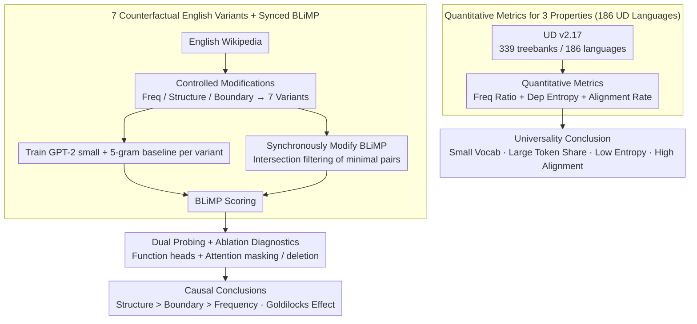

# Function Words as Statistical Cues for Language Learning

**Conference**: ACL 2026  
**arXiv**: [2601.21191](https://arxiv.org/abs/2601.21191)  
**Code**: <https://github.com/picol-georgetown/function_word>  
**Area**: Linguistics / Cognition / Computational Language Acquisition  
**Keywords**: Function words, statistical learning, counterfactual language, BLiMP, Goldilocks effect

## TL;DR
The authors use Universal Dependencies corpora across 186 languages to demonstrate that three distributional properties—"high frequency + syntactic predictability + phrase boundary alignment"—are cross-linguistically universal. Simultaneously, they construct seven counterfactual variants of English to train GPT-2 small, proving that transformer learners perform best only when all three properties are satisfied. They identify a Goldilocks effect: function words must be both sufficiently frequent and sufficiently diverse to be both reliable and discriminative.

## Background & Motivation
**Background**: A long-standing puzzle in language acquisition is how humans (and neural networks) abstract hierarchical grammatical knowledge from linear input. Experimental psychology and cognitive science over the past forty years have repeatedly pointed out that **function words** (closed classes like determiners, auxiliaries, and prepositions) act as crucial "statistical anchors." These are often summarized by three distributional properties: (i) high token frequency; (ii) reliable binding to specific syntactic structures; and (iii) systematic placement at phrase boundaries. Representative hypotheses include the Anchoring Hypothesis (Valian & Coulson 1988) and the Marker Hypothesis (Green 1979).

**Limitations of Prior Work**: ① Empirical evidence mostly comes from English or a handful of languages; linguists have performed descriptive analyses (e.g., WALS) on thousands of languages, but large-scale statistical validation across diverse corpora is lacking. ② The causal roles of these properties are usually tested separately in simplified artificial languages, without systematic comparison of "how much each property contributes" at the scale of real natural languages or what happens when one property is undermined. ③ It remains unknown whether the impact of these properties on models is limited to the acquisition phase (learning) or extends to the inference phase (processing).

**Key Challenge**: If the distributional features of function words are truly universal cues for grammar learning, then (a) they should hold true across 186 languages, (b) systematically undermining them in real natural languages should significantly degrade syntactic generalization in neural models, and (c) models should actually "use" these features during processing. These three levels have not been jointly tested.

**Goal**: To answer these three levels of questions: (RQ1) Whether the three properties are truly universal; (RQ2.1) Whether findings from artificial languages hold at scale in natural languages; (RQ2.2) The individual contribution of each property; (RQ3) Whether models truly rely on function words during processing.

**Key Insight**: Conducting statistical tests using 339 treebanks from Universal Dependencies (UD) v2.17 covering 186 languages; using counterfactual language modeling—modifying English Wikipedia based on target properties—to train GPT-2 small and 5-gram baselines, making the "undermining of a specific property" an independent variable.

**Core Idea**: Treating the "three properties of function words" as statistical variables that can be independently ablated, and using transformers—a general learner with weak inductive bias—as a magnifying glass to conduct controlled experiments on "which statistical regularities support grammar learning."

## Method

### Overall Architecture
The paper is divided into two parts: The first part performs cross-linguistic corpus analysis—calculating type/token ratios, dependency entropy, and phrase boundary alignment rates for function words and content words for each language in UD to prove universality. The second part performs counterfactual language modeling—constructing 7 variant corpora on English Wikipedia (NoFunction / FiveFunction / MoreFunction / BigramDep / RandomDep / WithinBoundary / NaturalFunction). An independent GPT-2 small (32k vocab, 10 epochs, 3 seeds) and a 5-gram baseline are trained for each variant. Evaluation is conducted using synchronously modified BLiMP minimal pairs, followed by diagnostic experiments using attention probing and function-word ablation.

### Key Designs

**1. Quantitative Metrics for Three Properties on 186 UD Languages: Turning qualitative descriptions of "high frequency / predictable / boundary alignment" into cross-linguistically comparable numbers.**

Previous typology could only qualitatively state that function words are "frequent, predictable, and at boundaries," without large-scale validation. This paper develops computable metrics for each property. **High frequency** is characterized by the type ratio $\frac{|V_c|}{|V|}$ and the token frequency ratio $\frac{\sum_{w\in V_c}\text{count}(w)}{\sum_{w\in V}\text{count}(w)}$. If words were uniformly distributed, these would be equal (falling on the diagonal), but function words fall far above the diagonal—a tiny vocabulary accounts for a massive token share. **Syntactic predictability** treats the dependency tree as an undirected graph, calculating the conditional entropy $H(X\mid Y=y)=-\sum_{x\in T} p(x\mid y)\log_2 p(x\mid y)$ for each POS node $y$, then taking the frequency-weighted average for the function word set $\mathcal{F}$, $H_F=\sum_{f\in \mathcal{F}}\text{Freq}(f)H(X\mid Y=f) / \sum \text{Freq}(f)$. The result $H_F$ is significantly lower than content word entropy $H_C$ in nearly all languages.

**Boundary alignment** approximates constituent boundaries using the left and right ends of dependency subtrees. For reliable markers like ADP/DET/SCONJ/CCONJ, the ratio of "appearing at subtree ends" is measured. The median ratio across 186 languages is as high as **0.95** (with Korean being the lowest at 0.55), while the median for content words is only 0.58. Together, these metrics turn "universality" from a descriptive claim into numbers verifiable on large-scale corpora.

**2. Seven Counterfactual English Variants + Synced BLiMP: Turning "corpus modification" into clean factorial experiments, allowing frequency, structure, and boundaries to be ablated individually and jointly.**

In artificial languages, these three properties are tested separately; no one has compared "which one hurts most" at the scale of real natural language. This paper controlledly rewrites English Wikipedia along three dimensions. **Frequency dimension** (three levels): STANDARDFUNCTION (116 natural English function word types), FIVEFUNCTION (compressing each syntactic category into 1 type, 5 types total, driving frequency extremely high), MOREFUNCTION (expanding each function word into 10 pseudo-words using Wuggy, increasing inventory to 1.2k), and NOFUNCTION (complete removal). **Structure dimension** (three levels): PHRASEDEPENDENCY (natural baseline), BIGRAMDEP (function word identity determined by the next word), and RANDOMDEP (preserving position but shuffling identity). **Boundary dimension** (two levels): ATBOUNDARY (natural baseline) and WITHINBOUNDARY (moving function words from the boundary to the position adjacent to their syntactic head, disrupting 55% of function word positions and covering 99% of sentences).

Modifying training data alone is insufficient—fair evaluation is a fundamental challenge. The solution is to modify the BLiMP benchmark using the same rules: categories where keywords are function words (e.g., Det-N agreement) are removed, minimal pairs that collapse into the same sentence after transformation are removed, and intersection filtering is applied—if a pair is removed under any condition, it is removed for all. This ensures all models are tested on the **exact same** set of minimal pairs. This synchronous modification turns "Frequency vs. Structure vs. Boundary" into three independent toggles.

**3. Dual Probing + Function-word Ablation Diagnostics: Extending "corpus modification affects learning" to "whether the model truly uses function words during inference."**

BLiMP scores alone only prove that modifying the corpus changes learning outcomes, not what happens inside the model. Two diagnostics bridge "learning" and "usage." **Probing** follows Aoyama & Wilcox 2025 by defining $f_{h,l}(x_i)=\arg\max_{j\neq i} a_{ij}^{(h,l)}$ for each head $(h,l)$ (whom the maximum attention points to) and calculating the frequency $S_F(h,l)$ of attention pointing to function words. This identifies "function heads" most contributing to BLiMP subcategories to see if specialized function-word heads emerge when properties are intact. **Ablation** takes two forms: function-word masking blocks bidirectional attention for function word tokens during evaluation, turning them into content-free placeholders; function-word deletion evaluates directly on NoFunction-transformed BLiMP. Both ask the same question: how much does the model rely on function words during inference? These diagnostics convert "corpus-level causality" into "model-level mechanisms."

### Loss & Training
GPT-2 small (BPE vocab 32,768, context 128, batch 128, 10 epochs, lr 5e-4, linear warmup 10%, AdamW, weight decay 0.1, Tesla V100) was trained for each variant using 3 random seeds (42/53/67). An independent tokenizer was trained for each variant to adapt to vocab changes; 5-gram baselines used KenLM + Kneser-Ney smoothing. Perplexity was not used for evaluation (as variants change entropy); instead, BLiMP accuracy + linear mixed-effects significance tests (`acc ~ condition + (1|category:phenomenon) + (1|seed)`) were used.

## Key Experimental Results

### Main Results

| Condition | Transformer Overall | $\Delta$ vs Natural | 5-gram Overall | Key Observations |
| :--- | :--- | :--- | :--- | :--- |
| NATURALFUNCTION | **72.7** | — | 55.5 | Natural English is optimal |
| NOFUNCTION | 60.7 | **-12.0** | 54.1 | Removing function words causes greatest loss |
| FIVEFUNCTION | 70.9 | -1.8 (p=0.08) | 55.4 | Only marginally significant |
| MOREFUNCTION | 69.7 | -3.0 | 52.8 | Excessive diversity hurts |
| BIGRAMDEP | 67.4 | -5.3 | **56.1** | 5-gram outperforms Natural condition here |
| RANDOMDEP | 67.0 | -5.7 | 53.4 | Significant drop after structure shuffle |
| WITHINBOUNDARY | 69.7 | -3.0 | 54.5 | Breaking boundaries causes small drop |

Key Observation: All disruptive conditions had a significant negative effect ($p<0.05$) (except FIVEFUNCTION at $p=0.08$); **disrupting structural association (BigramDep/RandomDep) is more harmful than disrupting boundary alignment (WithinBoundary)**.

### Ablation Study

| Condition | Mean Entropy of Function Heads (bits) | std |
| :--- | :--- | :--- |
| NATURALFUNCTION | **2.74** | 0.861 |
| FIVEFUNCTION | 2.87 | 0.924 |
| MOREFUNCTION | 3.53 | 0.263 |
| BIGRAMDEP | 3.60 | 0.257 |
| RANDOMDEP | 3.64 | 0.156 |
| WITHINBOUNDARY | 4.02 | 0.463 |

In the Natural condition, function-head attention is highly concentrated in a few heads in Layers 3-4 (lowest entropy). Disrupting any property scatters these "specialized heads." In function-word deletion experiments, the Natural condition shows the largest drop in BLiMP (showing high reliance), while BigramDep/RandomDep show the smallest drop (indicating they never relied on them).

### Key Findings
- **Goldilocks Effect**: Compressing 116 function words into 5 high-frequency types (FiveFunction) or expanding them into 1.2k pseudo-types (MoreFunction) is inferior to the natural baseline. High frequency must be paired with sufficient diversity; too much concentration loses discriminative power for structure, while too much dispersion loses high-frequency benefits.
- **Structural Association > Boundary Alignment > Frequency**: Disrupting structural association cost significantly more (BigramDep/RandomDep -5.3/-5.7) than disrupting boundary alignment (-3.0). This suggests labeling information is more central than segmentation information for function words; segmentation can be partially recovered from other statistical sources like transition probability.
- **Universal across 186 Languages**: Function words in all languages exhibit a "small vocab + large token share + low dependency entropy + high boundary alignment," pushing decades of English-based psycholinguistic induction into true cross-linguistic validation.
- **5-gram Counter-evidence**: The 5-gram model performed better on BigramDep than Natural (56.1 vs 55.5), while the transformer won decisively on Natural. This proves transformers capture structural association rather than just local linear statistics.

## Highlights & Insights
- **Translating linguistic hypotheses into ablatable training experiments**: Psycholinguistics has relied on human subjects and artificial languages to establish the "distributional properties → learning difficulty" causal chain. This paper uses counterfactual language modeling + transformer learners to validate this chain at scale. This methodology can be transferred to any question of "whether a distributional feature in a corpus truly causes a certain acquisition" (e.g., morphology, tone, hierarchy).
- **Dual Probing + Ablation Evidence**: Proving first that function word properties shape the model during learning, then proving the model relies on these properties during inference, completes a closed loop from "corpus-level causality" to "model-level mechanism."
- **Two-stage "Cross-linguistic + Computational" Narrative**: UD results for 186 languages provide typological weight; counterfactual modeling provides mechanistic weight. Combining both is a model paradigm for any "language universality" claim.
- **Goldilocks Effect across Tasks**: Viewing "high frequency" and "diversity" as a binary trade-off might recur in vocab design, tokenizer choice, or prompt selection—for instance, system prompts using a few high-frequency anchor words (FiveFunction style) might lose discriminative capacity.

## Limitations & Future Work
- Counterfactual modeling is English-only: WithinBoundary operations rely on precise dependency parsing (Stanza) and BLiMP-style minimal pairs, currently only available for English. Causal experiments for other languages are pending.
- Function words are limited to word-level closed classes, omitting "functional suffixes" at the morphological level (e.g., in agglutinative languages like Turkish); the lack of morphology in UD limits this expansion.
- The training corpus is Wikipedia rather than Child-Directed Speech (CDS), lacking prosodic cues (stress/rhythm); the authors acknowledge the classic psycholinguistic dimension of prosody was not addressed.
- Random expansion of pseudo-words in MoreFunction does not guarantee natural collocations, potentially introducing noise.
- Limitations of BLiMP for measuring grammatical ability—even a 5-gram model reaches above-chance; high BLiMP scores do not necessarily equate to human-like grammatical knowledge.

## Related Work & Insights
- **vs Valian & Coulson 1988 / Green 1979**: Classic psycholinguistic experiments conducted on a small scale with human subjects; this paper scales the paradigm to natural language + neural learners, yielding consistent but more detailed conclusions (Structure > Frequency).
- **vs Kallini et al. 2024 (Mission: Impossible Language Models)**: They also use "counterfactual corpus modification" to test LM inductive bias; this paper focuses specifically on the "three properties of function words."
- **vs Mintz 2003 (Frequent Frames)**: Proposed that frequent frames support grammatical category learning; this paper decomposes frames into "frequency/structure/boundary" and replicates findings on transformers.
- **vs Original BLiMP (Warstadt et al. 2020)**: This paper extends BLiMP via synchronous modification and strict "intersection filtering," turning it from an English-only benchmark into a unified testbed for counterfactual language studies—a resource highly beneficial for future research.

## Rating
- Novelty: ⭐⭐⭐⭐ Combination of counterfactual LM + 186 language statistics + dual diagnostics is comprehensive.
- Experimental Thoroughness: ⭐⭐⭐⭐⭐ 7 main conditions + 3 seeds + 5-gram baseline + interaction conditions + probing + dual ablation.
- Writing Quality: ⭐⭐⭐⭐⭐ Clear narrative chain; honest limitations and discussion.
- Value: ⭐⭐⭐⭐ Bridges cognitive science and computational linguistics, providing a modern machine learning answer to "Why Zipfian + Function Words."

<!-- RELATED:START -->

## Related Papers

- [\[ICLR 2026\] Function Induction and Task Generalization: An Interpretability Study with Off-by-One Addition](../../ICLR2026/causal_inference/function_induction_and_task_generalization_an_interpretability_study_with_off-by.md)
- [\[ICLR 2026\] Ice Cream Doesn't Cause Drowning: Benchmarking LLMs Against Statistical Pitfalls in Causal Inference](../../ICLR2026/causal_inference/ice_cream_doesnt_cause_drowning_benchmarking_llms_against_statistical_pitfalls_i.md)
- [\[ACL 2026\] Evaluating Counterfactual Strategic Reasoning in Large Language Models](evaluating_counterfactual_strategic_reasoning_in_large_language_models.md)
- [\[ECCV 2024\] Learning Chain of Counterfactual Thought for Bias-Robust Vision-Language Reasoning](../../ECCV2024/causal_inference/learning_chain_of_counterfactual_thought_for_bias-robust_vision-language_reasoni.md)
- [\[ACL 2026\] Learning Invariant Modality Representation for Robust Multimodal Learning from a Causal Inference Perspective](learning_invariant_modality_representation_for_robust_multimodal_learning_from_a.md)

<!-- RELATED:END -->
