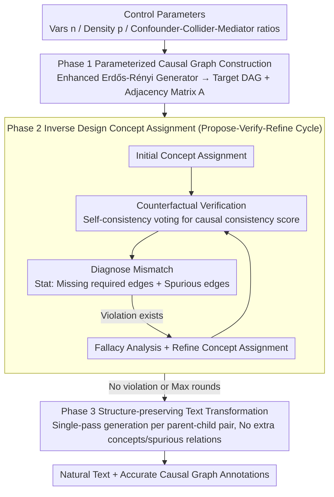

# iTAG: Inverse Design for Natural Text Generation with Accurate Causal Graph Annotations

**Conference**: ACL 2026  
**arXiv**: [2604.06902](https://arxiv.org/abs/2604.06902)  
**Code**: Yes  
**Area**: Causal Inference / Text Generation  
**Keywords**: Causal graph annotation, inverse design, text generation, benchmark data, CoT reasoning

## TL;DR
The iTAG framework is proposed, which utilizes a three-stage inverse design pipeline (parameterized causal graph construction → CoT-based concept assignment → structure-preserving text generation) to generate data with both extremely high causal graph annotation accuracy and text naturalness. This serves as a practical substitute for real annotated data in benchmarking text causal discovery algorithms.

## Background & Motivation

**Background**: Causal discovery research suffers from a severe lack of text data with causal ground-truth annotations; prohibitive manual annotation costs are the fundamental barrier. Existing methods are categorized into template-based methods and direct LLM generation methods.

**Limitations of Prior Work**: (1) Template-based methods (e.g., "[A] results in [B]") guarantee annotation accuracy but produce highly unnatural text; (2) Direct LLM generation methods produce natural text but do not verify whether the generated concepts align with target causal relations, leading to unstable annotation accuracy (F1 drops from ~0.78 to ~0.52 as graph size increases).

**Key Challenge**: A tradeoff dilemma exists between text naturalness and causal graph annotation accuracy—existing methods cannot satisfy both simultaneously, rendering them unreliable as substitutes for real annotated data.

**Goal**: To generate text data that satisfies three conditions: (1) accurate causal graph annotations, (2) indistinguishable natural text, and (3) usability for evaluating practical causal discovery algorithms.

**Key Insight**: Concept assignment is treated as an inverse design problem—taking the causal graph as the target, concept selection is iteratively checked and refined via CoT reasoning to ensure that induced relations between concepts remain consistent with the target causal graph.

**Core Idea**: An "inverse design concept assignment" step is inserted before LLM text generation, using a CoT-guided propose-verify-refine cycle to ensure that the causal relations among concepts match the target graph.

## Method

### Overall Architecture
iTAG is a training-free, three-stage inverse design pipeline that directly employs LLM APIs (defaulting to Claude Opus) as the reasoning engine to translate a "desired causal graph" into "natural-sounding text with accurate annotations." The process begins with control parameters: Phase 1 constructs a parameterized causal DAG (Directed Acyclic Graph) and its adjacency matrix as the target ground truth; Phase 2, the core of the framework, replaces abstract nodes in the graph with real-world concepts one by one and uses counterfactual verification to ensure induced causal relations match the target graph; Phase 3 weaves the concept-labeled causal graph into fluent text. Contrary to the forward approach of "letting an LLM write text and then passively accepting its causal structure," iTAG treats the causal graph as a pre-fixed design goal, forcing the concept assignment to approximate it, thereby eliminating omissions and hallucinations at the source.

### Key Designs

**1. Phase 1 Parameterized Causal Graph Construction: Turning Structural Complexity into Adjustable Knobs**

To perform systematic benchmarking, the framework requires precise control over graph difficulty. iTAG utilizes an enhanced Erdős-Rényi DAG generator, exposing number of variables $n$, density $p$, degree constraints, confounder ratio $\gamma_c$, collider ratio $\gamma_v$, and mediator chains $\lambda$ as input parameters, and outputs the corresponding DAG and adjacency matrix $A$. This allows for the explicit creation of graph suites ranging from sparse to dense and from simple chains to complex structures containing confounders/colliders, providing a controlled difficulty gradient for accuracy and transferability evaluations.

**2. Phase 2 Inverse Design Concept Assignment: Injecting Graph Constraints via Propose-Verify-Refine Cycles**

This is the core of the framework. Existing LLM generation methods lack hard constraints at the graph level, leading to missing required edges and the assertion of spurious relations as the scale increases. iTAG explicitly models concept assignment as an inverse problem—taking the target graph $A$ as the expected output and concept assignment $C$ as the design variable, approximating it through the iterative cycle in Algorithm 1. Following initial concept assignment $C^{(0)}$, CounterfactualVerification estimates a causal consistency score $s_{ij}\in[0,1]$ for every pair of concepts via self-consistency voting. Subsequently, a diagnostic mismatch $\hat{\mathcal{L}}(C;A)$ is calculated, accounting for both "missing required edges" ($\ell^{\text{miss}}_{ij}=1-s_{ij}$) and "spurious causal relations" ($\ell^{\text{spur}}_{ij}=s_{ij}$). FallacyAnalysis sets a threshold on $s_{ij}$ to identify violations, and RefineConceptAssignment specifically replaces concepts while recording the historical best $C^{\star}$. This continues until no violations remain or the maximum rounds $K_{\max}$ are reached. To avoid circular reasoning, the verification backbone is typically separated from the proposer/refiner. This error-correction mechanism allows the concept assignment phase to converge in a median of 1.63 rounds, with a 99.1% success rate.

**3. Phase 3 Structure-preserving Text Transformation: Single-pass Generation on Purified Concepts**

Since Phase 2 already ensures that concepts are clear and non-overlapping, the text generation stage requires minimal structural adjustment. iTAG enumerates each parent-child node pair and prompts the LLM to weave them into fluent text, strictly forbidding the introduction of extra concepts or the assertion of causal relations for non-adjacent pairs. A single-pass generation approach is used here rather than another inverse design cycle; ablation studies show that adding cycles at the text stage yields only marginal gains at significant cost, thus concentrating verification pressure at the concept layer is more efficient.

## Key Experimental Results

### Main Results
Annotation Accuracy (Experiment 1, n=3-10):

| Method | F1_Ga (↑) | SHD (↓) | SID (↓) | Naturalness F1_D (↓) |
|------|----------|---------|---------|---------------|
| Template-based | 1.00 (Perfect) | 0 | 0 | 0.81-0.99 (Highly detectable)|
| LLM-dependent | 0.78→0.52 | High | High | 0.57-0.64 |
| LLM-dep+CA | Better than baseline | Medium | Medium | 0.54-0.60 |
| **iTAG** | **≥0.95** | **~1 edge** | **<1** | **0.51-0.57 (Near-random)**|

### Transferability Experiments

| Metric | Pearson $r$ | Spearman $\rho$ | $R^2$ |
|------|-----------|----------------|-------|
| F1_G | 0.928 | 0.926 | 0.861 |
| SHD | 0.927 | 0.921 | 0.859 |
| SID | 0.921 | 0.928 | 0.848 |

### Key Findings
- iTAG is the only method to simultaneously satisfy high annotation accuracy (F1 ≥ 0.95) and high naturalness (detection rates near random guessing).
- Annotation accuracy remains stable within the n=3-10 range for iTAG, whereas LLM baselines degrade severely as graph size increases.
- Causal discovery algorithm evaluations on generated corpora are highly correlated with evaluations on real-world corpora (Pearson r ≥ 0.921, p < 0.001), remaining significant even after centering.
- Phase 2 concept assignment is the critical contribution: ablations show that one-shot concept assignment offers limited improvement, and inverse design only during generation yields marginal benefits.

## Highlights & Insights
- Modeling concept assignment as an inverse design problem is a clever innovation—using a known causal graph as the target to "reverse" search for appropriate concepts, rather than "forward" generating graphs from concepts that might be inconsistent.
- Simultaneously achieving high accuracy and high naturalness breaks the tradeoff dilemma of existing methods, serving as a methodological benchmark.
- Transferability validation (significant correlation remains after centering to remove the confounding effect of $n$) provides rigorous statistical support for the validity of the surrogate data.

## Limitations & Future Work
- Only adjacency-level causal graphs (presence/absence of edges) are supported; structural equation models (effect sizes/functional forms) are not yet supported.
- Verification is limited to small graphs (3-10 variables) and three English-language domains.
- Spurious edge verification is inherently more difficult than required edge verification, potentially leaving residual errors.
- Future work may expand to larger/hierarchical graphs, multiple languages, and SEM annotations with effect parameters.

## Related Work & Insights
- **vs Template-based**: Templates are perfectly accurate but extremely unnatural (detection rates 0.81-0.99); iTAG achieves naturalness while maintaining accuracy.
- **vs LLM-dependent (Phatak et al.)**: Direct LLM generation is natural but does not verify causal consistency; iTAG resolves this through inverse design verification.
- **vs Gandee et al. (faithful generation)**: They also note that LLM generation may omit or hallucinate causal relations; iTAG addresses this at the source via the concept layer.

## Rating
- Novelty: ⭐⭐⭐⭐⭐ The methodology of inverse design + CoT concept assignment is highly innovative.
- Experimental Thoroughness: ⭐⭐⭐⭐⭐ Three experiments (accuracy/naturalness/transferability) cover all evaluation needs with rigorous statistics.
- Writing Quality: ⭐⭐⭐⭐⭐ Problem definitions are clear, the three desiderata drive the logic, and limitation discussions are honest and thorough.
- Value: ⭐⭐⭐⭐⭐ Provides an important benchmarking tool for the field of text-based causal discovery.

<!-- RELATED:START -->

## Related Papers

- [\[ICML 2025\] Isolated Causal Effects of Natural Language](../../ICML2025/causal_inference/isolated_causal_effects_of_natural_language.md)
- [\[ACL 2026\] Parallel Universes, Parallel Languages: A Comprehensive Study on LLM-based Multilingual Counterfactual Example Generation](parallel_universes_parallel_languages_a_comprehensive_study_on_llm-based_multili.md)
- [\[CVPR 2026\] CGU-Bayes: Causal Graph Uncertainty-Guided Bayesian Inference for Domain Generalization](../../CVPR2026/causal_inference/cgu-bayes_causal_graph_uncertainty-guided_bayesian_inference_for_domain_generali.md)
- [\[ACL 2025\] Causal Graph based Event Reasoning using Semantic Relation Experts](../../ACL2025/causal_inference/causal_graph_based_event_reasoning_using_semantic_relation_experts.md)
- [\[ACL 2025\] CausalRAG: Integrating Causal Graphs into Retrieval-Augmented Generation](../../ACL2025/causal_inference/causalrag_integrating_causal_graphs_into_retrieval-augmented_generation.md)

<!-- RELATED:END -->
