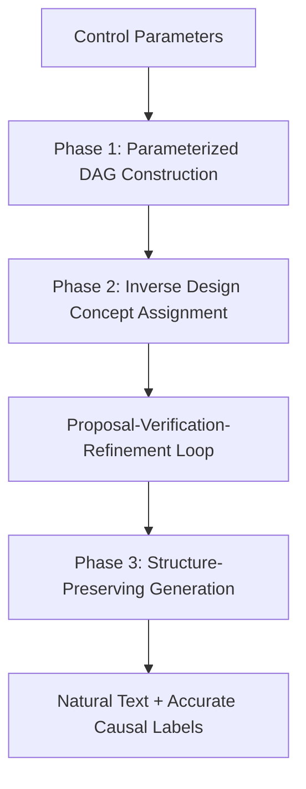

# iTAG: Inverse Design for Natural Text Generation with Accurate Causal Graph Annotations

**Conference**: ACL 2026  
**arXiv**: [2604.06902](https://arxiv.org/abs/2604.06902)  
**Code**: Yes  
**Area**: Causal Inference / Text Generation  
**Keywords**: Causal Graph Annotation, Inverse Design, Text Generation, Benchmark Data, CoT Reasoning

## TL;DR
The iTAG framework is proposed, using a three-phase inverse design process (parameterized causal graph construction → CoT-based concept assignment → structure-preserving text generation) to generate data that possesses both extremely high causal graph annotation accuracy and text naturalness, serving as a practical surrogate for real annotated data in benchmarking text causal discovery algorithms.

## Background & Motivation

**Background**: Causal discovery research suffers from a severe lack of text data with causal annotations as ground truth, primarily due to the prohibitive cost of manual annotation. Existing methods fall into two categories: template-based methods and direct LLM generation methods.

**Limitations of Prior Work**: (1) Template-based methods (e.g., "[A] results in [B]") ensure annotation accuracy but produce highly unnatural text; (2) Direct LLM generation methods produce natural text but fail to verify whether the generated concepts align with the target causal relationships, leading to unstable annotation accuracy (F1 drops from ~0.78 to ~0.52 as graph scale increases).

**Key Challenge**: There is a trade-off between text naturalness and causal graph annotation accuracy—existing methods cannot satisfy both simultaneously, making them unreliable substitutes for real annotated data.

**Goal**: To generate text data that simultaneously satisfies three conditions: (1) accurate causal graph annotations, (2) indistinguishable text naturalness, and (3) utility for evaluating actual causal discovery algorithms.

**Key Insight**: Concept assignment is treated as an inverse design problem—taking the causal graph as the target and iteratively checking and refining concept selection via CoT reasoning to ensure the induced relationships between concepts match the target causal structure.

**Core Idea**: An "Inverse Design Concept Assignment" step is added before LLM text generation, using a CoT-guided proposal-verification-refinement loop to ensure the causal relationships between concepts align with the target graph.

## Method

### Overall Architecture
A three-phase workflow: Phase 1 generates a parameterized causal DAG and adjacency matrix from control parameters; Phase 2 replaces abstract nodes with real-world concepts via an inverse design loop to ensure structural consistency; Phase 3 transforms the conceptualized causal graph into natural language text.

### Key Designs

1.  **Phase 2: Inverse Design Concept Assignment**:
    - **Function**: Replaces abstract nodes with real-world concepts while maintaining the causal structure.
    - **Mechanism**: Implements a proposal-verification-refinement loop using Algorithm 1. After initial concept assignment, `CounterfactualVerification` calculates causal consistency $s_{ij} \in [0,1]$ for each pair of concepts via self-consistency voting. The diagnostic mismatch degree $\mathcal{L}(C; A)$ is defined to include "missing required edges" and "spurious causes on non-edges." `FallacyAnalysis` identifies violation sets, and `RefineConceptAssignment` refines the concepts. Iterations continue until no violations occur or $K_{\max}$ is reached; the median convergence is 1.63 rounds with a 99.1% success rate.
    - **Design Motivation**: Existing LLM methods lack hard constraints at the full-graph level, leading to omissions and hallucinations; inverse design injects structural constraints into the generation process via iterative error correction.

2.  **Phase 1: Parameterized Causal Graph Construction**:
    - **Function**: Generates structured causal DAGs from control parameters.
    - **Mechanism**: Uses an enhanced Erdős-Rényi DAG generator, taking parameters such as the number of variables $n$, density $p$, degree constraints, confounder ratio $\gamma_c$, collider ratio $\gamma_v$, and mediator chain count $\lambda$, to output the DAG and adjacency matrix.
    - **Design Motivation**: Provides explicit control over structural complexity, supporting systematic benchmarking.

3.  **Phase 3: Structure-Preserving Text Transformation**:
    - **Function**: Converts the causal graph and concepts into natural language text.
    - **Mechanism**: Enumerates parent-child node pairs and prompts the LLM to weave them into fluent text, while strictly prohibiting the introduction of extra concepts and avoiding causal assertions for non-edge pairs. A single generation pass is used rather than an additional inverse design loop (ablation shows marginal gains vs. high cost for extra loops).
    - **Design Motivation**: Phase 2 already ensures concepts are clear and non-overlapping; LLMs rarely make structural errors under these constraints.

### Loss & Training
The entire framework is training-free, utilizing LLM APIs (defaulting to Claude Opus) as the reasoning engine.

## Key Experimental Results

### Main Results
Annotation Accuracy (Experiment 1, $n=3$ to $10$):

| Method | F1_Ga (↑) | SHD (↓) | SID (↓) | Naturalness F1_D (↓) |
| :--- | :--- | :--- | :--- | :--- |
| Template-based | 1.00 (Perfect) | 0 | 0 | 0.81-0.99 (Easy to detect) |
| LLM-dependent | 0.78→0.52 | High | High | 0.57-0.64 |
| LLM-dep+CA | Better than baseline | Medium | Medium | 0.54-0.60 |
| **Ours (iTAG)** | **≥0.95** | **~1 edge** | **<1** | **0.51-0.57 (Near random)** |

### Transferability Experiments

| Metric | Pearson $r$ | Spearman $\rho$ | $R^2$ |
| :--- | :--- | :--- | :--- |
| F1_G | 0.928 | 0.926 | 0.861 |
| SHD | 0.927 | 0.921 | 0.859 |
| SID | 0.921 | 0.928 | 0.848 |

### Key Findings
- iTAG is the only method that satisfies both high annotation accuracy (F1 $\ge$ 0.95) and high naturalness (detection rates near random guessing).
- Annotation accuracy remains stable within the $n=3$ to $10$ range, whereas LLM baselines degrade severely as graph scale increases.
- Causal discovery algorithm evaluations on generated corpora are highly correlated with evaluations on real corpora (Pearson $r \ge 0.921$, $p < 0.001$), remaining significant even after centralization.
- Phase 2 concept assignment is the critical contribution: ablation shows that one-shot concept assignment offers limited improvement, and inverse design during generation alone yields marginal benefits.

## Highlights & Insights
- Modeling concept assignment as an inverse design problem is a clever innovation—using a known causal graph as the target to "back-search" for suitable concepts, rather than "forward-generating" graphs from concepts which may lead to inconsistency.
- Achieving both high accuracy and high naturalness breaks the trade-off dilemma of existing methods, providing a methodological benchmark.
- Transferability validation (significant correlation even after removing the confounding effect of $n$ via centralization) provides rigorous statistical support for the validity of the surrogate data.

## Limitations & Future Work
- Only supports adjacency-level causal graphs (existence of edges), not Structural Equation Models (effect sizes/functional forms).
- Validation is limited to small graphs (3-10 variables) and three English domains.
- Non-edge verification is inherently more difficult than edge verification; residual errors may exist.
- Future work could extend to larger/hierarchical graphs, multi-lingual support, and SEM annotations with effect parameters.

## Related Work & Insights
- **vs Template-based**: Templates are perfectly accurate but highly unnatural (detection rate 0.81-0.99); iTAG achieves naturalness while maintaining accuracy.
- **vs LLM-dependent (Phatak et al.)**: Direct LLM generation is natural but fails to verify causal consistency; iTAG resolves this via inverse design verification.
- **vs Gandee et al. (faithful generation)**: They also noted that LLM generations may omit or hallucinate causal relationships; iTAG addresses this at the source of concept assignment.

## Rating
- **Novelty**: ⭐⭐⭐⭐⭐ Strong methodological innovation with inverse design + CoT concept assignment.
- **Experimental Thoroughness**: ⭐⭐⭐⭐⭐ Three experiments (accuracy/naturalness/transferability) cover all evaluation needs with statistical rigor.
- **Writing Quality**: ⭐⭐⭐⭐⭐ Clear problem definition, logical progression of the three desiderata, and honest discussion of limitations.
- **Value**: ⭐⭐⭐⭐⭐ Provides an important benchmarking tool for the text causal discovery field.

<!-- RELATED:START -->

## Related Papers

- [\[ICLR 2026\] AgentTrace: Causal Graph Tracing for Root Cause Analysis in Deployed Multi-Agent Systems](../../ICLR2026/causal_inference/agenttrace_causal_graph_tracing_for_root_cause_analysis_in_deployed_multi-agent_.md)
- [\[ACL 2026\] Parallel Universes, Parallel Languages: A Comprehensive Study on LLM-based Multilingual Counterfactual Example Generation](parallel_universes_parallel_languages_a_comprehensive_study_on_llm-based_multili.md)
- [\[ICCV 2025\] A Visual Leap in CLIP Compositionality Reasoning through Generation of Counterfactual Sets](../../ICCV2025/causal_inference/a_visual_leap_in_clip_compositionality_reasoning_through_gen.md)
- [\[ACL 2026\] ClimateCause: Complex and Implicit Causal Structures in Climate Reports](climatecause_complex_and_implicit_causal_structures_in_climate_reports.md)
- [\[ACL 2026\] Learning Invariant Modality Representation for Robust Multimodal Learning from a Causal Inference Perspective](learning_invariant_modality_representation_for_robust_multimodal_learning_from_a.md)

<!-- RELATED:END -->
