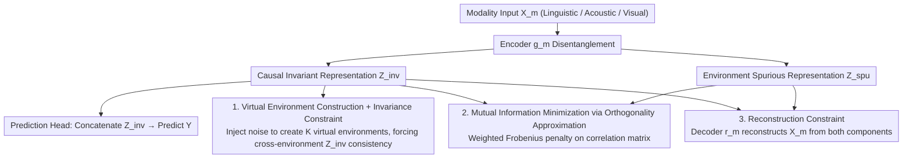

# Learning Invariant Modality Representation for Robust Multimodal Learning from a Causal Inference Perspective

**Conference**: ACL 2026  
**arXiv**: [2604.18460](https://arxiv.org/abs/2604.18460)  
**Code**: [GitHub](https://github.com/TmacMai/CmIR)  
**Area**: Audio & Speech  
**Keywords**: Causal Invariant Representation, Multimodal Sentiment Analysis, Out-of-Distribution Generalization, Feature Disentanglement, Virtual Environments

## TL;DR

This paper proposes CmIR (Causal Modality Invariant Representation learning), which explicitly disentangles each modality into causal invariant representations and environment-specific spurious representations based on causal inference theory. Through an elegant objective function incorporating invariance constraints, mutual information constraints, and reconstruction constraints, it ensures that invariant representations possess stable predictive relationships across environments. It achieves SOTA on multimodal sentiment, humor, and sarcasm detection, showing particularly outstanding performance in OOD and noisy scenarios.

## Background & Motivation

**Background**: Multimodal sentiment computing predicts emotions by integrating linguistic, acoustic, and visual modalities. Existing methods perform well on in-distribution tests but often learn spurious cross-modal correlations within the training data.

**Limitations of Prior Work**: (1) Models may over-rely on a speaker's consistent smile (spurious visual feature) rather than semantic content; (2) Noisy modalities (e.g., background noise/low-resolution video) further undermine spurious correlations, exacerbating the generalization gap; (3) Existing causal methods either lack theoretical guarantees or target specific biases (e.g., speaker bias) and are not generalizable.

**Key Challenge**: A general framework is needed to distinguish between causal and spurious features—without relying on prior assumptions about bias types or predefined bias labels.

**Goal**: Establish a general framework with theoretical guarantees based on causal inference to disentangle each modality into causal invariant and environmental spurious components.

**Key Insight**: The core property of causal invariant representations is predictive stability across environments—if $P(Y|Z_m^{\text{inv}}, E=e_1) = P(Y|Z_m^{\text{inv}}, E=e_2)$, then $Z_m^{\text{inv}}$ contains only causal features.

**Core Idea**: Learn disentanglement via tri-constraint optimization: invariance constraints ensure consistent cross-environment prediction, mutual information constraints ensure the independence of the two components, and reconstruction constraints ensure no information loss. When explicit environment labels are missing, virtual environments are simulated by injecting noise of varying intensities into the original features.

## Method

### Overall Architecture

CmIR splits each modality into "causal invariant" and "environment spurious" halves, allowing only the former to participate in prediction, thereby blocking accidental cross-modal correlations in training data from decision-making. Given a modality input $X_m$, the encoder $g_m$ disentangles it into $(Z_m^{\text{inv}}, Z_m^{\text{spu}})$. The prediction head consumes only the concatenation of all modality-invariant representations $\{Z_m^{\text{inv}}\}_{m=1}^M$. Simultaneously, the decoder $r_m$ must reconstruct the original input from these two halves. During training, the model jointly optimizes through a "encoding disentanglement → invariant representation prediction + three constraints → decoding reconstruction" loop. The three constraints solidify the disentanglement from the perspectives of causality, purity, and completeness, ensuring that invariant representations only carry causal signals that are stable across environments.

### Key Designs

**1. Virtual Environment Construction + Invariance Constraint: Enforcing cross-environment invariance without environment labels**

The defining property of causal invariant representation is predictive stability across environments, but most multimodal datasets lack explicit environment labels. CmIR assigns a virtual environment $e\in\{1,\dots,K\}$ to each sample and creates environmental differences by injecting additive Gaussian noise with intensity $\alpha^{(e)}=\alpha^{(1)}\cdot e$, then requires invariant representations extracted under different environments to be consistent: $\mathcal{R}_{\text{inv}}^{(m)}=\sum_{e_1\neq e_2}\|Z_m^{\text{inv},(e_1)}-Z_m^{\text{inv},(e_2)}\|_1$. Compared to KL divergence, this L1 consistency is stronger—if representations are forced to be equal under different perturbations, the distributions naturally align—and it is applicable to both classification and regression without training unimodal predictors.

**2. Mutual Information Minimization via Orthogonality Approximation: Using weighted Frobenius penalty of the correlation matrix**

To ensure invariant and spurious components capture different semantics, the ideal goal is to minimize their mutual information, which is not directly computable. CmIR approximates this using orthogonality, a necessary condition for independence: it calculates a normalized correlation matrix $\bm{C}^m=\text{Nor}(\bm{Z}_m^{\text{inv}})\cdot\text{Nor}(\bm{Z}_m^{\text{spu}})^\top$ within each batch and penalizes it with the weighted Frobenius norm—diagonal terms (orthogonality of two components for the same sample) have a weight of 1, while off-diagonal weights are $\alpha<1$. This term works with invariance and reconstruction constraints to stably segment semantics.

**3. Reconstruction Constraint to Prevent Degeneration: Forcing both components to jointly preserve all input information**

Without invariance and orthogonality constraints, the model might fall into degenerate solutions where one component captures all information while the other collapses. CmIR introduces a decoder $r_m$ to reconstruct the original features: $\mathcal{R}_{\text{rec}}^{(m)}=\|X_m-r_m(Z_m^{\text{inv}},Z_m^{\text{spu}})\|_2^2$. The reconstruction term ensures disentanglement is a "division of labor" rather than "discarding," keeping the combined representation full, which blocks trivial solutions at the information level.

### Loss & Training

The total objective sums the prediction loss with three modality-level constraints: $\mathcal{L}=\mathcal{L}_{\text{pred}}+\sum_{m=1}^{M}\lambda_1\mathcal{R}_{\text{inv}}^{(m)}+\lambda_2\mathcal{R}_{\text{dec}}^{(m)}+\lambda_3\mathcal{R}_{\text{rec}}^{(m)}$, where $\lambda_1, \lambda_2, \lambda_3$ balance invariance, independence, and reconstruction. Theoretically, the authors provide proofs for three theorems: the existence and extractability of invariant representations, and their OOD risk advantage over spurious representations, providing formal support for the constraints.

## Key Experimental Results

### Main Results

Evaluated on CMU-MOSI/MOSEI/CH-SIMS-v2 (sentiment) + UR-FUNNY (humor) + MUStARD (sarcasm). CmIR achieved SOTA in both standard and OOD settings.

### Key Findings

- In OOD settings (CMU-MOSI OOD), CmIR's advantage is more pronounced—confirming the generalization benefit of causal invariant representations.
- In noisy modality tests, CmIR's degradation is significantly smaller than baselines—the isolation of spurious components makes the model more robust to noise.
- Ablation Study proves all three constraints are indispensable—removing any leads to performance drops.

## Highlights & Insights

- The tri-constraint framework design is elegant—invariance ensures "causality," orthogonality ensures "purity," and reconstruction ensures "completeness."
- Virtual environment construction is a practical compromise—while less precise than real environment labels, it provides a viable solution for datasets lacking such labels.
- Theoretical guarantees (three theorems) provide a solid foundation for the framework.

## Limitations & Future Work

- Virtual environment construction relies on the additive Gaussian noise assumption, which may not fully reflect real-world distribution shifts.
- Hyperparameters (number of environments $K$, noise coefficient $\alpha$, three $\lambda$ values) require tuning.
- Encoders/decoders are simple MLPs; stronger architectures might further improve performance.

## Related Work & Insights

- **vs IRM**: CmIR extends Invariant Risk Minimization from unimodal contexts to multimodal disentanglement.
- **vs Existing Multimodal Causal Methods**: While others target specific biases (speaker/modality), CmIR is a general framework that does not rely on bias assumptions.

## Rating

- Novelty: ⭐⭐⭐⭐⭐ First systematic combination of causal invariant representation learning with feature disentanglement in MAC.
- Experimental Thoroughness: ⭐⭐⭐⭐⭐ 6 datasets + standard/OOD/noise settings + full ablation + theoretical proofs.
- Writing Quality: ⭐⭐⭐⭐⭐ Rigorous theoretical derivation and comprehensive experimentation.
- Value: ⭐⭐⭐⭐⭐ Paradigmatic contribution to multimodal robustness research.

<!-- RELATED:START -->

## Related Papers

- [\[ICLR 2026\] Learning Robust Intervention Representations with Delta Embeddings](../../ICLR2026/causal_inference/learning_robust_intervention_representations_with_delta_embeddings.md)
- [\[ECCV 2024\] Integrating Markov Blanket Discovery into Causal Representation Learning for Domain Generalization](../../ECCV2024/causal_inference/integrating_markov_blanket_discovery_into_causal_representation_learning_for_dom.md)
- [\[ICML 2025\] Learning Time-Aware Causal Representation for Model Generalization in Evolving Domains](../../ICML2025/causal_inference/learning_time-aware_causal_representation_for_model_generalization_in_evolving_d.md)
- [\[ACL 2026\] Function Words as Statistical Cues for Language Learning](function_words_as_statistical_cues_for_language_learning.md)
- [\[ECCV 2024\] Learning Chain of Counterfactual Thought for Bias-Robust Vision-Language Reasoning](../../ECCV2024/causal_inference/learning_chain_of_counterfactual_thought_for_bias-robust_vision-language_reasoni.md)

<!-- RELATED:END -->
