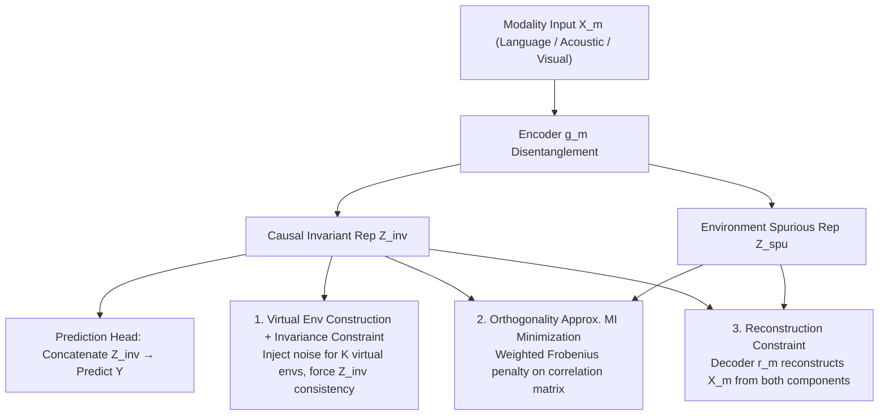

# Learning Invariant Modality Representation for Robust Multimodal Learning from a Causal Inference Perspective

**Conference**: ACL 2026  
**arXiv**: [2604.18460](https://arxiv.org/abs/2604.18460)  
**Code**: [GitHub](https://github.com/TmacMai/CmIR)  
**Area**: Audio Speech  
**Keywords**: Causal Invariant Representation, Multimodal Sentiment Analysis, Out-of-Distribution Generalization, Feature Disentanglement, Virtual Environments

## TL;DR

This paper proposes CmIR (Causal Modality Invariant Representation learning), which explicitly disentangles each modality into causal invariant representations and environment-specific spurious representations based on causal inference theory. Through an elegant objective function combining invariance constraints, mutual information constraints, and reconstruction constraints, it ensures that invariant representations maintain stable predictive relationships across environments. It achieves SOTA performance in multimodal sentiment, humor, and sarcasm detection, particularly excelling in OOD and noisy scenarios.

## Background & Motivation

**Background**: Multimodal sentiment computing predicts emotions by integrating linguistic, acoustic, and visual modalities. Existing methods perform well on in-distribution tests but often learn spurious cross-modal correlations present in the training data.

**Limitations of Prior Work**: (1) Models may over-rely on consistent smiling (a spurious visual feature) rather than semantic content; (2) Noisy modalities (e.g., background noise or low-resolution video) further undermine spurious correlations, exacerbating the generalization gap; (3) Existing causal methods either lack theoretical guarantees or only target specific biases (e.g., speaker bias) without being generalizable.

**Key Challenge**: A general framework is needed to distinguish between causal and spurious features without relying on prior assumptions about bias types or pre-defined bias labels.

**Goal**: Establish a theoretically guaranteed general framework based on causal inference to disentangle each modality into causal invariant and environment-spurious components.

**Key Insight**: The core property of a causal invariant representation is predictive stability across environments—if $P(Y|Z_m^{\text{inv}}, E=e_1) = P(Y|Z_m^{\text{inv}}, E=e_2)$, then $Z_m^{\text{inv}}$ contains only causal features.

**Core Idea**: Learn disentanglement via a three-constraint optimization: invariance constraints ensure consistent predictions across environments, mutual information constraints ensure independence between components, and reconstruction constraints ensure no information loss. In the absence of explicit environment labels, virtual environments are simulated by injecting noise of varying intensities into the original features.

## Method

### Overall Architecture

CmIR splits each modality into "causal invariant" and "environment spurious" halves, allowing only the former to participate in prediction, thereby excluding accidental cross-modal correlations in the training data from the decision-making process. Given modality input $X_m$, the encoder $g_m$ disentangles it into $(Z_m^{\text{inv}}, Z_m^{\text{spu}})$. The prediction head consumes only the concatenation of invariant representations from all modalities $\{Z_m^{\text{inv}}\}_{m=1}^M$. Simultaneously, the decoder $r_m$ must be able to reconstruct the original input from both halves. During training, the model is jointly optimized through a loop of "encoding disentanglement → invariant representation prediction + three constraints → decoding reconstruction." These three constraints solidify the disentanglement from the perspectives of causality, purity, and completeness, ensuring the invariant representation carries only cross-environment stable causal signals.

### Key Designs

**1. Virtual Environment Construction + Invariance Constraint: Forcing cross-environment invariance without environment labels**

The defining property of causal invariant representations is predictive stability across environments, yet most multimodal datasets lack explicit environment labels. Ours assigns each sample to a virtual environment $e\in\{1,\dots,K\}$ and artificially creates environmental differences by injecting additive Gaussian noise with intensity $\alpha^{(e)}=\alpha^{(1)}\cdot e$. The model is then required to maintain consistency between invariant representations extracted under different environments: $\mathcal{R}_{\text{inv}}^{(m)}=\sum_{e_1\neq e_2}\|Z_m^{\text{inv},(e_1)}-Z_m^{\text{inv},(e_2)}\|_1$. Compared to KL divergence constraints, this L1 consistency is stronger—if representations are forced to be identical after different perturbations, the distributions naturally become the same—and it is applicable to both classification and regression without training additional unimodal predictors.

**2. Mutual Information Minimization via Orthogonality Approximation: Approximating independence with weighted Frobenius penalty on correlation matrices**

To ensure that invariant and spurious components capture different semantics, the ideal goal is to minimize their mutual information, which is not directly computable. Ours approximates this via orthogonality, a necessary condition for independence. A normalized correlation matrix $\bm{C}^m=\text{Nor}(\bm{Z}_m^{\text{inv}})\cdot\text{Nor}(\bm{Z}_m^{\text{spu}})^\top$ is computed within each batch, and penalized using a weighted Frobenius norm—the diagonal terms (orthogonality of the two components for the same sample) have a weight of 1, while off-diagonal terms have a weight $\alpha<1$. This term works with invariance and reconstruction constraints to stably segment semantics.

**3. Reconstruction Constraint to Prevent Degeneracy: Forcing components to jointly retain full input information**

With only invariance and orthogonality constraints, the model might converge to trivial solutions: the invariant component absorbing all information while the spurious one collapses, or vice versa. Ours introduces a decoder $r_m$ to reconstruct the original features from both components: $\mathcal{R}_{\text{rec}}^{(m)}=\|X_m-r_m(Z_m^{\text{inv}},Z_m^{\text{spu}})\|_2^2$. This term ensures that disentanglement is a "division of labor" rather than "discarding info," keeping the joint components a complete representation of the input and blocking trivial solutions at the information level.

### Loss & Training

The total objective sums the prediction loss and three modality-level constraints: $\mathcal{L}=\mathcal{L}_{\text{pred}}+\sum_{m=1}^{M}\lambda_1\mathcal{R}_{\text{inv}}^{(m)}+\lambda_2\mathcal{R}_{\text{dec}}^{(m)}+\lambda_3\mathcal{R}_{\text{rec}}^{(m)}$, where $\lambda_1, \lambda_2, \lambda_3$ balance invariance, independence, and reconstruction. Theoretically, the authors provide proofs for three theorems: the existence and extractability of invariant representations, and their OOD risk advantage over spurious representations, supporting the constraint set.

## Key Experimental Results

### Main Results

Evaluated on CMU-MOSI/MOSEI/CH-SIMS-v2 (Sentiment) + UR-FUNNY (Humor) + MUStARD (Sarcasm). CmIR achieves SOTA in both standard and OOD settings.

### Key Findings

- In OOD settings (CMU-MOSI OOD), the advantage of CmIR is more pronounced, confirming the generalization benefit of causal invariant representations.
- In noisy modality tests, the performance degradation of CmIR is significantly less than baselines, as isolating spurious components makes the model more robust to noise.
- Ablations prove all three constraints are indispensable; removing any leads to performance drops.

## Highlights & Insights

- The three-constraint framework design is elegant: invariance ensures "causality," orthogonality ensures "purity," and reconstruction ensures "completeness."
- Virtual environment construction is a practical trade-off; although less precise than real labels, it provides a feasible solution for datasets lacking them.
- Theoretical guarantees (three theorems) provide a solid foundation for the framework.

## Limitations & Future Work

- Virtual environment construction relies on additive Gaussian noise assumptions, which may not fully reflect real distribution shifts.
- Hyperparameters (number of environments $K$, noise coefficient $\alpha$, three $\lambda$ values) require tuning.
- Encoder/decoder architectures are simple MLPs; stronger architectures might further improve results.

## Related Work & Insights

- **vs IRM**: While Invariant Risk Minimization targets unimodal data, CmIR extends it to multimodal disentanglement.
- **vs Existing Multimodal Causal Methods**: Unlike methods targeting specific biases (speaker/modality), CmIR is a general framework independent of bias assumptions.

## Rating

- Novelty: ⭐⭐⭐⭐⭐ First to systematically combine causal invariant representation learning with feature disentanglement in MAC.
- Experimental Thoroughness: ⭐⭐⭐⭐⭐ 6 datasets + Standard/OOD/Noise settings + full ablation + theoretical proofs.
- Writing Quality: ⭐⭐⭐⭐⭐ Rigorous theoretical derivation and comprehensive experiments.
- Value: ⭐⭐⭐⭐⭐ Paradigm-level contribution to multimodal robustness research.

<!-- RELATED:START -->

## Related Papers

- [\[ICLR 2026\] Learning Robust Intervention Representations with Delta Embeddings](../../ICLR2026/causal_inference/learning_robust_intervention_representations_with_delta_embeddings.md)
- [\[ICLR 2026\] Beyond DAGs: A Latent Partial Causal Model for Multimodal Learning](../../ICLR2026/causal_inference/beyond_dags_a_latent_partial_causal_model_for_multimodal_learning.md)
- [\[ACL 2026\] Function Words as Statistical Cues for Language Learning](function_words_as_statistical_cues_for_language_learning.md)
- [\[ECCV 2024\] Integrating Markov Blanket Discovery into Causal Representation Learning for Domain Generalization](../../ECCV2024/causal_inference/integrating_markov_blanket_discovery_into_causal_representation_learning_for_dom.md)
- [\[ICML 2025\] Learning Time-Aware Causal Representation for Model Generalization in Evolving Domains](../../ICML2025/causal_inference/learning_time-aware_causal_representation_for_model_generalization_in_evolving_d.md)

<!-- RELATED:END -->
