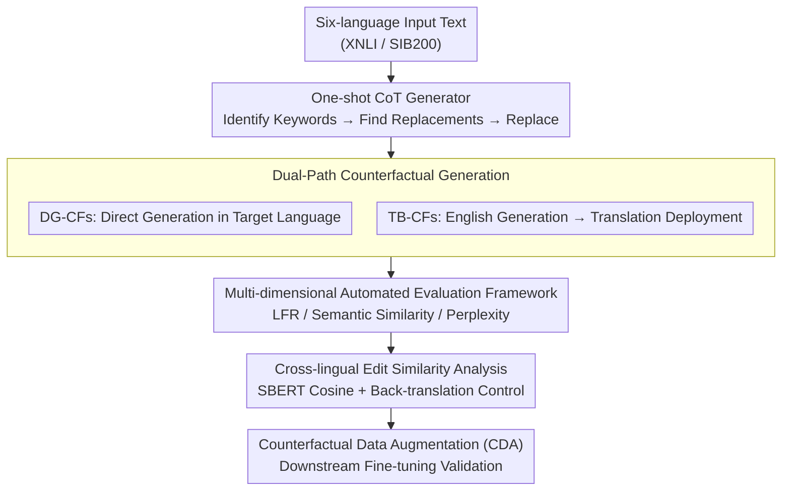

# Parallel Universes, Parallel Languages: A Comprehensive Study on LLM-based Multilingual Counterfactual Example Generation

**Conference**: ACL 2026  
**arXiv**: [2601.00263](https://arxiv.org/abs/2601.00263)  
**Code**: [GitHub](https://github.com/qiaw99/multicfe)  
**Area**: Causal Inference  
**Keywords**: Multilingual counterfactual generation, counterfactual explanation, data augmentation, cross-lingual consistency, LLM multilingual capability

## TL;DR

This paper systematically investigates the multilingual counterfactual generation capabilities of LLMs across six languages. By comparing direct generation and translation-based paths, it finds that the translation path yields higher label flip rates but requires more edits. It identifies four common error patterns and validates that multilingual counterfactual data augmentation outperforms cross-lingual augmentation, particularly for low-resource languages.

## Background & Motivation

**Background**: Counterfactual examples refer to samples where the input is minimally edited to change the model's prediction, serving as an effective tool for explaining model behavior. Existing counterfactual generation methods (e.g., MICE, Polyjuice, ZeroCF) are evaluated almost exclusively on English data.

**Limitations of Prior Work**: While LLMs demonstrate powerful multilingual capabilities, their effectiveness in generating high-quality counterfactuals in non-English languages remains unclear. Cross-lingual analyses have revealed systematic behavioral differences between English and non-English settings, suggesting that English counterfactuals alone are insufficient to capture the full scope of model behavior.

**Key Challenge**: The relationship between LLM multilingual capabilities and counterfactual generation remains under-researched. Specifically, what is the quality gap between high-resource and low-resource languages? Which path is superior: direct generation or translation-based generation?

**Goal**: (1) Evaluate LLM quality for direct and translation-based counterfactual generation across six languages; (2) Analyze cross-lingual edit similarity; (3) Identify error types in multilingual counterfactuals; (4) Assess the effectiveness of multilingual counterfactual data augmentation.

**Key Insight**: Six languages (English, Arabic, German, Spanish, Hindi, Swahili) were selected to cover high-to-low resources and multiple writing systems. Three LLMs of varying scales (Qwen2.5-7B, Gemma3-27B, Llama3.3-70B) were evaluated on two multilingual datasets (XNLI, SIB200).

**Core Idea**: By systematically comparing direct generation (DG) and translation-based (TB) paths, the study reveals the capability boundaries, error patterns, and data augmentation benefits of LLM-based multilingual counterfactual generation, providing an empirical foundation for multilingual interpretability research.

## Method

### Overall Architecture

The paper does not propose a new model but constructs a systematic empirical pipeline. It uses a fixed one-shot Chain-of-Thought (CoT) counterfactual generator as a base (identifying keywords affecting prediction, finding replacement words to flip the label, and generating the final counterfactual). From this base, two paths for acquiring multilingual counterfactuals emerge: Direct Generation in the target language (DG-CFs) and Translation-Based generation from English (TB-CFs). Generated counterfactuals undergo automated evaluation across three dimensions (validity, similarity, fluency) and cross-lingual edit similarity analysis, ultimately being used for downstream validation in Counterfactual Data Augmentation (CDA).

### Key Designs

**1. Dual-Path Counterfactual Generation: Comparing "Direct Generation" and "Translation Deployment" strategies**

Two natural ways to acquire multilingual counterfactuals are evaluated using the same one-shot CoT generator for comparability. DG-CFs execute the "keyword identification → replacement search → replacement generation" steps directly in the target language. TB-CFs generate counterfactuals in English first, where LLMs perform best, and then translate them into the target language using the same LLM. Both paths consistently use English prompts to isolate language variables to the content rather than instructions. This design investigates whether borrowing English performance via translation outweighs the introduction of translation noise.

**2. Multi-dimensional Evaluation Framework: Balancing Validity, Mini-edit property, and Naturalness**

Three metrics are used to characterize counterfactual quality. Validity is measured by the Label Flip Rate (LFR), representing the proportion of samples that successfully change the model prediction: $LFR = \frac{1}{N}\sum_{i=1}^{N}\mathbb{1}(\mathcal{M}(\tilde{x}_i) \neq \mathcal{M}(x_i))$. Mini-edit property is assessed via Textual Similarity using multilingual SBERT. Naturalness is evaluated using Perplexity from mGPT-1.3B. These metrics revealed the counter-intuitive phenomenon that TB-CFs often achieve higher LFR but lower similarity and higher perplexity.

**3. Cross-lingual Edit Similarity Analysis: Quantifying consistency across perturbation strategies**

To determine if LLMs apply similar editing patterns across languages, pairwise cosine similarity between counterfactuals of different languages is calculated using multilingual SBERT. To eliminate surface-level linguistic differences, non-English counterfactuals are back-translated into English before similarity calculation. This approach confirms that editing patterns for European languages are highly similar, while Arabic and Swahili differ significantly.

### Loss & Training

Counterfactual generation is performed zero-shot/few-shot. Training occurs only during the downstream CDA validation phase: multilingual BERT is fine-tuned using augmented data. Two methods are compared: Cross-lingual CDA (training on English data plus counterfactuals) and Multilingual CDA (training on data and counterfactuals from all languages). The difference isolates the added value of producing multilingual counterfactuals over English-only counterfactuals.

## Key Experimental Results

### Main Results

**Label Flip Rate (LFR) for Direct Generation (DG-CFs)**

| Model | Dataset | en | ar | de | es | hi | sw |
|------|--------|----|----|----|----|----|----|
| Qwen2.5-7B | XNLI | 45.42% | 44.10% | 46.63% | 49.44% | 39.92% | 38.31% |
| Qwen2.5-7B | SIB200 | 92.16% | 89.22% | 77.45% | 72.55% | 89.71% | 84.80% |
| Llama3.3-70B | XNLI | 50.88% | 36.91% | 42.25% | 44.70% | 41.33% | 34.42% |
| Llama3.3-70B | SIB200 | 87.25% | 88.73% | 78.43% | 83.33% | 85.29% | 91.18% |

**TB-CFs vs. DG-CFs**: TB-CFs generally yield higher LFRs, but similarity is on average 15.44% lower, and perplexity is 38% higher.

### Ablation Study

**Multilingual vs. Cross-lingual CDA (Generated by Qwen2.5-7B)**

| Language | Cross-lingual CDA (XNLI) | Multilingual CDA (XNLI) | Cross-lingual CDA (SIB200) | Multilingual CDA (SIB200) |
|------|-------------------|-------------------|---------------------|---------------------|
| en | 69.86 (+1.16) | 73.45 (+1.23) | 82.80 (-1.00) | 85.86 (+3.03) |
| ar | 58.10 (-2.02) | 64.89 (+1.68) | 26.30 (+1.00) | 53.54 (-1.01) |
| de | 63.49 (+0.16) | 68.42 (+0.82) | 84.80 (-4.10) | 84.85 (-3.03) |
| sw | 48.92 (+0.26) | — | 63.60 (-1.00) | — |

### Key Findings

- English counterfactuals generally achieve the highest LFR, but are not necessarily optimal in terms of fluency or edit size.
- European languages (en, de, es) show highly similar edit patterns, whereas Arabic and Swahili patterns are distinct.
- Among four error types, copy-paste is most prevalent (avg. 6.7% for SIB200), and language confusion is more severe in low-resource languages.
- Multilingual CDA generally outperforms cross-lingual CDA, with the most significant gain in Arabic (avg. +64.45%), though it remains ineffective for Swahili.

## Highlights & Insights

- Provides the first systematic evaluation of LLM multilingual counterfactual generation, filling a gap in explainability research.
- The error taxonomy (copy-paste, negation, inconsistency, language confusion) offers practical directions for future improvements.
- Reveals a trade-off where higher LFR (via translation) often comes at the cost of lower quality, indicating that flipping labels is not the sole indicator of a "good" counterfactual.

## Limitations & Future Work

- Restricted to English prompts; the impact of target-language prompts remains unexplored.
- Basic generation method (one-shot CoT); advanced methods may yield different results.
- Poor CDA performance in low-resource languages like Swahili requires specialized strategies.
- Evaluation relies on automated metrics; manual evaluation was limited in scope.

## Related Work & Insights

- **vs. ZeroCF/FIZLE**: Extends these English-centric methods to six languages, uncovering new challenges in multilingual settings.
- **vs. Multilingual CDA (Liu et al., 2021)**: While prior work focused on machine-translated CDA, this study focuses on CDA derived from counterfactual explanations.
- **Insight**: Cross-lingual edit similarity analysis can inform future work on multilingual alignment and cross-lingual transfer.

## Rating

- Novelty: ⭐⭐⭐⭐ 
- Experimental Thoroughness: ⭐⭐⭐⭐⭐ 
- Writing Quality: ⭐⭐⭐⭐ 
- Value: ⭐⭐⭐⭐ 

<!-- RELATED:START -->

## Related Papers

- [\[ACL 2025\] FitCF: A Framework for Automatic Feature Importance-guided Counterfactual Example Generation](../../ACL2025/causal_inference/fitcf_a_framework_for_automatic_feature_importance-guided_counterfactual_example.md)
- [\[ICLR 2026\] On the Eligibility of LLMs for Counterfactual Reasoning: A Decompositional Study](../../ICLR2026/causal_inference/on_the_eligibility_of_llms_for_counterfactual_reasoning_a_decompositional_study.md)
- [\[ICML 2025\] E-LDA: Toward Interpretable LDA Topic Models with Strong Guarantees in Logarithmic Parallel Time](../../ICML2025/causal_inference/e-lda_toward_interpretable_lda_topic_models_with_strong_guarantees_in_logarithmi.md)
- [\[ACL 2026\] iTAG: Inverse Design for Natural Text Generation with Accurate Causal Graph Annotations](itag_inverse_design_for_natural_text_generation_with_accurate_causal_graph_annot.md)
- [\[ICLR 2026\] Function Induction and Task Generalization: An Interpretability Study with Off-by-One Addition](../../ICLR2026/causal_inference/function_induction_and_task_generalization_an_interpretability_study_with_off-by.md)

<!-- RELATED:END -->
