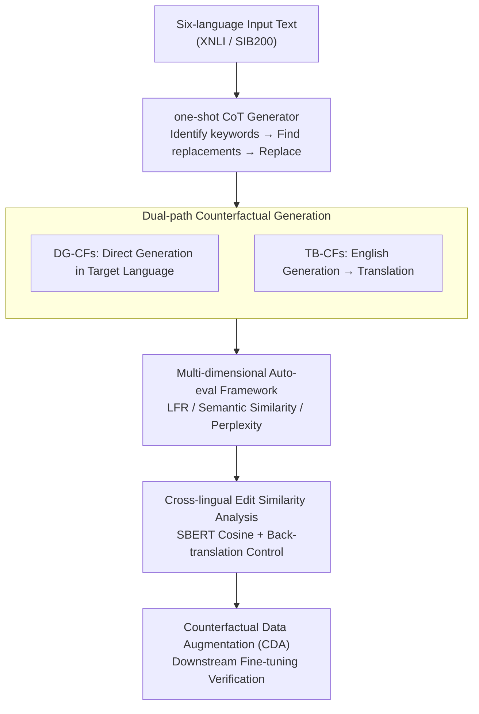

# Parallel Universes, Parallel Languages: A Comprehensive Study on LLM-based Multilingual Counterfactual Example Generation

**Conference**: ACL 2026  
**arXiv**: [2601.00263](https://arxiv.org/abs/2601.00263)  
**Code**: [GitHub](https://github.com/qiaw99/multicfe)  
**Area**: Causal Reasoning  
**Keywords**: Multilingual Counterfactual Generation, Counterfactual Explanation, Data Augmentation, Cross-lingual Consistency, LLM Multilingual Capability

## TL;DR

This paper systematically investigates the capability of LLMs to generate multilingual counterfactual examples across six languages. By comparing direct generation and translation-based paths, it finds that the translation path yields higher label flip rates but requires more editing. The study identifies four common error modes and verifies that multilingual counterfactual data augmentation outperforms cross-lingual augmentation, being particularly effective for low-resource languages.

## Background & Motivation

**Background**: Counterfactual examples refer to samples generated by applying minimal edits to the input such that the model's prediction changes. They are effective tools for explaining model behavior. Existing counterfactual generation methods (e.g., MICE, Polyjuice, ZeroCF, etc.) are evaluated almost exclusively on English data.

**Limitations of Prior Work**: While LLMs have demonstrated powerful multilingual capabilities, their effectiveness in generating high-quality counterfactuals in non-English languages remains unclear. Cross-lingual analysis has revealed systematic behavioral differences between English and non-English languages, suggesting that English counterfactuals alone cannot capture the full spectrum of model behavior.

**Key Challenge**: The relationship between the multilingual capabilities of LLMs and their counterfactual generation capabilities has not been systematically studied—how large is the quality gap between high-resource and low-resource languages? Which is superior: the translation path or the direct generation path?

**Goal**: (1) Evaluate the quality of counterfactuals generated by LLMs via direct and translation paths across six languages; (2) Analyze the similarity of edits across languages; (3) Identify error types in multilingual counterfactuals; (4) Assess the effectiveness of multilingual counterfactual data augmentation.

**Key Insight**: The authors select six languages (English, Arabic, German, Spanish, Hindi, Swahili) covering high to low resources and various writing systems. They conduct a comprehensive evaluation using three LLMs of different scales (Qwen2.5-7B, Gemma3-27B, Llama3.3-70B) on two multilingual datasets (XNLI, SIB200).

**Core Idea**: By systematically comparing the direct generation and translation-based paths, this work reveals the capability boundaries, error patterns, and data augmentation effects of LLM-based multilingual counterfactual generation, providing an empirical foundation for multilingual interpretability research.

## Method

### Overall Architecture

This paper does not propose a new model but rather builds a systematic empirical pipeline. Using a fixed one-shot Chain-of-Thought (CoT) counterfactual generator as the base (which identifies keywords influencing the prediction, finds replacement words to steer the label toward the target class, and generates the counterfactual), the authors fork two paths for obtaining multilingual counterfactuals: direct generation in the target language (DG-CFs) and generation in English followed by translation (TB-CFs). The generated counterfactuals undergo automatic evaluation across three dimensions—validity, similarity, and fluency—along with cross-lingual edit similarity analysis. Finally, they are utilized for downstream verification via Counterfactual Data Augmentation (CDA), decomposing the problem of "LLM multilingual counterfactual capability" into three layers: quality, patterns, and gains.

### Key Designs

**1. Dual-path Counterfactual Generation: Comparing "Direct Generation" and "Translation-based" strategies using the same base**

There are two natural ways to obtain multilingual counterfactuals. This paper ensures comparability by sharing the same one-shot CoT generator. DG-CFs completes the "identify keywords → find replacements → generate" steps directly in the target language. TB-CFs first generates counterfactuals in English (where LLMs excel) and translates them into the target language using the same LLM. Both paths consistently use English prompts to isolate the language variable to the content itself rather than the instructions. This design aims to quantify the trade-off between the high-quality English generation in the translation path and the potential noise introduced by translation.

**2. Multi-dimensional Auto-evaluation Framework: Balancing validity, minimal editing, and naturalness**

A single metric cannot characterize the quality of counterfactuals. The paper reports three dimensions: validity is measured by the Label Flip Rate ($LFR = \frac{1}{N}\sum_{i=1}^{N}\mathbb{1}(\mathcal{M}(\tilde{x}_i) \neq \mathcal{M}(x_i))$); minimal editing is measured via Textual Similarity using multilingual SBERT; and naturalness is assessed via Perplexity using mGPT-1.3B. These metrics reveal that the translation path often achieves higher LFR but lower similarity and higher perplexity.

**3. Cross-lingual Edit Similarity Analysis: Quantifying consistency in perturbation strategies**

To determine if LLMs employ similar editing patterns across languages, the authors calculate pairwise cosine similarity between counterfactuals using multilingual SBERT. To prevent surface-level linguistic differences from contaminating the results, they also back-translate non-English counterfactuals into English before calculating similarity. This reveals whether cross-lingual perturbations share common semantic principles.

### Loss & Training

Counterfactual generation itself does not involve training and is performed zero-shot/few-shot by frozen LLMs. Training occurs only during the downstream CDA verification: multilingual BERT is fine-tuned on augmented data. The study distinguishes between two methods: Cross-lingual CDA (English training data + counterfactuals) and Multilingual CDA (all languages' training data + counterfactuals) to measure the specific benefits of multilingual counterfactuals.

## Key Experimental Results

### Main Results

**Label Flip Rate (LFR) for Direct Generation (DG-CFs)**

| Model | Dataset | en | ar | de | es | hi | sw |
|------|--------|----|----|----|----|----|----|
| Qwen2.5-7B | XNLI | 45.42% | 44.10% | 46.63% | 49.44% | 39.92% | 38.31% |
| Qwen2.5-7B | SIB200 | 92.16% | 89.22% | 77.45% | 72.55% | 89.71% | 84.80% |
| Llama3.3-70B | XNLI | 50.88% | 36.91% | 42.25% | 44.70% | 41.33% | 34.42% |
| Llama3.3-70B | SIB200 | 87.25% | 88.73% | 78.43% | 83.33% | 85.29% | 91.18% |

**TB-CFs vs. DG-CFs**: TB-CFs achieves higher LFR in most cases, but textual similarity is 15.44% lower on average, and perplexity is 38% higher on average.

### Ablation Study

**Multilingual vs. Cross-lingual CDA (Generated by Qwen2.5-7B)**

| Language | Cross-lingual CDA (XNLI) | Multilingual CDA (XNLI) | Cross-lingual CDA (SIB200) | Multilingual CDA (SIB200) |
|------|-------------------|-------------------|---------------------|---------------------|
| en | 69.86 (+1.16) | 73.45 (+1.23) | 82.80 (-1.00) | 85.86 (+3.03) |
| ar | 58.10 (-2.02) | 64.89 (+1.68) | 26.30 (+1.00) | 53.54 (-1.01) |
| de | 63.49 (+0.16) | 68.42 (+0.82) | 84.80 (-4.10) | 84.85 (-3.03) |
| sw | 48.92 (+0.26) | — | 63.60 (-1.00) | — |

### Key Findings

- English counterfactuals generally have the highest LFR, but are not necessarily optimal in terms of fluency or edit distance; the "optimal language" depends on the specific metric.
- Edit patterns for European languages (en, de, es) are highly similar, while Arabic and Swahili show significantly different patterns.
- Among four error types, copy-paste is the most prevalent (avg. 6.7% on SIB200), and language confusion is more severe in low-resource languages.
- Multilingual CDA generally outperforms cross-lingual CDA, with the most significant improvement in Arabic (avg. +64.45%), though it remains largely ineffective for Swahili.

## Highlights & Insights

- This is the first systematic evaluation of LLM multilingual counterfactual generation, filling a critical gap in moving counterfactual explanations from English to a multilingual context.
- The error taxonomy (copy-paste, negation, inconsistency, language confusion) provides practical value for future refinements.
- The study identifies an interesting trade-off: higher label flip rates in the translation path do not equate to better counterfactual quality.

## Limitations & Future Work

- Only English prompts were used; the potential of target-language prompts remains unexplored.
- The generation method is basic (one-shot CoT); more advanced methods might yield different performance characteristics.
- CDA is ineffective for ultra-low-resource languages like Swahili, necessitating specialized strategies.
- Evaluation relies on automatic metrics; human evaluation coverage was limited.

## Related Work & Insights

- **vs. ZeroCF/FIZLE**: These methods evaluate only English; this study extends the scope to six languages, revealing new challenges in multilingual scenarios.
- **vs. Multilingual CDA (Liu et al., 2021)**: Previous work focused on machine translation for CDA; this work focuses on CDA for counterfactual explanations.
- **Insight**: Cross-lingual edit similarity analysis can inspire future research on multilingual alignment and cross-lingual transfer.

## Rating

- Novelty: ⭐⭐⭐⭐ First systematic study of multilingual counterfactual generation.
- Experimental Thoroughness: ⭐⭐⭐⭐⭐ Comprehensive evaluation across three models, six languages, and two datasets.
- Writing Quality: ⭐⭐⭐⭐ Clear structure, in-depth analysis, and informative visualizations.
- Value: ⭐⭐⭐⭐ Provides a significant empirical basis and methodological reference for multilingual interpretability.

<!-- RELATED:START -->

## Related Papers

- [\[ACL 2025\] FitCF: A Framework for Automatic Feature Importance-guided Counterfactual Example Generation](../../ACL2025/causal_inference/fitcf_a_framework_for_automatic_feature_importance-guided_counterfactual_example.md)
- [\[ICML 2025\] E-LDA: Toward Interpretable LDA Topic Models with Strong Guarantees in Logarithmic Parallel Time](../../ICML2025/causal_inference/e-lda_toward_interpretable_lda_topic_models_with_strong_guarantees_in_logarithmi.md)
- [\[ICLR 2026\] On the Eligibility of LLMs for Counterfactual Reasoning: A Decompositional Study](../../ICLR2026/causal_inference/on_the_eligibility_of_llms_for_counterfactual_reasoning_a_decompositional_study.md)
- [\[ACL 2026\] iTAG: Inverse Design for Natural Text Generation with Accurate Causal Graph Annotations](itag_inverse_design_for_natural_text_generation_with_accurate_causal_graph_annot.md)
- [\[ICLR 2026\] Function Induction and Task Generalization: An Interpretability Study with Off-by-One Addition](../../ICLR2026/causal_inference/function_induction_and_task_generalization_an_interpretability_study_with_off-by.md)

<!-- RELATED:END -->
