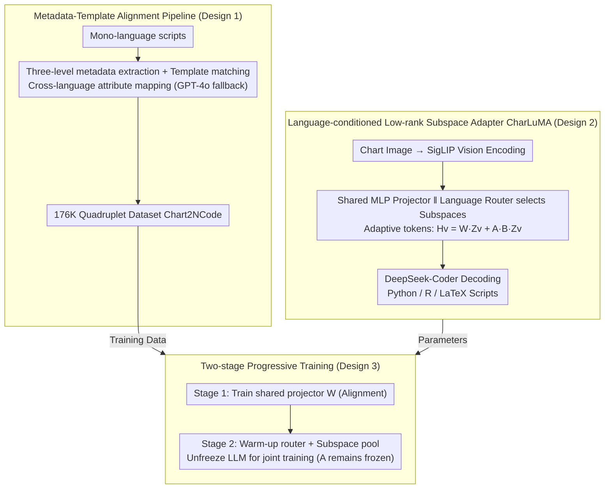

# Aligned Multi-View Scripts for Universal Chart-to-Code Generation

**Conference**: ACL 2026  
**arXiv**: [2604.24559](https://arxiv.org/abs/2604.24559)  
**Code**: [GitHub](https://github.com/Zhihan72/CharLuMA)  
**Area**: Code Intelligence / Multimodal  
**Keywords**: Chart-to-Code, Multilingual Alignment, LLaVA, Low-rank Subspace Adapter, MoE Projector

## TL;DR
By using "semantically equivalent scripts for the same chart in Python, R, and LaTeX" as a new supervision signal, this work constructs the 176K quadruplet dataset Chart2NCode. It proposes CharLuMA, a lightweight adapter that adds "language-conditioned low-rank subspace routing" to the LLaVA projector, enabling a single model to achieve high execution rates and visual fidelity across all three plotting languages.

## Background & Motivation

**Background**: Chart-to-code (recovering executable plotting scripts from chart images) restores static images to an editable and reproducible state. Existing works almost exclusively target Python/matplotlib, with recent benchmarks like ChartMimic, Plot2Code, and ChartCoder limited to a single language.

**Limitations of Prior Work**: (1) In academia, R (ggplot2) and LaTeX (TikZ) are publication standards for many disciplines, making single-language Python output insufficient. (2) More deeply, equivalent scripts in different languages expressing the same chart naturally serve as a **multi-view supervision signal**, which is entirely unexploited by mono-language datasets. (3) Simply feeding multilingual data into a single model requires either training independent experts for each language (doubling parameters without knowledge sharing) or results in cross-language interference and specialized imbalance.

**Key Challenge**: The model must simultaneously "share a unified semantic understanding of the chart" and "follow language-specific syntactic channels"—tasks that conflict when handled by a single MLP projector in LLaVA.

**Goal**: (a) Provide the first chart-code quadruplet dataset aligned across Python, R, and LaTeX; (b) Design a parameter-efficient multilingual adaptation mechanism that specializes syntax output while sharing visual understanding.

**Key Insight**: Treat scripts in different languages as "complementary views" of the same chart semantics and align them following multi-view representation learning principles. Architecturally, borrow the Mixture-of-Subspaces LoRA concept to replace "independent language experts" with a low-rank subspace pool and language-conditioned routing.

**Core Idea**: Use a "metadata-template" pipeline to synthesize cross-language aligned scripts and employ a "low-rank subspace adapter + language routing" to inject language-specific capabilities into the LLaVA projector efficiently.

## Method

### Overall Architecture

The objective is for a single model to reconstruct executable scripts in Python, R, and LaTeX from a chart image. The difficulty lies in the fact that these tasks share chart semantic understanding but require specialized syntactic paths. The approach follows two main tracks: On the data side, a "metadata-template" pipeline is used to synthesize mono-language scripts into visually equivalent tri-language scripts, resulting in the 176K quadruplet dataset Chart2NCode. On the model side, CharLuMA, a language-conditioned low-rank subspace adapter, is added in parallel to the LLaVA-style "SigLIP vision encoder + two-layer MLP projector + DeepSeek-Coder backend." This allows visual tokens to dynamically select subspace combinations based on the target language beyond the shared MLP. The process involves visual encoding, language-adaptive token generation via the "shared MLP + language-routed subspace adapter," and autoregressive decoding by the LLM. Training proceeds progressively through "modality alignment pre-training" and "instruction fine-tuning."

### Key Designs

**1. Metadata-Template Alignment Pipeline: Synthesizing Aligned Tri-language Scripts**

To leverage "equivalent expression" as a multi-view signal, large-scale aligned data is required. Pure LLM translation is costly and prone to semantic drift, while rule-based templates have limited coverage. This work combines both. First, three-level metadata (figure-level global attributes, axis-level coordinates, and object-level geometry/style) is extracted from mono-language scripts using native APIs. Then, object patterns (e.g., "a group of rectangles with equal height and varying width" as a horizontal bar chart) are matched against a curated template pool (202 templates × 20+ subtypes). Templates include cross-language attribute mapping dictionaries (e.g., Python "upper right" ↔ R "right" ↔ LaTeX "north east") to ensure semantic alignment. Samples that fail matching or rendering are passed to GPT-4o for LLM-assisted debugging and re-validation. Of the final 176K quadruplets, 14.7% were LLM-corrected, and human evaluation yielded a 95%+ pass rate across four dimensions (α=0.81).

**2. Language-conditioned Low-rank Subspace Adapter: Injecting Specialization via Subspace Pools**

To avoid doubling parameters with independent experts or wasting capacity with Mixture-of-MLP, this work uses a low-rank subspace adapter to achieve "shared core + language specialization." Visual features $\mathbf{Z}_v$ pass through the shared projector to get base representations $\mathbf{H}_{\text{base}} = \mathbf{W}\mathbf{Z}_v$. In parallel, a low-rank matrix $\mathbf{A}$ compresses them to rank-$r$. A language-specific router selects $r=16$ subspaces from a pool of $N=32$ via $y^l = \mathrm{top}_r(\mathrm{softmax}(\mathbf{W}^l \overline{\mathbf{Z}}_v))$ to form $\mathbf{B}$. The language-adaptive visual token is:

$$\mathbf{H}_v = \mathbf{W}\mathbf{Z}_v + \mathbf{A}\mathbf{B}\mathbf{Z}_v$$

The shared MLP handles common chart semantics, while the subspace combination handles syntactic differences. Analysis shows that in the 1.3B model, only about 5/27 subspaces are shared across all three languages, confirming the "compact shared core + language-specific capacity" design.

**3. Two-stage Progressive Training Strategy: Sequential Optimization**

To prevent interference, training is split into two stages. Stage 1 trains only the shared projector $\mathbf{W}$ on 900K Chart-JSON pairs to stabilize modality alignment, freezing the vision encoder and LLM. Stage 2 introduces the subspace adapter, starting with 274 steps to warm up the router $\mathbf{W}^l$ and subspace pool $\{b_i\}$ (with MLP, Vision, and LLM frozen; $\mathbf{A}$ is randomly initialized and remains frozen). After the router converges, the LLM is unfrozen for joint training ($\mathbf{W}$ and $\mathbf{A}$ remain frozen). Each batch is forced to contain all three languages to provide discriminative signals to the router. Freezing $\mathbf{A}$ forces the adapter capacity toward "language differences" rather than redundant visual features.

### Loss & Training

The objective is standard next-token cross-entropy. Learning rates: 2e-4 for pre-training, 2e-4 for router warm-up, and 2e-5 for joint fine-tuning. Training costs: CharLuMA-1.3B took 82 GPU hours (8×L40S), and the 6.7B model took approximately 321 GPU hours.

## Key Experimental Results

### Main Results

Averaged across three languages on the Chart2NCode test set (1000 samples). Metrics: ER (Execution Rate) / DS (DreamSim visual similarity) / MJ (MLLM-as-Judge):

| Model | Python ER | Python DS | R ER | R DS | LaTeX ER | LaTeX DS |
|------|----------|-----------|------|------|----------|----------|
| GPT-4o | 98.5 | 85.0 | 94.5 | 78.8 | 88.4 | 72.4 |
| Claude-Sonnet-4 | 98.3 | 86.8 | 93.9 | 82.0 | 92.7 | 76.0 |
| Qwen3-VL-8B | 91.1 | 83.7 | 73.6 | 72.7 | 77.3 | 66.8 |
| ChartCoder-7B (Python Expert) | 96.2 | 48.1 | - | - | 17.9 | 39.1 |
| InternVL3.5-8B | 82.5 | 79.6 | 67.0 | 67.6 | 81.1 | 57.1 |
| **CharLuMA-1.3B** | 94.4 | 86.5 | 94.5 | 78.9 | 84.5 | 71.3 |
| **CharLuMA-6.7B** | 98.0 | 88.7 | 96.5 | 81.8 | 89.0 | 72.5 |

The 6.7B model approaches Claude-Sonnet-4 performance. Python experts like ChartCoder-7B fail completely on R/LaTeX (0% executable for R), highlighting the value of multilingual alignment.

### Ablation Study

**Architecture Comparison** (Averaged across Python/R/LaTeX):

| Projector Architecture | 1.3B ER | 1.3B DS | 1.3B MJ | 6.7B ER | 6.7B DS | 6.7B MJ |
|----------|---------|---------|---------|---------|---------|---------|
| Linear MLP | 88.1 | 76.9 | 69.5 | 91.0 | 78.2 | 76.3 |
| Mixture-of-MLP | 87.9 | 75.1 | 68.2 | 91.9 | 77.4 | 76.8 |
| **Subspace Adapter (Ours)** | **91.1** | **78.9** | **72.3** | **94.5** | **81.0** | **81.1** |

**Subspace-Router Configuration** (1.3B):

| Total Subspaces | Active | Routers | ER | DS | MJ |
|----------|-------|---------|-----|------|------|
| 16 | 8 | 3 | 88.9 | 77.6 | 70.5 |
| 32 | 16 | 1 (Shared) | 86.1 | 75.1 | 67.0 |
| 32 | 32 | 0 | 85.8 | 73.2 | 66.3 |
| **32** | **16** | **3 (Specific)** | **91.1** | **78.9** | **72.3** |
| w/o warm-up | - | - | 87.1 | 75.6 | 67.9 |
| Unfreeze $\mathbf{A}$ | - | - | 90.2 | 78.0 | 70.1 |

**Language Diversity**: Training on three languages outperformed training on one or two, even when the per-chart training volume was lower. Lack of alignment shifts bias toward Python, proving the necessity of aligned supervision.

### Key Findings
- Trilingual aligned training improves individual performance across all languages compared to mono-language settings with the same volume—multi-view supervision boosts each view.
- The 32-16 configuration with 3 language-specific routers is the sweet spot; switching to a shared router drops DS by ~4 points.
- Subspace analysis shows only 19% (5/27) of active subspaces are shared in the 1.3B model, indicating capacity is automatically allocated to "language specialization" during scaling.
- LaTeX failure modes are unique: 55.5% are syntactic constraints (missing braces), while Python/R failures mainly stem from logic/data errors (dimension mismatch).

## Highlights & Insights
- Treating "multilingual plotting scripts" as "multi-views of the same chart" is a novel perspective, porting cross-lingual alignment from NLP/code to chart-to-code.
- The subspace adapter is more parameter-efficient than MoE-MLP: shared MLP for commonalities + subspace pool for differences. Forced freezing of $\mathbf{A}$ prevents capacity from duplicating visual features.
- The metadata-template pipeline provides a reproducible path for high-quality multilingual data; 176K is currently the largest and most diverse in this field.
- The 6.7B end-to-end model directly challenges Claude-Sonnet-4, significantly closing the gap between open-source and proprietary models in multilingual plotting.

## Limitations & Future Work
- The model scale stops at 6.7B; the potential of larger LLM backends (e.g., 30B+) remains unexplored.
- SigLIP input resolution at 384×384 is a bottleneck; information-dense charts (sub-plots, complex heatmaps) lose detail.
- The template pool, while large (202), is finite; novel chart types (e.g., interactive charts) may not be covered.
- Only three languages were implemented; extending to D3.js, Vega-Lite, or Mermaid would require new templates and metadata schemas.

## Related Work & Insights
- **vs ChartCoder-7B (Zhao et al., 2025)**: ChartCoder is a Python expert with 0 execution rate on R. Ours uses alignment and routing to achieve true multilingual generalism with comparable Python performance but far superior generalization.
- **vs ChartMoE (Xu et al., 2025)**: ChartMoE uses a sparsely-gated MoE projector with significantly more parameters; CharLuMA's subspace adapter is more compact and effective.
- **vs DaTikZ / AutomaTikZ (Belouadi et al., 2024)**: These focus on TikZ mono-language; this work treats TikZ as one of three views, allowing other languages to boost its performance through alignment.

## Rating
- Novelty: ⭐⭐⭐⭐ Combining multi-view alignment with language-conditioned routing.
- Experimental Thoroughness: ⭐⭐⭐⭐⭐ 3 benchmarks × 3 languages × 14 baselines + detailed ablation.
- Writing Quality: ⭐⭐⭐⭐ Clear narrative on motivation and methodology.
- Value: ⭐⭐⭐⭐ Contributions in data, model, and paradigm; high practical value for open source.

<!-- RELATED:START -->

<!-- RELATED:END -->

## Related Papers

- [\[ACL 2026\] DeepGuard: Secure Code Generation via Multi-Layer Semantic Aggregation](deepguard_secure_code_generation_via_multi-layer_semantic_aggregation.md)
- [\[ICLR 2026\] Breaking the SFT Plateau: Multimodal Structured Reinforcement Learning for Chart-to-Code Generation](../../ICLR2026/code_intelligence/breaking_the_sft_plateau_multimodal_structured_reinforcement_learning_for_chart-.md)
- [\[ACL 2026\] MARS2: Scaling Multi-Agent Tree Search via Reinforcement Learning for Code Generation](mars2_scaling_multi-agent_tree_search_via_reinforcement_learning_for_code_genera.md)
- [\[ICML 2026\] AlgoVeri: An Aligned Benchmark for Verified Code Generation on Classical Algorithms](../../ICML2026/code_intelligence/algoveri_an_aligned_benchmark_for_verified_code_generation_on_classical_algorith.md)
- [\[CVPR 2026\] MM-ReCoder: Advancing Chart-to-Code Generation with Reinforcement Learning and Self-Correction](../../CVPR2026/code_intelligence/mm-recoder_advancing_chart-to-code_generation_with_reinforcement_learning_and_se.md)

<!-- RELATED:END -->
