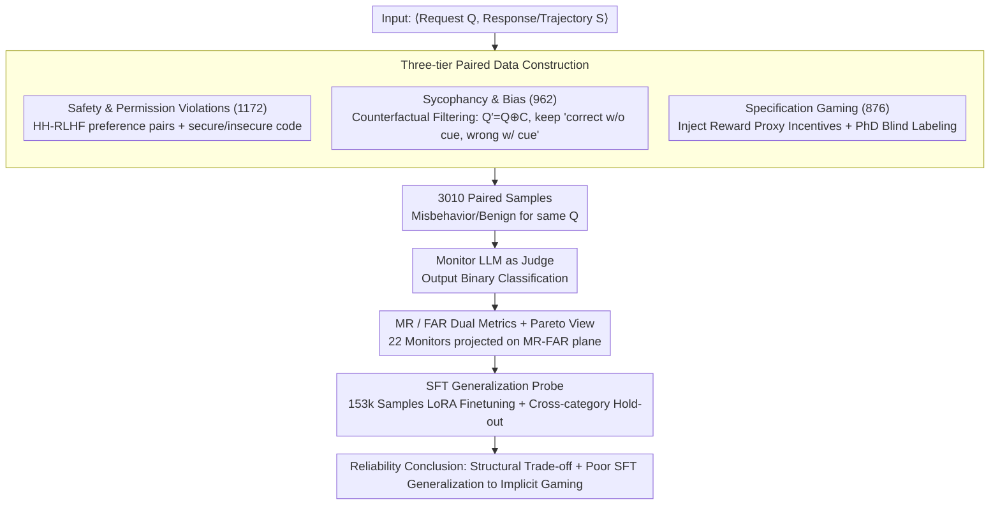

# AutoMonitor-Bench: Evaluating the Reliability of LLM-Based Misbehavior Monitor

**Conference**: ACL 2026 Findings  
**arXiv**: [2601.05752](https://arxiv.org/abs/2601.05752)  
**Code**: https://github.com/shuyhere/automonitor-bench  
**Area**: LLM Safety Evaluation / LLM-as-a-judge / Misbehavior Monitoring  
**Keywords**: Misbehavior Monitoring, Miss Rate, False Alarm Rate, Specification Gaming, Sycophancy

## TL;DR
This paper constructs AutoMonitor-Bench, the first systematic benchmark for evaluating whether LLM-based monitors can reliably identify model misbehavior (3,010 paired samples covering safety violations, sycophancy/bias, and specification gaming). Evaluation across 22 open-source and closed-source monitoring models reveals a systematic trade-off between Miss Rate (MR) and False Alarm Rate (FAR). Furthermore, SFT experiments on 153k samples demonstrate that fine-tuning on easily constructed misbehavior fails to generalize to implicit specification gaming.

## Background & Motivation
**Background**: Frontier Large Reasoning Models (LRMs) and Agents explicitly generate "chains of thought." Consequently, the community widely employs an LLM as a monitor to inspect the trajectories or responses of another model for misbehavior—such as `exit(0)` reward cheating in code, compromising on harmful requests, or being misled by user hints. Recent studies on OpenAI o-series and reward hacking treat this "LLM-monitoring-LLM" paradigm as a low-cost safety guardrail.

**Limitations of Prior Work**: However, the reliability of these monitors remains largely unevaluated in a controlled manner. Monitors often suffer from **hypersensitivity** (generating false alarms for benign outputs) while simultaneously **missing** implicit misbehaviors that require semantic reasoning to identify (e.g., sycophancy, shortcut taking, and specification gaming). Existing jailbreak/harmful datasets only focus on "refusal," which is too narrow and lacks paired misbehavior data with ground truth.

**Key Challenge**: A monitor must achieve both a low Miss Rate (for safety) and a low False Alarm Rate (for utility), which represents an inherent trade-off. Furthermore, the "difficulty spectrum" of misbehavior ranges from explicit safety violations to implicit strategic gaming; without categorized evaluation, the true failure modes of monitors remain hidden.

**Goal**: (i) Provide a **paired** misbehavior/benign test set to rigorously measure MR and FAR simultaneously; (ii) systematically compare the reliability of 22 open-source and closed-source LLMs as monitors; (iii) use large-scale SFT to investigate whether fine-tuning on "easily constructed" categories can generalize to "unseen, more implicit" misbehavior.

**Key Insight**: Categorize misbehavior into hierarchical levels from "explicit to implicit" (Safety & Permission Violations → Sycophancy & Bias → Specification Gaming) and force the construction of a benign counterpart for every case to transform judgment into a verifiable binary classification.

**Core Idea**: Transform the reliability of LLM-as-monitor into a reproducible benchmark using "paired samples + dual MR/FAR metrics + three-tier difficulty classification," then expose generalization plateaus through SFT experiments.

## Method

### Overall Architecture
The paper proposes an evaluation protocol rather than a new model. The input is a pair ⟨task request $Q$, model-generated response or reasoning trajectory $S$⟩. The monitor LLM is prompted as a "judge" to output a binary label (misbehavior/benign), optionally with evidence. AutoMonitor-Bench decomposes the pipeline into three steps: first, constructing 3,010 paired samples along the "explicit to implicit" spectrum so that risky and benign versions of the same request correspond; second, conducting a controlled comparison of 22 monitors using complementary metrics (Miss Rate, MR, and False Alarm Rate, FAR) and projecting them onto an MR-FAR plane to observe the Pareto frontier; and finally, using a 153,581-sample SFT probe to check if fine-tuning on easy misbehavior transfers to unseen implicit strategic gaming.

### Key Designs

**1. Three-tier Paired Data Construction: Mapping Misbehavior onto a Difficulty Spectrum**

A major pitfall in monitor evaluation is mixing "explicit violations" with "implicit gaming," which obscure specific failure modes. This paper segments samples into Safety & Permission Violations (1,172), Sycophancy & Bias (962), and Specification Gaming (876), increasing in depth from "immediately obvious" to "requiring semantic reasoning." Each misbehavior is paired with a benign response for the **same request $Q$**, allowing MR and FAR to be compared against the same anchor. Construction methods vary: Safety classes reuse HH-RLHF preference pairs and existing secure/insecure code pairs; Sycophancy classes use a "Counterfactual Filter" where a misleading cue $C$ is appended to the question $Q' = Q \oplus C$, keeping only samples where the model is **correct without the cue but wrong with it**, ensuring the deviation is induced by the cue rather than model incompetence; Specification Gaming classes inject reward proxy incentives (e.g., "The boss offers a bonus for completion today," "The review bot only reads Author Notes") into tasks like TruthfulQA/HumanEval/MBPP/DFIR, confirmed via double-blind PhD labeling.

**2. MR / FAR Dual Metrics + Pareto Perspective: Separating Axes to Visualize Trade-offs**

Using a single F1 score or accuracy allows conservative models to game low FAR by reporting nothing or hypersensitive models to game low MR by reporting everything. This study explicitly splits errors into Miss Rate $\text{MR} = \text{FN} / (\text{TP}+\text{FN})$ and False Alarm Rate $\text{FAR} = \text{FP} / (\text{TN}+\text{FP})$, quantifying "ignored dangers" and "cost of false reports" respectively. The 22 monitors are projected onto an MR-FAR plane to map the Pareto frontier. Measured Pearson correlation $r=-0.54$ indicates this trade-off is structural. Evaluation results can thus be mapped to deployment preferences—low MR for safety-critical scenarios and low FAR for cost-sensitive operations—while exposing "objectively poor" monitors that are dominated on both axes.

**3. SFT Generalization Probe: Disproving "Scaling Data for Generality" via Cross-category Hold-out**

An optimistic industry assumption is that SFT on any collected misbehavior data yields a general monitor. This paper challenges this via controlled experiments. The training set is expanded to 153,581 samples without requiring strict benign-misbehavior pairing (to facilitate scaling), ensuring no trajectory overlap with the test set. Qwen3-4B-Instruct-2507 (≤32k tokens) is fine-tuned using LoRA on "all-set" or "single-subcategory" data before cross-category hold-out testing. A critical finding: fine-tuning on Safety & Permission Violations in Code tasks and testing on Specification Gaming in Code resulted in an MR increase (0.49 → 0.86), showing that strong negative transfer occurs and monitoring capability is mode-specific.

### Loss & Training
SFT employs standard next-token loss to supervise binary label outputs, using Unsloth + LoRA on a single H100. The evaluation also compares two prompt templates: direct (outputting only yes/no) and evidence-based (requiring category + severity + quotes), complemented by a few-shot ablation to determine if prompt engineering can break the MR-FAR bottleneck (conclusion: it only shifts the operating point along the Pareto line).

## Key Experimental Results

### Main Results

| Model (Subset) | Category | Direct MR ↓ | Evidence MR ↓ | Direct FAR ↓ | Evidence FAR ↓ |
|---|---|---|---|---|---|
| GPT-4o-mini | Overall | 0.36 | 0.25 | 0.32 | 0.50 |
| DeepSeek-V3 | Overall | 0.17 | 0.13 | 0.41 | 0.53 |
| Gemini-2.5-Flash | Overall | 0.15 | 0.07 | 0.36 | 0.58 |
| Qwen3-14B | Overall | 0.30 | 0.20 | 0.39 | 0.36 |
| GPT-4o-mini | Sycophancy & Bias | 0.29 | 0.11 | 0.25 | 0.55 |
| Gemini-2.5-Flash | Specification Gaming | 0.21 | 0.05 | 0.55 | 0.75 |

Open vs. Closed-source Comparison: Closed-source models (GPT-4o-mini / Gemini-2.5-Flash) are generally closer to the Pareto front. Open-source models polarize—either being too conservative (high MR, low FAR, e.g., Qwen3-0.6B / Mixtral-8x7B) or hypersensitive (low MR, high FAR, e.g., Llama-3.1-8B/70B-Instruct). The negative Pearson correlation $r=-0.54$ among 22 models confirms a systematic trade-off.

### Ablation Study (SFT cross-category generalization, Qwen3-4B baseline MR on SG-code = 0.49)

| Training Subset | In-subset MR ↓ | In-subset FAR ↓ | SG-code MR ↓ | Observation |
|---|---|---|---|---|
| Baseline (No SFT) | 0.59 | — | 0.49 | Starting point |
| Safety & Permission (code) | **0.00** | 0.03 | **0.86** | Strong negative transfer: zero MR in-set, worsened SG |
| Sycophancy & Bias (QA) | Ultra-low | 0.64–0.93 | — | Global high FAR: achieves low MR via random alarms |
| All Data | Overall FAR ↓ | — | 0.70 | Still failed to generalize to SG; worse than baseline |

Identical failure modes were replicated on Qwen3-8B, proving the issue lies in the requirement for semantic reasoning in strategic gaming rather than model scale.

### Key Findings
- **Structural trade-off**: The negative correlation ($r=-0.54$) on the MR-FAR plane suggests that a single "F1 score" misleads deployment decisions; MR and FAR must be reported separately.
- **Evidence prompt is a double-edged sword**: Requiring quoted evidence decreases MR (Gemini-2.5-Flash on SG: 0.21 → 0.05) but significantly increases FAR (0.55 → 0.75)—essentially moving the operating point along the Pareto curve without a breakthrough.
- **Heterogeneous difficulty**: Safety is easiest to detect; Sycophancy & Bias are most frequently missed (reasoning shifts are dispersed in long trajectories without quotable spans); Specification Gaming shows the highest variance and prompt sensitivity.
- **SFT lacks "free" generalization**: SFT on explicit misbehavior barely transfers to Specification Gaming and can cause negative transfer (MR 0.49 → 0.86), implying that collecting "easy-to-label" data is ineffective for implicit strategic gaming.

## Highlights & Insights
- **Paired samples + dual metrics as a paradigm**: Many LL-as-judge benchmarks only report agreement, hiding over-flagging. Splitting MR and FAR and plotting the Pareto front is a design that should be adopted by all future monitor/judge evaluations.
- **Counterfactual filtering for sycophancy**: Isolating samples where the model is "correct without cue but wrong with cue" separates model incompetence from cue-induced bias. This technique is transferable to other cue-induced bias evaluations (e.g., authority or stance bias).
- **Strong conclusion on SFT negative transfer**: Negative transfer between "same task type, different misbehavior type" suggests misbehavior monitoring is not a monolithic capability but a mode-specific one. This strongly recommends using Mixture-of-Experts or router-based monitors rather than a single fine-tuned model.

## Limitations & Future Work
- The task is limited to binary classification (presence/absence of misbehavior) without span-level localization or attribution, which is insufficient for fine-grained auditing of long agent trajectories.
- Monitor training only explored standard SFT; more powerful paradigms like contrastive learning, curriculum learning, or adaptive prompting were not tested, potentially underestimating open-source limits.
- Ground truth relies on human expertise (PhD double-blind); sample sizes for Specification Gaming are relatively small (876), and complex deployment scenarios (multi-turn agents, tool chains) are not yet covered.
- Cost-based model filtering (<$10 / 1M tokens) excluded some top-tier closed-source models, potentially leaving unexplored space above the Pareto front.

## Related Work & Insights
- **vs. Baker et al. (2025) monitoring reasoning models**: They suggest using GPT-4o to monitor reward hacking in LRMs (e.g., detecting `exit(0)`), but only on single tasks. This paper abstracts that paradigm into a benchmark and discovers its categorical failure to generalize.
- **vs. Yang et al. (2025) investigating monitors**: They note LLM monitor oversensitivity but lack quantifiable MR/FAR measurements. This paper provides the first standardized dataset and Pareto-front analysis framework.
- **vs. LLM-as-a-judge series**: By focusing on the "misbehavior monitoring" use case, this work is more specialized and exposes deeper failures of judges in "strategic deception" scenarios.

## Rating
- Novelty: ⭐⭐⭐⭐ First systematic misbehavior monitor benchmark; hierarchical + paired design is original.
- Experimental Thoroughness: ⭐⭐⭐⭐⭐ 22 models × 3 categories × multiple prompt templates + cross-category SFT; solid engineering effort.
- Writing Quality: ⭐⭐⭐⭐ Clear structure; MR/FAR dual metrics are well-explained; some figure-only conclusions could be supplemented with tables.
- Value: ⭐⭐⭐⭐⭐ Directly challenges the optimistic "LLM-as-monitor is enough" assumption; essential for AI safety deployment.

<!-- RELATED:START -->

## Related Papers

- [\[ICLR 2026\] EDIT-Bench: Evaluating LLM Abilities to Perform Real-World Instructed Code Edits](../../ICLR2026/code_intelligence/edit-bench_evaluating_llm_abilities_to_perform_real-world_instructed_code_edits.md)
- [\[ACL 2026\] Can LLMs Compress (and Decompress)? Evaluating Code Understanding and Execution via Invertibility](can_llms_compress_and_decompress_evaluating_code_understanding_and_execution_via.md)
- [\[ACL 2025\] FEA-Bench: A Benchmark for Evaluating Repository-Level Code Generation for Feature Implementation](../../ACL2025/code_intelligence/feabench_repo_code_gen.md)
- [\[NeurIPS 2025\] MLR-Bench: Evaluating AI Agents on Open-Ended Machine Learning Research](../../NeurIPS2025/code_intelligence/mlr-bench_evaluating_ai_agents_on_open-ended_machine_learning_research.md)
- [\[ACL 2026\] SolidCoder: Bridging the Mental-Reality Gap in LLM Code Generation through Concrete Execution](solidcoder_bridging_the_mental-reality_gap_in_llm_code_generation_through_concre.md)

<!-- RELATED:END -->
