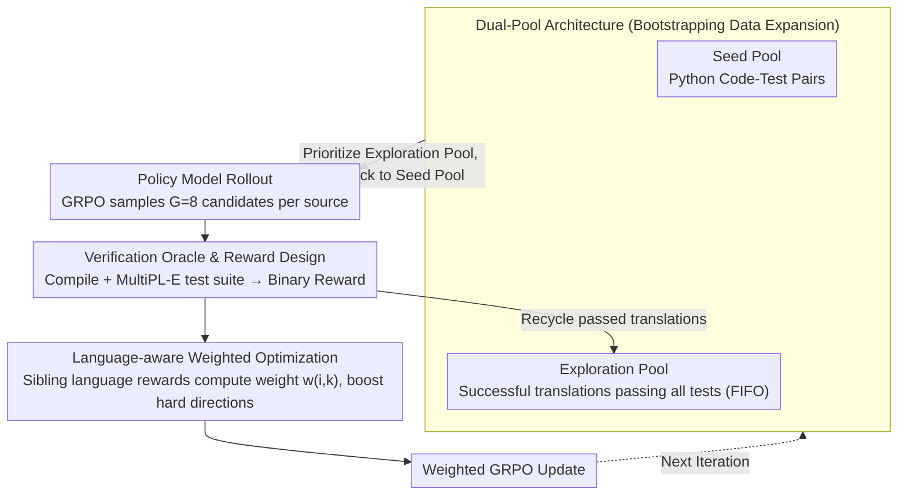

# Bootstrapping Code Translation with Weighted Multilanguage Exploration

**Conference**: ACL 2026  
**arXiv**: [2601.03512](https://arxiv.org/abs/2601.03512)  
**Code**: [https://github.com/nju-websoft/BootTrans/](https://github.com/nju-websoft/BootTrans/)  
**Area**: Code Translation/Reinforcement Learning  
**Keywords**: Code Translation, Bootstrapping Exploration, Language-aware Weighting, RLVR, Multilingual Optimization

## TL;DR

BootTrans proposes a bootstrapping multilingual code translation method that leverages test cases from a single hub language (Python) as cross-language verification oracles. Combined with a dual-pool architecture for experience collection to expand training data and a language-aware weighting mechanism to prioritize difficult translation directions, it significantly outperforms baselines on HumanEval-X and TransCoder-Test.

## Background & Motivation

**Background**: Code translation is essential for legacy system modernization and cross-platform interoperability. LLMs have made significant progress in coding tasks, but code translation typically relies on high-quality parallel corpora, which are rarely equipped with executable test cases.

**Limitations of Prior Work**: (1) Multilingual parallel code data is scarce and seldom includes cross-language executable test cases; (2) Unsupervised methods (e.g., those using code structural information) require massive monolingual corpora and cannot optimize directly based on functional correctness; (3) Existing RLVR methods face two major challenges: **input monotony** (verifiable seeds are limited to a single hub language) and **optimization imbalance** (skewed learning signals due to varying difficulty across translation directions).

**Key Challenge**: While test cases are naturally portable across languages, expanding from a single hub language to a full multilingual translation matrix faces the dual obstacles of data bottlenecks and optimization imbalance.

**Goal**: (1) Address the scarcity of training data in multilingual code translation; (2) Mitigate the optimization imbalance during simultaneous multilingual optimization.

**Key Insight**: Utilize the cross-language portability of unit tests as a unified verification mechanism, gradually expanding training data coverage across all translation directions through bootstrapping experience collection.

**Core Idea**: Use one language as a hub to "bootstrap" training data expansion through the RL policy model's own successful translations, while dynamically adjusting the learning intensity of different translation directions using language-aware weights.

## Method

### Overall Architecture

BootTrans addresses the data bottleneck where "multilingual code translation lacks parallel corpora with executable tests." Its core observation is that unit tests are naturally portable across languages: by using Python as the hub language and rule-converting Python test cases into target languages, functional correctness verification oracles can be provided for any translation direction. Centered on this, the method trains a translation model using RL (GRPO), recycling code successfully translated by the model as new training data to roll out coverage from a single hub language to the complete translation matrix. Simultaneously, language-aware weighting dynamically increases the learning intensity for directions where "other languages are translated well, but this specific one is not," achieving balanced improvement across all directions.

### Key Designs

**1. Dual-Pool Architecture: Self-bootstrapping multilingual training data**

Verifiable seeds are limited to Python (input monotony), and expansion via parallel corpora is unavailable. This paper breaks this dependency using two pools: the seed pool $\mathcal{D}_{\text{seed}}$ contains hub language (Python) code-test pairs, while the exploration pool $\mathcal{D}_{\text{explore}}$ dynamically collects successful translations that **pass all tests** during policy model rollouts. Each training round prioritizes sampling from the exploration pool; correctly translated code in the exploration pool can then serve as source input for new directions in subsequent iterations (e.g., Java→Python back-translation), snowballing training data across the entire matrix. The pool is managed via a FIFO queue to prevent overloading.

**2. Verification Oracle & Reward Design: Aligning targets to functional equivalence**

Cross-language verification relies on a binary verifiable reward $R(y, T) = \mathbb{1}[y \text{ compiles and passes all tests in } T]$—a translation must both compile and pass the test suite $T$ to receive a score of 1; compilation errors, runtime errors, or timeouts result in 0. The test suite itself is converted from Python to other languages using MultiPL-E rules, allowing the same tests to be reused across all directions. This ensures the optimization target focuses on functional correctness rather than surface-level similarity like BLEU—providing both the criterion for "correctness" in the dual-pool and a common ground for comparing performance across directions.

**3. Language-aware Weighted Optimization: Boosting difficult directions via "sibling languages"**

When optimizing multiple translation directions simultaneously, differences in difficulty can skew learning signals toward easier directions. For a translation from source $x_i$ to target language $L_k$, the method defines sibling rewards $\mathcal{R}_{i,\neg k}$ as the sum of cumulative rewards for the same source across other target languages. The weight is set as $w_{i,k} = \frac{\mathcal{R}_{i,\neg k}}{\mathcal{R}_{i,k} + \mathcal{R}_{i,\neg k}}$. The intuition is clear: if the model demonstrates semantic understanding in sibling languages but struggles specifically with $L_k$, $w_{i,k}$ increases, indicating the bottleneck lies in the syntax/idiomatic expression of that language rather than problem comprehension, forcing the model to apply more learning intensity to that difficult direction.

### Loss & Training

Training uses GRPO with a language-aware weighted PPO-style objective. It retains clipping ratios and KL penalties, with advantage estimation calculated per "target language" group and multiplied by the weight $w_{i,k}$. The optimizer is AdamW with a learning rate of 1e-6, a rollout macro-batch of 256, and $G=8$ candidate translations sampled per source code.

## Key Experimental Results

### Main Results

**HumanEval-X CA@1 Average Scores**

| Method | Avg |
|------|-----|
| Qwen3-1.7B (base) | 64.33 |
| BootTrans Qwen3-1.7B | **74.70** (+10.37) |
| Llama-3.1-8B (base) | 61.79 |
| BootTrans Llama-3.1-8B | **78.36** (+16.57) |
| Qwen2.5-7B (base) | 68.50 |
| BootTrans Qwen2.5-7B | **83.84** (+15.34) |

**Comparison with Other Methods (Qwen3-1.7B, HumanEval-X Avg)**

| Method | Avg |
|------|-----|
| CoTran | 64.03 |
| MultiPL-T | 64.74 |
| PPOCoder | 69.21 |
| OORL | 69.92 |
| BootTrans | **74.70** |

### Ablation Study

The BootTrans 1.7B model surpassed Qwen3-32B on HumanEval-X (74.70 vs 67.99), demonstrating the potential of small models to outperform large ones through RL training. On TransCoder-Test, BootTrans similarly yielded consistent improvements.

### Key Findings

- Both bootstrapping exploration and language-aware weighting components contribute significantly to final performance.
- BootTrans enables a small model with 1.7B parameters to outperform a 32B parameter model.
- Consistent improvements were achieved across all six translation directions, mitigating the optimization imbalance problem.
- The cross-language portability of test cases is the fundamental key to the method's success.

## Highlights & Insights

- The approach to bootstrapping data expansion is simple yet effective, fully utilizing the cross-language portability of test cases.
- The language-aware weighting mechanism has a clear intuition, achieving adaptive difficulty regulation based on "sibling language" comparisons.
- Experimental results where small models surpass large models highlight the value of RL training in code translation.
- The FIFO management strategy for the dual-pool architecture is well-considered for engineering implementation.

## Limitations & Future Work

- Currently only experimented with three languages (C++, Java, Python); not yet expanded to more languages.
- Relying on MultiPL-E's rule-based test conversion may fail for certain complex test cases.
- Training costs are high, requiring significant rollouts and compilation/execution.
- Future work could explore expanding the method to more programming languages and more complex software engineering scenarios.

## Related Work & Insights

- Compared to RL methods like PPOCoder and OORL, BootTrans's novelty lies in the combination of data expansion and weighting mechanisms.
- MultiPL-E's test conversion tools provide critical infrastructure for the method.
- The idea of bootstrapping training data expansion can be generalized to other generation tasks requiring validation feedback.

## Rating

- **Novelty**: ⭐⭐⭐⭐ The combined design of bootstrapping exploration and language-aware weighting is novel and practical.
- **Experimental Thoroughness**: ⭐⭐⭐⭐ Comprehensive comparison across three base models, two benchmarks, and multiple baselines.
- **Writing Quality**: ⭐⭐⭐⭐ Clear problem definition and detailed algorithmic description.

<!-- RELATED:START -->

## Related Papers

- [\[ACL 2026\] PExA: Parallel Exploration Agent for Complex Text-to-SQL](pexa_parallel_exploration_agent_for_complex_text-to-sql.md)
- [\[ICML 2026\] MatchFixAgent: Language-Agnostic Autonomous Repository-Level Code Translation Validation and Repair](../../ICML2026/code_intelligence/matchfixagent_language-agnostic_autonomous_repository-level_code_translation_val.md)
- [\[ICML 2025\] Function-to-Style Guidance of LLMs for Code Translation](../../ICML2025/code_intelligence/function-to-style_guidance_of_llms_for_code_translation.md)
- [\[ICML 2026\] Bridging Functional Correctness and Runtime Efficiency Gaps in LLM-Based Code Translation](../../ICML2026/code_intelligence/bridging_functional_correctness_and_runtime_efficiency_gaps_in_llm-based_code_tr.md)
- [\[ACL 2025\] ExploraCoder: Advancing Code Generation for Multiple Unseen APIs via Planning and Chained Exploration](../../ACL2025/code_intelligence/exploracoder_advancing_code_generation_for_multiple_unseen_apis_via_planning_and.md)

<!-- RELATED:END -->
