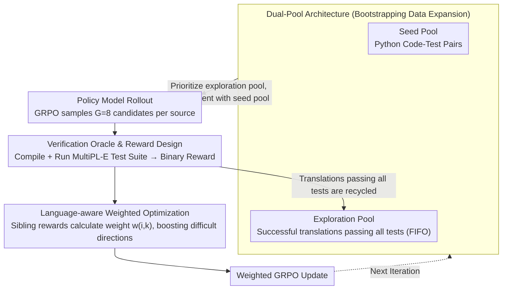

# Bootstrapping Code Translation with Weighted Multilanguage Exploration

**Conference**: ACL 2026  
**arXiv**: [2601.03512](https://arxiv.org/abs/2601.03512)  
**Code**: [https://github.com/nju-websoft/BootTrans/](https://github.com/nju-websoft/BootTrans/)  
**Area**: Code Translation/Reinforcement Learning  
**Keywords**: Code Translation, Bootstrapping Exploration, Language-aware Weighting, RLVR, Multilingual Optimization

## TL;DR

BootTrans proposes a bootstrapping multilingual code translation method. By leveraging test cases from a single pivot language (Python) as cross-language verification oracles and employing a dual-pool architecture for experience collection to expand training data, it incorporates a language-aware weighting mechanism to dynamically prioritize difficult translation directions. It significantly outperforms baselines on HumanEval-X and TransCoder-Test.

## Background & Motivation

**Background**: Code translation is essential for legacy system modernization and cross-platform interoperability. While LLMs have achieved significant progress in coding tasks, code translation typically relies on high-quality parallel corpora, which are rarely equipped with executable test cases.

**Limitations of Prior Work**: (1) Multilingual parallel code data is scarce and seldom equipped with cross-language executable test cases; (2) Unsupervised methods (e.g., those utilizing code structure) require massive monolingual corpora and cannot be directly optimized based on functional correctness; (3) Existing RLVR methods face two major challenges: **input monotony** (verifiable seeds are limited to a single pivot language) and **optimization imbalance** (skewed learning signals due to difficulty variances across translation directions).

**Key Challenge**: Although test cases are naturally portable across languages, expanding from a single pivot language to a complete multilingual translation matrix faces the dual obstacles of data bottlenecks and optimization imbalance.

**Goal**: (1) Address the scarcity of training data in multilingual code translation; (2) Mitigate the optimization imbalance issue during simultaneous multilingual optimization.

**Key Insight**: Utilize the cross-language portability of unit tests as a unified verification mechanism, gradually expanding training data coverage to all translation directions through bootstrapping experience collection.

**Core Idea**: Using one language as the axis, the method "bootstraps" and expands training data via successful translations from the RL policy model itself, while dynamically adjusting the learning intensity of different translation directions through language-aware weights.

## Method

### Overall Architecture

BootTrans aims to solve the data bottleneck where "multilingual code translation lacks parallel corpora with executable tests." Its core observation is that unit tests are naturally portable across languages: taking Python as the pivot language, as long as Python test cases are rule-converted into the target language, they can provide functional correctness verification oracles for any translation direction. Based on this, the method trains the translation model using RL (GRPO), recycling code correctly translated by the model itself via bootstrapping exploration to expand coverage from a single pivot language to the full translation matrix. Simultaneously, it uses language-aware weighting to dynamically increase the learning intensity for directions where "the model performs well on sibling languages but fails on this specific one," achieving balanced improvement across all directions.

### Key Designs

**1. Dual-Pool Architecture: Bootstrapping multilingual training data using correctly translated code**

Since verifiable seeds are only available for Python (input monotony), expanding via parallel corpora is unfeasible. This paper breaks this dependency using two pools: the Seed Pool $\mathcal{D}_{\text{seed}}$ contains code-test pairs of the pivot language (Python), and the Exploration Pool $\mathcal{D}_{\text{explore}}$ dynamically collects successful translations from the policy model rollout that **pass all tests**. Each round prioritizes sampling from the exploration pool; correctly translated code in the exploration pool can serve as source inputs for new directions in subsequent iterations (e.g., Java→Python reverse translation), expanding training data across the entire translation matrix like a snowball. The pool is managed via a FIFO queue to prevent overload.

**2. Verification Oracle and Reward Design: Aligning targets to functional equivalence via binary executable rewards**

Cross-language verification relies on a binary verifiable reward $R(y, T) = \mathbb{1}[y \text{ compiles and passes all tests in } T]$—a translation receives a 1 only if it both compiles and passes the test suite $T$, while compilation errors, runtime errors, and timeouts are marked as 0. The test suite itself is rule-converted from Python to other languages via MultiPL-E, allowing the same tests to be reused across all directions. This ensures the optimization target focuses on functional correctness rather than surface-level similarity like BLEU.

**3. Language-aware Weighting Optimization: Boosting difficult directions using "sibling language" relative performance**

When multiple translation directions are optimized simultaneously, difficulty variances cause learning signals to lean towards easier directions. For a translation from source $x_i$ to target language $L_k$, this paper defines the sibling reward $\mathcal{R}_{i,\neg k}$ as the sum of cumulative rewards for the same source across other target languages, and sets the weight $w_{i,k} = \frac{\mathcal{R}_{i,\neg k}}{\mathcal{R}_{i,k} + \mathcal{R}_{i,\neg k}}$. The intuition is clear: if the model demonstrates semantic understanding in sibling languages but struggles specifically with $L_k$, $w_{i,k}$ increases, indicating the bottleneck lies in the syntax/idioms of that language rather than problem comprehension, forcing the model to allocate more learning intensity to that difficult direction.

### Loss & Training

Training utilizes GRPO with a language-aware weighted PPO-style objective. It maintains clipping ratios and KL penalties, while advantage estimation is calculated by grouping by the "same target language" and then multiplied by the weight $w_{i,k}$. Technical setup: AdamW optimizer, learning rate 1e-6, rollout macro-batch of 256, and $G=8$ candidate translations sampled per source code.

## Key Experimental Results

### Main Results

**HumanEval-X CA@1 Average Score**

| Method | Avg |
|------|-----|
| Qwen3-1.7B (base) | 64.33 |
| BootTrans Qwen3-1.7B | **74.70** (+10.37) |
| Llama-3.1-8B (base) | 61.79 |
| BootTrans Llama-3.1-8B | **78.36** (+16.57) |
| Qwen2.5-7B (base) | 68.50 |
| BootTrans Qwen2.5-7B | **83.84** (+15.34) |

**Comparison with Other Methods (Qwen3-1.7B, HumanEval-X Avg)**

| Method | Avg |
|------|-----|
| CoTran | 64.03 |
| MultiPL-T | 64.74 |
| PPOCoder | 69.21 |
| OORL | 69.92 |
| BootTrans | **74.70** |

### Ablation Study

The BootTrans 1.7B model outperformed Qwen3-32B on HumanEval-X (74.70 vs 67.99), demonstrating the potential of small models to surpass larger ones through RL training. On TransCoder-Test, BootTrans delivered consistent improvements.

### Key Findings

- Both bootstrapping exploration and language-aware weighting components contribute significantly to final performance.
- BootTrans enables a small 1.7B parameter model to surpass a 32B parameter large model.
- Consistent improvements were achieved across all six translation directions, mitigating the optimization imbalance issue.
- The cross-language portability of test cases is the fundamental key to the method's success.

## Highlights & Insights

- The approach of bootstrapping data expansion is simple and effective, fully exploiting the cross-language portability of test cases.
- The language-aware weighting mechanism has a clear intuition, achieving adaptive difficulty adjustment based on "sibling language" comparisons.
- The experimental result of small models surpassing larger ones highlights the value of RL training in code translation.
- The FIFO management strategy for the dual-pool architecture is a well-considered engineering choice.

## Limitations & Future Work

- Currently only experimented with C++, Java, and Python; not yet extended to more languages.
- Relies on rule-based test conversion via MultiPL-E, which might fail for certain complex test cases.
- High training cost due to the requirement for extensive rollouts, compilation, and execution.
- Future work could explore extending the method to more programming languages and complex software engineering scenarios.

## Related Work & Insights

- Compared to RL methods like PPOCoder and OORL, the innovation of BootTrans lies in the combination of data expansion and weighting mechanisms.
- The MultiPL-E test conversion tools provide critical infrastructure for the method.
- The concept of bootstrapping training data expansion can be generalized to other generation tasks requiring verification feedback.

## Rating

- Novelty: ⭐⭐⭐⭐ The combination of bootstrapping exploration and language-aware weighting is novel and practical.
- Experimental Thoroughness: ⭐⭐⭐⭐ Comprehensive comparison across three base models, two benchmarks, and multiple baselines.
- Writing Quality: ⭐⭐⭐⭐ Clear problem definition and detailed algorithmic description.

<!-- RELATED:START -->

## Related Papers

- [\[ICML 2026\] MatchFixAgent: Language-Agnostic Autonomous Repository-Level Code Translation Validation and Repair](../../ICML2026/code_intelligence/matchfixagent_language-agnostic_autonomous_repository-level_code_translation_val.md)
- [\[ACL 2026\] PExA: Parallel Exploration Agent for Complex Text-to-SQL](pexa_parallel_exploration_agent_for_complex_text-to-sql.md)
- [\[ICML 2025\] Function-to-Style Guidance of LLMs for Code Translation](../../ICML2025/code_intelligence/function-to-style_guidance_of_llms_for_code_translation.md)
- [\[ACL 2025\] ExploraCoder: Advancing Code Generation for Multiple Unseen APIs via Planning and Chained Exploration](../../ACL2025/code_intelligence/exploracoder_advancing_code_generation_for_multiple_unseen_apis_via_planning_and.md)
- [\[ACL 2026\] CodeRL+: Improving Code Generation via Reinforcement with Execution Semantics Alignment](coderl_improving_code_generation_via_reinforcement_with_execution_semantics_alig.md)

<!-- RELATED:END -->
