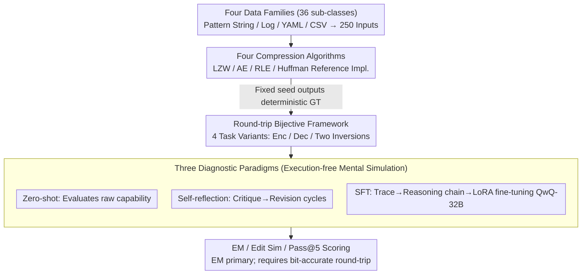

# Can LLMs Compress (and Decompress)? Evaluating Code Understanding and Execution via Invertibility

**Conference**: ACL 2026 Findings  
**arXiv**: [2601.13398](https://arxiv.org/abs/2601.13398)  
**Code**: https://github.com/Nickil21/round-trip-code-compression  
**Area**: Code Intelligence  
**Keywords**: Code reasoning, bidirectional execution, compression algorithms, self-consistency, evaluation

## TL;DR
Ours proposes RoundTripCodeEval (RTCE): a code reasoning benchmark comprising 1,000 strict round-trip cases (250 inputs × 4 sub-tasks) where encode→decode must restore bit-level accuracy, constructed using 4 lossless compression algorithms (LZW/AE/RLE/Huffman). Results demonstrate that even QwQ-32B maintains 0% EM on Huffman encoding, a failure that cannot be remediated by SFT or self-reflection.

## Background & Motivation

**Background**: Code-LLMs (such as DeepSeek-Coder, Qwen2.5-Coder, StarCoder2) have achieved significant performance on code generation benchmarks like HumanEval/MBPP. Execution reasoning evaluations (e.g., CRUXEval, CodeIO, CodeMind, REVAL) typically assess either forward or backward execution in isolation.

**Limitations of Prior Work**: Existing evaluations are either unidirectional or rely on "semantic equivalence" (e.g., IdentityChain for code↔spec, RTC for code↔NL description). Semantic equivalence is a loose standard—generated code is considered correct as long as it behaves identically, allowing models to potentially score high via pattern matching or memorization without truly understanding the internal state machine or data flow of the algorithm.

**Key Challenge**: Models may achieve high scores in forward execution through surface-level pattern matching but fail in backward execution. Alternatively, both directions might seem correct independently while failing to close the round-trip loop, indicating inconsistent internal representations. "forward correctness was fragile, derived from template matching."

**Goal**: Design an evaluation capable of distinguishing between "score-padding via pattern matching" and "genuine understanding of algorithmic semantics."

**Key Insight**: Lossless compression algorithms are inherently bijective. The requirement that $\text{dec}(\text{enc}(x))=x$ must be perfectly invertible provides a strict round-trip constraint that is far more difficult to "game" than semantic equivalence.

**Core Idea**: Redefine "code understanding" as a "code invertibility" problem. By using round-trip exact-match as the evaluation signal across a 16-dimensional diagnostic grid (4 compression algorithms × 4 task variants: encode, decode, encode⁻¹, decode⁻¹), systematic failures undetectable by forward-only benchmarks can be exposed.

## Method

### Overall Architecture

RTCE reformulates code understanding as a code invertibility problem and uses a strict round-trip constraint to verify if models accurately simulate algorithms mentally. The benchmark is constructed in three steps: first, 250 diverse inputs are synthesized across four data families (Pattern strings, Apache logs, YAML, CSV) totaling 36 sub-categories. Second, deterministic ground truths are generated using Python reference implementations of LZW, AE, RLE, and Huffman under a fixed seed. Finally, models perform four task variants (O/P Pred, O/P Pred-I, I/P Pred, I/P Pred-I) in an execution-free setting, forcing mental simulation. Evaluation utilizes EM, Edit Similarity (ES), and Pass@5. EM (exact match with float tolerance $10^{-3}$) is the primary metric, while ES provides partial credit. In this benchmark, three diagnostic paradigms—zero-shot, self-reflection, and SFT—are used to exhaustively test performance improvements and attribute failures to architectural limitations.

### Key Designs

**1. Round-trip framework via bijective compression: Operationalizing "understanding" as bit-accurate invertibility**

The fundamental weakness of existing evaluations lies in "semantic equivalence"—as long as behavior matches, models can succeed via pattern matching without mastering the internal state machine. Lossless compression is naturally bijective, imposing a stricter constraint: defining $\mathsf{enc}:\mathcal{X}\to\mathcal{Z}$ and $\mathsf{dec}:\mathcal{Z}\to\mathcal{X}$ enforces $\forall x\in\mathcal{X},\ \mathsf{dec}(\mathsf{enc}(x))=x$. Any information loss causes an immediate EM failure. Four tasks are derived: $x\to z$ (forward encoding), $z\to x'$ (forward decoding), and two "inversion" variants using the dec function to infer encoding behavior and vice versa. These inversion tasks are critical as they require the model to reason about a function as the inverse of the target, preventing simple forward simulation and exposing internal contradictions.

**2. Four compression algorithms spanning the encoding paradigm spectrum**

To avoid bias from a single algorithm, RTCE selects four highly distinct mechanisms: LZW (dictionary maintenance/dynamic state), AE (cumulative probability intervals/floating-point precision and long-range dependency), RLE (run-length aggregation/simplest bijection), and Huffman (prefix coding/tree construction/multi-stage process). This range allows the differentiation between "lack of specific algorithm knowledge" and "poor general state-tracking capability." Huffman encoding is particularly revealing: 15 models achieved 0% EM, whereas RLE showed significantly higher scores, proving that the barrier is the "understanding of the state machine" rather than absolute difficulty.

**3. Three diagnostic paradigms: Proving the gap is fundamental**

To substantiate the conclusion that Transformers have fundamental defects in stateful bijection, the study excludes the possibility of poor prompting or data scale. Three standard enhancement methods are applied: zero-shot for raw capability; multi-round self-reflection using a critique/revision loop; and SFT involving a five-stage pipeline—injecting execution via @snoop, filtering valid traces, converting traces into natural language reasoning chains using Qwen3-32B, and fine-tuning QwQ-32B via LoRA rank-8. Despite maximizing prompt, data, and scale levers, Huffman encoding performance remained at 0%, attributing the failure to architecture rather than training.

## Key Experimental Results

### Main Results
15 LLMs × 4 Algorithms × 4 Tasks (Pass@5 combined average, selected):

| Model | Size | RLE Avg | LZW Avg | AE Avg | Huffman Avg | Avg |
|------|------|----------|----------|---------|--------------|-----|
| Llama-3.2-1B | 1B | 0.15 | 0.05 | 0.34 | 0.08 | 0.16 |
| Phi-3-mini-128k | 3.8B | 12.01 | 3.65 | 2.60 | 1.54 | 4.95 |
| Qwen2.5-7B | 7.6B | 17.39 | 4.46 | 6.55 | 2.65 | 7.76 |
| DeepSeek-R1-Distill-14B | 14.8B | 26.97 | 14.03 | 10.08 | 3.15 | 13.56 |
| Codestral-22B | 22.2B | 30.68 | 7.77 | 1.76 | 1.50 | 10.43 |
| **QwQ-32B** | 32.8B | **57.23** | 24.14 | **15.71** | 5.50 | **25.65** |
| Qwen2.5-Coder-32B | 32.8B | 41.51 | 21.06 | 8.45 | 3.15 | 18.54 |
| DeepSeek-R1-Distill-32B | 32.8B | 36.37 | 23.81 | 12.74 | 3.98 | 19.23 |
| deepseek-coder-33b | 33.3B | 13.71 | 3.44 | 3.34 | 1.21 | 5.43 |

**Key Findings**: (1) Huffman encoding resulted in 0% EM for all models—combining frequency table construction, tree building, and variable-length output proved impossible for current LLMs; (2) Reasoning-focused training (QwQ vs. Qwen2.5-Coder) yielded a $1.86\times$ gain in AE, proving the bottleneck is logic rather than tokenization; (3) Decoding is generally easier than encoding, except for AE where QwQ scored 27.6% in encoding but only 2.3% in decoding (a $12\times$ gap) due to the complexity of inverse floating-point interval arithmetic.

### Ablation Study: SFT on QwQ-32B (Pass@5)

| Algorithm | temp | I/P Pred | I/P Pred-I | O/P Pred | O/P Pred-I |
|------|------|----------|------------|----------|------------|
| AE | 0.2 | 30.77 | 23.08 | **78.57** | **84.62** |
| AE | 0.8 | 15.00 | 20.00 | 70.00 | 84.21 |
| Huffman | 0.2 | 35.00 | 50.00 | **0.00** | **0.00** |
| Huffman | 0.8 | 36.36 | 50.00 | **0.00** | **0.00** |
| LZW | 0.2 | 62.50 | 62.50 | 87.50 | 87.50 |
| RLE | 0.2 | 76.47 | 86.00 | 80.00 | 86.00 |

After SFT, Huffman encoding remained at 0% while decoding rose to 50%, suggesting that trace-derived reasoning chains only capture "surface decoding templates" rather than internalizing the bijective state transfer structure.

### Key Findings
- **The Huffman Paradox**: All models failed Huffman encoding (0%), yet achieved 7-11% in decoding. Decoding only requires local lookups on a given tree, whereas encoding necessitates multi-stage global reasoning (frequency table → tree construction → variable coding).
- **Self-reflection Saturation**: The first critique round repairs shallow reasoning errors, but success saturates by the second round, indicating that systematic state-tracking errors cannot be fixed via self-correction (consistent with Olausson 2024).
- **SFT Gains Forward but Harms Inverse**: In AE, forward accuracy rose to 78.6% while inverse stayed at 23–30%, suggesting LoRA adapters overfitted to trace surface forms without learning bijective invariants.
- **Tokenization is Not the Bottleneck**: QwQ and Qwen2.5-Coder share the same tokenizer and parameters, yet AE performance differs by $1.86\times$, attributing the difference to training objectives (reasoning vs. code).
- **ES > 0 but EM = 0**: Resulting outputs are often "close but imprecise," validating that RTCE's strict EM requirement exposes fragility missed by other benchmarks.

## Highlights & Insights
- **Operationalizing "Understanding" as "Invertibility"**: Using bijection to transform the abstract concept of "algorithm understanding" into a quantifiable EM signal represents a new methodology in evaluation. This approach is transferable to any task with a natural inverse (e.g., refactoring↔rewriting, encryption↔decryption).
- **Diagnostic Evaluation Triad**: Testing zero-shot, self-reflection, and SFT simultaneously strengthens the conclusion that Transformers have fundamental defects in bijective state tracking.
- **Huffman Paradox Pinpoints Capability Gaps**: The sharp asymmetry between encoding (0%) and decoding (11%) defines "multi-stage global state construction" as a concrete target for future Code-LLMs.
- **Synthetic yet Realistic**: Using patterns, logs, YAML, and CSV simulates real-world developer artifacts to avoid data contamination from GitHub.

## Limitations & Future Work
- Restricted to Python; expansion to other languages is planned.
- Sample size (1000) and algorithm count (4) limit the stability of fine-grained per-category statistics.
- Execution-free settings cannot account for runtime phenomena like side-effects or concurrency.
- Primary evaluation focuses on open-source models; performance of state-of-the-art closed-source models remains an open question.
- Personal note: Bijection is one dimension; other forms of invertibility like decompilation or symbolic execution are not covered.

## Related Work & Insights
- **vs. IdentityChain (Min 2024)**: IdentityChain checks spec↔code consistency but relies on semantic equivalence; RTCE requires exact bijection, which is stricter.
- **vs. RTC (Allamanis 2024)**: RTC uses code↔NL description round-trips (semantic level); RTCE is data-level bit-accurate.
- **vs. CodeIO/CRUXEval**: These score forward/backward independently; RTCE emphasizes self-consistency between directions.
- **vs. CodeMind/REVAL/CACP**: These rely on trace/concept-level annotations; RTCE requires no annotation beyond the round-trip exact-match.

## Rating
- Novelty: ⭐⭐⭐⭐⭐ Introducing round-trip bijection as a quantifiable invertibility metric for code reasoning is a fresh perspective.
- Experimental Thoroughness: ⭐⭐⭐⭐ Extensive testing across 15 models, 4 algorithms, and 3 paradigms, though closed-source models are absent.
- Writing Quality: ⭐⭐⭐⭐ Clear mathematical notation and distinct definitions of tasks and inversions.
- Value: ⭐⭐⭐⭐⭐ Identifying a systematic flaw in Transformers regarding stateful bijection provides a clear research direction for the code reasoning community.

<!-- RELATED:START -->

## Related Papers

- [\[ACL 2026\] SWE-QA: Can Language Models Answer Repository-level Code Questions?](swe-qa_can_language_models_answer_repository-level_code_questions.md)
- [\[ACL 2025\] TeXpert: A Multi-Level Benchmark for Evaluating LaTeX Code Generation by LLMs](../../ACL2025/code_intelligence/texpert_a_multi-level_benchmark_for_evaluating_latex_code_generation_by_llms.md)
- [\[ACL 2026\] DUET: Dual Execution for Test Output Prediction with Generated Code and Pseudocode](duet_dual_execution_for_test_output_prediction_with_generated_code_and_pseudocod.md)
- [\[ACL 2026\] SolidCoder: Bridging the Mental-Reality Gap in LLM Code Generation through Concrete Execution](solidcoder_bridging_the_mental-reality_gap_in_llm_code_generation_through_concre.md)
- [\[ACL 2026\] AutoMonitor-Bench: Evaluating the Reliability of LLM-Based Misbehavior Monitor](automonitor-bench_evaluating_the_reliability_of_llm-based_misbehavior_monitor.md)

<!-- RELATED:END -->
