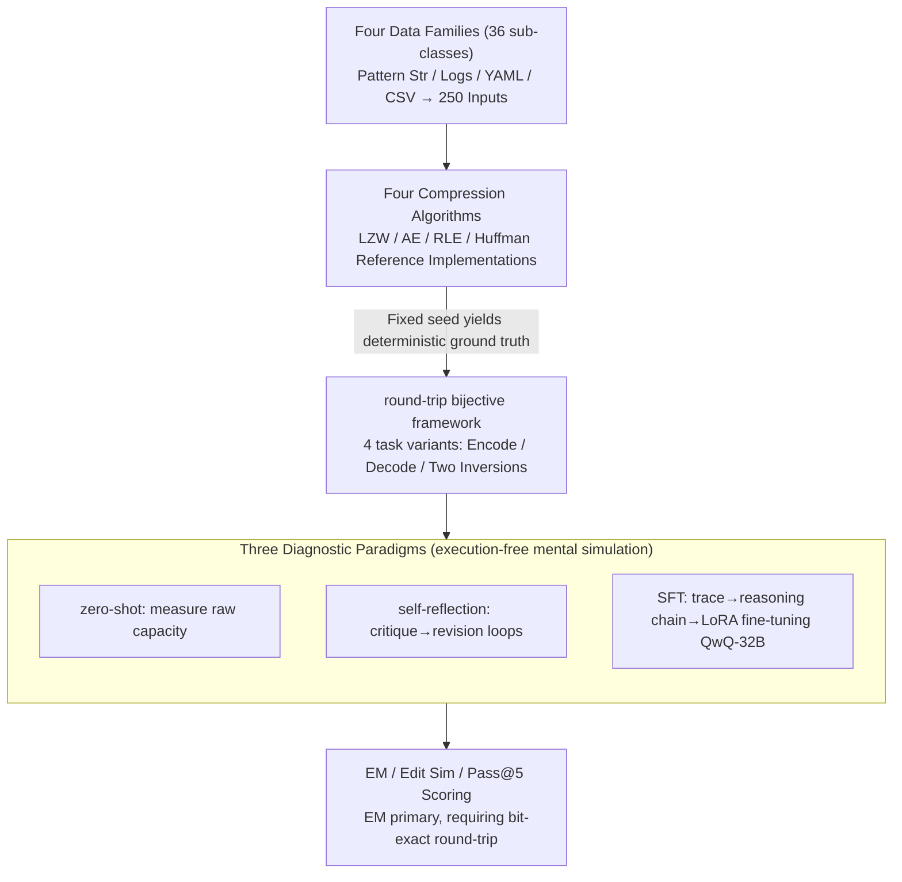

# Can LLMs Compress (and Decompress)? Evaluating Code Understanding and Execution via Invertibility

**Conference**: ACL 2026 Findings  
**arXiv**: [2601.13398](https://arxiv.org/abs/2601.13398)  
**Code**: https://github.com/Nickil21/round-trip-code-compression  
**Area**: Code Intelligence  
**Keywords**: Code reasoning, bidirectional execution, compression algorithms, self-consistency, evaluation

## TL;DR
This paper proposes RoundTripCodeEval (RTCE): a code reasoning benchmark using 4 lossless compression algorithms (LZW/AE/RLE/Huffman) to construct 250 inputs × 4 subtasks = 1000 strict round-trip (encode→decode must restore bit-exact data) tasks. Results show that even QwQ-32B achieves 0% EM on Huffman encoding, a failure that cannot be addressed by SFT or self-reflection.

## Background & Motivation

**Background**: Code-LLMs (DeepSeek-Coder, Qwen2.5-Coder, StarCoder2, etc.) have demonstrated strong performance on code generation benchmarks like HumanEval/MBPP. Execution reasoning evaluations (CRUXEval, CodeIO, CodeMind, REVAL, etc.) measure single-direction forward or backward execution.

**Limitations of Prior Work**: All existing evaluations are either single-directional (measuring only forward or backward) or based on "semantic equivalence" (e.g., IdentityChain testing code↔spec, RTC testing code↔NL description). However, semantic equivalence is a loose standard—as long as the newly generated code behaves the same, it is considered correct. Models can exploit surface pattern matching or memorization to inflate scores; such metrics fail to prove that a model truly understands the internal state machines and data flows of an algorithm.

**Key Challenge**: A model might achieve high scores in forward execution (because forward execution can be solved by surface pattern matching) but fail in backward execution. Alternatively, both directions might seem correct individually, yet the round-trip loop fails to close—this indicates that the model's internal representations are inconsistent, a defect that single-direction benchmarks can never capture. "forward correctness was fragile, derived from template matching."

**Goal**: Design an evaluation capable of distinguishing "pattern matching for scores" from "genuine understanding of algorithmic semantics."

**Key Insight**: Lossless compression algorithms are inherently bijections. The operations $\text{enc}(x)=z$ and $\text{dec}(z)=x$ must be perfectly reversible, providing a strict round-trip constraint $\text{dec}(\text{enc}(x))=x$, which is significantly harder to "game" than semantic equivalence.

**Core Idea**: Redefine "code understanding" as a "code invertibility" problem. By using round-trip exact-match as the evaluation signal, a diagnostic grid of 4 compression algorithms × 4 task variants (encode, decode, encode⁻¹, decode⁻¹) is formed to expose systemic failures that forward-only evaluations miss.

## Method

### Overall Architecture

RTCE reformulates "code understanding" as a "code invertibility" problem, using a strict round-trip constraint to verify whether the model truly executes the algorithm internally. The benchmark is constructed in three steps: first, 250 diverse inputs are synthesized across four data families (Pattern Strings, Apache Logs, YAML, CSV) comprising 36 sub-categories; second, deterministic ground truths are produced using Python reference implementations of LZW, AE, RLE, and Huffman under a fixed seed; finally, models complete four task variants (O/P Pred, O/P Pred-I, I/P Pred, I/P Pred-I) in an execution-free setting (prohibiting actual code execution), forcing them to perform mental simulation. Scoring uses EM, Edit Similarity (ES), and Pass@5. EM (exact match, with a floating-point tolerance of $10^{-3}$) is the primary metric, while ES (normalized Levenshtein) provides partial credit. EM is prioritized because many samples with EM=0 still show ES of 8%–20%, illustrating that model outputs "look similar but are imprecise"—only a strict round-trip can capture this fragility. Using this benchmark, the paper investigates three diagnostic paradigms (zero-shot, self-reflection, SFT) to exhaust potential improvement methods and attributes failures to architectural limitations.

### Key Designs

**1. Round-trip framework via bijective compression: Operationalizing "understanding" as bit-exact invertibility**

The fundamental weakness of existing evaluations lies in "semantic equivalence"—as long as the behavior is identical, the model passes, potentially relying on pattern matching rather than understanding the internal state machine. Lossless compression is naturally bijective, imposing a far more rigorous constraint: defining $\mathsf{enc}:\mathcal{X}\to\mathcal{Z}$ and $\mathsf{dec}:\mathcal{Z}\to\mathcal{X}$, it forces $\forall x\in\mathcal{X},\ \mathsf{dec}(\mathsf{enc}(x))=x$. Any information loss leads to immediate exact-match failure. Four tasks are derived: $x\to z$ (forward encoding), $z\to x'$ (forward decoding), and two "inversion" variants requiring the model to infer encode behavior using the dec function and vice versa. These inversion tasks are the ultimate test—they prevent the model from simply "reading and simulating" and instead expose internal contradictions where both directions seem correct individually but fail to close the loop.

**2. Four compression algorithms spanning encoding paradigms: Probing reasoning bottlenecks with different design patterns**

Relying on a single algorithm would bias conclusions toward its specific traits. RTCE selects four algorithms with vastly different mechanisms: LZW tests dictionary maintenance (dynamic state), AE tests probability interval accumulation (floating-point precision and long-range dependency), RLE tests consecutive run aggregation (the simplest bijection), and Huffman tests prefix coding with tree construction (a multi-stage hierarchical process). Covering the spectrum from simple (RLE) to complex (Huffman) allows the researchers to distinguish between a lack of specific algorithmic knowledge and a general failure in state-tracking. The most compelling signal comes from Huffman encoding: all 15 models achieved 0% EM, whereas the moderately difficult RLE yielded significant scores, proving the bottleneck is not absolute complexity but the "true understanding of state machines."

**3. Three diagnostic paradigms: Exhausting improvement methods to prove fundamental gaps**

To ensure the conclusion that "Transformers have fundamental flaws in stateful bijections" holds, alternative explanations like "poor prompting" or "insufficient scale" must be ruled out. The paper utilizes three standard enhancement methods: zero-shot to measure raw capacity; multi-round self-reflection using a critique/revision cycle; and SFT involving a five-stage pipeline—injecting execution traces via @snoop, filtering valid traces, translating traces into natural language reasoning chains using Qwen3-32B, and fine-tuning QwQ-32B with LoRA rank-8. Despite maximizing prompt, data, and scale levers, none of these methods rescued Huffman encoding from 0% EM, firmly attributing the failure to architecture rather than training.

## Key Experimental Results

### Main Results
15 LLMs × 4 Algorithms × 4 Tasks (Pass@5 combined average, selected):

| Model | Size | RLE Agg. | LZW Agg. | AE Agg. | Huffman Agg. | Avg |
|------|------|----------|----------|---------|--------------|-----|
| Llama-3.2-1B | 1B | 0.15 | 0.05 | 0.34 | 0.08 | 0.16 |
| Phi-3-mini-128k | 3.8B | 12.01 | 3.65 | 2.60 | 1.54 | 4.95 |
| Qwen2.5-7B | 7.6B | 17.39 | 4.46 | 6.55 | 2.65 | 7.76 |
| DeepSeek-R1-Distill-14B | 14.8B | 26.97 | 14.03 | 10.08 | 3.15 | 13.56 |
| Codestral-22B | 22.2B | 30.68 | 7.77 | 1.76 | 1.50 | 10.43 |
| **QwQ-32B** | 32.8B | **57.23** | 24.14 | **15.71** | 5.50 | **25.65** |
| Qwen2.5-Coder-32B | 32.8B | 41.51 | 21.06 | 8.45 | 3.15 | 18.54 |
| DeepSeek-R1-Distill-32B | 32.8B | 36.37 | 23.81 | 12.74 | 3.98 | 19.23 |
| deepseek-coder-33b | 33.3B | 13.71 | 3.44 | 3.34 | 1.21 | 5.43 |

**Key Findings**: (1) Huffman encoding resulted in 0% EM for all models—no LLM could complete the combination of frequency table construction + Huffman tree building + variable-length code output; (2) Reasoning-specific training (QwQ-32B vs Qwen2.5-Coder-32B using the same parameters and tokenizer) increased AE performance by 1.86x, proving the bottleneck is logical reasoning rather than tokenization; (3) Decoding is generally easier than encoding (leverages surface patterns of the encoded string), but AE is an exception: QwQ achieves 27.6% on AE encoding but only 2.3% on decoding (a 12x drop) due to the complexity of inverse floating-point interval arithmetic.

### Ablation Study: SFT on QwQ-32B (Pass@5)

| Algorithm | temp | I/P Pred | I/P Pred-I | O/P Pred | O/P Pred-I |
|------|------|----------|------------|----------|------------|
| AE | 0.2 | 30.77 | 23.08 | **78.57** | **84.62** |
| AE | 0.8 | 15.00 | 20.00 | 70.00 | 84.21 |
| Huffman | 0.2 | 35.00 | 50.00 | **0.00** | **0.00** |
| Huffman | 0.8 | 36.36 | 50.00 | **0.00** | **0.00** |
| LZW | 0.2 | 62.50 | 62.50 | 87.50 | 87.50 |
| RLE | 0.2 | 76.47 | 86.00 | 80.00 | 86.00 |

Huffman encoding remained at 0% after SFT, but decoding rose to 50%—proving that trace-derived reasoning chains only taught "surface decoding templates" without internalizing the bijective state transition structure.

### Key Findings
- **Huffman Paradox**: Every model reached 0% on Huffman encoding while reaching 7-11% on decoding. Reason: Decoding requires only a local lookup/traversal on the provided Huffman tree, whereas encoding requires multi-stage global reasoning (frequency table + tree construction + variable-length codes).
- **Self-reflection Saturation**: The first round of critique fixes shallow reasoning errors, but the second round saturates, indicating that systemic state-tracking errors cannot be fixed via self-correction (consistent with Olausson 2024).
- **SFT favors forward but hurts inverse**: In AE, forward performance rose to 78.6% while inverse stayed at 23–30%, suggesting LoRA adapters overfit to the surface form of traces without learning bijective invariants.
- **Tokenization is not the bottleneck**: QwQ and Qwen2.5-Coder share the same tokenizer and parameter count, yet AE performance differs by 1.86x, attributed entirely to the training objective (reasoning vs. code prefix-tuning).
- **ES > 0 but EM = 0**: Model outputs appear "mostly correct but imprecise," confirming that RTCE's strict exact-match requirement exposes fragility hidden by other benchmarks.

## Highlights & Insights
- **Operationalizing "understanding" as "invertibility"**: Using bijections to transform the abstract notion of "algorithmic understanding" into quantifiable exact-match signals represents a new evaluation methodology. This can migrate to any task with a natural inverse (refactor↔rewrite, encryption↔decryption, serialization↔deserialization).
- **Diagnostic Evaluation Triad**: Testing zero-shot, self-reflection, and SFT together rules out deficiencies in prompting or data, making the conclusion that "Transformers have fundamental flaws in bijective state tracking" highly persuasive.
- **Huffman Paradox defines a clear capability gap**: The 0% encoding vs. 11% decoding asymmetry identifies "multi-stage global state construction" as a concrete goal for future code LLMs.
- **Synthetic yet realistic**: The 4 data families simulate real developer artifacts (Logs, YAML, CSV) to avoid potential contamination from GitHub training data.

## Limitations & Future Work
- Evaluated only on Python; not yet extended to other languages.
- Limited to 4 compression algorithms and 1,000 samples—statistical stability for fine-grained per-category analysis may be limited.
- Execution-free evaluation cannot measure runtime phenomena like side-effects, concurrency, or exceptions.
- Primarily evaluated open-source models; the generalizability of findings to leading closed-source models (GPT-4, Claude, Gemini) remains an open question.
- Personal note: Bijection is only one dimension of code understanding; other forms of invertibility like refactoring, decompilation, and symbolic execution are not covered.

## Related Work & Insights
- **vs. IdentityChain (Min 2024)**: Checks spec↔code consistency, but relies on semantic equivalence; Ours requires exact bijection, making it much stricter.
- **vs. RTC (Allamanis 2024)**: Performs code↔NL description round-trips at the semantic level; Ours is data-level bit-exact.
- **vs. CodeIO/CRUXEval**: These collect function I/O but score forward/backward independently; Ours emphasizes that both directions must be self-consistent.
- **vs. CodeMind/REVAL/CACP**: These rely on trace/concept-level annotations; Ours requires no manual annotation, utilizing automatic round-trip exact-match scoring.

## Rating
- Novelty: ⭐⭐⭐⭐⭐ Introducing round-trip + bijection to code reasoning evaluation and operationalizing invertibility as a quantifiable metric is a genuinely new perspective.
- Experimental Thoroughness: ⭐⭐⭐⭐ 15 models × 4 algorithms × 4 tasks × 3 enhancement paradigms, though closed-source models are absent.
- Writing Quality: ⭐⭐⭐⭐ Clear mathematical notation; the distinction between the 4 tasks and inversion is well-explained.
- Value: ⭐⭐⭐⭐⭐ Exposes systemic architectural flaws in stateful bijections for Transformers, providing a clear research direction and negative signal for the code reasoning community.

<!-- RELATED:START -->

## Related Papers

- [\[ICLR 2026\] AetherCode: Evaluating LLMs' Ability to Win In Premier Programming Competitions](../../ICLR2026/code_intelligence/aethercode_evaluating_llms_ability_to_win_in_premier_programming_competitions.md)
- [\[ACL 2026\] SWE-QA: Can Language Models Answer Repository-level Code Questions?](swe-qa_can_language_models_answer_repository-level_code_questions.md)
- [\[ACL 2025\] TeXpert: A Multi-Level Benchmark for Evaluating LaTeX Code Generation by LLMs](../../ACL2025/code_intelligence/texpert_a_multi-level_benchmark_for_evaluating_latex_code_generation_by_llms.md)
- [\[ACL 2026\] DUET: Dual Execution for Test Output Prediction with Generated Code and Pseudocode](duet_dual_execution_for_test_output_prediction_with_generated_code_and_pseudocod.md)
- [\[ACL 2026\] SolidCoder: Bridging the Mental-Reality Gap in LLM Code Generation through Concrete Execution](solidcoder_bridging_the_mental-reality_gap_in_llm_code_generation_through_concre.md)

<!-- RELATED:END -->
