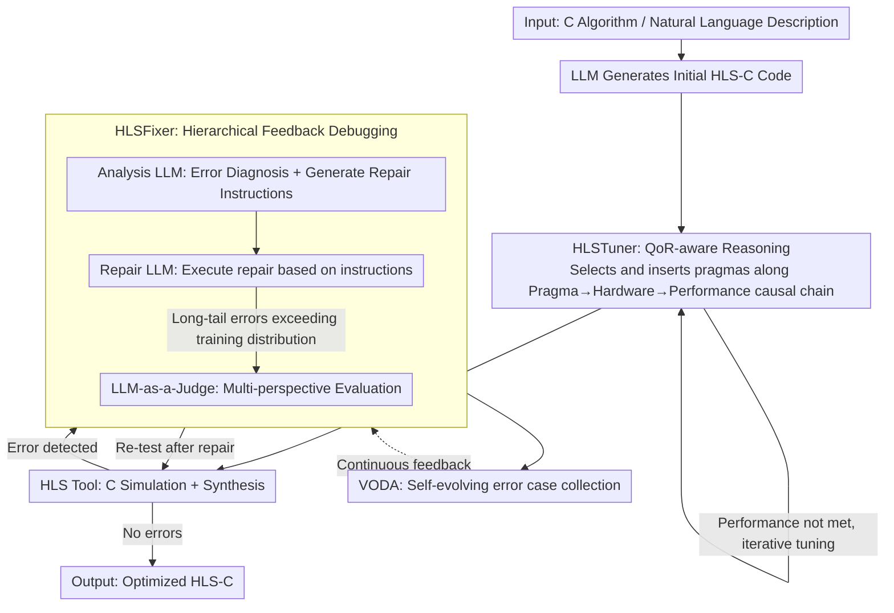

# ChatHLS: Towards Systematic Design Automation and Optimization for High-Level Synthesis

**Conference**: ACL 2026  
**arXiv**: [2507.00642](https://arxiv.org/abs/2507.00642)  
**Code**: None  
**Area**: LLM-assisted Hardware Design  
**Keywords**: High-Level Synthesis, LLM-assisted Design, Multi-agent, Pragma Optimization, Auto-debugging

## TL;DR

ChatHLS proposes a multi-agent HLS design framework that significantly outperforms baselines in HLS-C generation success rates and hardware performance optimization. It features two core components: HLSTuner (QoR-aware reasoning for pragma selection) and HLSFixer (a hierarchical feedback-augmented debugging framework), integrated with a self-evolving error case expansion mechanism (VODA).

## Background & Motivation

**Background**: High-Level Synthesis (HLS) accelerates hardware design by abstracting C/C++ into hardware descriptions. The success of LLMs in code generation has inspired research into their application for HLS.

**Limitations of Prior Work**: (1) HLS-specific data is scarce, with existing datasets rarely exposing synthesizability constraints, pragma selection rationale, or QoR correlations; (2) The combinatorial explosion of the pragma tuning space makes manual optimization extremely time-consuming; (3) General LLMs struggle to identify and correct HLS-specific compatibility errors.

**Key Challenge**: HLS design requires the simultaneous optimization of functional correctness and hardware efficiency, yet existing LLMs lack an understanding of hardware constraints and pragma semantics.

**Goal**: To build an automated HLS design, optimization, and debugging framework.

**Key Insight**: Multi-agent collaboration combined with specialized fine-tuning and self-evolving data augmentation.

**Core Idea**: Enable LLMs to understand the causal relationship between pragmas and hardware performance through QoR-aware reasoning, and accurately diagnose HLS errors using a reasoning-to-instruction approach.

## Method

### Overall Architecture

ChatHLS is a multi-agent pipeline that connects HLS design, optimization, and debugging. The core mechanism involves enabling fine-tuned LLMs to truly "understand" the causality between pragmas and hardware performance. The workflow consists of two phases: In the generation phase, the LLM produces initial HLS-C code, followed by HLSTuner selecting and inserting optimization pragmas based on QoR-aware reasoning. In the debugging phase, HLSFixer parses feedback from HLS tools for error diagnosis and repair, while VODA collects newly encountered error cases to allow the debugging capability to evolve through use.

### Key Designs

**1. HLSTuner: Shifting from "Pragma Insertion" to "Trade-off Awareness" via QoR-aware Reasoning**

The pragma tuning space is subject to combinatorial explosion, making manual optimization slow. General LLMs often insert pragmas mechanically without understanding how each pragma alters the hardware. HLSTuner takes source HLS-C and initial QoR as inputs and reasons along the causal chain of "pragma change → hardware architecture change → performance change." Training data is generated using NSGA-II to create diverse optimized designs in a multi-objective space, with a teacher model generating optimization CoTs for each design as supervision signals. Consequently, the LLM learns "why a pragma improves QoR" rather than just "which pragma frequently appears."

**2. HLSFixer: Decoupling Debugging into a Hierarchical Identify-Diagnose-Repair Framework**

General LLMs find it difficult to identify and correct HLS-specific synthesizability/compatibility errors, and end-to-end code modification is often an uncontrollable black box. HLSFixer decomposes debugging into three steps: identification, diagnosis, and repair. An Analysis LLM extracts error information from HLS tool feedback and generates repair instructions, which are then executed by a Repair LLM. For long-tail errors falling outside the training distribution, an LLM-as-a-Judge is introduced for multi-perspective evaluation. This "reasoning-to-instruction" decoupling is more controllable and interpretable than end-to-end repair.

**3. VODA: Self-evolving Error Case Expansion within the Workflow**

HLS errors follow a long-tail distribution that is difficult to cover with one-time labeled datasets. VODA allows ChatHLS to automatically capture new error cases during actual operation and store them in a library, continuously feeding back into the debugging capabilities of HLSFixer to form a closed loop that improves with use.

### Loss & Training

HLSTuner utilizes NSGA-II to generate diverse designs and teacher model-produced optimization CoTs for supervised fine-tuning (SFT). HLSFixer is fine-tuned according to the decoupled "reasoning-to-instruction" method, training the Analysis LLM and Repair LLM separately.

## Key Experimental Results

### Main Results

- ChatHLS achieves a 32.6% improvement in debugging performance compared to Gemini-3-pro.
- HLS-C generation success rate increased by 41.8%.
- Achieves a 3.3× performance gain compared to RAG-based methods.

### Key Findings

- QoR-aware reasoning significantly outperforms simple code-to-code mapping.
- Hierarchical feedback debugging is more effective than end-to-end repair.
- The VODA self-evolving mechanism continuously enhances debugging capabilities.

## Highlights & Insights

- QoR-aware reasoning enables the LLM to "understand" hardware rather than simply generating code.
- The decoupled reasoning-to-instruction debugging method offers excellent interpretability.

## Limitations & Future Work

- Currently targeting specific HLS toolchains; may not generalize to other EDA tools.
- The process of generating CoT via NSGA-II involves high computational costs.
- Future work could explore end-to-end RL training as an alternative to supervised fine-tuning.

## Related Work & Insights

- Compared to template-based methods like HeteroRefactor and HeteroGen, ChatHLS is more flexible and does not require predefined templates.
- Compared to RAG methods, specialized fine-tuning provides more precise domain knowledge.

## Rating

- Novelty: ⭐⭐⭐⭐ QoR-aware reasoning and self-evolving debugging are novel designs.
- Experimental Thoroughness: ⭐⭐⭐⭐ Comparisons against multiple benchmarks and baselines.
- Writing Quality: ⭐⭐⭐⭐ Detailed framework descriptions and clear flowcharts.

<!-- RELATED:START -->

## Related Papers

- [\[ACL 2026\] SOCIA-EVO: Automated Simulator Construction via Dual-Anchored Bi-Level Optimization](socia-evo_automated_simulator_construction_via_dual-anchored_bi-level_optimizati.md)
- [\[ACL 2026\] CuBridge: An LLM-Based Framework for Understanding and Reconstructing High-Performance Attention Kernels](cubridge_an_llm-based_framework_for_understanding_and_reconstructing_high-perfor.md)
- [\[ACL 2026\] LogicEval: A Systematic Framework for Evaluating Automated Repair Techniques for Logical Vulnerabilities in Real-World Software](logiceval_a_systematic_framework_for_evaluating_automated_repair_techniques_for_.md)
- [\[ACL 2026\] QiMeng-PRepair: Precise Code Repair via Edit-Aware Reward Optimization](qimeng-prepair_precise_code_repair_via_edit-aware_reward_optimization.md)
- [\[ACL 2026\] QAQ: Bidirectional Semantic Coherence for Selecting High-Quality Synthetic Code Instructions](qaq_bidirectional_semantic_coherence_for_selecting_high-quality_synthetic_code_i.md)

<!-- RELATED:END -->
