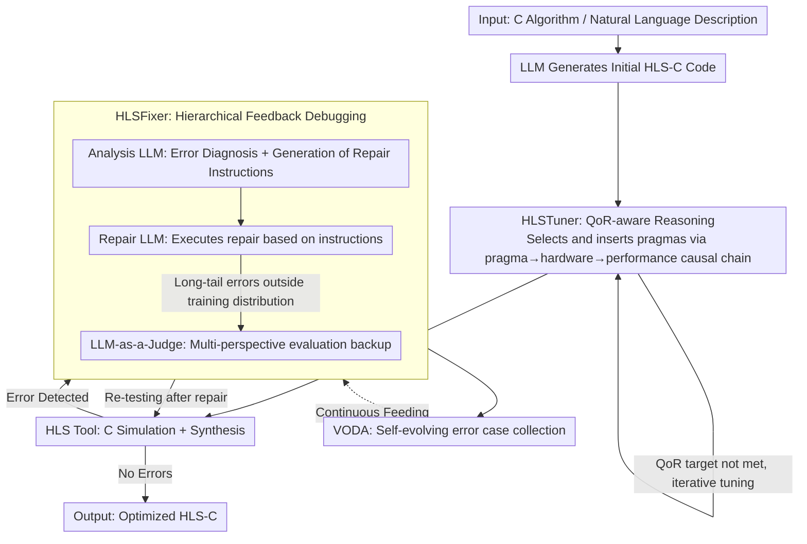

# ChatHLS: Towards Systematic Design Automation and Optimization for High-Level Synthesis

**Conference**: ACL 2026  
**arXiv**: [2507.00642](https://arxiv.org/abs/2507.00642)  
**Code**: None  
**Area**: LLM-aided Hardware Design  
**Keywords**: High-Level Synthesis, LLM-aided Design, Multi-agent, Pragma Optimization, Automatic Debugging

## TL;DR

ChatHLS proposes a multi-agent HLS design framework. Through two core components—HLSTuner (QoR-aware reasoning for optimization pragma selection) and HLSFixer (a debugging framework enhanced by hierarchical feedback)—combined with a self-evolving error case expansion mechanism (VODA), it significantly outperforms baselines in both HLS-C generation success rates and hardware performance optimization.

## Background & Motivation

**Background**: High-Level Synthesis (HLS) accelerates hardware design by abstracting C/C++ into hardware descriptions. The success of LLMs in code generation has inspired research into applying them to HLS.

**Limitations of Prior Work**: (1) HLS-specific data is scarce, and existing datasets rarely expose synthesis constraints, pragma selection rationales, or QoR correlations; (2) The combinatorial explosion of the pragma tuning space makes manual optimization extremely time-consuming; (3) General LLMs struggle to identify and correct HLS-specific compatibility errors.

**Key Challenge**: HLS design requires simultaneous optimization of functional correctness and hardware efficiency, but existing LLMs lack an understanding of hardware constraints and pragma semantics.

**Goal**: Build an automated HLS design, optimization, and debugging framework.

**Key Insight**: Multi-agent collaboration + Specialized fine-tuning + Self-evolving data augmentation.

**Core Idea**: Enable LLMs to understand the causal relationship between pragmas and hardware performance through QoR-aware reasoning, and accurately diagnose HLS errors using a "reasoning-to-instruction" approach.

## Method

### Overall Architecture

ChatHLS is a multi-agent pipeline that strings together HLS design, optimization, and debugging. The core is to empower fine-tuned LLMs with a genuine understanding of the causality between pragmas and hardware performance. The workflow consists of two stages: In the generation stage, the LLM produces initial HLS-C code, which is then processed by HLSTuner to select and insert optimization pragmas based on QoR-aware reasoning. In the debugging stage, HLSFixer parses feedback from HLS tools for error diagnosis and repair, while VODA collects newly encountered error cases to enable the debugging capability to evolve through use.

### Key Designs

**1. HLSTuner: Converting "Pragma Insertion" into "Trade-off Understanding" via QoR-aware Reasoning**

The pragma tuning space is subject to combinatorial explosion, and manual optimization is extremely time-consuming. General LLMs often mechanically insert pragmas without understanding how each pragma alters the hardware. HLSTuner takes the source HLS-C and initial QoR as input and reasons along the causal chain of "pragma change → architectural change → performance change." Training data is generated using NSGA-II to produce diverse optimized designs in a multi-objective space, with a teacher model writing optimization CoTs for each design as supervision signals. Consequently, the LLM learns "why this pragma improves QoR" rather than just "which pragma appears frequently."

**2. HLSFixer: Decoupling Debugging into a Hierarchical Identification-Diagnosis-Repair Framework**

General LLMs struggle to identify and correct HLS-specific synthesizability/compatibility errors, and end-to-end code modification is often a black box and difficult to control. HLSFixer decomposes debugging into three steps: error identification, diagnosis, and repair. An Analysis LLM extracts error information from HLS tool feedback and generates repair instructions, which are then executed by a Repair LLM. For long-tail errors outside the training distribution, an LLM-as-a-Judge is introduced to provide multi-perspective evaluation. This "reasoning-to-instruction" decoupling is more controllable and interpretable than end-to-end repair.

**3. VODA: Self-evolving Expansion of Error Case Libraries within the Workflow**

HLS errors follow a long-tail distribution, making it difficult for one-time labeled datasets to achieve full coverage. VODA enables ChatHLS to automatically capture newly emerging error cases during actual operation and store them in a library, continuously feeding back into HLSFixer's debugging capabilities to form a closed loop that improves with use.

### Loss & Training

HLSTuner utilizes NSGA-II to generate diverse designs and a teacher model to produce optimization CoTs for supervised fine-tuning (SFT). HLSFixer is fine-tuned according to the "reasoning-to-instruction" decoupling method, training the Analysis LLM and Repair LLM separately.

## Key Experimental Results

### Main Results

- ChatHLS improves debugging by 32.6% compared to Gemini-3-pro.
- HLS-C generation success rate increased by 41.8%.
- Achieves a $3.3\times$ performance improvement compared to RAG-based methods.

### Key Findings

- QoR-aware reasoning is significantly superior to simple code-to-code mapping.
- Hierarchical feedback debugging is more effective than end-to-end repair.
- The VODA self-evolution mechanism continuously enhances debugging capabilities.

## Highlights & Insights

- QoR-aware reasoning allows the LLM to "understand" hardware rather than simply generating code.
- The decentralized "reasoning-to-instruction" debugging method provides excellent interpretability.

## Limitations & Future Work

- Currently targeted at specific HLS toolchains and may not be applicable to other EDA tools.
- The process of generating CoT via NSGA-II involves high computational costs.
- Future work could explore end-to-end RL training as a replacement for supervised fine-tuning.

## Related Work & Insights

- Compared to template-based methods like HeteroRefactor and HeteroGen, ChatHLS is more flexible and does not require predefined templates.
- Compared to RAG methods, specialized fine-tuning provides more precise domain knowledge.

## Rating

- Novelty: ⭐⭐⭐⭐ QoR-aware reasoning and self-evolving debugging are innovative designs.
- Experimental Thoroughness: ⭐⭐⭐⭐ Comparisons across multiple benchmarks and baselines.
- Writing Quality: ⭐⭐⭐⭐ Detailed framework descriptions and clear flowcharts.

<!-- RELATED:START -->

## Related Papers

- [\[ACL 2026\] SOCIA-EVO: Automated Simulator Construction via Dual-Anchored Bi-Level Optimization](socia-evo_automated_simulator_construction_via_dual-anchored_bi-level_optimizati.md)
- [\[ICLR 2026\] LLM-Guided Evolutionary Program Synthesis for Quasi-Monte Carlo Design](../../ICLR2026/code_intelligence/llm-guided_evolutionary_program_synthesis_for_quasi-monte_carlo_design.md)
- [\[ACL 2026\] CuBridge: An LLM-Based Framework for Understanding and Reconstructing High-Performance Attention Kernels](cubridge_an_llm-based_framework_for_understanding_and_reconstructing_high-perfor.md)
- [\[ACL 2026\] LogicEval: A Systematic Framework for Evaluating Automated Repair Techniques for Logical Vulnerabilities in Real-World Software](logiceval_a_systematic_framework_for_evaluating_automated_repair_techniques_for_.md)
- [\[ACL 2026\] QiMeng-PRepair: Precise Code Repair via Edit-Aware Reward Optimization](qimeng-prepair_precise_code_repair_via_edit-aware_reward_optimization.md)

<!-- RELATED:END -->
