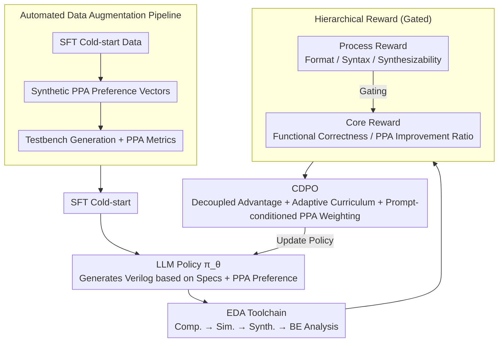

# ChipSeek: Optimizing Verilog Generation via EDA-Integrated Reinforcement Learning

**Conference**: ACL 2026  
**arXiv**: [2507.04736](https://arxiv.org/abs/2507.04736)  
**Code**: [https://github.com/rong-hash/chipseek](https://github.com/rong-hash/chipseek)  
**Area**: Reinforcement Learning  
**Keywords**: Verilog generation, EDA integration, Hierarchical reward, PPA optimization, Curriculum dynamic policy optimization

## TL;DR

ChipSeek proposes a hierarchical reward RL framework that integrates an EDA toolchain directly into the training loop. Through Curriculum-guided Dynamic Policy Optimization (CDPO), the framework enables LLMs to generate RTL code that satisfies both functional correctness and PPA (Power-Performance-Area) optimization, achieving SOTA on standard benchmarks.

## Background & Motivation

**Background**: LLMs have demonstrated significant potential in automated RTL code generation. Existing methods enhance functional correctness through SFT, RAG, multi-agent systems, and CoT reasoning, but typically neglect hardware-specific metrics (PPA).

**Limitations of Prior Work**: (1) Existing models lack intrinsic mechanisms to optimize functional correctness and PPA simultaneously; (2) Post-processing methods (e.g., MCTS) do not improve the capability of the LLM itself; (3) Verilog generated by current models is generally less hardware-efficient than expert-written code.

**Key Challenge**: Current methods lack mechanisms to incorporate functional correctness and PPA optimization into training objectives in parallel.

**Goal**: Design a framework that incorporates EDA toolchain feedback directly into RL training, allowing LLMs to internalize hardware design knowledge.

**Key Insight**: Hierarchical reward design + curriculum weight scheduling + prompt-conditioned PPA preferences.

**Core Idea**: By integrating a complete open-source EDA toolchain (compilation, simulation, synthesis, back-end analysis) into the training loop, hierarchical rewards ranging from syntax to PPA are provided, enabling the LLM to learn hardware design trade-offs during training.

## Method

### Overall Architecture

ChipSeek integrates the complete open-source EDA toolchain (compilation, simulation, synthesis, back-end analysis) into the RL training loop: the LLM acts as the policy $\pi_\theta$ to generate Verilog based on design specifications; the toolchain evaluates the code from syntax through to PPA and returns hierarchical rewards. CDPO then treats functional correctness and PPA as multi-objectives for optimization. Consequently, the model internalizes hardware design trade-offs into its parameters during training rather than being corrected post-hoc. The process is supported by an automated data augmentation pipeline for PPA-aware training data, starting with SFT cold-start before entering closed-loop RL training.

### Key Designs

**1. Hierarchical Reward: Using gating to prioritize cheap checks before expensive evaluations**

PPA evaluation requires synthesis and back-end analysis, which are computationally expensive; performing these on code that fails compilation is wasteful. Hierarchical rewards split feedback into process rewards (format, syntax, synthesizability) and core rewards (functional correctness, PPA), connected via a strict gating mechanism—only code passing upstream checks triggers downstream metric calculation. The PPA reward is defined as the improvement ratio relative to a reference design $r_m = \text{ref}_m / \text{gen}_m$, decoupling continuous PPA signals from discrete correctness signals to save computation while keeping both objectives controllable.

**2. CDPO (Curriculum-guided Dynamic Policy Optimization): Preventing multi-objective bias toward easy-to-learn components**

Multi-objective RL often suffers from unsynchronized learning stages and inconsistent scales among reward components, where simple objectives like syntax can dominate. CDPO addresses this through three mechanisms: (a) Decoupled advantage estimation, where each reward component is normalized independently to prevent scale suppression; (b) Adaptive curriculum, which dynamically adjusts process reward weights based on global success rates—automatically reducing weights for syntax as success becomes high to shift focus to PPA; (c) Prompt-conditioned PPA weighting, adjusting the weights of power/delay/area according to preference vectors provided in the prompt. Together, these achieve a progression from easy to difficult learning while allowing on-demand design preferences.

**3. Automated Data Augmentation Pipeline: Bridging the gap in PPA-aware training data**

Hardware design data is scarce, especially with PPA annotations. The pipeline generates data in three stages: first, generating SFT cold-start data for basic generation capability; second, synthesizing diverse PPA preference vectors to cover different optimization requirements; and finally, generating paired testbenches and PPA metrics for each sample, enabling the RL training to be truly PPA-driven.

### Loss & Training

The framework utilizes GRPO as the backbone for policy optimization, combined with decoupled clipping and dynamic weighting for multi-objective advantage aggregation. Training begins with an SFT cold-start, followed by an RL phase integrated with EDA toolchain feedback.

## Key Experimental Results

### Main Results

- Achieved SOTA functional correctness and PPA performance on standard benchmarks.
- Successfully produced efficient designs for specific optimization targets (power, delay, area).

### Key Findings

- Integrating the EDA toolchain into the training loop is more effective than post-processing.
- CDPO curriculum scheduling is critical for multi-objective optimization.
- Prompt-conditioned PPA weighting enables flexible control over design preferences.

## Highlights & Insights

- The approach of using the EDA toolchain as a verifiable reward source can be generalized to other engineering domains.
- The multi-objective optimization design of CDPO is universal.
- Hierarchical gating significantly reduces computational resource consumption.

## Limitations & Future Work

- Reliance on open-source EDA tools; commercial tools might yield different results.
- Long execution time of EDA tools increases training costs.
- Future work could explore more complex design scenarios and larger scale models.

## Related Work & Insights

- Compared to RAG-based methods like RTLFixer/HDLDebugger, RL training internalizes hardware design knowledge.
- Compared to post-processing like VeriGen-MCTS, RL enhances the intrinsic capability of the LLM itself.

## Rating

- Novelty: ⭐⭐⭐⭐⭐ Integrating a full EDA toolchain into RL training is a significant innovation.
- Experimental Thoroughness: ⭐⭐⭐⭐ Comprehensive evaluation across multiple benchmarks and optimization targets.
- Writing Quality: ⭐⭐⭐⭐ Clear framework design and detailed formulation.

<!-- RELATED:START -->

## Related Papers

- [\[ACL 2026\] MARS2: Scaling Multi-Agent Tree Search via Reinforcement Learning for Code Generation](mars2_scaling_multi-agent_tree_search_via_reinforcement_learning_for_code_genera.md)
- [\[NeurIPS 2025\] QiMeng-SALV: Signal-Aware Learning for Verilog Code Generation](../../NeurIPS2025/code_intelligence/qimeng-salv_signal-aware_learning_for_verilog_code_generation.md)
- [\[ACL 2026\] CodeRL+: Improving Code Generation via Reinforcement with Execution Semantics Alignment](coderl_improving_code_generation_via_reinforcement_with_execution_semantics_alig.md)
- [\[CVPR 2026\] MM-ReCoder: Advancing Chart-to-Code Generation with Reinforcement Learning and Self-Correction](../../CVPR2026/code_intelligence/mm-recoder_advancing_chart-to-code_generation_with_reinforcement_learning_and_se.md)
- [\[ICLR 2026\] Breaking the SFT Plateau: Multimodal Structured Reinforcement Learning for Chart-to-Code Generation](../../ICLR2026/code_intelligence/breaking_the_sft_plateau_multimodal_structured_reinforcement_learning_for_chart-.md)

<!-- RELATED:END -->
