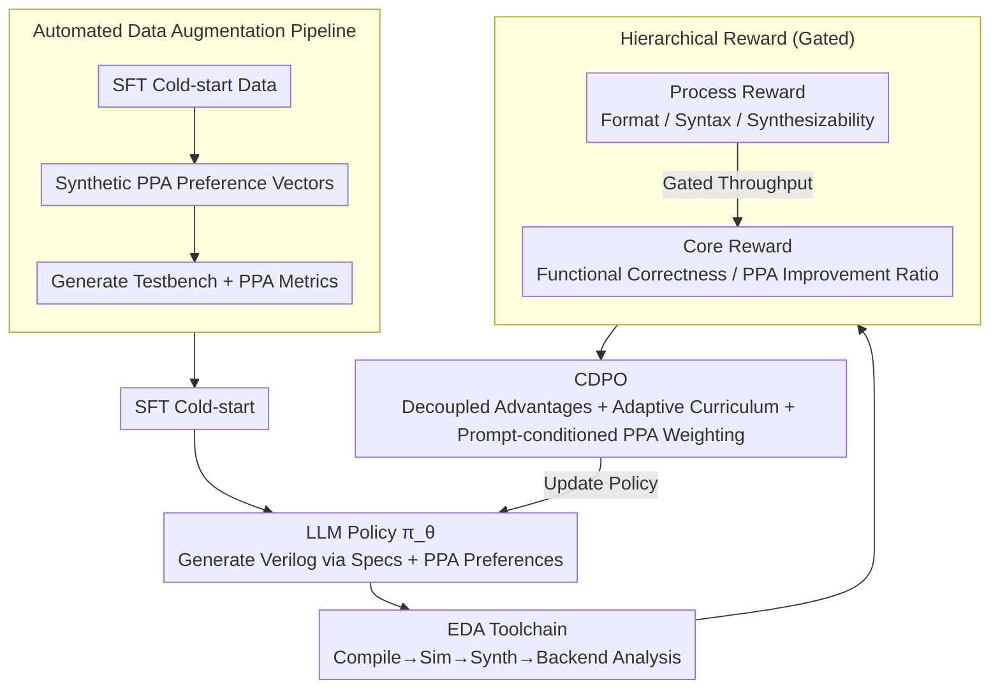

# ChipSeek: Optimizing Verilog Generation via EDA-Integrated Reinforcement Learning

**Conference**: ACL 2026  
**arXiv**: [2507.04736](https://arxiv.org/abs/2507.04736)  
**Code**: [https://github.com/rong-hash/chipseek](https://github.com/rong-hash/chipseek)  
**Area**: Reinforcement Learning  
**Keywords**: Verilog generation, EDA integration, Hierarchical reward, PPA optimization, Curriculum-driven policy optimization

## TL;DR

ChipSeek proposes a hierarchical reward RL framework that integrates the EDA toolchain directly into the training loop. Through Curriculum-driven Dynamic Policy Optimization (CDPO), it enables LLMs to generate RTL code that meets both functional correctness and PPA (Power-Performance-Area) optimization objectives, achieving SOTA on standard benchmarks.

## Background & Motivation

**Background**: LLMs have demonstrated significant potential in automated RTL code generation. Existing methods enhance functional correctness through SFT, RAG, multi-agent systems, and CoT reasoning, but typically overlook hardware-specific metrics (PPA).

**Limitations of Prior Work**: (1) Existing models lack inherent mechanisms for simultaneously optimizing functional correctness and PPA; (2) Post-processing methods (e.g., MCTS) do not improve the underlying capabilities of the LLM itself; (3) Verilog generated by current models is often less hardware-efficient than expert-written code.

**Key Challenge**: Current approaches lack a mechanism to concurrently incorporate functional correctness and PPA optimization into training objectives.

**Goal**: Design a framework that directly integrates EDA toolchain feedback into RL training, allowing LLMs to internalize hardware design knowledge.

**Key Insight**: Hierarchical reward design + Curriculum-based weight scheduling + Prompt-conditioned PPA preferences.

**Core Idea**: By integrating a complete open-source EDA toolchain (compilation, simulation, synthesis, backend analysis) into the training loop, the framework provides hierarchical rewards from syntax to PPA, enabling LLMs to learn hardware design trade-offs during training.

## Method

### Overall Architecture

ChipSeek integrates a complete open-source EDA toolchain (compilation, simulation, synthesis, backend analysis) directly into the RL training loop: the LLM acts as the policy $\pi_\theta$ to generate Verilog based on design specifications; the toolchain evaluates the code from syntax through to PPA and returns hierarchical rewards; subsequently, CDPO optimizes functional correctness and PPA as multi-objective targets. Consequently, the model does not merely receive post-hoc corrections but internalizes hardware design trade-offs into its parameters during the training process. The entire workflow is supported by an automated data augmentation pipeline that prepares PPA-aware training data for an SFT cold start followed by closed-loop RL training.

### Key Designs

**1. Hierarchical Reward: Using Gating to Prioritize Cheap Checks over Expensive Evaluations**

PPA evaluation requires running synthesis and backend analysis, which is computationally expensive; performing these on code that fails compilation is inefficient. The hierarchical reward structure decomposes feedback into process rewards (format, syntax, synthesizability) and core rewards (functional correctness, PPA), connected by a strict gating mechanism—downstream metrics are only calculated for code that passes upstream checks. The PPA reward is defined as the improvement ratio relative to a reference design $r_m = \text{ref}_m / \text{gen}_m$, decoupling continuous PPA signals from discrete functional correctness signals to save computation while maintaining control over both objectives.

**2. CDPO (Curriculum-driven Dynamic Policy Optimization): Preventing Multi-objective Drifting toward Easily Learned Components**

Multi-objective RL often suffers from asynchronous learning stages and inconsistent reward scales, where simple summation can cause the model to be dominated by easily learned syntax objectives. CDPO addresses this via three strategies: (a) Decoupled advantage estimation, where each reward component is normalized independently to prevent scale suppression; (b) Adaptive curriculum, which dynamically adjusts process reward weights based on global success rates—automatically reducing weights for syntax once its success rate is high to shift focus to the harder PPA tasks; (c) Prompt-conditioned PPA weighting, which adjusts the weights of power, delay, and area according to preference vectors provided in the prompt. Together, these enable a learning progression from easy to difficult and allow design preferences to be specified on demand.

**3. Automated Data Augmentation Pipeline: Filling the Gap in PPA-aware Training Data**

Hardware design data is scarce, and PPA-labeled data is even rarer. This pipeline generates data in three stages: first, generating SFT cold-start data to provide the model with basic generation capabilities; second, synthesizing diverse PPA preference vectors to cover different optimization requirements; and finally, generating matching testbenches and PPA metrics for each sample, ensuring the RL training is truly driven by PPA objectives.

### Loss & Training

The framework utilizes GRPO as the backbone for policy optimization, combined with decoupled clipping and dynamic weighting for multi-objective advantage aggregation. Training begins with an SFT cold start, followed by the RL phase integrated with EDA toolchain feedback.

## Key Experimental Results

### Main Results

- Achieved SOTA functional correctness and PPA performance on standard benchmarks.
- Successfully generated efficient designs customized for specific optimization targets (power, delay, area).

### Key Findings

- Integrating the EDA toolchain into the training loop is more effective than post-processing.
- The curriculum-based scheduling of CDPO is critical for multi-objective optimization.
- Prompt-conditioned PPA weighting enables flexible control over design preferences.

## Highlights & Insights

- The paradigm of using an EDA toolchain as a verifiable reward source can be generalized to other engineering domains.
- The multi-objective optimization design of CDPO is inherently versatile.
- Hierarchical gating significantly reduces computational resource consumption.

## Limitations & Future Work

- Reliance on open-source EDA tools; commercial tools might yield different results.
- Long execution times of EDA tools increase training costs.
- Future work could explore more complex design scenarios and larger model scales.

## Related Work & Insights

- Compared to RAG-based methods like RTLFixer/HDLDebugger, RL training internalizes hardware knowledge within the model.
- Compared to post-processing like VeriGen-MCTS, RL enhances the intrinsic capabilities of the LLM.

## Rating

- Novelty: ⭐⭐⭐⭐⭐ Integrating a full EDA toolchain into RL training is a major innovation.
- Experimental Thoroughness: ⭐⭐⭐⭐ Comprehensive evaluation across multiple benchmarks and optimization targets.
- Writing Quality: ⭐⭐⭐⭐ Clear framework design with detailed formulations.

<!-- RELATED:START -->

## Related Papers

- [\[ACL 2026\] MARS2: Scaling Multi-Agent Tree Search via Reinforcement Learning for Code Generation](mars2_scaling_multi-agent_tree_search_via_reinforcement_learning_for_code_genera.md)
- [\[NeurIPS 2025\] QiMeng-SALV: Signal-Aware Learning for Verilog Code Generation](../../NeurIPS2025/code_intelligence/qimeng-salv_signal-aware_learning_for_verilog_code_generation.md)
- [\[ACL 2026\] CodeRL+: Improving Code Generation via Reinforcement with Execution Semantics Alignment](coderl_improving_code_generation_via_reinforcement_with_execution_semantics_alig.md)
- [\[ICLR 2026\] ATGen: Adversarial Reinforcement Learning for Test Case Generation](../../ICLR2026/code_intelligence/atgen_adversarial_reinforcement_learning_for_test_case_generation.md)
- [\[AAAI 2026\] ReCode: Updating Code API Knowledge with Reinforcement Learning](../../AAAI2026/code_intelligence/recode_updating_code_api_knowledge_with_reinforcement_learning.md)

<!-- RELATED:END -->
